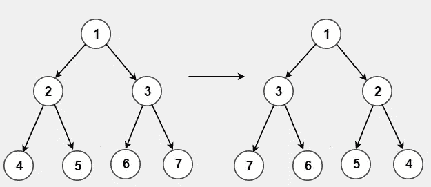
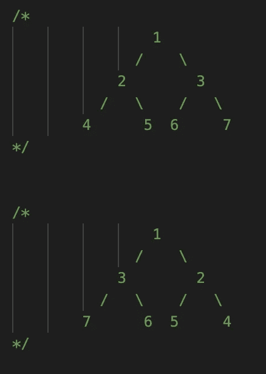
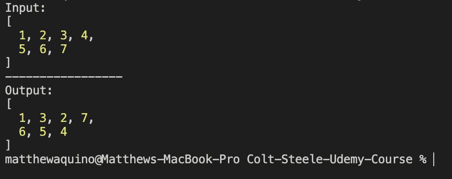

# JS 中的二叉树编码挑战:反转二叉树

> 原文：<https://medium.com/nerd-for-tech/binary-tree-coding-challenges-in-js-invert-a-binary-tree-and-number-of-islands-6c44e8718c22?source=collection_archive---------8----------------------->

树形倒置

本周的问题涉及到我们之前讨论过的数据结构，树。请访问上一篇文章[这里](https://javascript.plainenglish.io/binary-search-trees-and-tree-traversal-in-javascript-ab7f9cf6b3d2)，了解更多关于二叉树的知识，并用 JavaScript 自己实现一个二叉树！树由相互连接的节点组成，主要关系是父节点和子节点。二叉树在计算机科学中非常流行，在这种情况下，父节点最多可以有 2 个子节点。但是会有三叉树或四叉树更合适的情况。需要记住的重要一点是，树是一种具有父子关系的数据结构。

现实生活中的编码挑战和问题通常围绕着有效地遍历这些树。如果你不熟悉一些常见的图遍历技术 DFS(深度优先搜索)和 BFS(广度优先搜索)，我建议你使用[这个](https://visualgo.net/en/dfsbfs?slide=1)资源来复习。

## 反转二叉树

这是一个经典问题，*‘给定一个根，反转对应的二叉树，返回根。’*

我们想要的结果可以在下图中看到:

对于这个解决方案，我将通过连接节点来创建一个二叉树。然后我将创建一个“打印”函数，它也遍历我们的树并返回一个节点值数组。最后，我将创建反转函数，它将携带反转我们的树的逻辑。

这个问题的解决方案是我们的反函数。它采用递归 DFS 方法，先遍历树的各个级别，然后在返回的路上执行交换。这个问题的设置占用了我们代码中的大部分行，但是现在您可以通过将代码保存在一个文件中或者实现您自己的类来重用它！

当上述代码片段在您的本地计算机上运行时，输出应该如下所示:

预期产出

感谢您本周抽出时间和我一起讨论这个问题！在接下来的几周里，我将会讨论更多的树遍历问题！