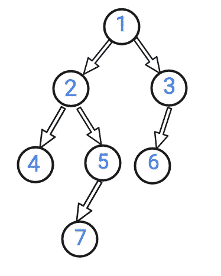
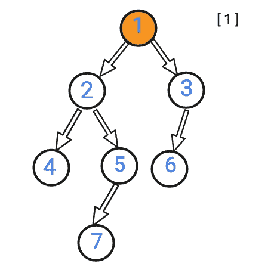
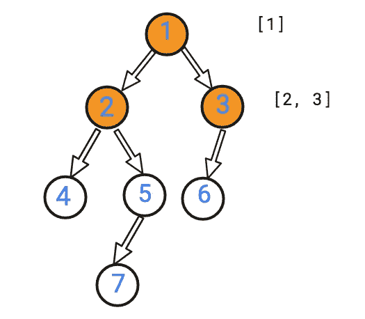
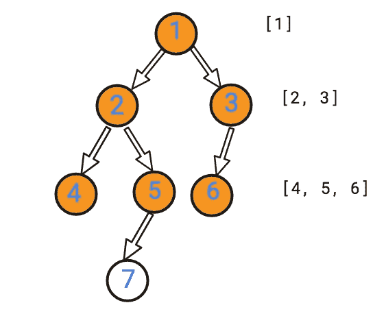
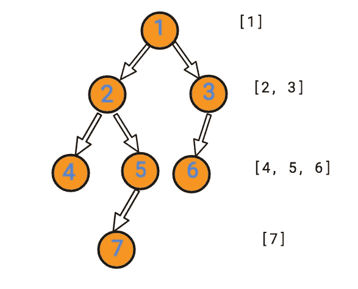
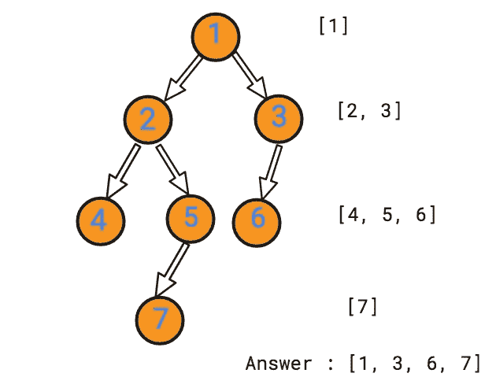

# 二叉树右侧视图—第 73 天(Python)

> 原文：<https://medium.com/nerd-for-tech/binary-tree-right-side-view-day-73-python-1b2a20adccef?source=collection_archive---------7----------------------->


在 [Unsplash](https://unsplash.com?utm_source=medium&utm_medium=referral) 上由 [Fabrice Villard](https://unsplash.com/@fabulu75?utm_source=medium&utm_medium=referral) 拍摄的照片

今天的问题来自 Leetcode 的每日编码挑战二月版。这是脸书面试官经常问的问题。让我们看看问题陈述。

[**199**](https://leetcode.com/problems/binary-tree-right-side-view/) **。二叉树右侧视图**

给定一棵二叉树，想象你站在它的右边，返回你能看到的从上到下排序的节点的值。

**示例:**

```
**Input:** [1,2,3,null,5,null,4]
**Output:** [1, 3, 4]
**Explanation:** 1            <---
 /   \
2     3         <---
 \     \
  5     4       <---
```

这个问题希望我们打印给定输入树的右侧视图。输出应该从上到下排序。

我们可以使用层次顺序遍历来遍历树，然后打印答案。让我们看看如何使用层次顺序遍历。

让我们举一个例子，



树

让我们执行层次顺序遍历。

一级:



第二级:



第三级:



第四级:



回答:



我们观察到了什么？我们看到，当我们使用级别顺序进行遍历时，我们需要从每个级别中取出最后一个节点。这些节点将是我们的答案。

因为我们以前使用过层次顺序遍历，所以我们不会重复这个算法。如果你需要复习，你可以点击[链接](https://atharayil.medium.com/maximum-depth-of-n-ary-tree-day-65-python-6c3d1c1ce299)。

让我们来看看代码片段。

```
class RightSideFinder:
    def rightSideView(self, root: TreeNode) -> List[int]:
        queue = []
        next_nodes = []
        output = []
        if root != None:
            output = [root.val]
            queue = [root]
            while queue:
                out = queue.pop(0)
                if out.left:
                    next_nodes.append(out.left)
                if out.right:
                    next_nodes.append(out.right)
                if queue == []:
                    if next_nodes != []:
                        output.append(next_nodes[-1].val)
                    queue, next_nodes = next_nodes, queue
            return output
        else:
            return []
```

**复杂性分析。**

**时间复杂度**

我们访问每个节点一次，因此时间复杂度是 O(N ),其中 N 是节点的数量。

**空间复杂度。**

我们访问每个节点一次，并将其存储在队列中。在最坏的情况下，如果所有的孩子都在同一个 x 层，我们可能必须保存队列中的所有节点，因此空间复杂度是 O(N ),其中 N 是节点的数量。