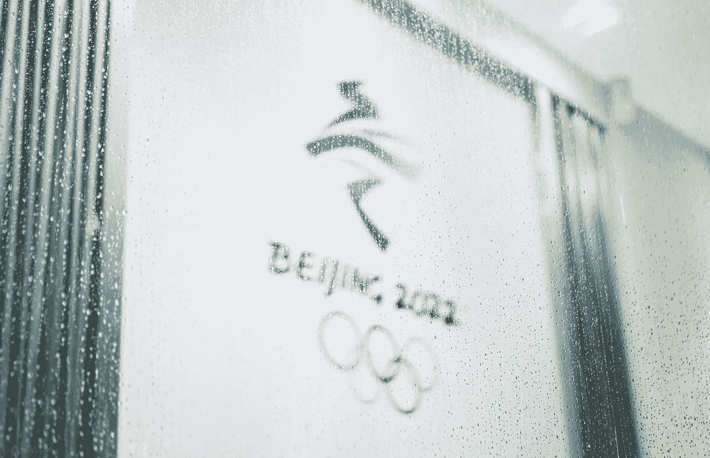

# 北京冬奥会“黑科技”|机器人上岗了！

> 原文：<https://medium.com/nerd-for-tech/black-tech-in-beijing-winter-olympic-games-robots-were-on-duty-19774bf01933?source=collection_archive---------8----------------------->

## 冬奥会上的机器人

公平地说，奥运会是以智力为中心的，广泛应用了机器人。

数百台机器人承担了疫情防控的责任，以及服务，涉及智慧防疫、智慧物流、智慧服务、智慧餐厅、智慧媒体。

防疫机器人、引导机器人、送货机器人、物流机器人、烹饪机器人、送餐机器人、人工智能机器人和其他机器人提供了送餐、引导、消毒和废物清除等服务。

## **1。智能防疫**

疫情防控一直是重中之重。在人类工作的基础上，引入了智能操作平台和消毒机器人、数字哨兵机器人、巡逻机器人等各种机器人来提供帮助。

消毒机器人负责场馆的消毒。据报道，雾化消毒机器人和紫外线消毒机器人被用于场地消毒。组委会非常喜欢它，因为它非常方便，易于操作，你只需要每天提前添加消毒剂，它们就可以在设定的时间自动开始工作。

## **2。智慧物流**

在物品配送方面，冬奥组委根据不同场景选择了几种不同类型的智能物流机器人。这不仅使高效的运输成为可能，也减少了人员接触。在比赛期间，不同的机器人运送不同重量的物品。

## **3。智能服务**

可以提供卫生、指导和翻译等服务的机器人被用于提供更好的服务。清洁机器人提供各种服务，如空间消毒、擦洗、干燥、拖尘、杀菌和减少灰尘。它将超声波消毒剂雾化喷雾系统与湿拖地清洁功能有效集成。它还具有自动充电、维护和自动避障功能。它的电池寿命非常长，可以在无人值守的情况下在指定区域进行清洁工作，并在人们拥挤和忙碌的区域长时间工作。

## **4。智能餐厅**

在餐饮服务方面，智慧餐厅保证了每个人的食物供应。该智能餐厅占地 5400 平方米，可同时容纳 1700 多人，全天候运营，确保点餐、准备和上菜的整个过程都是自动化的。每台智能烹饪设备都配有支付系统，支持信用卡和移动支付。

一个巨大的白色机器人也提供咖啡制作服务。这个智能咖啡设备是一个双臂协作机器人，可以在短短 4 分钟内做出一杯好咖啡。

## 需要更多的标记数据

从人工智能技术的研究方向来看，无论是在传统的机器学习领域还是深度学习领域，基于训练数据的监督学习仍然是一种主要的模型训练方法。尤其是在深度学习领域，需要更多的标记数据来提高模型的有效性。

在当前的人工智能应用实践中，不同水平的数据质量显示了人工智能解决方案价值的明显差距。

## 机器人技术中的常用标签工具

*   2D 包围盒
*   [3D 边界框](https://tinyurl.com/u7u4me)
*   [语义分割](https://tinyurl.com/48w576p7)
*   [视频追踪](http://tinyurl.com/wmu4yfhh)

## 机器人中常见的标签类型

*   物体识别
*   视频对象跟踪
*   工业机器人导航
*   机器人手臂导航

①机器人分拣和材料处理，如包裹递送、仓库库存处理

②质量保证检查、维护

## 结束

将你的数据标注任务外包给 [ByteBridge](https://tinyurl.com/5ya5wpnr) ，你可以更便宜更快的获得高质量的 ML 训练数据集！

*   无需信用卡的免费试用:您可以快速获得样品结果，检查输出，并直接向我们的项目经理反馈。
*   100%人工验证
*   透明和标准定价:[有明确的定价](https://www.bytebridge.io/#/?module=price)(包括人工成本)

## 为什么不试一试？

来源:https://www . robot-China . com/news/202202/07/69592 . html