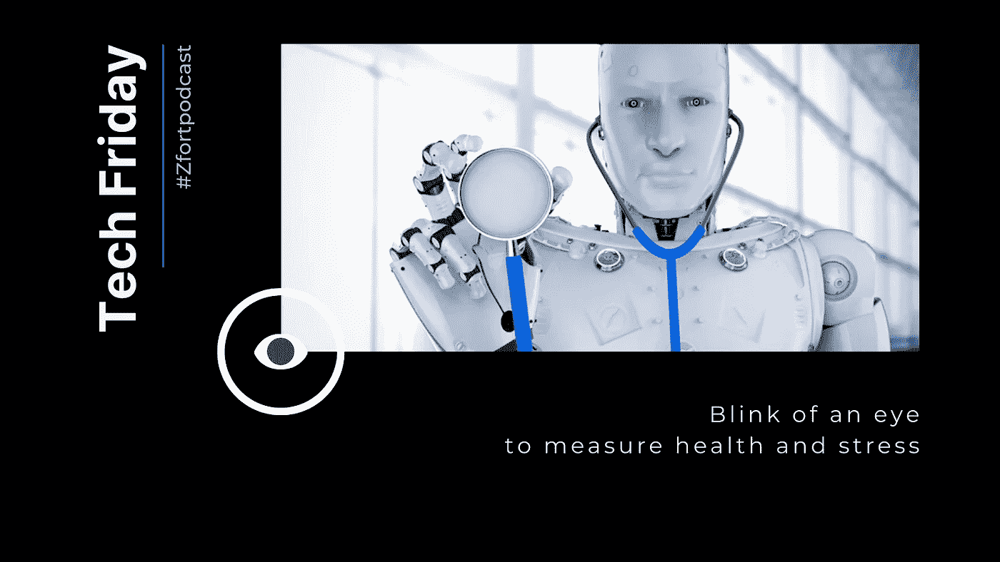

# 测量压力和注意力的瞬间:用于医疗和教育的人工智能

> 原文：<https://medium.com/nerd-for-tech/blink-of-an-eye-to-measuring-stress-and-attentiveness-ai-for-healthcare-and-education-36cd5ba91352?source=collection_archive---------18----------------------->

人工智能能比我们理解自己更理解我们吗？人工智能现在是公共医疗系统变革的主要力量。人工智能相关技术的结果是，自我护理变得比以往任何时候都更容易和更准确。

越来越多的人开始使用各种各样的小工具和应用程序来跟踪健康状况。一些公司更进一步。本周我们和一个来自韩国的好人聊天，他正在研究一种非接触式健康分析装置。这款应用的名字叫 CardiVu，他们的主要技术叫做自动生命体征提取算法，承诺超过 90%的生命体征准确率。智能手机或笔记本电脑上的普通摄像头似乎可以通过分析你的眼睛来揭示你的压力水平。特别是，顺便说一下，你的虹膜会动。你甚至不必为了分析而中断工作——只要继续做你正在做的事情，应用程序就会告诉你压力有多大。哦，还有一些关于你健康的事情。那么，它到底是如何工作的呢？像往常一样，它从收集数据开始。大量数据。并找出生命体征与人眼虹膜微动之间的相关性。我们收集的数据越多，结果就越准确。数据监视器包括心跳率、波动、低频与高频带比率等。
事实证明，当虹膜过于平静时，你就有麻烦了。一段时间后，这些测量被应用到你身上，你可以对当前的自己了解很多。如果您已经使用该应用程序有一段时间了，您还可以查看您过去的测量历史。对非接触式技术来说还不错，对吧？

心率变异性，或 HRV，仍然是核心指标之一。智能诊断研究人员还认为，“HRV 已被证明是一个非常强大的生物标志物”。此外，这是对自主神经系统的一种准确、非侵入性的测量。

健康的人应该经历大而复杂的心率变化，但如果他们有疾病或压力，复杂性会显著降低。在获得 KFDA 的批准后，智能诊断更进一步，将该算法应用于教育行业。在线教育课程平台的兴起引出了一个如何衡量学生参与度和注意力的问题。
即使学生们的摄像机打开了，谁知道他们脑子里在想什么，他们真的试图抓住素材了吗？或者可能有一个游戏在单独的浏览器窗口中打开？

当然，很难实现类似于个人课程和讨论的参与，但我们至少可以从跟踪开始。在这种情况下，相机更专注于视线跟踪，而不是虹膜收缩。该应用程序可以跟踪专注的时间，以及不专注于屏幕的时间。该应用程序还可以向我们显示学生注意力的热图，突出显示学生在特定时间内最关注的屏幕主要区域。

其他一些被追踪的因素有眨眼频率、瞳孔反应和头部位置。你们对科技有什么看法？有用吗？危险？够道德吗？如果可以你会用吗？这些人目前正处于 alpha 阶段，所以在它上市之前，我们还有一些时间来考虑选择。

让我们知道！

*也可用音频格式* [*此处*](https://open.spotify.com/episode/3fHkK8zRMR3RJKhEgLWDCL) *。*

*由* [*Zfort 集团*](https://www.zfort.com/) *创建。*