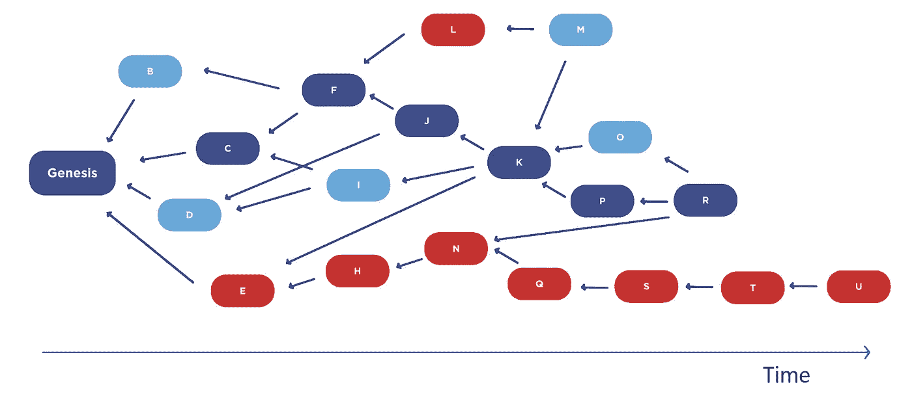
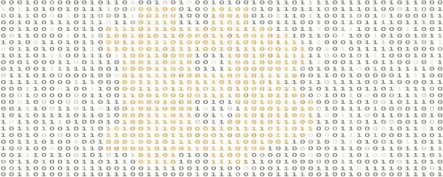

# 区块链算法。第一部分。共识；一致

> 原文：<https://medium.com/nerd-for-tech/blockchain-algorithms-part-1-consensus-7cb9bd363d88?source=collection_archive---------1----------------------->

## 同意是行动的条件

在这一系列文章中，我们将考虑分布式分类帐功能的各种算法、该技术的基本原理和特性，该技术基于一系列块。

区块链共识算法是网络的分散节点(服务器)就所有块中数据的当前状态达成一致(或共识)的一种方式。节点是连接到区块链的任何计算机，它验证和确认交易并保存分类账的副本。

## 基础

共识算法确保遵守协议规则，并且所有事务都是有效的。

所有现代加密货币都是基于对等网络的原理，其中每个节点都是一个独立的单元，可以参与确认交易，组成区块链网络。

为了使网络正常运行，并且为了尽可能地排除对网络的攻击，所有网络节点必须相互确认和批准彼此的行为，即在确认每个事务和创建新块时达成共识。

> **生成新块**的权利由共识模型或通常所说的共识算法精确确定。

在加密货币的背景下，共识算法是每个区块链的关键元素，因为它们负责维护这些分布式系统的完整性和安全性。第一个加密货币共识算法是工作证明(PoW)，由**中本聪**开发，在比特币中实现，作为克服**“拜占庭错误”**的一种方式。

公共(分散)区块链是作为分布式系统构建的，由于它们不依赖于中央机构，独立的节点必须就事务验证达成一致。

这就是共识算法发挥作用的地方。它们确保遵守协议规则，并确保所有交易都以可信的方式进行，因此硬币只能花一次。

## 责任范围

> 基本上，共识算法是一组特定的数学规则和法则，控制着区块链的工作方式。

***生成新块的频率*** —这有助于消除每个节点生成自己的块并将其写入区块链的情况。例如，在比特币区块链中，每 10 分钟生成一个区块(每小时总共 6 个区块)。

有时会出现这样的情况:几个节点几乎同时(相差几分之一秒)生成一个块，然后发生冲突，冲突会以有利于首先创建该块的节点的方式解决。包含在“已拒绝”块中的交易被放在未确认操作列表中，并在下一个块中处理。

***奖励生成块*的大小。**大小取决于难度:难度越高，奖励金额越低。

***检查块数据的正确性。*** 所有节点必须验证由特定节点生成的块数据。检查事务的散列、先前和生成的块以及正确选择的随机数。

***避免重复浪费资金。*** 例如，在比特币区块链中，当一笔交易被发送到区块链时，所有的资金都被发送出去，之后指定的金额到达接收方，剩余部分被返回到发送方的账户。

## 适应

区块链共识算法是基于拜占庭将军们的密码学任务。

然而，为了在加密货币中使用，它的原理已经稍微改变并适应于在 **P2P 网络**中工作:

*   ***抵制审查。*** 与拜占庭的挑战不同，区块链不需要总司令，因为区块链是一个分权制的体系，没有人可以禁止任何人采矿。
*   ***客观性*** —交易日志的当前版本始终存储在区块链，因此该信息不需要权威来源的确认。

在我们深入研究不同类型的共识算法之前，理解算法和协议之间的差异是很重要的。

## 草案

算法和协议这两个术语经常互换使用，但它们不是一回事。

> 一般来说，我们可以将协议定义为区块链的**主要规则**，将算法定义为执行它们的**机制**。

除了在金融系统中使用，区块链技术还可以应用于各种各样的业务，并且可以适用于各种各样的用例。但是，不管背景如何，区块链网络将建立在一个协议之上，该协议将决定系统应该如何工作，因此系统的所有不同部分和所有网络参与者都必须遵循该协议的基本规则。

当协议定义规则时，算法告诉系统它需要采取什么步骤来遵守这些规则并获得期望的结果。例如，区块链共识算法决定了事务和块的有效性。

> 于是，比特币和以太坊是协议，而**工作证明**和**利害证明**是它们的共识算法。

为了进一步说明这一点，考虑比特币协议的定义:节点应该如何交互，数据应该如何在它们之间传输，以及成功的块验证(验证)的要求是什么。

另一方面，共识算法负责验证余额和签名，确认交易，并实际执行块验证，所有这些都依赖于网络的共识。

在下面的文章中，我们将详细了解加密货币和加密工具的某些类型的算法。

**保持更新。**

 [## 隐藏网络评论:解决方案和产品

### 在 DeFi 环境中，有许多有趣的项目可以让人们独立管理他们的财务…

medium.com](/predict/conceal-network-review-solutions-and-products-a4bbed1163ac)