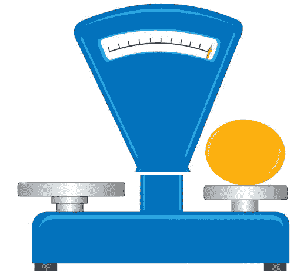

# 区块链算法。第三部分。权威证明，燃烧证明

> 原文：<https://medium.com/nerd-for-tech/blockchain-algorithms-part-3-proof-of-authority-proof-of-burn-dffeb32c60c5?source=collection_archive---------0----------------------->

## 其他机制

# 权威证明

权威共识证明算法由以太坊平台开发者 **Gavin Wood** 于 2017 年提出。程序员解决了流行的**利害关系证明**算法的问题，该算法与“富裕”节点对伪造过程的垄断有关。

因此，用户拥有的令牌越多，就越有可能形成新的区块。还有， **PoA 算法**的运行机制与 **PoW** 完全不同，PoW 用在支持挖矿的比特币和加密货币上。

权威证明机制已成功应用于 VeChain 加密货币项目。

## PoA 功能

PoA consensus 算法使用一个身份值，这意味着块验证器不赌硬币，而是有自己的声誉。

> 因此， **PoA 区块链**受到被任意选择为可信实体的验证者节点的保护。

PoA 模型依赖于有限数量的块验证器，这使得系统具有高度的可扩展性。块和交易由作为系统主持人的预先批准的参与者进行验证。

权威证明模型允许公司通过利用区块链技术来维护隐私。

## 验证的条件

在 PoA 网络中，交易和块由被称为“验证者”的认可账户来验证。

验证器运行允许将事务放在块中的软件。这个过程是自动的，不需要验证者不断地监控他们的计算机。然而，需要保持计算机(管理网站)在良好的工作秩序。

为了被选为验证者，必须满足三个主要条件:

1.  身份必须经过正式的在线验证，能够在公共领域交叉检查信息
2.  有资格被选为被授权验证挣得的和被验证的块的验证者不应该是容易的。例如，潜在的验证者需要获得州公证执照
3.  建立证书的检查和程序应该完全一致。

## 早熟禾的优点和缺点

1)能耗方面的效率
2)高速
3)可扩展性

1)集权程度。可以在公共区块链上使用，但通常用在私有的许可网络上
2)可能被验证器操纵

# 燃烧证明

燃烧证明( **PoB** )是加密货币用于分布式共识的一种方法，作为工作证明和利益证明的替代方法。

燃烧证据的概念是矿工证明他们燃烧了硬币(即他们将硬币送到了一个经过验证的未用地址)。虽然从人类的角度来看很昂贵，但与工作证明不同，PoB 不消耗除燃烧硬币之外的任何资源。

## PoB 的特色

PoB 有几个版本，但被伊安·斯图瓦特理想化的防烧证明的概念是加密货币领域最受认可的。

这已经被提出作为 PoW 一致性算法的更鲁棒的替代方案。事实上，燃烧证明看起来像工作证明算法，但能耗率更低。

> 在这种情况下，为了获得某一种货币的硬币或者开采权，你需要**用一张工作证明销毁系统中收到的替代加密货币的一定数量的硬币**。

焚烧的证据在于，矿工将硬币发送到一个特殊的地址，“吃掉”它们——它们不能从那里返回或花费——这一交易被记录在区块链中，作为焚烧硬币的证据，之后用户将获得奖励。

燃烧证据的想法是，通过燃烧一种加密货币，用户为了长期投资而展示出对短期损失的准备。

奖励在于获得终身开采权，用户燃烧的硬币越多，就越有可能开采下一个区块。

## PoB 是如何运作的

简而言之，烧币的过程就是把硬币送到一个公开的验证过的地址，在那里硬币变得无法访问，毫无用处。通常，这些地址是随机生成的，没有与之相关联的公钥。

> **PoB 系统**将向矿工提供奖励，在一段时间内，利润预计将覆盖被烧毁硬币的初始投资。

如前所述，有各种方法来实现燃烧证明算法。虽然一些项目通过燃烧比特币进行 PoB 挖掘，但其他项目通过燃烧自己的硬币达成共识。

## PoB 的优势和劣势

1)更可持续。降低功耗
2)不需要硬件挖矿。被烧毁的硬币实际上是人工装备
3)被烧毁的硬币减少了它们的流通
4)鼓励了矿工的长期承诺
5)硬币的分配通常不太集中

1)有一种观点认为 PoB 不太环保，因为被烧毁的比特币是使用 PoW 开发产生的，这需要大量资源
2)它尚未被证明可以大规模使用。对矿工工作的核实通常会被推迟 4)硬币的平均寿命并不总是透明的

**保持更新。**

 [## 区块链算法。第二部分。工作证明

### 工作证明(PoW)是保护网络不被自私的目的过度使用(例如，从 DoS…

medium.com](/coinmonks/blockchain-algorithms-part-2-proof-of-work-e7febcc1b69f)