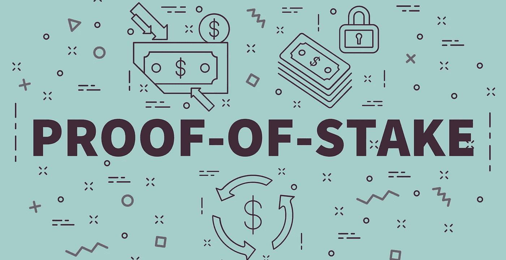
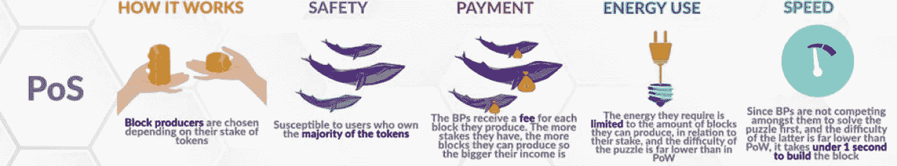

# 区块链算法。第四部分。利害关系证明

> 原文：<https://medium.com/nerd-for-tech/blockchain-algorithms-part-4-proof-of-stake-e993be02dc3f?source=collection_archive---------3----------------------->

## 可用性的影响

该算法由 bitcointalk.org 的用户 QuantumMechanic 于 2011 年首次提出，作为比特币所用工作证明的替代方案。PoS 也叫伪造。

伪造是根据所有权证明在区块链以各种加密货币创造新的区块，并能够以新单位和佣金的形式获得奖励。

第一个部分在赌注证明算法上实现的硬币是 Peercoin。更准确地说，在 **PPC** 中使用了一个混合版本:最初，使用工作证明算法的挖掘原理，在所有硬币被挖掘后，过渡到赌注证明。

最初在 PoS 上工作的第一批“干净”硬币是 **NXT** 和 **Blackcoin** 。

## 利害关系证明是如何工作的

PoS 算法使用一个伪随机过程来选择一个节点，以基于一组因素来验证下一个块，这些因素可能包括 stake(桩)年龄、随机化(随机节点选择)和节点状态。

> **PoS** 操作原理如下:参与伪造的参与者账户上一定数量的硬币被“冻结”，作为节点诚信的一种保证。

硬币处于“冻结”状态，直到一个节点生成一个块，其他参与者确认主节点动作的正确性。这种“冻结”也是一种预防措施，有助于防止对网络的攻击，避免硬币的“双重花费”，并排除节点验证虚假交易的可能性。

PoS 加密货币通常以硬币预售或运行工作证明算法开始，然后切换到股份证明。
在系统基于工作证明的情况下，越来越多的加密货币被创造出来作为对矿工的奖励，PoS 系统通常使用佣金作为奖励。

希望参与伪造过程的用户需要在网络中获得一定数量的硬币，即他们的份额。赌注大小影响节点被下一个验证者选择来伪造下一个块的可能性，赌注(stake)越大，机会越大。为了确保该过程不仅仅支持网络中最富有的节点，更多独特的方法被添加到选择过程中。

## 细微差别

其中两种更广为人知的方法被称为'*随机块选择*和'*硬币年龄选择*。

使用随机选择块验证器的方法，通过搜索具有最低散列值和最大分数的节点来确定它们。由于用户共享的信息是公开的，其他节点可以预测谁将是下一个伪造者。

用于确定硬币“寿命”的方法基于它们的代币在赌注中的时间长度来指示节点。硬币的年龄由天数乘以份额中硬币的数量来确定。一旦一个节点铸造了下一个块，硬币的年龄就被重置为零，并且在能够创建另一个块之前，它需要等待一定量的时间，这防止了大份额节点在区块链中的支配地位。

当一个节点伪造下一个块时，它检查该块中的事务是否有效，然后对该块进行签名并将其添加到区块链中。作为回报，该节点收到大宗交易费。

> 如果一个节点想要停止成为一个伪造者，它的份额，连同获得的奖励，将在一段时间后可用，这给网络一个机会来确认是否有任何欺诈块被这个节点添加到区块链中。

与工作证明不同，在赌注证明中，决定因素是一个节点(node)的账户上的硬币数量。那些。一个钱包里的硬币越多，你就有越多的机会生成一个区块并获得一部分新硬币。“赢得战斗”的节点称为主节点。

PoS 原理有点类似于轮盘赌的游戏:你下注越多(在我们的例子中，你有硬币)，赢的机会就越高(以加密货币的形式获得奖励)。

## 算法安全性

在欺诈交易被网络注意到的情况下，伪造节点将失去其份额的一部分以及将来参与伪造者角色的权利。因此，如果份额大于奖励，那么在欺诈尝试的情况下，验证者将失去比其将获得的更多的硬币。

为了有效地监控网络并确认欺诈交易，节点需要在网络中拥有控股权，也称为 51%攻击。根据加密货币的价格，这可能非常不切实际，因为为了获得对网络的控制，需要购买总发行量的 51%的硬币。

> 利益证明算法有 **2** 个关键优势:低功耗和高安全性。节点的部署不需要特殊的容量，因此适用于广泛的用户。

这与随机化过程一起，也使得网络更加分散，因为不再需要池来开采块。由于不太需要发行很多新硬币来获得奖励，这有助于特定硬币的价格保持更稳定。

## PoS 的优点和缺点

1.  能源效率—与传统的工作证明不同，利害关系证明算法不需要大量能源资源—电力仅用于确认交易本身
2.  对设备的资源要求低——参与锻造只需要一台计算机(普通 PC 或笔记本电脑)、稳定的互联网和一个已安装的客户端程序
3.  低费用——与比特币和其他基于 PoW 的硬币不同，除了处理矿工的交易外，支付电费也包括在内，PoS 上的硬币交易更便宜，因为没有能源消耗
4.  更大程度的去中心化——为了创建一个稳定的主节点，并在确认交易的过程中拥有完全的权力，你只需要拥有大量的硬币。然而，也有不利的一面——理论上，“鲸鱼”可以买断大部分硬币，巩固并夺取对某一特定硬币的铸造权。
5.  对设备故障的高抵抗性——由于锻造不需要昂贵和复杂的设备，所以在设备故障的情况下很容易替换它
6.  实施攻击的低概率 51% —要进行这种类型的攻击，伪造者必须拥有超过一半的硬币。首先，它非常昂贵，其次，他自己将首先遭受攻击，因为攻击后这些硬币的价值将直线下降。

1.  双重花费攻击的可能性是双重花费攻击。事实是，在 PoS 中，可以在任何高度开采区块。因此，为了实施攻击，有必要并行挖掘两个区块，一个区块的付款将流向接收者，另一个区块的交易将返回给挖掘者。如果矿工发现这两个区块，那么他会确认第一个，钱会到收款人那里，第二个会进入网络让其他参与者确认，钱会返还给矿工，网络会从这个区块继续。
2.  硬币流通的不可能性-为了参与伪造，您需要在您的帐户上有一定数量的硬币，并且不能提取它们，即，将不能进行购买、在交易所兑换硬币或执行任何其他操作
3.  足够高的进入门槛——为了参与锻造，一个节点必须拥有一定数量的硬币(例如，对于 Dash，你至少需要拥有 1000 DASH)
4.  薄利——在这种情况下，低佣金不是优势，而是劣势，因为用它来锻造，你可以赚到和采矿一样多的钱

**保持更新。**

 [## 区块链算法。第三部分。授权证明和刻录

### 授权证明和刻录

Authoritymedium.com 的证明](/nerd-for-tech/blockchain-algorithms-part-3-proof-of-authority-proof-of-burn-dffeb32c60c5)