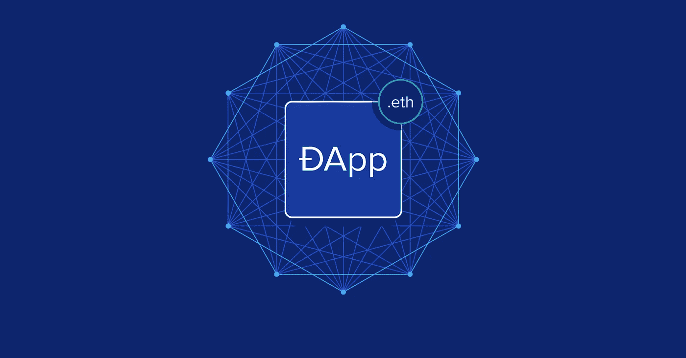

# 区块链开发者路线图 2022

> 原文：<https://medium.com/nerd-for-tech/blockchain-developer-roadmap-3db5b55eff8b?source=collection_archive---------0----------------------->

## 如何成为区块链开发者的终极指南

## 1.对 Web 3.0 和区块链的强烈热情

当学习一项新工具或技术时，激情和好奇心是关键。要成为区块链开发者，你必须对学习区块链、其生态系统以及其工作方式有强烈的热情。

## 2.关于 Web 2.0 的知识

为了更深入地研究区块链开发，人们应该对 Web 2.0 有所了解。区块链技术是建立在 web 开发之上的，对 web 开发的理解是必要的。所以如果你想学习区块链 aks Web 3.0，你必须从总体上了解 Web 开发的基础知识。

关于 React.js 和 Next.js 的知识将是有益的，因为分散式应用程序(又名 DApps)有一个标准的普通 Javascript 或 Javascript 框架前端。

## 3.学习区块链的基础知识

要成为区块链开发者，你需要了解什么是区块链？它是如何工作的？我们为什么以及何时使用它？你首先需要知道你在做什么。

要掌握区块链的基本原理，请学习以下内容:

> 什么是区块链？
> 
> 它是如何工作的？
> 
> 如何与区块链互动？
> 
> 如何将 web 应用连接到你的区块链上？

这是一个建议，开始与以太坊区块链合作，因为它非常受欢迎，它有一个强大的开发社区。

## 4.了解智能合约

智能合同类似于普通合同，但区别在于智能合同是数字形式的，而传统合同是纸质形式的。智能合约有不同的定义。根据 coinbase 的说法，智能合约是:

> 像任何合同一样，智能合同建立了协议的条款。但与传统合同不同，智能合同的条款是作为运行在以太坊这样的区块链上的代码来执行的。智能合约允许开发者构建利用区块链安全性、可靠性和可访问性的应用，同时提供复杂的点对点功能——从贷款和保险到物流和游戏的一切。

IBM 对智能合同的定义是:

> 智能合约只是存储在区块链上的程序，在满足预定条件时运行。它们通常用于自动执行协议，以便所有参与者可以立即确定结果，而无需任何中介的参与或时间损失。他们还可以自动化工作流，在满足条件时触发下一个操作。

关于智能合约需要了解的事项:

> 智能合约的基础
> 
> 智能合同的生命周期
> 
> 编译、测试、部署智能合约
> 
> 使用 web3.js 或 ether.js 与智能合约交互

## 5.学习稳健，智能合约的语言

稳健被称为智能合约的语言。Solidity 是一种面向对象的高级语言，用于实现智能合约。智能合约是在以太坊状态下管理账户行为的程序。

Solidity 是一种[花括号语言](https://en.wikipedia.org/wiki/List_of_programming_languages_by_type#Curly-bracket_languages)，设计用于以太坊虚拟机(EVM)。它受到 C++、Python 和 JavaScript 的影响。你可以在[语言影响](https://docs.soliditylang.org/en/v0.8.13/language-influences.html)部分找到更多关于 Solidity 受哪些语言启发的细节。

Solidity 是静态类型的，支持继承、库和复杂的用户定义类型以及其他特性。

使用 Solidity，您可以创建用于投票、众筹、盲目拍卖和多签名钱包等用途的合同。

## 6.深入研究分散式应用程序

熟悉智能合约和可靠性之后，您就可以构建、测试和部署您的智能合约了。现在，您将需要一个用户友好的界面作为前端，以便最终用户可以与您的 dApp 进行交互。在前端接口中，您创建一个 dApp(分散式应用程序)。dApp 可以是移动或网络应用，但在大多数情况下，它是一个网络应用。Web 应用程序通常像常规的 web 应用程序一样使用 HTML、CSS 和 Javascript。

构建 dApp 时，最重要的两项任务是:

> 与区块链的集成
> 
> 与钱包集成

为了与区块链集成，使用了 javascript 库 web3.js。

## 7 了解元掩码或任何其他加密钱包

区块链钱包是一种数字钱包，允许用户存储和管理他们的资金，如比特币、以太和其他加密货币。钱包是用来快速兑换资金的。这些交易是加密签名的，因此是安全的。钱包可通过移动应用和网络应用访问。区块链钱包提供了在不同方之间安全转移和交换资金的所有必要特征。这非常类似于通过 PayPal 或当今使用的任何其他网关发送或接收资金，但你使用的是加密货币。

有许多区块链/加密钱包。我建议一开始就用 Metamask。Metamask 允许用户通过浏览器扩展或移动应用程序访问他们的以太坊钱包。

## 8.学习 web3.js 和 ether.js 将智能合约连接到 dApp

现在你将有一个用户界面应用程序(前端应用程序)和一个区块链(智能合同)。现在你需要你的前端与区块链交互。最流行的两种方法是 web3.js 和 ether.js。

**Web3.js** 是一个库的集合，允许你
使用 HTTP、Websockets、&其他通信
协议直接从你的基于 JavaScript 的
前端与本地或远程以太坊节点
连接。
**Ethers.js** 是一个轻量级的 JavaScript 库，用于
连接 JavaScript 前端和智能
联系人，作为 Web3.js 的替代。

## 9.通过构建一些区块链应用程序来练习您的技能

之后，你就要随着练习掌握以上技巧了。从我个人的经验来看，实践和从事测试项目是学习一项新技术或框架的最佳方式。

为了保持有效的学习，通过构建小型或中级 Web3 应用程序来挑战您的能力。这些种类的小项目也将帮助你建立你的投资组合。

参考资料:

 [## web3.js -以太坊 JavaScript API - web3.js 1.0.0 文档

### js 是一个库的集合，允许你使用 HTTP、IPC 或…与本地或远程以太坊节点交互

web3js.readthedocs.io](https://web3js.readthedocs.io/en/v1.7.3/)  [## 什么是区块链智能合约？IBM

### 了解智能合同以及区块链网络如何在预定条款生效时自动执行合同…

www.ibm.com](https://www.ibm.com/topics/smart-contracts)  [## 精通 JavaScript

### 精通 JavaScript 的目的是帮助有抱负的开发人员将他们的开发技能运用到…

www.youtube.com](https://www.youtube.com/channel/UCmXmlB4-HJytD7wek0Uo97A) 

[https://www . coin base . com/learn/crypto-basics/what-is-a-smart-contract](https://www.coinbase.com/learn/crypto-basics/what-is-a-smart-contract)