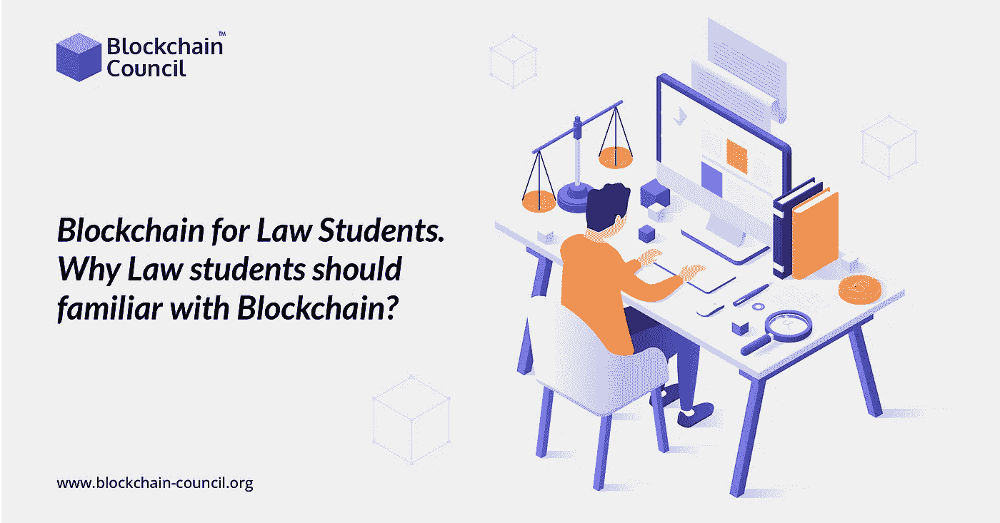

# 法律专业学生的区块链:为什么它很重要？

> 原文：<https://medium.com/nerd-for-tech/blockchain-for-law-students-why-its-important-b67273b15345?source=collection_archive---------2----------------------->

随着新冠肺炎疫情迫使许多律师远程工作，越来越多的法律学生报名参加法律技术课程，以提高他们在快速变化的就业市场中的技能。区块链教育正在兴起，越来越多的人希望[学习区块链](https://www.blockchain-council.org/blockchain/how-can-a-newbie-start-learning-about-blockchain/)。

疫情给法律行业带来了一个新问题，因为许多法庭和企业没有做好远程办公的准备，被迫使用 Zoom 和微软团队等新的数字工具。随着越来越多的法学院学生习惯使用视频会议服务，人们似乎更加关注比特币等技术如何帮助解决法律难题，而许多法学院尚未将这一点付诸实践。

所以，让我们来看看区块链将在未来对律师产生的一些最重要的影响。

更多阅读- [在线学习区块链](https://www.blockchain-council.org/online-training/)

# 执法和区块链的未来

大多数人都熟悉区块链的概念，它被定义为不受任何单一实体或政府控制的宇宙真理的分布式记录。虽然比特币等第一代区块链平台确实如此，但以太坊等第二代平台增加了几个有益的功能。智能合约的概念是这些方面中最值得注意的，它可以用来开发去中心化的应用程序。根据法律规定，合同是“一份书面或口头协议，尤其是涉及雇佣或销售的协议，旨在通过法律强制执行”。

阅读更多- [如何成为一名聪明的合同开发者](https://www.blockchain-council.org/certifications/certified-smart-contract-developer/)

当满足特定环境时，智能契约是一段代码，可以在分散的网络上执行，而不需要人工交互。将人为因素排除在合同执行之外可能对法律行业极为有利，因为它减少了管理费用并加快了执行过程。美国证券交易委员会在最近一份关于区块链在治理中的作用的报告中指出，分布式账本可以“确保合规性和透明度与市场的基本结构紧密相连。”

目前，律师的工作包括获取支持客户立场的信息，并使用这些数据构建一个连贯、逻辑的论点。通过自动收集证据，区块链可以帮助简化这一过程。例如，合规的企业和机构可以立即将数据提交给律师，而不必从各种来源查找数据。像比特币一样，开放的账本可供各方查看和检查，这种透明度在金融欺诈案件中非常有用。

智能合同还可以用来在做出决定后自动支付现金，从而使律师事务所的托管账户变得多余。托管账户是律师事务所保留资金，然后在满足特定条件的情况下进行分配的资金。信息可以通过分布式的 oracles 进行验证，确保它不会被篡改。

# 包扎

除了智能合同，区块链还有助于简化刑事司法系统。近年来出现了几起事件，在这些事件中，地方警察执法被揭露由于对某一社区成员的偏见而篡改证据。区块链可以帮助创建与律师直接交换证据的系统，警察机构没有篡改证据的可能性。这些记录有助于保证在法庭上出示的证据准确无误，没有偏见。区块链不是一夜之间彻底改变刑事司法系统的灵丹妙药。另一方面，上面提到的改革很有可能给现实世界带来有益的变化。如果你想知道如何学习区块链，报名参加[区块链课程](https://www.blockchain-council.org/blockchain-certification/)，开始你成为王牌区块链专业人员的旅程。