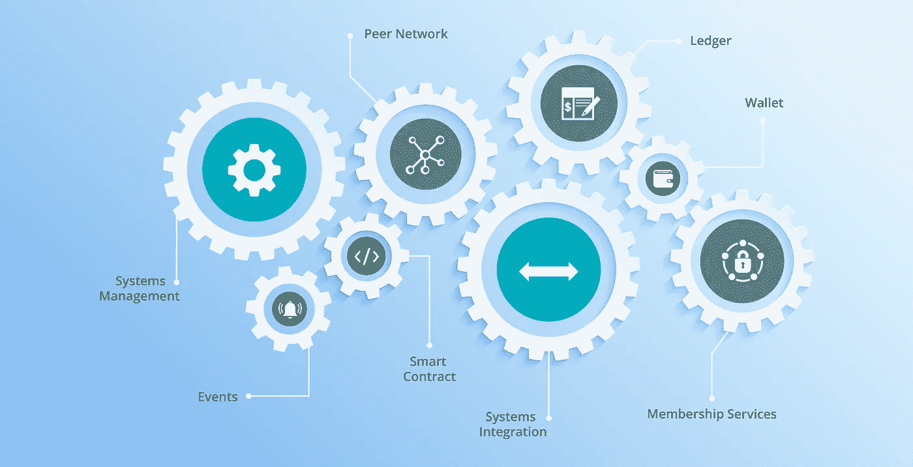
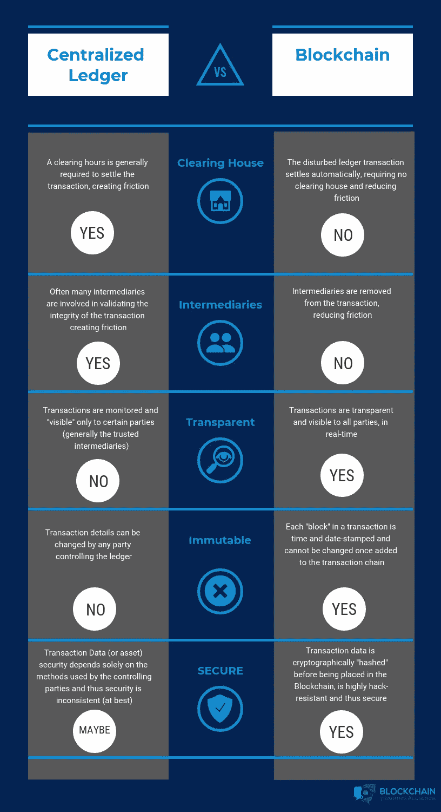
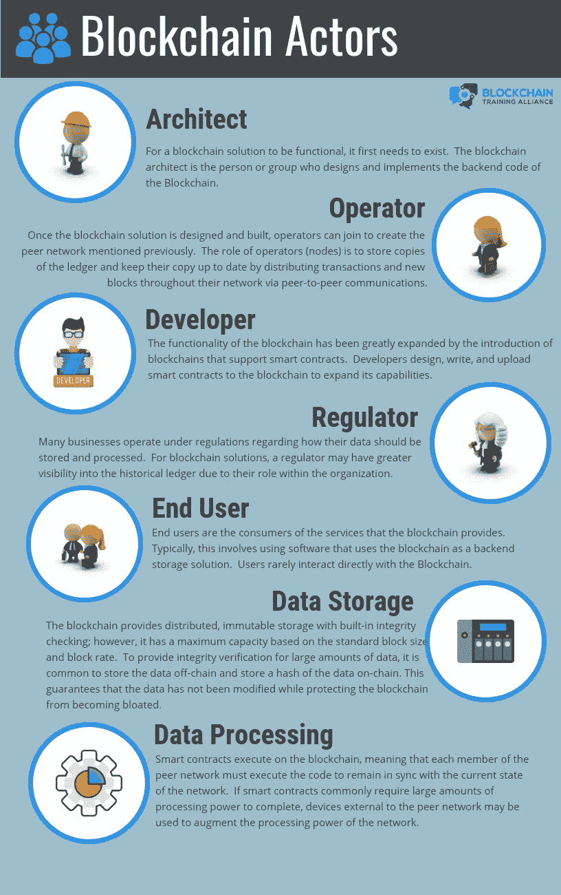
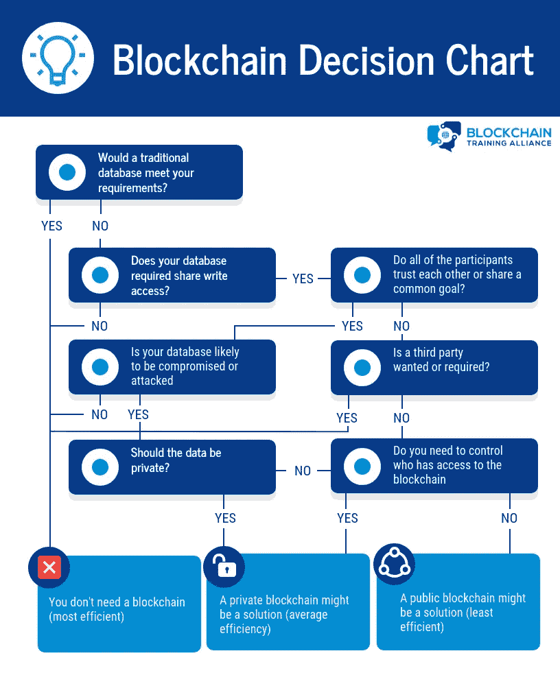
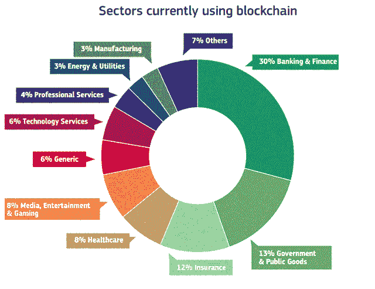

# 区块链——了解其用途和含义

> 原文：<https://medium.com/nerd-for-tech/blockchain-understanding-its-uses-and-implications-162b6d1cffd5?source=collection_archive---------11----------------------->

# 什么是区块链🤔？

这是一种允许人们在没有第三方的情况下交换资产和进行交易的技术。

事情开始于**中本聪**，他的真实身份仍然未知，在 **2008** 发布了一份白皮书，介绍了一种纯**点对点版本的**电子现金，被称为比特币。正是在这里，区块链技术首次亮相。

# 区块链是如何工作的？

**传统上**我们需要中央机构相互信任，并为我们的资产或任何类型的交易履行合同，但在**区块链**中，它们不再存储在一个中央位置，而是分布在一个**全球总账**中，使用最高级别的加密技术。当交易进行时，它会被发布到全球成千上万台电脑上。**这些交易被记录为块。**然后这些块被验证，然后被添加到不可变的先前验证的块的堆栈中。**将前一信息块嵌入到当前信息块的行为称为** **链接。**

于是有了**区块链。**

区块链的工作原理

**注:——比特币**和**加密货币**不是区块链。它们是区块链的用例。此外，比特币不完全是区块链的用例，它也是加密货币的用例。

一些流行加密货币是:-

比特币、以太坊、莱特币、Dogecoin、Ripple、Dash、zCash 等。

**区块链由几种不同类型的组件组成，每种组件在区块链的运作中都有特定的作用**

*   **分类账**:分布式的、不可变的历史记录
*   **对等网络**:存储、更新和维护分类帐
*   **会员服务**:用户认证、授权和身份管理
*   智能合约:在区块链上运行的程序
*   **钱包**:存储用户凭证
*   **事件**:区块链上的更新和动作的通知
*   **系统管理**:组件创建、修改和监控
*   **系统集成**:区块链与外部系统的集成。

区块链组件

# 分布式分类帐:-

分布式壁架的概念已经存在了数百年。为了理解区块链的基本原理，理解分布式分类账的工作原理是很重要的。分布式分类账是一个数据集合，没有一致同意的中央管理员。为了了解更多的细节，让我们回到公元 500 年的雅浦岛。雅皮士人使用一种非常独特的货币形式:拉伊石。这些石头每块重约 200 公斤，很难移动。为了用它们来换取商品或服务，他们把石头分成几部分，然后向岛上的每个成年人宣布谁拥有每块石头的哪一部分。每个成年人都必须保持一个所有权的心理账本。任何一个雅皮士人每次进行交易，都会向整个部落宣布。部落的每个成员都会更新他们的大脑记录。
**在今天的描述中，这将被称为分布式分类账。所有 Rai 石头的所有权都是众所周知的，每当有交易发生时，这些知识就会更新。那么为什么部落中没有一个人记录下 Rai 石头呢？如果主要档案保管员生病、无法工作或被发现不诚实，该怎么办？如果账本的唯一副本被以任何方式改变，财富将失去或不公平地获得。雅皮士知道他们的分布式账本系统可以保护它不被篡改。因为所有的雅皮士都知道谁拥有什么，所以很难愚弄岛上的每个人。即使一个部落成员搬走了，这个部落仍然有他们的心理账本的多个副本。在这点上，分类账是**容错**的，不容易被更改、损坏或丢失。这个部落还决定，石头不一定要放在岛上才能保值。有一天，一块石头掉进了海里，雅皮士人认为这块石头尽管看不见，但仍有价值，可以交易。
**这个由岛上大多数成年人一致同意的系统没有中央管理员，是分布式账本的第一个例子。****

# 集中式账本和区块链分布式账本的区别。

# 区块链参与者:-

商业区块链解决方案需要扮演各种角色的许多参与者才能充分发挥作用:

区块链参与者

# 你什么时候需要区块链？

这里有一个决策模型，它肯定会帮助你了解你是否真的需要一个区块链。

决策图表

## **其他一些受欢迎的型号有:-**

1.  D.伯奇模型
2.  伯奇-布朗-帕鲁拉瓦模型
3.  B.Suichies 模型
4.  A.刘易斯模型
5.  卡尔·wüSTL 和阿瑟·热尔韦等

**但是**都不完全正确。

# 为什么？🤔

因为他们都认为区块链是一种技术，但事实上它不是一种技术，而是一种设计模式。

**在开发模型的过程中，大家忽略的两个主要问题是:**

*   **你的软件是完全作为开源软件项目开发的吗？**

= >如果你的答案是否定的，那么你不需要区块链

*   **软件变更的治理是去中心化的吗，在某种意义上说“不是由一个或一小组个人或实体控制的”？**

= >不，那么你肯定不需要区块链。这意味着对软件变更的治理必须是痛苦和无政府的，否则你不需要区块链。

# 区块链的一些流行用例是:-

区块链是当今业界的一项趋势技术。它有如此多的用例，包括医疗保健、汽车、身份、政府、房地产和保险在内的行业都已经在使用区块链。

包括 IBM、Luxoft 在内的公司，以及美国伊利诺伊州库克县等县，都在使用区块链解决问题、节省资金，并改变数据存储和交换的方式。

## 在上与我联系👇👇

 [## JavaScript 不可用。

### 编辑描述

twitter.com](https://twitter.com/iam_chopra_aman)  [## Aman Chopra -微软学生学习大使- Beta -微软| LinkedIn

### Java 和 Python 爱好者| Web 开发人员|云(AWS) |技术内容作者|编码爱好者|喜欢从事真实的…

www.linkedin.com](https://www.linkedin.com/in/aman-chopra-375a81171/)