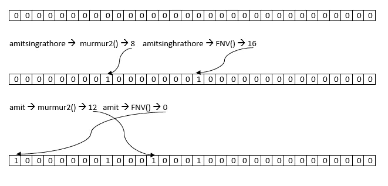
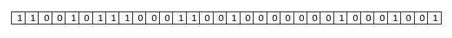

# 布鲁姆滤镜:没有就是没有！，Yes 表示一个也许。

> 原文：<https://medium.com/nerd-for-tech/bloom-filter-no-means-no-yes-means-a-maybe-4223e5d4cdd5?source=collection_archive---------4----------------------->

喜欢这个标题吗？


我想不出比这更简单的方法来描述布隆过滤器的概率行为。用专业术语来说，**布隆过滤器**是一个

*   节省空间
*   盖然论的
*   集合成员检查
*   数据结构

让我们一个一个来。

**集合成员检查:** Bloom filter 告诉我们一个项目是否在项目集合中。它在恒定的空间和时间 O(k)中这样做，其中 k 是散列函数的数目。它不需要存储整个集合本身。


**概率:**它可能保证也可能不保证物品的存在。但是可以保证它不存在。


稍后将详细介绍。

**节省空间:**它本身不存储数据。它使用一个位数组来实现。例如，您可以用大约 40MB 的空间表示 1000 万条记录。


**数据结构:**我们都知道什么是数据结构。:)

布隆过滤器使用比特阵列，最初全部设置为零。布隆过滤器利用散列函数来设置位数组的位值。使用哈希函数，需要快速和独立，如**杂音**和 **FNV** 。很多实现都有 **MD5** ，还有 **HashMix** 函数。

当我们在布隆过滤器中添加一个密钥时，该密钥被多个函数散列，然后相应的输出值被用于将该位置的比特设置为 1。当我们检查一个密钥的存在时，我们再次散列该密钥并检查是否所有的位(由散列函数给出)都被设置为 1。如果任一位被设置为 0，则意味着该密钥不存在。

让我们使用 murmur2 和 FNV 哈希函数快速浏览一下 Bloom filter，看看我们如何获得误报和漏报。我们创建一个 32 位数组，所有元素都设置为 0。



我们将字符串“amitsinghrathore”传递给 murmur2 和 FNV 函数，这两个函数在需要将位设置为 1 的地方生成索引。在这个例子中是 8，16。类似地，我们添加“amit ”,它返回索引 12 和 0。所以我们把这里的位设为 1。

我们又增加了一些值。

amitsinghrathore → [8，16]，amit → [12，0]，amitsingh → [1，31]，amitrathore → [4，13]，singh → [6，28]，rathore → [24，6]，amitkumar → [7，4])

我们以下面的数组结束。



现在，让我们看看如果我们寻找一个不存在的字符串会发生什么。

arathore → [15，19]如果我们查看数组中的[15]和[19]，我们会发现值[0，0]。因为我们在列表中得到一个零，所以 Bloom filter 可以有把握地说这个名字不存在。

让我们检查一下“阿古玛”。

阿古玛→ [24，6]。在数组中，第 24 位和第 6 位都包含 1。[1，1]导致 bloom filter 说它可能存在，尽管我们从未添加这个键/名称。这叫做假阳性。这是由于哈希函数中的冲突造成的。

布隆过滤器中的假阳性概率是，**p**=**(1-(1–1/m)^kn)^k**)。

其中 **n** 是存储在数组中的元素数量。 **m** 是数组的大小， **k** 是使用的哈希函数的数量。

使用明确否的概念，许多应用程序使用布隆过滤器来检查不存在并减少磁盘读取开销。卡桑德拉就是这样一个例子。它使用一个 bloom filter 来检查是否需要扫描表(在磁盘上)。如果布隆过滤器说它找不到密钥，那么应用程序确定它不需要扫描表。这减少了磁盘扫描操作的开销。

布隆过滤器存储器需求、散列函数的数量和假阳性概率相互依赖。

> ***m/n = -1.44 *log2(假阳性概率)***

要尝试不同的组合，试试这个。

 [## 布隆过滤器计算器

### 计算你的布鲁姆过滤器的最佳大小，看看一个给定的过滤器可以容纳多少个项目，或者只是欣赏曲线…

hur.st](https://hur.st/bloomfilter/) 

链接:

 [## 布隆过滤器

### 布隆过滤器被用来创建一个关于一个项目是否在一个数据结构中的概率猜测，并且被创建…

asecuritysite.com](https://asecuritysite.com/encryption/bloom)  [## 证明文件

### 当您需要可伸缩性和高可用性时，Apache Cassandra 数据库是正确的选择

cassandra.apache.org](http://cassandra.apache.org/doc/latest/operating/bloom_filters.html) 

Python 代码:

```
pip3 install bloom-filterfrom bloom_filter import BloomFilterblm_fltr = BloomFilter(max_elements=1000, error_rate=0.1)
assert "user1" in blm_fltr is False
blm_fltr.add('user1')
assert "user1" in blm_fltr is True
blm_fltr.add('user2')
```

# 供选择的

## 布谷鸟过滤器

Cuckoo 过滤器是一种类似的数据结构，支持快速集合成员检查。Cuckoo filter 提供删除、有限计数和有界误报概率，同时仍然保持类似的空间复杂度。它使用 cuckoo 散列来解决冲突，并维护一个紧凑的 cuckoo 散列表。

> 众所周知，布谷鸟在其他鸟类的巢中产卵，一旦卵孵化，幼鸟通常会将宿主的卵从巢中排出。Cuckoo 散列表在处理要插入到 Cuckoo 散列表中被占用的“桶”中的项目时采用了类似的行为。

布谷鸟过滤器可能会返回假阴性(删除后)。

## 超对数

超对数是一种概率基数估计算法。总之，这是通过从一组均匀分布的随机数中找到前导零的最大数量来实现的。如果随机数有 n 个最大前导零，则集合中的相异元素是`2^n`。这是非常高效的内存。

> *使用 1.5 kB 的内存，超对数算法能够以 2%的典型精度(标准误差)估计>* `*10^9*` *的基数。*

[很快](https://prestodb.io/)，一个分布式 SQL 查询引擎使用 HyperLogLog 提供一个名为`APPROX_DISTINCT`的函数来近似计算不同元素的数量。

希望这有所帮助。