# BMates:我的全栈 React.js/Rails web 应用程序项目

> 原文：<https://medium.com/nerd-for-tech/bmates-my-full-stack-react-js-rails-web-application-project-b4ee90054d1?source=collection_archive---------4----------------------->

我将分享我对软件工程研究期末项目的看法。

***App:****[*https://bmates.herokuapp.com*](https://bmates.herokuapp.com)*

****源代码:***[*https://github.com/CodeHunt101/bmates*](https://github.com/CodeHunt101/bmates)*

*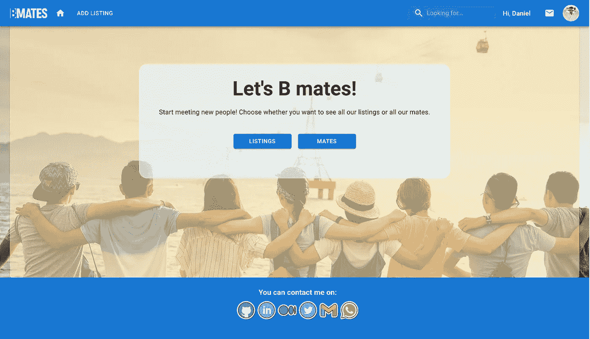*

*BMates 主页*

*终于，这一刻到来了！为了成为一名专注于 web 开发的软件工程师，我持续学习了几个月，最终开发了一个全栈 Web 应用程序，其中包含了我开始学习以来所学到的一切。我用来开发该产品的核心技术是:*

***编程语言:** *JavaScript* (前端)和 *Ruby* 作为 API(后端)*

***主框架/库:** *React.js* 和 *Rails**

***数据库管理系统:** *PostgreSQL**

***其他工具:** HTML，CSS，MaterialUI，React-Router，React-Calendar，AWS S3 桶云存储*

*没有什么要说的了，我们开始吧。*

# *BMates 是关于什么的？*

*比方说，你有点无聊，想和一个也愿意这样做的人见面或交谈，在见那个人之前，你已经知道那个人喜欢谈论什么话题，同时，你想和那个人交谈，而且只和那个人交谈。*

*我想开发一个应用程序，帮助那些愿意结交新朋友，但可能有点害羞或保守，宁愿有更私人的接触，而不是像 meetup 这样的应用程序的人联系起来。此外，它专注于朋友，因此有别于 Gumtree 或 Craiglist 等应用。那里是 Bmates 会敲你门的地方！*

# *它是如何工作的？*

*它由我称之为“伙伴”的用户组成，这些用户希望通过列表与其他人联系。一个单身伴侣可以有很多物品。列表只是一个页面，显示了一个伴侣愿意为与其他伴侣的潜在虚拟相遇带来什么。可以把它想象成一个电子商务网站上的产品列表，展示该产品的功能以及它如何帮助你。每个列表都有由主人挑选的可用日期，因此客人可以从列表中预订任何可用日期。*

# *好的，现在告诉我它的特点*

*该应用程序具有以下功能:*

*   *伙伴*
*   *清单*
*   *信息*
*   *保留*
*   *复习*
*   *搜索、排序和过滤*

## *伴侣(用户)*

*一切都从创建新用户或登录(如果他们已经有一个帐户)开始。后端呈现了验证错误。一旦用户提交了新帐户，客户机就向服务器发送 POST 请求。UsersController 将通过用户模型创建一个新用户；否则，它会将任何验证错误检索回客户端。*

*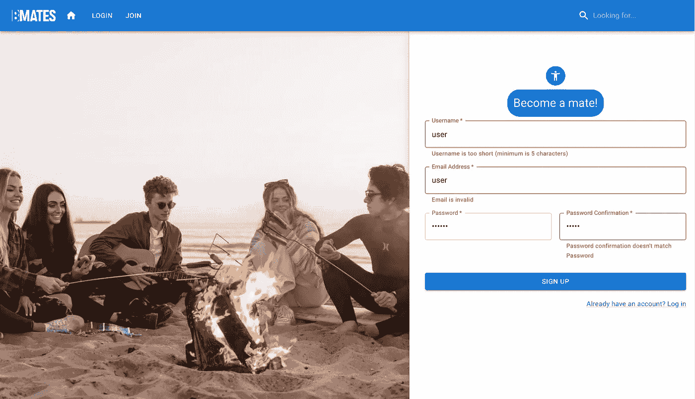*

***<【signumuserform/>**:用户尝试创建账户*

*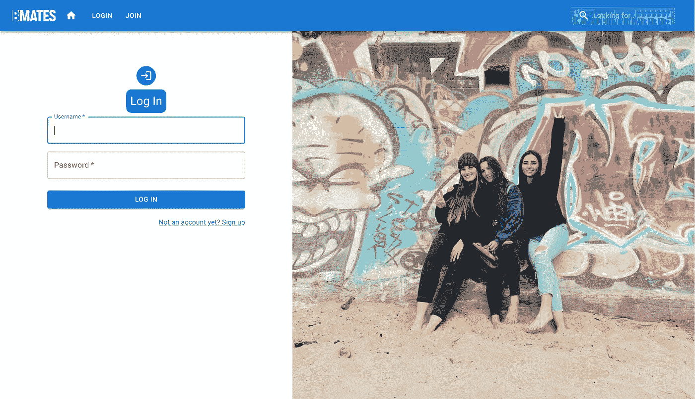*

***<LoginUserForm/>***

*登录后，他们可以预订、发送消息或在个人资料中添加更多信息，如姓名、性别、出生日期、当前国家、个人简历或个人资料图片。根据用户的操作，它会发送 POST 或 PATCH 请求来创建或更新数据库中的用户信息。*

*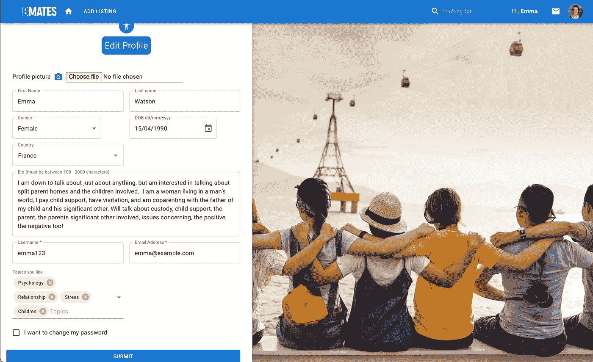*

***<编辑用户表单>** :艾玛添加或更新她的用户资料*

*值得一提的是，伴侣可以浏览列表和其他伴侣，而不必注册。*

*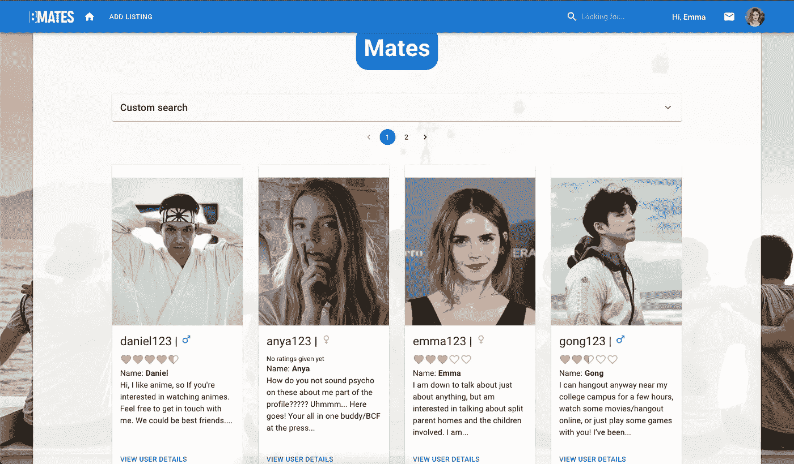*

***<用户/ >***

## *清单*

*配偶可以添加新的列表，并选择这些列表的可用日期。此操作将向列表和 available_dates 实体发送 POST 或 PATCH 请求。*

*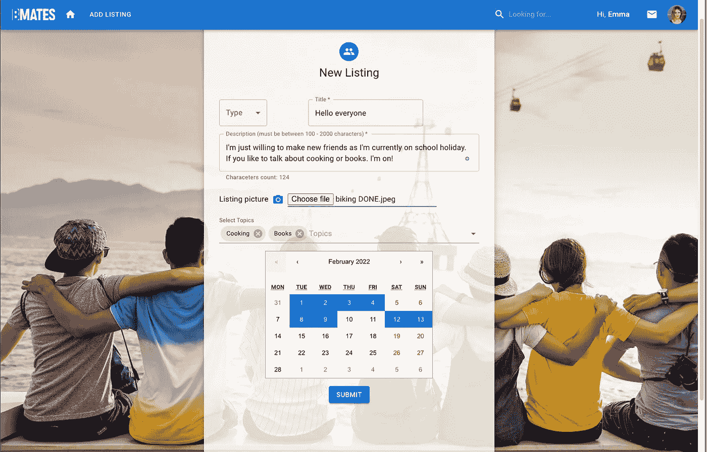*

***<【列表表单/ >** : Emma 创建/编辑新列表*

*如上所述，无论是否登录，用户都可以浏览所有列表。*

*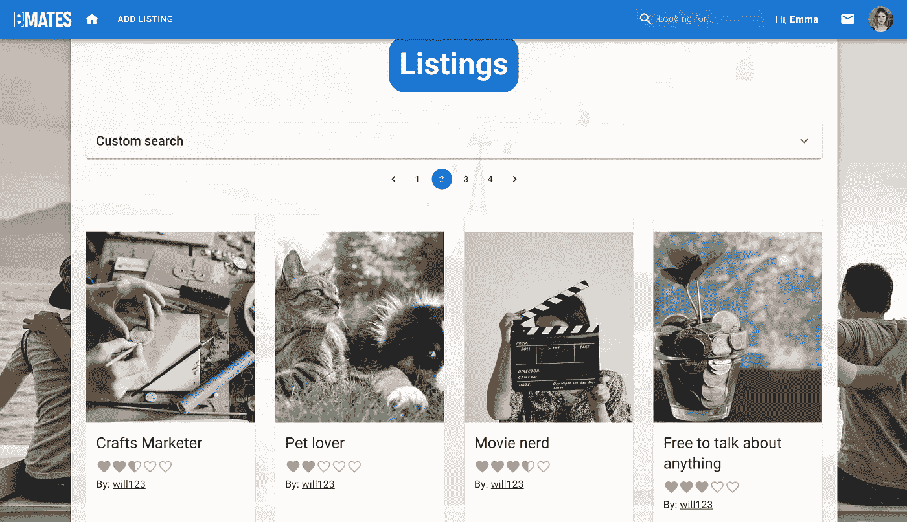*

***<【列表列表/ >***

*如果朋友们想查看一个列表的所有信息，包括评论，他们可以点击任何列表预览。*

*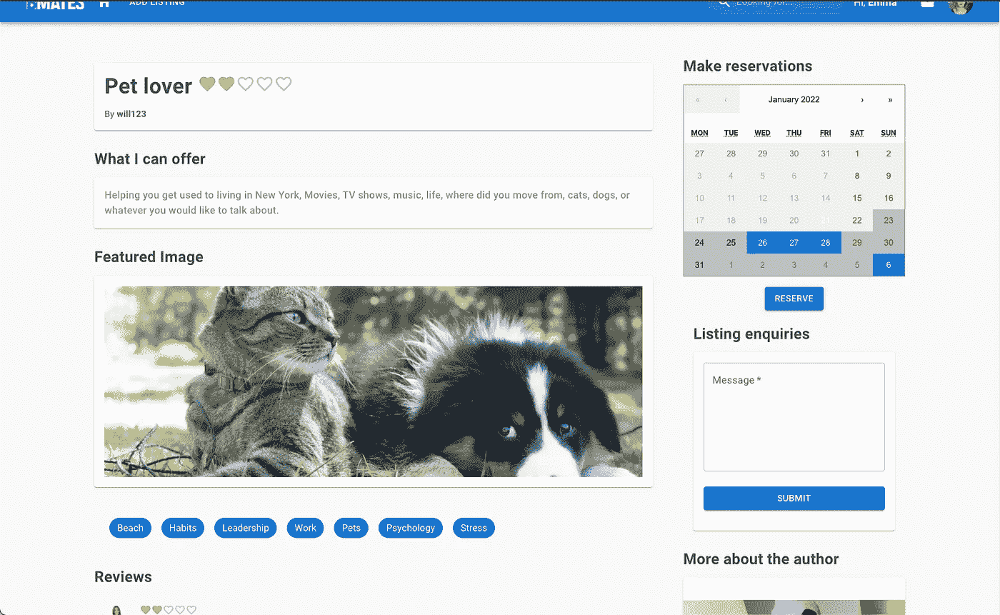*

***<列表详细信息/ >***

*此外，如果用户不想再使用某个列表，可以将其删除。但是，它只是在后端将其状态更改为 inactive，以保留重要信息，如以前的预订和给定的评论。*

***消息***

*现在用户已经创建了一个帐户，登录后，找到了一个他们想见的朋友的列表。是时候设置细节了，比如会议的确切时间，或者阐明他们可以期待什么。为此，我构建了一个消息功能。在那里，伙伴们可以看到并回复其他伙伴发来的所有信息。他们还可以看到该列表(如果它来自某个列表)。*

*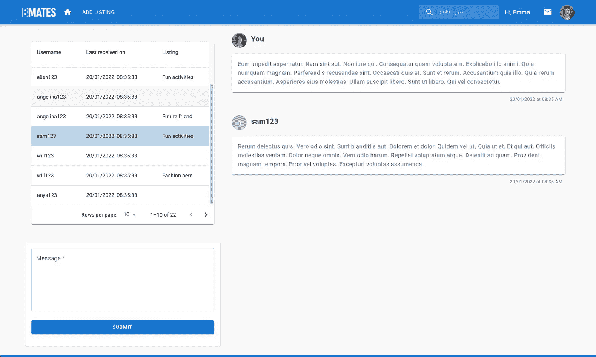*

***</>**:艾玛可以看到她收到的所有消息*

## *保留*

*当用户准备预订时，他们必须进入引起他们注意的列表，并通过在他们方便的时候预订日期来进行预订。用户可以通过点击头像并选择“我的预订”来查看所有已预订和已收到的预订。*

*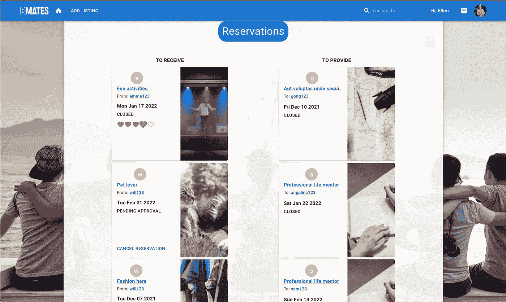*

***</>:**Ellen 可以看到她已经完成的和从其他用户那里收到的所有预订*

*预订可以有五种状态:*

*   **待审批*:挂牌主机等待主机审批的预约*
*   **已接受*:挂牌主持人已批准的预约*
*   **拒绝*:挂牌主持人拒绝的预订*
*   **关闭*:截至预订日期，挂牌主持人已批准的预订。*
*   **过期*:房源主持人正在等待审批的预订，在预订日之前从未接受或拒绝。*

## *复习*

*只有当预订状态为*关闭*时，大副才能查看。*

**

***在列表详细信息页面上可以看到评论，列表在标题旁边显示平均评分。Mate 页面还会显示所有列表的平均评分。***

******

*****<【listing details/>**:Will 在该列表中有两条评论，平均评分为 4.5 分，总体平均评分为 2.5 分。***

## ***搜索、排序和过滤***

***菜单栏有一个输入字段，允许队友从任何关键字查找列表。该关键字将浏览列表标题、描述和主题，以查看与该关键字匹配的列表。***

***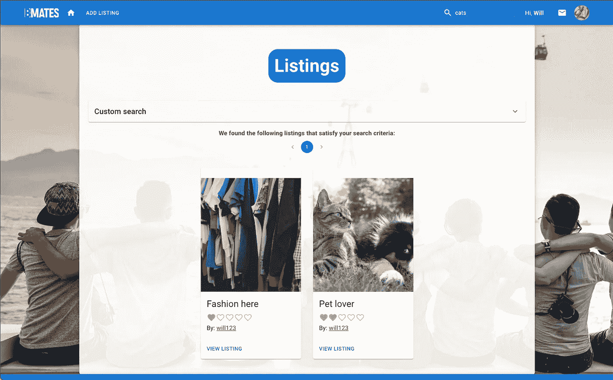***

*****< MainMenu/ > :** 将在搜索工具上键入“猫”并找到包含该关键字的两个列表***

***此外，配偶可以在方便的时候过滤和排序列表。因此，他们可以很容易地找到匹配他们喜欢的物品。如果他们想要搜索其他配偶，也会发生同样的情况，使用年龄范围和居住国家作为过滤参数，并使用与列表相同的排序参数。***

***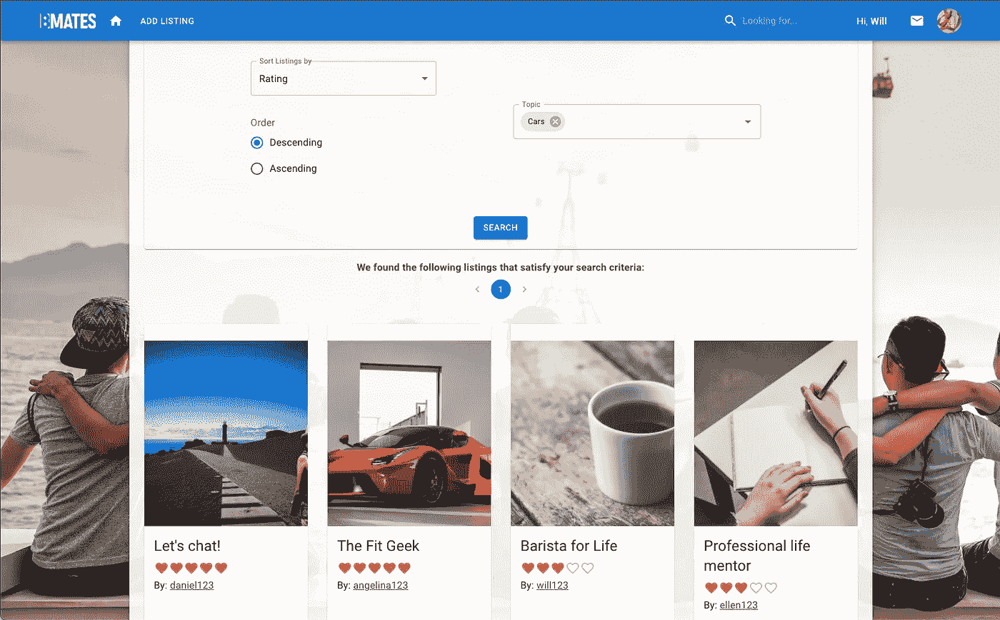***

*****<【sortandfilteristings/>**:将查找包含主题“汽车”的按评分降序排序的列表。***

# ***风格，日历和图像存储***

***在以前的项目中，我总是使用 *CSS* 和 *Bootstrap* 或 *React-Bootstrap* 作为样式框架。我已经对 Bootstrap 的工作原理有了很好的理解，所以我决定使用另一个流行的工具来进行样式化， *Material UI，*一个健壮的、可定制的、可访问的基础和高级组件库，用于 *React* 。我最终使用了各种各样的组件，所以我可以说我学到了很多这个库。***

***为了创建列表和预订日历，我使用了 *React-Calendar* 库，它允许我快速定制可用日期的选择。***

***这些图像由*亚马逊简单存储服务(亚马逊 S3)* 存储，这是一种提供行业领先的可扩展性、数据可用性、安全性和性能的对象存储服务。我不得不使用来自 *Rails* 的 *ActiveStorage* 来连接 AWS。***

# ***挑战***

***这个项目无疑是所有项目中要求最高、最具挑战性的，因为这一次，我必须将我在学习过程中所学到的一切整合到一个产品中。让我面临困难的挑战有:***

1.  *****Building** `**<ListingAvailability/>**` **和** `**<Reservation/>**` **:** 这两个组件处理`<Calendar/>`，这是来自 React-Calendar 的主要组件。那个库很强大，但是个人很难在短时间内理解。如果您想利用它的所有特性，您可能需要一段时间通读文档。我很难理解如何选择多个日期，以及如何更改选定日期或取消选定日期的样式属性。如果您必须从不同的月份中选择日期，那么每次我转到另一个月份时，前几个月中选择的日期仍然在状态中，但在样式中被取消选择。过了一段时间，通过一些`<Calendar/>`道具，我总算想明白了。***
2.  *****发送包含二进制文件的表单的 POST、PUT 和 PATCH 请求:**在以前的项目中，我只从 JavaScript 向服务器发送文本，或者直接从 Rails 视图发送图像。这次我必须找到一种通过 JavaScript 发送图像的方法。解决这个问题的一个方法是使用`FormData()`构造函数。下面是一个列表图像(二进制文件)如何通过`FormData().`发送到后端的例子***

```
***const **newListingInfo** = new **FormData()**const **appendListingInfo** = () => { **newListingInfo**.append("listing[image]", attachedImage) return **newListingInfo**}fetch(`/api/v1/listings/${resp.listing.id}/update_image`, { method: "PATCH", body: **appendListingInfo()**,})***
```

***3.**异步 JavaScript:** 感谢我的[神奇宝贝匹配卡](/nerd-for-tech/pokémon-matching-cards-my-reactjs-app-project-8f69bee496a2)项目。我可以改进如何处理异步 JavaScript。然而，从个人经验来看，我们应该谨慎对待承诺。我遇到的一个问题是，在从`<ListingForm/>,`提交一个列表后，在重定向到那个组件后，并不是所有可用的日期都显示在`<ListingDetails/>`中。基本上，在提交表单之后，重定向代码将运行，而不需要等待来自可用日期的所有承诺得到解决。了解并小心对待承诺是很重要的。***

# ***结论***

***总而言之，我非常享受这几个星期来完成我的最后一个项目。我可以将我以前学到的各种各样的概念整合到这个最终项目中。我的导师在演示后批准了这个项目，因此我正式成为了一名具有 Web 开发技能的软件工程师！***

***如果你想看看我的项目，我很乐意分享 GitHub 库和部署版本:***

*****储存库:**【https://github.com/CodeHunt101/bmates】T2***

***【https://bmates.herokuapp.com/】部署版本:***