# 奖励:你不能通过！！—玩家边界

> 原文：<https://medium.com/nerd-for-tech/bonus-you-shall-not-pass-player-boundaries-8e0a6e59aa8a?source=collection_archive---------17----------------------->

**目标**:防止玩家把手伸到屏幕外

这是更高级的**，因为我计划在未来的教程中更好地探索一些主题，所以把这作为**的奖励**，也许以后会回来这里更好地理解。**

**问题很简单:现在玩家可以迈出第一步了(太可爱了！)它可以**突破屏幕侧** …如果我们不阻止它！**

**有两种方法，一种**更简单，但更混乱**涉及一个简单的球员位置检查，与一些经验值相比，我们可以从检查员那里得到，并认为是屏幕边界。另一个，我更喜欢，更"**程序化**"，我们将得到实时的屏幕边界，它甚至可能在游戏过程中改变，因为与游戏摄像机配置有关。当然是**更复杂**，但也不是不可能。**

**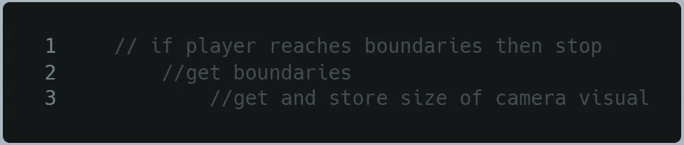**

**好吧，我把它写成伪代码:我们必须让播放器停在屏幕边界；但是要做到这一点，我们必须得到这些界限；但要做到这一点，我们必须定义它们，例如使用相机所看到的大小。**

**首先，让我们创建一个新的 C#脚本，并将其命名为**Cameron borders。****

****

**让我们以通常的方式定义一些**变量**:如果需要频繁调用，减少构造函数调用。**

**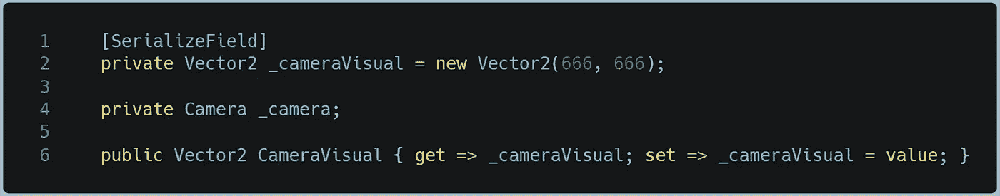**

**好的，我们需要更深入地研究: **_cameraVisual** 将存储摄像机看到的屏幕的 x 和 y 尺寸，初始化为一些随机的邪恶值。 **_camera** 是 camera 组件上的一个句柄，然后我定义了一个 _cameraVisual 作为**属性**来获得对它的 **public** 访问。**

**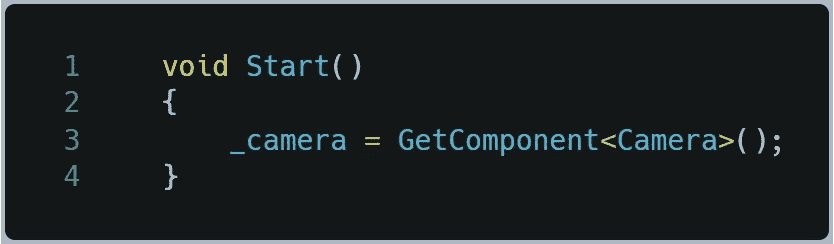**

**这里我们将相机组件分配给 _camera，我们需要它来获取一些值。这不是开始，所以在开始时只做一次。**

**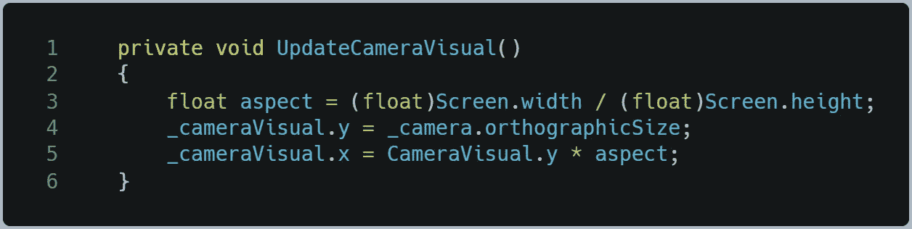**

**一个不错的部分:一个私有方法 UpdateCameraVisual **()** ，这里我们调用 **Screen** 类属性，width 和 height，以便计算**纵横比**。也许有更简单的方法…但是我从来没有想到过！**

**现在真正的东西是:视觉的 y 分量是由相机的 **orthographicSize** 属性获得的，只代表垂直尺寸的一半，但这正是我们所需要的。水平分量由 y 乘以纵横比得出。**

**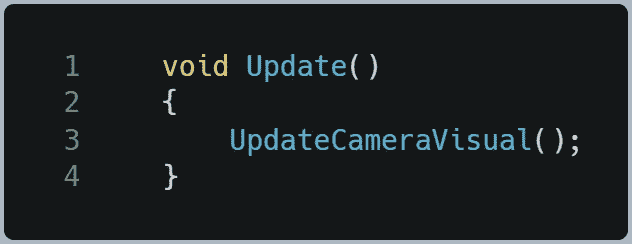**

**我们通过调用 **Update()** 中的方法来结束这个类。**

**回到 player 类，让我们添加两个新的变量:一个 Cameron borders 脚本的句柄(**_ Cameron borders**)和一个存储 player **位置的 vector3】(耶，3 甚至在 2D)。****

**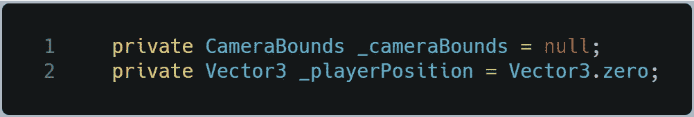**

**在 Start()中，我们可以通过检查我们正在寻找的相机对象是否存在(非空)来安全地将 camera borders 链接到组件。为了搜索相机对象，我使用了方法 **GameObject。FindGameObjectWithTag(" main camera ")**，这一点相当不言自明。在检查员视图中显示了**标签**。**

**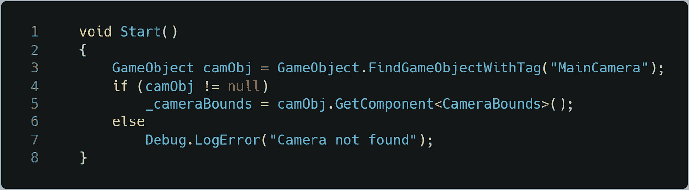****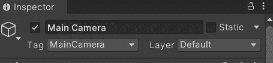**

****调试。LogError()** 将在控制台中显示指定的字符串，标记为 Error。**

**现在问题的核心。让我们写一个新的私有方法 **CheckBounds()** ，这里我们将把我们的逻辑。基本上，我们将使用一个强大的方法: **Mathf 来设置位置的 vector3 值。**钳()。该方法要求检查一个浮点值，一个浮点值代表最小值，另一个代表最大值。如果在最小值和最大值之间，或者在最小值(如果更小)或最大值(如果更大)之间，它返回一个等于最初传递的浮点值。太棒了！**

**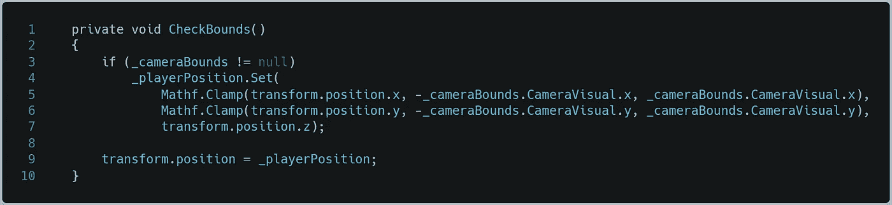**

**现在我们在 Update()中调用这个方法，就可以开始了。**

**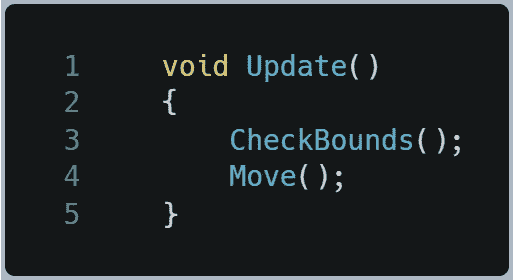**

**结果如下:**

**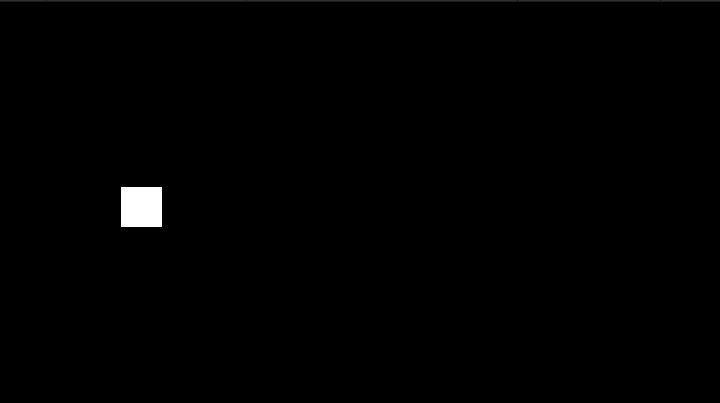**

**在关闭之前还有一件事:我选择这个方法是因为这样的话，如果我修改相机，边界会随之更新。也就是说，这是通过从检查器中更改相机组件中的**大小**值来完成的。**

**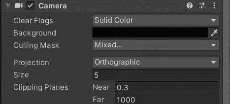**