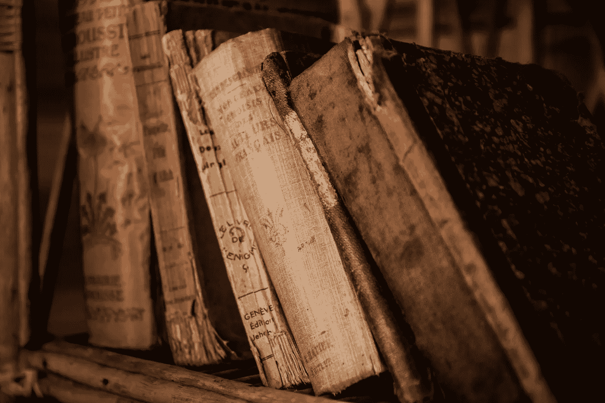

# 开始学习机器学习和深度学习的 5 本常青树书

> 原文：<https://medium.com/nerd-for-tech/books-to-start-learning-ml-and-dl-12bcc4cf22b?source=collection_archive---------4----------------------->

## 如果你刚刚开始你的数据科学职业生涯，或者只是对人工智能领域感到好奇，下面的书会很有帮助。

> *按照这个顺序👇如果你还是一个初学者，获得最大的好处。*

1.*使用 Scikit-Learn 和 tensor flow-Aurelion Geron 进行机器实践学习*

这是您开始数据科学之旅的最佳书籍之一。它向我们介绍了各种机器学习概念，并提供了实际的编码示例和一个庞大的 GitHub 知识库供我们以后实践。它还向我们介绍了基本的深度学习概念，解释得很好，以及如何使用深度学习框架 Tensorflow 来实现它们。
在接下来的几年里，你会不断地回到这本书上，快速复习你的 ML 和 DL 概念。

2.*用于数据分析的 Python—Wes McKinney*

然后你可以从这本书开始，这本书理论较少，采取了更实际的路线，从讲授 Python 和其他 Python 库开始，如 Pandas、Numpy 和 Matplotlib。这些库将有助于您清理数据并对其进行研究，从而从中获得真知灼见。如果你还不知道 Python，不要错过这个。

3. *Python 机器学习食谱—克里斯·阿尔邦*

这本书也是一个实用的实现，可以学习更多有助于数据预处理和管理的 Python 库。修正我们的一些旧观念和学习一些新技术可能会有帮助。但是，顾名思义，它更像是一本烹饪书，所以这本书的内容可能不符合我们的学习轨迹，但在将来使用实际例子时会有所帮助。如果你跑得很快，可以跳过，但是如果你有时间的话，就从头到尾看一遍。

4.*深度学习书籍——伊恩·古德菲勒*

这也是学习机器学习和深度学习最好的书籍之一。它走的是一条更理论化的路线，深入到现实世界中使用的各种技术背后的数学。但是请注意，这是一本很重的书。所以，深呼吸，准备潜得更深。乍看之下，你不会理解书中提到的所有内容，但你可以尝试同时进行自己的研究，以理解一些你不知道的概念。一本必读的书和自己搜索未知概念和理解的习惯在将来会很有帮助。

5.*用 Python 进行深度学习——Francois Chollet*

现在，你将在本书的帮助下更实际地实现前一本书中给出的概念。它向我们介绍了构建在 Tensorflow 框架之上的 Keras 库，该框架是作者自己开发的。您将学习如何使用 Keras 构建实用的深度学习模型，如 CNN、RNNs 等。而且在大脑深处进行深度学习会相当有益。

6.*奖励:探索深度学习——安德鲁·特拉斯克*

这是一本有趣的读物，你可以很快读完。这本书也可以作为深度学习的入门指南，可以在深度学习书之前阅读。

希望对你有帮助。喜欢就分享。喜欢就鼓掌。谢了。