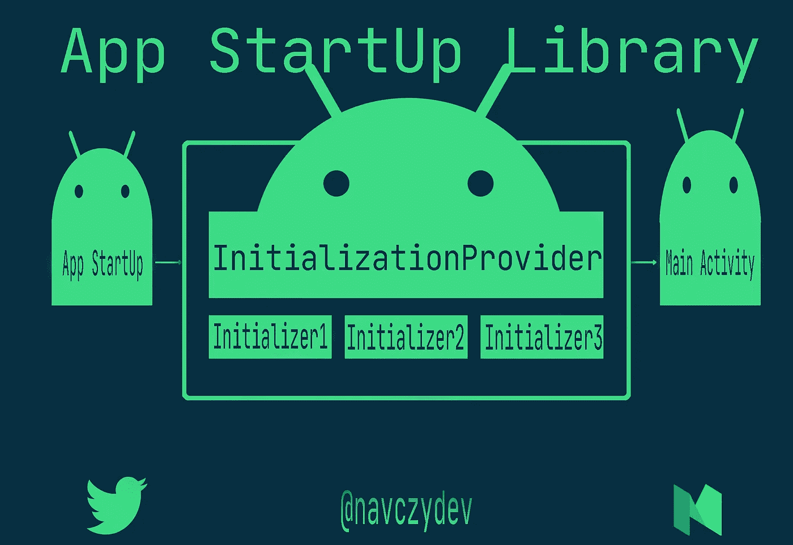

# 使用 Jetpack 启动库提高应用程序启动时间

> 原文：<https://medium.com/nerd-for-tech/boost-app-start-up-time-with-jetpack-startup-library-f1d61bdb640b?source=collection_archive---------1----------------------->



文章标题

应用程序启动库提供了一种在应用程序启动时初始化组件的简单、高效的方法。

它可以被**库开发人员**以及**应用程序开发人员**用来简化启动序列并明确设置初始化的顺序。

不是**为你想要**初始化**的每个组件**定义单独的内容提供者，应用启动允许你**定义共享单个内容提供者**的组件初始化器。这可以显著改善应用程序的启动时间。

如果你有一点在你的 android 应用中使用 **Firebase/WorkManager** 的经验。您可能已经看到了如何通过调用👇

```
FirebaseAuth.*getInstance*()
WorkManager.getInstance()
```

在大多数情况下，为了初始化库或任何其他组件，我们需要调用某种方法，如下所示:

```
NotificationManager.init(applicationContext)
```

但是在 firebase 初始化的情况下，我们没有调用任何方法来初始化它。我们只是得到它的实例，并准备好去。如果你想知道它是如何工作的，那么答案是`ContentProvider`。

您可以通过检查项目的**合并 AndroidManifest 文件**来验证这一点。

*   下面是 **FirebaseAuthUI** 使用的**提供者**的样本:

```
<provider
    android:name="com.firebase.ui.auth.data.client.AuthUiInitProvider"
    android:authorities="${applicationId}.authuiinitprovider"
    android:exported="false"
    android:initOrder="90" />
```

当应用程序启动时，所有的内容提供者都被初始化，从那时起，我们就可以使用 Firebase 使用`FirebaseAuth.*getInstance*()`

但是这种方法有一些缺点。比方说，如果我们的应用程序中有`n components`遵循 ContentProvider 方法进行初始化，那么`n ContentProviders`会导致应用程序启动过程变慢。

# 解决办法

🙏感谢 AndroidTeam，他们在 AndroidJetpack 的保护伞下引入了新的**库，名为 App StartUp**

> 今天，我们将看到这个库如何使我们的生活比以往任何时候都更容易，当它涉及到应用程序启动时的组件初始化。

*   要在您的库或应用程序中使用 Jetpack 启动，**将以下内容添加到您的 Gradle 文件:**

```
dependencies {
    implementation "androidx.startup:startup-runtime:1.0.0"
}
```

有两种方法可以使用这个库。

1.  在应用程序启动时初始化任何组件
2.  惰性/手动初始化

# 启动时初始化组件:

> 要在启动时自动初始化组件，您必须为应用程序需要初始化的每个组件定义一个**组件初始化器。**

# **实现组件初始化器:**

你需要实现`Initializer<T> interface`，它有 2 个方法:

*   `create()`方法，包含初始化组件的所有必要操作，并返回一个`T`实例。这里的`T`指的是你想要初始化的组件类型。
*   `dependencies()`方法，返回初始化器依赖的其他`Initializer<T>`对象的列表。你可以使用这个方法来控制应用程序在启动时运行初始化器的顺序。

# 假设我们有一个 **NotificationManager** ，我们希望在应用程序启动时初始化它。

## 初始化器的样本代码:

```
// Initializing  **NotificationManager**.
class NotificationManagerInitializer : Initializer<NotificationManager> {
    override fun create(context: Context): NotificationManager {
        val configuration = Configuration.Builder().build()
        return NotificationManager.initialize(context)
    }
    override fun dependencies(): List<Class<out Initializer<*>>> {
        // No dependencies on other libraries.
        return emptyList()
    }
}
```

# **通知管理器**

```
public class **NotificationManager** private constructor(val context: Context) { **...... other code**   companion object { lateinit var context: Context
      private lateinit var notificationManager: NotificationManager fun initialize(ctx: Context): NotificationManager { context = ctx.*applicationContext* notificationManager = NotificationManager(ctx) return notificationManager } fun getInstance(): NotificationManager { if (!(::notificationManager.*isInitialized*)) { throw Exception("Notification Manager not initialized.   You might forgot to call initialize(ctx: Context) ") } Log.d("TAG", "getInstance:  $notificationManager]") return notificationManager } }}
```

*   现在一切就绪，**接下来我们需要将提供者条目添加到 AndroidManifest 文件:**

App Startup 包括一个名为`InitializationProvider`的特殊内容提供者，它用来发现和调用你的组件初始化器。

这意味着，为了使组件初始化器可被应用程序启动发现，必须满足以下条件之一:

*   组件初始化器在`InitializationProvider`清单条目下有一个对应的`<meta-data>`条目。
*   组件初始化器在`dependencies()`方法中列出，来自一个已经可以发现的初始化器。

```
<provider
    android:name="androidx.startup.InitializationProvider"
    android:authorities="${applicationId}.androidx-startup"
    android:exported="false"
    tools:node="merge"><!-- This entry makes NotificationManagerInitializer discoverable. -->
<meta-data  android:name="com.example.NotificationManagerInitializer"
          android:value="androidx.startup" />
</provider>
```

*   仅此而已。现在，您可以随时随地在您的应用程序中使用 **NotificationManager** ,只需调用:

```
NotificationManagerInitializer.getInstance()
```

# 惰性/手动组件初始化:

通常，当您使用应用程序启动时，`InitializationProvider`对象使用一个名为`[AppInitializer](https://developer.android.com/reference/kotlin/androidx/startup/AppInitializer)`的实体在应用程序启动时自动发现并运行组件初始化器。

但是，如果您想手动初始化组件，也可以直接使用`AppInitializer`。这被称为 ***惰性初始化*** ，它可以帮助最小化启动成本。

*   您必须先**禁用任何您想要手动初始化**的**组件的自动初始化**。

## 禁用所有组件的自动初始化

*   要禁用所有自动初始化，从清单中删除`InitializationProvider`的整个条目:

```
<provider
    android:name="androidx.startup.InitializationProvider"
    android:authorities="${applicationId}.androidx-startup"
    tools:node="remove" />
```

## 手动初始化 NotificationManager:

```
AppInitializer.getInstance(context)
    .initializeComponent(NotificationManager::class.java)
```

# 👨‍💻👨‍💻👏👏快乐编码👏👏👨‍💻👨‍💻

# **保持联系**

*   [推特](https://twitter.com/navczydev)
*   [领英](https://www.linkedin.com/in/navczydev/)

# 参考

[](/androiddevelopers/app-startup-part-1-34f57b65cacd) [## 应用程序启动，第 1 部分

### 内容提供商和自动初始化

medium.com](/androiddevelopers/app-startup-part-1-34f57b65cacd) [](https://android-developers.googleblog.com/2020/07/decrease-startup-time-with-jetpack-app.html) [## 通过 Jetpack 应用程序启动减少启动时间

### 对于任何应用程序来说，应用程序启动时间都是一个关键指标。用户希望应用响应迅速，加载速度快…

android-developers.googleblog.com](https://android-developers.googleblog.com/2020/07/decrease-startup-time-with-jetpack-app.html)