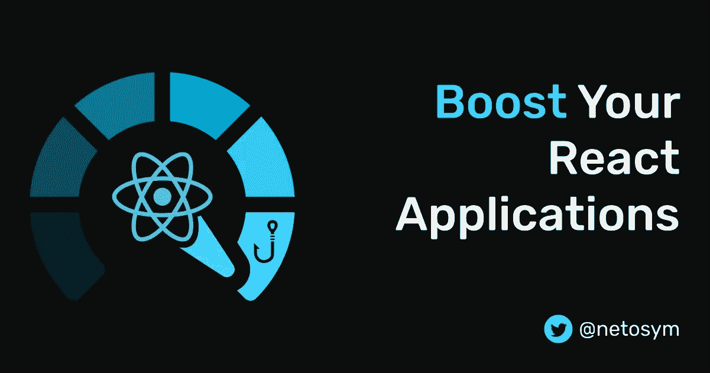
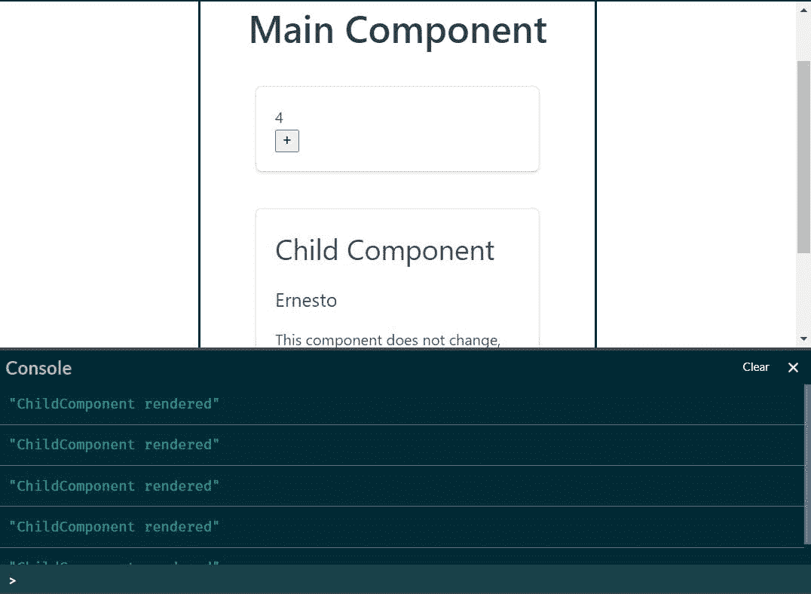
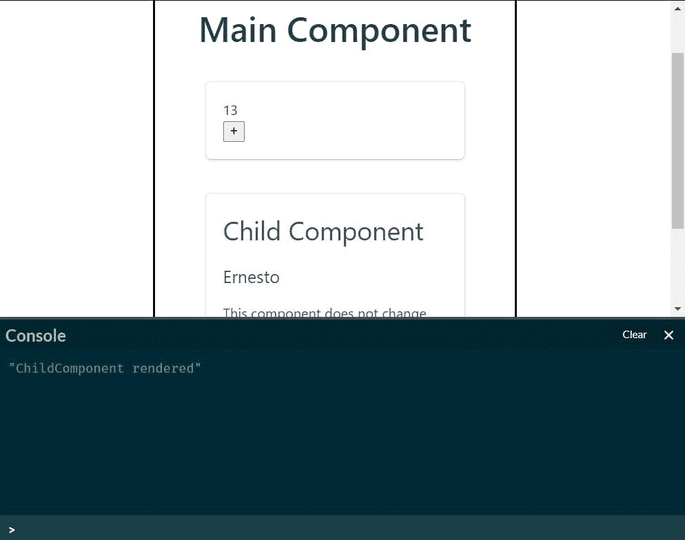
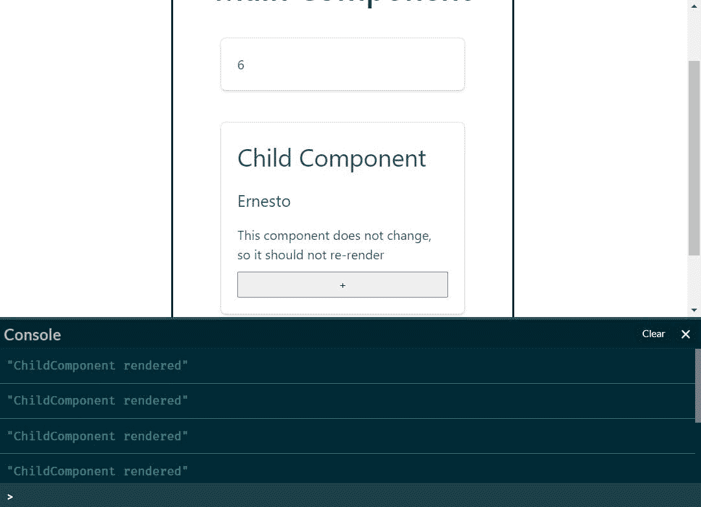
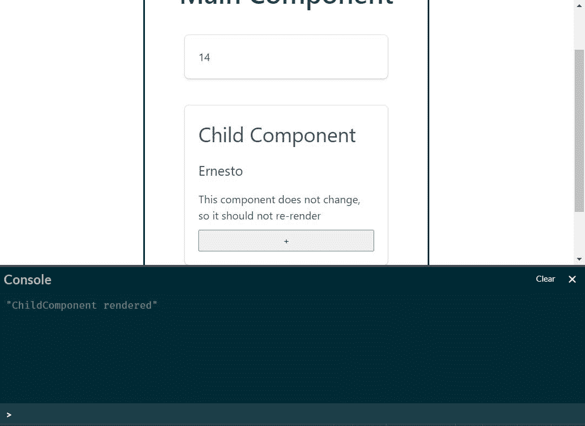
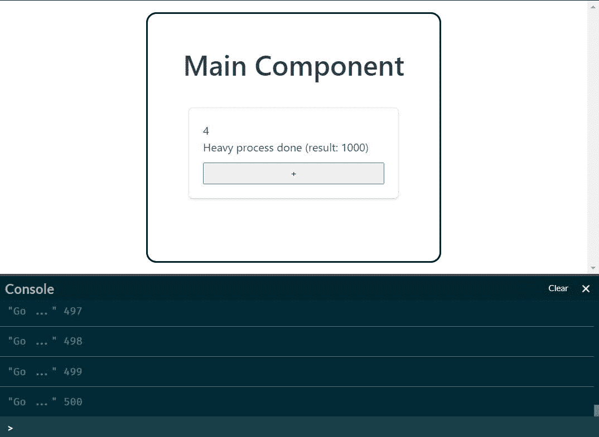
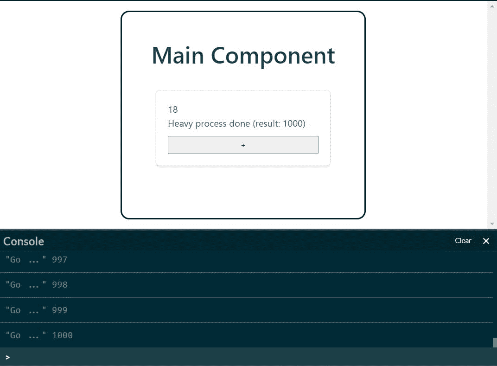

# 使用 React.memo、useCallback 和 useMemo 增强 React 应用程序

> 原文：<https://medium.com/nerd-for-tech/boost-your-react-apps-with-react-memo-usecallback-and-usememo-52dfe9575ec6?source=collection_archive---------1----------------------->



我们热爱的众多原因之一💙反应过来就是因为真的快。React 在幕后做了大量的工作来保证所有的东西都能有效渲染。因此，在大多数情况下，性能不是我们需要担心的事情。然而，我们可能会遇到这样的情况，我们发现我们的组件渲染的比他们需要的要多，因此，我们的应用程序变慢了。🐢🐢

嗨！我是 Ernesto，在这篇文章中，我将讨论如何使用`React.memo`、`useCallback`和`useMemo`让我们的 React 应用程序像风一样运行。⚡

# 反应备忘录🧠

这是 React 16.6.0 发布以来最酷的特性之一。顾名思义，`React.memo`⚛️允许我们通过记忆过程来提升功能组件的性能。它类似于用于类组件的`PureComponent`。

> `React.memo`是[高阶分量](https://reactjs.org/docs/higher-order-components.html) (HOC)，是取一个分量，返回一个新分量的函数。

`React.memo`取一个函数组件，返回一个[记忆的](https://en.wikipedia.org/wiki/Memoization)(优化)组件。

迷茫？😐让我们看一个例子。😁——*你可以查看我的代号*[](https://codepen.io/netoTests/pen/wvWVBxZ)**中的例子。✒**

```
*//Child Component
const ChildComponent = (props) => {
  //This message is printed when the component renders
  console.log("ChildComponent rendered")

  return (
    <div className="box">
      <h1>Child Component</h1>
      <h2>{props.name}</h2>
      <p>This component does not change, so it should not render</p>
    </div>
  )
} //Main Component
const MainComponent = () => {
  const [value, setValue] = React.useState(0)
  handleClick = () => {
    setValue(value => value + 1)
  };

  return (
    <div>
      <h1 className="title">React.memo example</h1>
      <div className="box">
        <div>{value}</div>
        <button onClick={handleClick}>+</button>
      </div>
      {/*Child component, its prop does not change*/}
      <ChildComponent name="Ernesto"/>
    </div>
  )
}*
```

*我们有一个用`name`道具渲染`ChildComponent`的`MainComponent`。`MainComponent`有一个状态，如果它改变了，组件会重新渲染。*

*有道理，对吧？🤔如果一个组件改变了，它应该重新渲染，如果没有改变，就不应该。*

*然而，当我们点击+按钮并改变`MainComponent`状态时，`ChildComponent`也会重新渲染。如果你检查控制台，你会看到*“子组件渲染”*消息。*

**

*这是不必要的重新渲染，因为`ChildComponent`根本没有改变；唯一改变的是`MainComponent`。*

*怎么才能解决这个问题？🤨嗯，现在是`React.memo`来救援的时候了。我们唯一要做的就是将我们的`ChildComponent`包装在`React.memo()`函数中。*

```
*//Child Component
//We use React.memo
const ChildComponent = React.memo((props) => {
  //This message is printed when the component renders
  console.log("ChildComponent rendered")

  return (
    <div className="box">
      <h1>Child Component</h1>
      <h2>{props.name}</h2>
      <p>This component does not change, so it should not render</p>
    </div>
  )
})*
```

*现在，如果你看到控制台，*“child component rendered”*消息应该只出现一次，当你点击+按钮并改变状态时，这条消息不会显示，因为`ChildComponent`没有重新渲染。😎*

**

*`React.memo`比较传递给组件的道具。如果与上次相同，`React.memo`将使用之前的渲染结果，并跳过重新渲染过程。*

> *记住`React.memo`只找道具变化。这意味着如果你的函数组件有一个状态(带`useState`钩子)，当状态改变时，它仍然会重新呈现。*

# *使用回调🏹并使用备忘录🔥*

*这两个挂钩可能会有点混淆。😵它们都接收一个函数和一个依赖项数组作为参数，并且只有当其中一个依赖项发生变化时，它们才会计算一个新值。*

```
*//useCallback returns a memoized function
const memoizedCallback = useCallback(() => {
  doSomething();
}, [dependencies]);//useMemo returns a memoized value
const memoizedValue = useMemo(() => {
    return computeExpensiveValue()
}, [dependencies]);*
```

*不同的是`useMemo`会返回一个记忆化的值，函数传递的结果，而`useCallback`会返回记忆化的函数本身。*

*让我们看看如何以及何时使用它们。😉*

## *使用回调*

*这在向优化的子组件传递回调时特别有用。所以`useCallback`总是和`React.memo`一起工作。*

*我们将把前面的例子稍微改变一下。——*你可以在* [*我的笔友*](https://codepen.io/netoTests/pen/OJXKVdN) *里查例子。✒**

```
*//Child Component
const ChildComponent = React.memo((props) => {
  console.log("ChildComponent rendered") return (
    <div className="box">
      <h1>Child Component</h1>
      <h2>{props.name}</h2>
      <p>This component does not change, so it should not re-render</p>
      {/*Button that will change the state of its parent component*/}
      <button onClick={props.handle}>+</button>
    </div>
  )
}) //Main Component
const App = () => {
  const [value, setValue] = React.useState(0)
  handleClick = () => {
    setValue(value => value + 1)
  }; return (
    <div className="main-comp">
        <h1 className="title">Main Component</h1>
        <div className="box">
          <div>{value}</div>
        </div>
        {/*Pass the handleClick function through props*/}
        <ChildComponent name="Ernesto" handle={handleClick}/>
    </div>
  )
}*
```

*现在，改变`MainComponent`状态的按钮在`ChildComponent`内部；因此，我们必须从`MainComponent`中传递包含`handleClick`功能的`handle`属性。*

*如果你去控制台，你会注意到每次我们点击按钮时*“child component rendered”*消息再次出现。我们正在使用`React.memo`，但是组件仍然在重新渲染。发生了什么事？🥴*

**

*这是因为每次`MainComponent`状态改变时，一个新的`handleClick`函数就会被创建。这意味着每次我们点击+按钮时，`ChildComponent`的`handle`道具是不同的。这就是`React.memo`不起作用的原因；`handle`道具在变。*

*我们可以通过使用`useCallback`钩子来记忆`handleClick`函数来解决这个问题。*

```
*//Main Component
const App = () => {
  const [value, setValue] = React.useState(0)
  //useCallback hook
  const handleClick = useCallback(() => {
    setValue(value => value + 1)
  }, []);

  return (
    <div className="main-comp">
        <h1 className="title">Main Component</h1>
        <div className="box">
          <div>{value}</div>
        </div>
        {/*Pass the handleClick memoized function through props*/}
        <ChildComponent name="Ernesto" handle={handleClick}/>
    </div>
  )
}*
```

*请注意，依赖项数组是空的；这意味着该函数将只创建一次。所以`MainComponent`的`handle`道具永远不变。😎*

**

## *使用备忘录*

*当我们必须计算一个过大的值时，我们使用`useMemo`，我们不希望每次组件重新渲染时都要重新计算一次。*

*我们来举个例子。——*你可以在* [*我的 CodePen*](https://codepen.io/netoTests/pen/QWEezwZ) *里查例子。✒**

```
*//Function that computes an exessive value
const heavyProcess = (times) => {
  for (let i = 0; i < times; i++) {
    console.log('Go ...', i + 1);
  }
  return `Heavy process done (result: ${times})`;
};

//Main Component
const MainComponent = () => {
  const [value, setValue] = React.useState(0)
  handleClick = () => {
    setValue(value => value + 1)
  };
//The returned value is saved
const heavyProcessValue = heavyProcess(1000)

  return (
    <div className="main-comp">
        <h1 className="title">Main Component</h1>
        <div className="box">
          <div>{value}</div>
          {/*The returned value is printed*/}
          <p>{heavyProcessValue}</p>
          <button onClick={handleClick}>+</button>
        </div>
    </div>
  )
}*
```

*我们用`heavyProcess`函数模拟一个繁重的过程，它将从 1 到 1000 的数字打印到控制台，并返回最后打印的数字(1000)。我们的`MainComponent`有一个简单的计数器，它打印`heavyProcess`函数的返回值。*

*如果你去控制台，你会注意到每次我们点击+按钮，从 1 到 1000 的所有数字都会被打印出来。因此，每次组件重新呈现时(由于其状态的变化),`heavyProcess`再次执行。*

**

*这一次，`useMemo`会救我们。我们将用它来记忆计算出的值。*

```
*//Main Component
const MainComponent = () => {
  const [value, setValue] = React.useState(0)
  handleClick = () => {
    setValue(value => value + 1)
  };
  //The returned memoized value is saved with useMemo
  const memoizedHeavyProcessValue = React.useMemo(() => {
    return heavyProcess(1000)
  }, []) return (
    <div className="main-comp">
        <h1 className="title">Main Component</h1>
        <div className="box">
          <div>{value}</div>
          {/*The memoized value is printed*/}
          <p>{memoizedHeavyProcessValue}</p>
          <button onClick={handleClick}>+</button>
        </div>
    </div>
  )
}*
```

*现在，我们传递的不是`heavyProcess`函数返回的值，而是`useMemo`钩子给我们的记忆值；仅当其中一个依赖关系发生变化时，才会再次计算该值。在我们的例子中，数组是空的，这意味着这个值只被计算一次。😎*

> *不要忘记`useMemo`钩子的第一个参数中的`return`语句。*

**

# *结论*

*   *使用`React.memo`跳过⏭函数组件中不必要的渲染。如果你想要类似于类组件的东西，使用`PureComponent`。*
*   *当你想通过回调的时候使用`useCallback`钩子🏹通过道具传递给子组件。*
*   *当您想记忆一个过大的值时，使用`useMemo`挂钩🔥由函数返回，比如获取大量数据的 HTTP 请求。*

*请记住，在你开始优化你的应用程序之前，你应该先衡量一下成本。⚖:否则，你将优化那些可能不需要优化的东西。😉*

*感谢阅读！📖如果这篇文章对你有帮助，请为它鼓掌。🖐，如果你有任何贡献、意见、疑问或建议，请告诉我。对我提高内容帮助很大。😃*

*下一篇文章再见。👋*

# *资源*

*   *【https://reactjs.org/docs/react-api.html#reactmemo 号*
*   *【https://reactjs.org/docs/hooks-reference.html#usecallback *
*   *[https://reactjs.org/docs/hooks-reference.html#usememo](https://reactjs.org/docs/hooks-reference.html#usememo)*

**最初发布于*[*https://ernesto angulo . hash node . dev .*](https://ernestoangulo.hashnode.dev/are-you-still-using-cmd-let-me-introduce-you-to-wsl)*