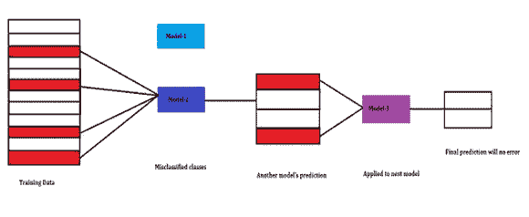
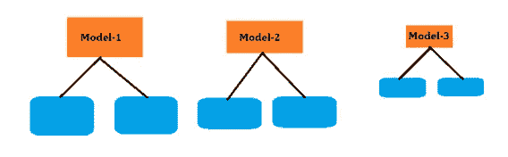
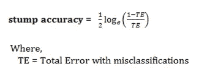
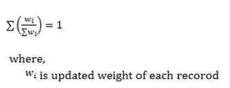
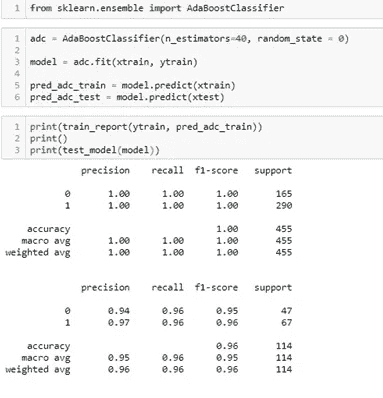
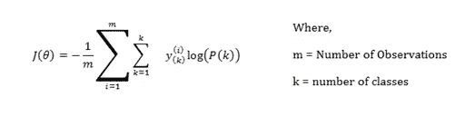

# 机器学习中的助推

> 原文：<https://medium.com/nerd-for-tech/boosting-in-machine-learning-438312f8f4e1?source=collection_archive---------24----------------------->

Boosting 是一种集成机器学习技术，用于通过使用多个弱分类器来制作更强的分类器。第一个模型基本上是使用训练数据建立的，第二个模型是为了纠正第一个模型中存在的错误而建立的。这个系列继续下去，直到误差减少或增加最大数量的模型。

Boosting 算法背后的过程

上图解释了 Boosting 算法背后的完整过程。错误分类的数据被设置到另一个模型(模型-2)中以预测更多的类，它给出了很好的准确性，但它仍然错误分类了一些类，从而保留在另一个模型中，最后，值被如此准确地预测。

模型-1 预测到一些错误分类，然后该算法将错误分类的数据传递到另一个模型(模型-2)，而另一个模型会小心处理错误分类以减少错误。如果第二个模型也不能减少太多的误差，最后会创建另一个模型来处理误差。像这样，只有过程继续。这是通过对模型进行一些调整来实现的。

模型的运行依赖于前一个模型的性能。取决于前一个模型给出了多少错误分类，另一个模型将只处理那些记录。就像同样的，整个过程被执行。

**Adaboosting**

Adaboost 基本上用于增强决策树模型，尤其是在二进制分类中，以获得良好的准确性模型。它通过弱分类器来增强机器学习算法。

树的 Adaboost 模型对于构成单个节点树的每个特征只有一个级别。于是对每一棵树，我们都称之为“**树桩**”。我们会给每条记录相同的权重。我们将其指定为样品重量。

重量不同的不同型号

每个模型都有不同的权重，基于熵或基尼系数的标准，模型选择第一棵树。此外，它通过使用下面的公式来检查残肢的性能:

性能是根据每个分类错误的记录的权重计算的。现在，在检查了残肢的性能之后，然后为下一个模型更新错误分类记录的权重。因此，要更新权重，公式为:

*新样本重量=旧样本重量* e* ***残肢精度***

这个公式肯定会增加被错误分类的记录的权重。对于那些被正确分类的条目，机器会尝试减少它们的权重，因此公式如下所示:

*新样本重量=旧重量* e****——(残肢准确度)***

这个公式将处理正确分类的记录，并降低它们的权重。在所有概率的情况下，它等于 1，但在更新权重后，总和不接近 1，那么我们做简单的数学计算:

最后，我们这样做是为了使更新的加权值正常化。不，总和是 1。最终，机器使用标准化重量。它在权重桶上工作，并处理错误分类的记录。毕竟，这就是装袋和随机森林喜欢对**多数投票**做预测的方式。

**Python 分析:**

**梯度推进**

梯度推进类似于最终处理模型的误差或成本函数的技术。最终，梯度意味着斜率，我们明确地处理回归中的斜率，这意味着梯度推进是一种集成技术，最终试图减少误差，或者我们可以说残差。

在测试数据的情况下，我们没有预测，因此对于训练数据，它要么预测值，要么取所有向量预测值的平均值并估计残差。然后，它进一步预测下一次试图减少误差的值，最后，机器给出一个令人满意的结果。

要了解有关回归的梯度推进的更多信息，请参考以下链接:

[https://github . com/AsadKarel/Machine _ Learning _ Stuff/blob/main/Gradient _ boosting . pdf](https://github.com/AsadKarel/Machine_Learning_Stuff/blob/main/Gradient_Boosting.pdf)

**用于分类的梯度推进:**

我们熟悉残差和成本函数，每一个都与回归或分类有关。我们甚至熟悉，我们估计连续数据的残差，因为我们处理分类数据的成本函数。

在分类分析中，我们不能做残差，那么这种梯度推进集成技术如何对这种方法有用呢？让我们看看这背后的数学原理。因此，**交叉熵**的公式由下式给出:

我们有两种不同的情况，要么类的概率为零，要么大于零。对于不正确的预测，完整项将为零，因为 *y(k) = 0* 。并且对于正确的预测，类别 *P(k)* 的概率将增加，因此该算法将迫使模型接近出现概率大的类别。

我们知道这种关系。 *-log (t)，*随着‘t’变为零，log 值增加。而这是会引起 *J(q)* 增加的。如果我们希望减少成本函数或误差，我们将不得不增加 t。同样的情况下机器遵循上面的等式。对于这种情况，我们有两个好处:

类别增加的概率给出了实际预测的高机会。

概率的高值降低了成本函数，因此 *J(q)* 变为零。