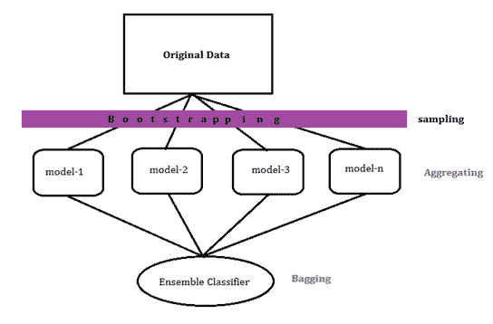
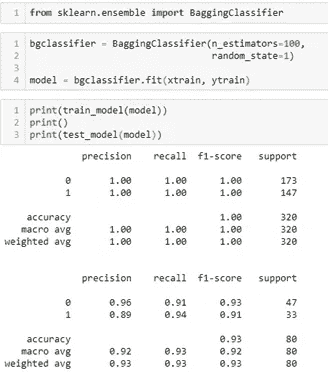
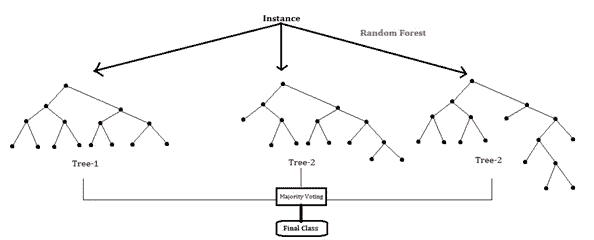
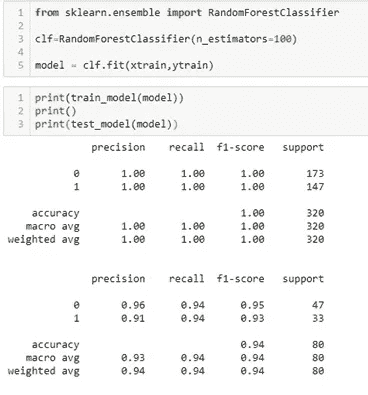

# 自助聚集随机森林模型

> 原文：<https://medium.com/nerd-for-tech/bootstrap-aggregating-and-random-forest-model-9460e235537?source=collection_archive---------5----------------------->

**B**oot strap**Agg**regat**ing**也叫装袋。这是一种机器学习集成元算法，旨在提高精度和减少算法中的杂质。这基本上是用于统计分类。该算法有助于减少方差以处理过拟合。该模型应用于决策树算法进行处理。此外，这是通过*随机抽样和替换*来完成的。

**什么是带替换的随机抽样？**

这是样本提取与观察，其中一个观察可以重复进入其他样本。这被称为置换随机抽样。

基本上这个算法做的是，它制作训练数据的不同样本。然后，它根据各个模型检查每个模型的准确性。它需要所有模型的平均精确度。基于平均值，它决定其整体精度。

不同的样本取自原始数据。然后对每个样本进行算法拟合。样本的选择称为自举，拟合模型称为聚合。总体精度估计只不过是一个集成分类器，这被称为“装袋”。

自举示例

完整的过程如上图所示。所以我们说，bagging 是由多个决策树构成的模型。因此决策树只不过是分类器。假设模型做了如下预测:

模型-1 = 0

模型-2 = 1

模型-3 = 0

型号 4 = 1

型号 5 = 1

模型-n = 1

在所有模型中，有一个模型预测 1 比 0 多，因此最终我们选择 1。基本上在几乎更多的车型上出现了。

接下来是一段 python 代码，其中包含用于引导聚合的分类报告。

为什么我们称之为合奏？

我们称之为集合模型，因为我们集合了她的多个模型。我们估计有一个结论。因此我们从集合中导入分类器。这里的 ensemble 是 sklearn 库的一个模块，而 BaggingClassifier 是 ensemble 下的类。

套袋与随机森林模型的工作差异

随机森林和装袋的基本区别在于特征选择。通过像随机森林模型那样工作，装袋并没有什么不同。

**装袋型号:**

*具有相同超参数的相同功能

*不同的样本(每个型号的数据不同)

**随机森林模型:**

*不同的功能和绝对不同的超参数

*不同的样本(每个型号的数据不同)

通过观察上面的差异，我们可以说，这两个模型只有样本抽取的差异。其他的整个过程都是类似的。

随机森林分类器插图

这里我们可以看到，每棵树都有不同的长度。这只是因为在随机森林中，模型为不同的模型选择了不同的特征。Rest 预测仍然是基于投票的，就像 Bagging 一样。

上面显示了与 Bagging 相同的随机森林模型的 python 代码精化。这就是我们如何在多个决策树模型上工作，以获得模型的良好准确性。