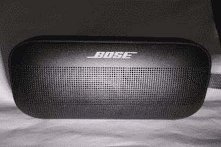
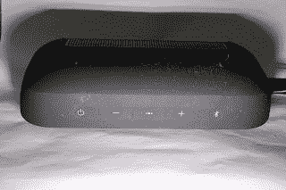
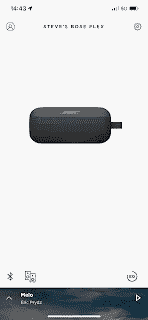
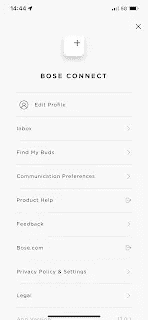
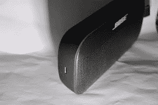
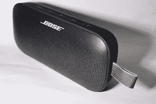

# Bose Soundlink Flex 扬声器

> 原文：<https://medium.com/nerd-for-tech/bose-soundlink-flex-speaker-4b98b744a625?source=collection_archive---------4----------------------->

Bose Soundlink Flex 扬声器专为户外使用而设计。它具有 IP64 和 IP67 等级，因此防水防尘，可以在 1 米深的水中停留 1 分钟。该案件是金属与一个“软触摸”硅涂层和格栅有一个织物涂层。这是一个便携式尺寸，宽 20.1 厘米，高 9 厘米，深 5 厘米，有一个织物带，因此可以携带。

有一个 USB-C 端口用于充电(包括 USB-A 到 USB-C 电缆)，很遗憾该端口不能用于直接连接音频源，因此它可以用作有线扬声器/DAC。给系统充满电需要 4 个小时。

这种音频只能通过蓝牙(4.2 版)获得，最远可达 30 米。

还有前置麦克风，可用于通话和语音助手。

顶部有 5 个按钮，电源、音量降低、多功能和音量增加以及可以启动配对的蓝牙(带指示灯)。

按下电源按钮即可打开设备(它会显示剩余电池百分比，默认情况下是启用的)。再次单按将关闭该单元。如果没有播放/连接，设备将在 20 分钟后自动关闭，这可以通过同时按住+(音量增大)和多功能按钮(或在应用程序中)来禁用，如果禁用，这将重新启用它。开机时，按下电源并保持按下，将显示电池电量。

多功能按钮根据模式执行多项操作:-

*   播放音频时，按一下即可播放或暂停，向前播放(按两下)和向后播放(按三下)。
*   按住将激活连接设备的语音控制功能(如 Siri 或 Alexa 等)。再次按住将退出语音控制。
*   当有来电时，按住会接听，按住会拒绝接听。在通话中，按住将结束通话。
*   当有两个通话正在进行时，快速按会在两个通话之间切换。

如果正在通话，同时上下按音量键会使通话静音。

虽然不是必需的，但有一个附带的 Bose Connect 应用程序(iOS/Android)可以实现各种功能，如派对模式(可以连接多个 Bose 扬声器，并播放相同的音频)或立体声模式，其中 2 个设备(在派对模式下连接后)将通过每个设备左右播放。

配对后，主屏幕会显示一个漂亮的图片和正在播放的内容。触摸屏幕上的按钮可以播放/暂停、倒带和快进，并且可以调节音量。

主屏幕只显示连接的设备。

设置然后显示各种可以改变，如党的模式，语音提示，语音语言等。

单击用户图标将进入配置文件设置，在这里可以设置一些用户设置。

USB 充电端口在左侧可见

右边的带子。

注意:从照片中可以看出，黑色硅涂层非常容易粘上灰尘，显然不会影响声音，但看起来有点脏。

当扬声器最初打开时，语音提示为英语，但扬声器支持以下语言:-

可以在应用程序中轻松选择语言，但要通过扬声器进行更改，请按住多功能按钮，然后按+或-在语言间循环，然后在找到所需语言时再次按住多功能按钮。

该扬声器一次最多可以与 8 个设备配对，但只能同时使用 2 个设备，并且任何时候只能播放一个设备。要在两个相连的音频源之间切换，请暂停一个音频源的播放，然后启动另一个音频源。要清除所有连接，请按住蓝牙按钮 10 秒钟。

当需要参加 party 2 时，Bose 产品可以在“Party Mode”下连接。这使得他们都可以左右播放，或者在立体声模式下，一个是左，另一个是右。在应用程序中很容易做到这一点，但可以通过连接的扬声器来完成。确保两台设备都已打开，并且其中一台已连接到蓝牙音频源，然后同时按下蓝牙和音量增大按钮(+)。扬声器会说“同时按下第二台 Bose 设备上的蓝牙和音量调低按钮”，这应该在另一台 Bose 扬声器上完成。

一旦进入聚会模式，按下蓝牙按钮和任一扬声器上的+,直到它宣布“立体声模式”,然后一个会说“左”,另一个会说“右”。再次按下蓝牙和+按钮将关闭立体声模式。要禁用任一模式，只需关闭一个扬声器。

只有通过应用程序，扬声器才能使用同步系统连接到 Bose 条形音箱，条形音箱上播放的任何内容都将通过 Flex 播放(受限于 30 米的蓝牙范围)。

Bose 声称电池寿命为 12 小时，但是如果体积接近 100%(这通常需要在室外或像健身房这样的大空间)，则电池寿命会大大减少到 3 小时以上。可以使用外部电源，它可以很好地为内部电池充电。

这款音箱有 3 种颜色(黑色、石蓝色和烟白色)，售价 149.95 英镑

有更便宜的扬声器，但这确实有很好的基础和播放效果。电池续航时间可以更长，很遗憾 USB 端口可以连接到有线播放的音频源，但这是一个不错的坚固的蓝牙扬声器。

*最初发表于*[*【http://eurotechnews.blogspot.com】*](https://eurotechnews.blogspot.com/2022/06/bose-soundlink-flex-speaker.html)*。*