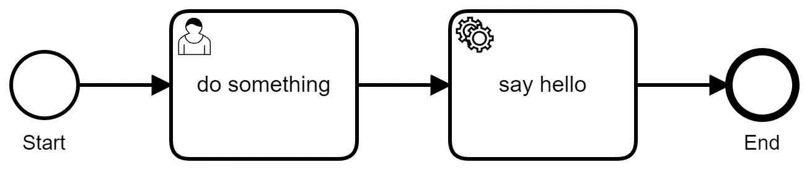

# BPMN 发动机简介

> 原文：<https://medium.com/nerd-for-tech/bpmn-engines-a-brief-introduction-2123b5e15435?source=collection_archive---------6----------------------->

当任何人提到业务流程时，都会想到巨大的流程图、复杂的流程和庞大的系统。所以，这是一篇介绍 BPMN 概念的文章:业务流程管理工具。

什么是业务流程？

业务流程最简单的形式是一系列步骤，执行这些步骤是为了实现对您的业务非常重要的某个目标。它可以简单到将每日报告上传到服务器，也可以复杂到填写表格、处理表格、保存数据并向收件人发送确认电子邮件。每个业务流程都有一组跨领域和流程或多或少通用的步骤和元素。

**BPMN 标准**

BPMN 标准定义了一种标准的方式来定义可能成为业务流程一部分的每个步骤和符号。因此，本质上每个过程都是这些步骤和动作的顺序和组合的变化。有关 BPMN 标准的更多信息，请参考—【https://www.bpmn.org/ 

BPMN 标准使表示业务流程变得更加容易，并最终自动化了那些并不真正依赖于用户交互的步骤

**BPMN 建模师:你的过程的可视化表示**

既然有了定义 BPMN 过程的标准，就有了实现该标准并提供过程建模功能的工具。对过程建模意味着使用 BPMN 元素来表示过程。一个 BPMN 过程的例子看起来如下—

简单的过程

一旦您对您的 BPMN 流程进行了建模，它就可以对每个输入进行操作和调用服务，并执行您的流程。如果需要用户操作，流程也会等待。上面的简单过程只有 4 个元素:它开始，然后等待用户输入一些东西，然后打印“Hello”并结束。

现在，根据任何特定流程的复杂性和组成要素，上述模型会发生变化。要点是，一旦分解并可视化地表示，理解和实现任何业务流程都变得简单，并最终将它自动化，以最大限度地减少用户干预。自动化任务的好处有很多，其中一些将用户从平凡的任务中解放出来，减少重复性工作的疲劳，最小化错误等等。

**BPMN 引擎:真正的英雄**

现在你有一个 BPMN 工作流，模拟它。现在该怎么办呢？这就是 BPMN 发动机的用武之地。BPMN 引擎是实际负责执行工作流的主力。在幕后，一旦定义了工作流，就会为每个步骤定义一个操作。每个步骤的执行方式取决于您的实现。例如，用户输入步骤可以显示用户填写并提交的表单。下一步可以调用服务(举例来说，可以是 Node.js 或 Java Springboot 服务)。它甚至可以调用一些外部链接或将消息推送到队列中。选择很多。

实际的模型文件表示为 BPMN 标准 XML。按照标准，每个动作元素都是 XML 元素。现在，当工作流在 BPMN 引擎上执行时，引擎会转换并执行这些操作。

就是这样！您的业务流程现在可以如此简单地实现自动化，而不需要任何复杂的系统和协议。

一些值得注意的 BPMN 发动机是—

*   卡蒙达:[https://camunda.com/](https://camunda.com/)
*   户外:【https://www.alfresco.com/】T2
*   练习:https://www.activiti.org/

感谢阅读！

注意:本文中显示的示例是使用 Camunda Modeler 创建的。