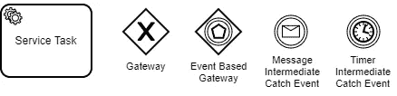
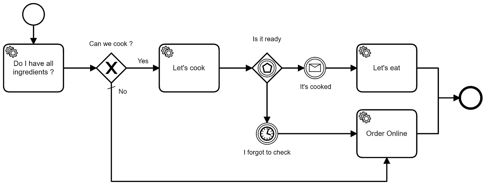
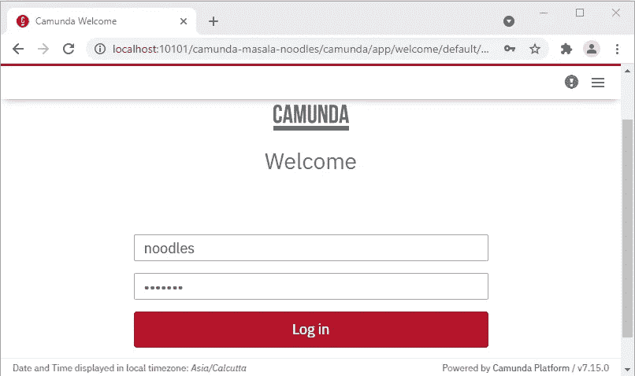
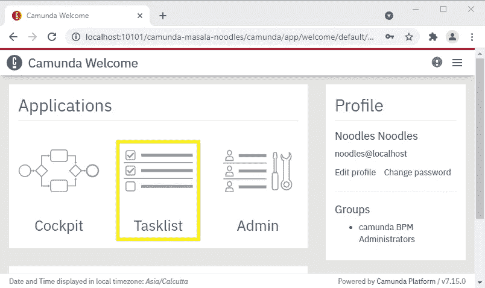
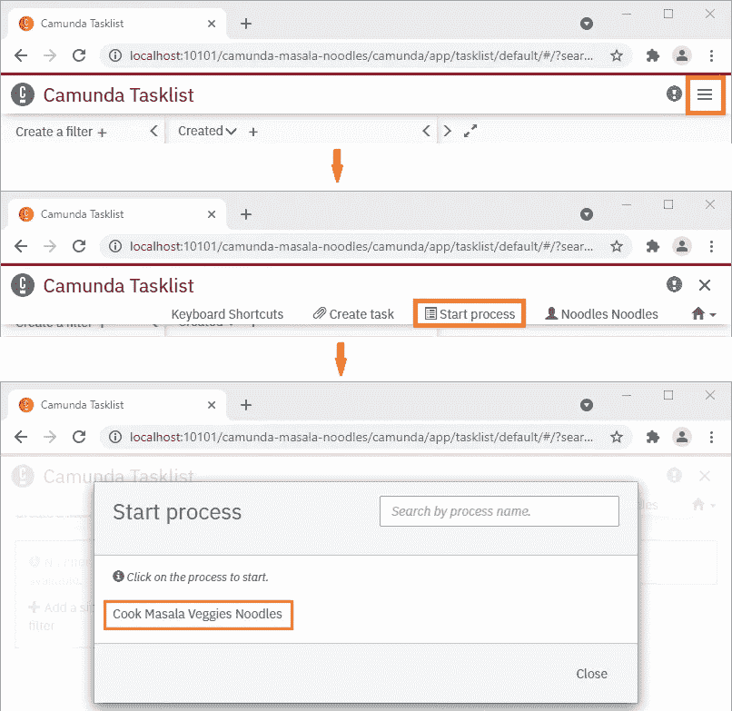
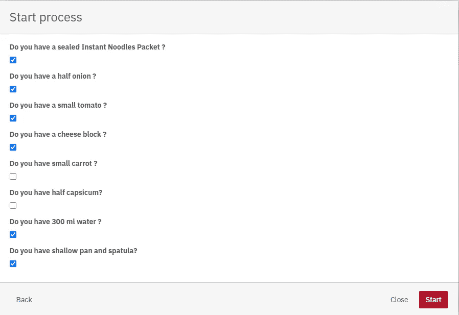
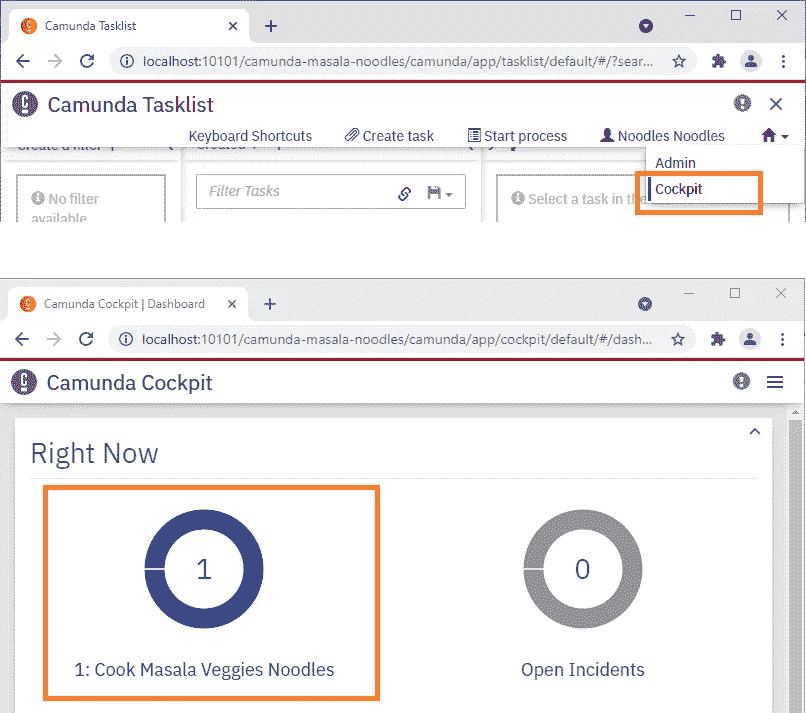
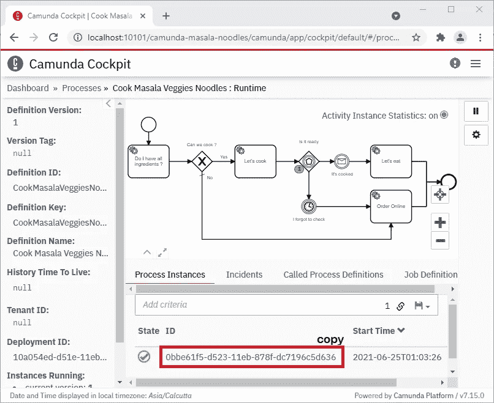
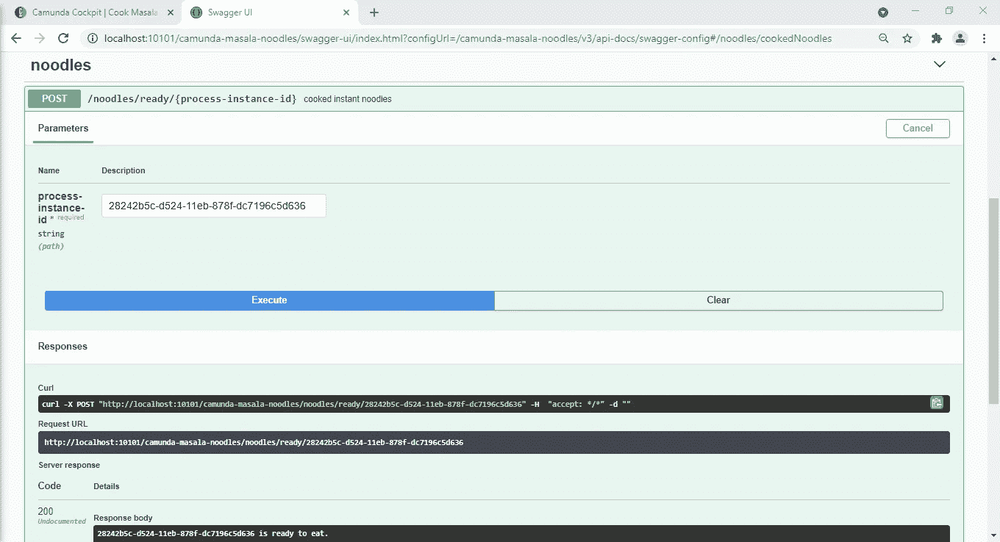

# BPMN2.0 - camunda 工作流春季启动应用程序

> 原文：<https://medium.com/nerd-for-tech/bpmn2-0-camunda-workflow-spring-boot-application-2381f3d42e5f?source=collection_archive---------0----------------------->

*有趣的* …。这种与 spring boot 的 DIY camunda 工作流流程集成旨在让您对什么是 camunda 以及我们如何轻松地将其与 spring boot 集成以创建一个*独立流程应用程序*？

*如果你想在继续下一步之前找到代码，那么就去查看一下*[***GitHub***](https://github.com/sourabhparsekar/camunda-masala-noodles)*库。该用例尝试使用嵌入式 camunda 工作流流程引擎烹饪 veg masala 方便面。*

Camunda —弹簧靴—独立过程应用

# 维基百科是怎么说卡蒙达的？

**Camunda 平台**是一个开源的[工作流](https://en.wikipedia.org/wiki/Workflow_automation)和[决策自动化](https://en.wikipedia.org/wiki/Decision_support_system)平台。Camunda 平台附带了用于创建工作流和[决策模型](https://en.wikipedia.org/wiki/Decision_model)的工具，在生产中操作部署的模型，并允许用户执行分配给他们的工作流任务。它在 [Java](https://en.wikipedia.org/wiki/Java_(programming_language)) 中开发，并在 [Apache 许可](https://en.wikipedia.org/wiki/Apache_License)的条款下作为[开源软件](https://en.wikipedia.org/wiki/Open-source_software)发布。

它提供了一个符合[业务流程模型和符号](https://en.wikipedia.org/wiki/Business_Process_Model_and_Notation) (BPMN)标准的[工作流引擎](https://en.wikipedia.org/wiki/Workflow_engine)和一个符合 (DMN)标准的[决策引擎](https://en.wikipedia.org/wiki/Decision_engine)，可以通过 [REST](https://en.wikipedia.org/wiki/REST) 嵌入到 [Java](https://en.wikipedia.org/wiki/Java_(programming_language)) 应用和其他语言中。

# 让我们自己动手吧

*这是我为这个博客创建的*[***GitHub***](https://github.com/sourabhparsekar/camunda-masala-noodles)*知识库。关于如何构建和运行项目，可以参考 [Readme](https://github.com/sourabhparsekar/camunda-masala-noodles/blob/main/README.md) 文件。这将有助于您了解最少的 camunda 配置，以及 camunda 工作流引擎与 spring boot 的集成。*

## 项目配置

*   JAVA(1.8 版)
*   弹簧靴:(2.4.3 版)
*   Camunda 平台:(7.15.0 版)
*   卡蒙达平台 Spring Boot 启动器:(7.15.0 版)
*   构建工具:Apache Maven(3 . 6 . 3 版)—包装器
*   数据库:H2 内存
*   单元测试:JUnit5 - Jupiter (v5.7.1)
*   代码质量:sonar cube(3 . 7 . 0 版)

## 我们今天在建造什么？

我们所有人一定都在某个时候吃过方便面。有些人可能还为自己做了这道菜。

*我们今天的使用案例是尝试用现有的原料来烹饪方便面。如果我们没有所需的原料，或者我们不会做饭，或者我们在做饭时把面条烧焦了，那么我们会像往常一样从你最喜欢的餐馆点菜。*

> 注意:你可能会看到一些烹饪步骤不直观。添加它们是为了利用 camunda 的功能来理解 camunda 的基础知识。

## 卡蒙达流程步骤

在 [BMPN 2.0 实现](https://docs.camunda.org/manual/7.15/reference/bpmn20/)中，我们在用例中使用了以下内容来煮面:

用于用例的 BPMN 2.0

*   `**Service Tasks**`:服务任务用于调用服务。我们使用了`JavaDelegate`接口来委托流程。
*   `**Gateway**`:网关控制流程中的令牌流。它们允许基于数据和事件的建模决策。
*   `**Event Based Gateway**`:基于事件的网关允许您根据事件做出决定。网关的每个传出序列流都需要连接到一个中间捕获事件。
*   `**Message Intermediate Catch Event**`:消息事件是指引用指定消息的事件。消息有一个名称和一个有效载荷。
*   `**Timer Intermediate Catch Event**`:定时器事件是由定义的定时器触发的事件。它们可以用作开始事件、中间事件或边界事件。

*所有可用的*[*【BPMN】2.0 实现参考*](https://docs.camunda.org/manual/7.15/reference/bpmn20/) 参考卡蒙达文档

## 使用案例——Veg Masala 方便面烹饪流程

我们已经使用[***cam unda Modeler***](https://camunda.com/download/modeler/)构建了流程，可以下载并在本地运行。它生成一个. bpmn 或。添加到项目[的 dmn 文件。/src/main/resources](https://github.com/sourabhparsekar/camunda-masala-noodles/blob/main/src/main/resources/cook_noodles_process.bpmn) 文件夹。

您可以查看 [Camunda Modeler](https://docs.camunda.org/manual/7.15/modeler/) 文档，了解如何使用它来创建或修改流程。

卡蒙达 BPMN 2.0 流程图

*   我们首先检查我们有最少的配料，方便面、水、锅和锅铲是必须的。蔬菜、奶酪等。都是随意做泡面。
*   如果有最基本的配料，我们就把所有的东西都放进锅里，搅拌一下，盖上盖子，保持加热。(在那里使用您的加热偏好)。
*   如果你记得你留了一些烹饪用的东西，而且你闻起来很香，那么打开盖子，检查一下它是否煮熟了。或者再等几分钟。
*   然而，很可能你忙于其他事情，而忘记检查。在这种情况下，15 分钟后烹饪计时器将到期，你必须在线订购，因为面条会烧焦。哎呀…
*   但是，如果你看到它煮得很好，味道很好，那就享受你的速食方便面吧。否则…哎呀，你的努力白费了，因为面条煮过头了/烧焦了。在那种情况下，你将不得不在网上订购。

享受烹饪！！

至此，我们结束了煮方便面非直观流程。顺便说一下，我就是这样煮方便面的，而且大多数时候都很好吃。

## Camunda 弹簧靴初始化器

包含 spring boot 框架的 [Camunda 平台初始化器](https://start.camunda.com/)可以轻松创建 Camunda spring boot 项目。这使得 Spring 可以在 camunda 工作流应用程序中工作。

这些启动器预先配置了 Camunda 流程引擎、REST API 和 Web 应用程序，因此可以轻松地在独立的流程应用程序中使用它们。

有关设置的详细说明和指南，请参考 [Camunda 文档-弹簧靴](https://docs.camunda.org/get-started/spring-boot/)

## 从 GIT repo 构建和部署 API

以下步骤涵盖了使用 Apache Maven 配置和部署 spring boot jar 所需的高级任务。

1.  本地系统上的克隆存储库。默认情况下，jar 将取自 Maven 中央存储库。
    URL =[https://github . com/sourabhparsekar/cam unda-masala-noodles . git](https://github.com/sourabhparsekar/camunda-masala-noodles.git)
2.  如果需要，更新 logback-spring.xml、application.yaml 中的属性
3.  使用 maven 包装器构建任务`mvnw clean install`
4.  收到。jar 文件从/target/到您的`deployment-directory`
5.  特定于环境的`application.yaml` & `logback-spring.xml`将被修改并与`.jar`一起放置在部署目录中(如果适用)
6.  用`java -jar camunda-masala-noodles-<version>.jar`开始执行
7.  日志在部署目录/logs 文件夹中生成，文件名为' cam unda-masala-noodles-logger . log '或在 logback-spring.xml 中提到

## 用 maven & cmd 运行 spring boot 应用程序

如果您想快速检查工作情况，那么您可以使用本地终端或命令提示符来运行项目

*   导航到项目根目录
*   使用`mvnw clean install`在本地构建并安装 jar
*   使用`mvnw spring-boot:run`在本地运行 spring boot 应用程序
*   或者，您可以导航到文件[MasalaNoodlesApplication](https://github.com/sourabhparsekar/camunda-masala-noodles/blob/main/src/main/java/com/noodles/MasalaNoodlesApplication.java)并从 IDE 中启动该应用程序

如果一切正常，你应该会在你的控制台上看到下面的日志

camunda spring boot 应用程序启动日志

*参考* [*运行您的应用*](https://docs.spring.io/spring-boot/docs/1.5.16.RELEASE/reference/html/using-boot-running-your-application.html) *获取更多关于运行启动应用的帮助。*

# 测试我们的用例

## 举例说明制作蔬菜马萨拉面条的新流程

现在您已经在本地托管了您的应用程序，让我们看看如何测试它

**第一步。在浏览器**中打开&登录 Camunda

*   使用
    http://localhost:10101/camunda-masala-noodles 在本地访问 cam unda
*   凭证在 [application.yaml](https://github.com/sourabhparsekar/camunda-masala-noodles/blob/main/src/main/resources/application.yaml) 文件中配置

camunda 默认登录凭据

camunda 欢迎登录页面

**第二步。开始“烹饪蔬菜面条”流程**

*   点击登录页面中的`TaskList`,您可以在这里生成新流程

camunda 登录页面

*   在右上角，我们有菜单。点击`Start process`，选择流程`Cook Masala Veggies Noodles`

从任务列表启动流程

**第三步。输入详细信息以启动流程实例**

*   现在我们将看到一个`form`来选择我们有的配料。基于输入，工作流将决定行动的过程。*您可以检查控制台日志，看看您的流程发生了什么。*

camunda 开始流程输入详细信息表单

**第四步。导航至卡蒙达驾驶舱**

*   `Cockpit`帮助我们形象化流程的当前步骤。它还会给我们流程实例 id。

卡蒙达驾驶舱可视化过程

*   您现在可以点击`Cook Masala Veggies Noodles`过程定义来查看正在运行的过程。
*   *复制流程实例 id* ，面条煮熟后，我们需要使用它来恢复我们的烹饪流程。如果您不这样做，那么计时器将过期，流程将出错，提示您在线订购

卡蒙达驾驶舱显示我们的等待步骤

> 一旦进入等待步骤，配料检查过程将结束，烹饪过程将从外部开始。如果您在驾驶舱中看不到您的流程，请检查控制台上的日志。它可能会出错，因为你没有足够的原料来煮方便面，或者你可能忘记在煮完面条后继续这个过程。无论是哪种失败的情况，你都必须在线订购。

## 完成后，使用实例 id 恢复流程

我们的面条现在已经煮好了，我们需要向我们的过程表明，以便它可以继续下一步。

**第一步。打开 Swagger API 浏览器**

*   当你忙着用手机的时候，你碰巧记得方便面还在煮。如果你的过程还没有结束，比如面条没有烧焦，可以吃了，那么你可以触发一个 api 来恢复等待过程。这也表明你的面条煮得很好...:)
*   你现在可以使用
    http://localhost:10101/cam unda-masala-noodles/Swagger-ui . html
    [*访问 Swagger API，想了解更多关于 swagger ui 的内容，可以参考我的另一篇文章。*](https://sourabhparsekar.medium.com/open-api-specification-swagger3-fc9ad3bbacdd)

**第二步。恢复实例 id 为**的流程

*   点击`Try it out`启用 API。从 cockpit 复制的流程实例 id 进入 path 参数。
*   点击`Execute`发送请求，恢复流程。
*   你可以查看会说
    `<process-instance-id> is ready to eat.`的回复

Swagger UI 进程已恢复，进程实例 id 为

## 检查日志以跟踪流程

像往常一样，检查日志以查看我们的工作流程遵循的所有步骤。它将通过控制台中的日志来跟踪该过程。如果您使用关键字`workflow-service-info`过滤日志，那么您会看到下面的内容

*   **流程实例化**

新的烹饪过程开始了

*   **进程成功恢复**

恢复暂停的烹饪过程

*   **进程恢复失败**

未能恢复暂停的进程

*   **烹饪食材不足**

缺少烹饪原料

*   **忘记检查烹饪状态——面条烧焦了**

*这个，你可以自己试试。检查 resources 文件夹中的* [*BPMN 定义*](https://github.com/sourabhparsekar/camunda-masala-noodles/blob/main/src/main/resources/cook_noodles_process.bpmn) *以检查多少分钟后该进程将失败并且不恢复该进程… :)*

*希望你已经发现了这一点，一个非常* ***有趣的*** *使用卡蒙达工作流程和 spring boot 烹饪方便面的旅程。*

如果你喜欢这篇文章，请留下你的反馈或者鼓掌。如往常一样，对于在设置您的本地环境方面的任何疑问或问题，我们可以通过电子邮件或下面的评论进行联系。

*下次见，快乐烹饪！！*

# 参考

 [## sourabhparsekar/cam unda-masala-面条

### 这个独立的流程应用程序是一个使用 Camunda Workflow & Springboot 和 JUnit5 测试用例的例子。至于…

github.com](https://github.com/sourabhparsekar/camunda-masala-noodles)  [## 卡蒙达-维基百科

### Camunda 平台是一个开源的工作流和决策自动化平台。Camunda 平台配有工具，可用于…

en.wikipedia.org](https://en.wikipedia.org/wiki/Camunda)  [## 工作流和决策自动化平台| Camunda

### BPMN 工作流和 DMN 决策自动化的开源平台。立即下载。

camunda.com](https://camunda.com/)  [## Spring 让 Java 变得简单。

### 提高您的 Java 代码水平，探索 Spring 能为您做什么。

spring.io](https://spring.io/)  [## 开放 API 规范— Swagger3

### SpringBoot API 文档

sourabhparsekar.medium.com](https://sourabhparsekar.medium.com/open-api-specification-swagger3-fc9ad3bbacdd)