# 基于深度学习的脑肿瘤磁共振图像分割。

> 原文：<https://medium.com/nerd-for-tech/brain-tumor-mri-segmentation-using-deep-leaning-322adebd1aa7?source=collection_archive---------1----------------------->


[乌曼诺德](https://unsplash.com/@umanoide?utm_source=medium&utm_medium=referral)在 [Unsplash](https://unsplash.com?utm_source=medium&utm_medium=referral) 上拍摄的照片

# 介绍

生物医学成像，如 X 射线、CT 扫描、MRI，有助于医生评估患者的当前状况。肿瘤是异常细胞的团块或生长。大脑中的早期肿瘤检测将拯救许多生命。由于肿瘤的形状和大小各不相同，很难确定确切的位置。在 MRI 中检测和定位肿瘤需要相当长的时间。

这一过程的自动化将提高系统的效率，并节省医务人员的时间，以便为更多的患者提供服务。它消除了发展中国家由于缺乏训练有素的医务人员而更常见的人为错误。

# 关于数据集:

数据集来源 [Kaggle](https://www.kaggle.com/mateuszbuda/lgg-mri-segmentation) 。

数据集由 110 名患者 MRI(磁共振成像)和手动 FLAIR(液体衰减反转恢复)异常分割屏蔽组成，从癌症成像档案馆(TCIA)获得。

data.csv 文件包含患者数据和肿瘤基因组簇。核磁共振扫描在 110 个文件夹里，这些文件夹都是以病例编号命名的。每个文件夹包含以下命名约定的 MR 图像:

TCGA_ <institution-code>_ <patient-id>_ <slice-number>。标签图像文件格式。</slice-number></patient-id></institution-code>

相应的掩码有一个“_mask”后缀。图像在里面。每个图像有三个通道的 tif 格式。

## 什么是图像分割？

这是将属于特定类别的每个像素分类的过程。

对于此任务，我们将有两个类:

*   肿瘤部分
*   非肿瘤部分

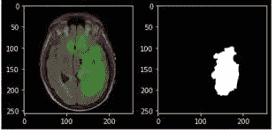

MRI 扫描和分割图像

# 业务目标:

使用核磁共振扫描为人脑中的肿瘤创建分割模板。

使用分割掩模，我们可以确定肿瘤是否存在。

# 绩效指标:

局灶性特沃斯基损失(FTL):是特沃斯基损失的概括。损耗的非线性特性使您可以控制在不同的 Tversky 指数值下损耗的表现。

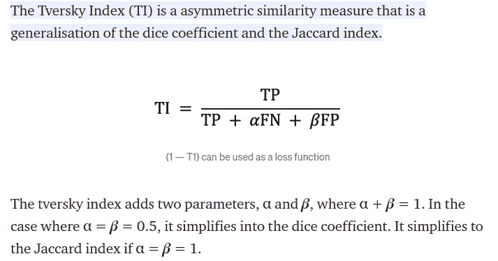

作为良好起点的默认参数。

α = 0.7, 𝜷 = 0.3, γ = 3/4

焦点特沃斯基损失用于解决阶级不平衡。

γ控制损耗的非线性。当γ < 1 it penalising more when TI >为 0.5 时，这种改变模式对这类例子有更多的改进。

至于很多扫描，扫描的只有一小部分是肿瘤。

# 探索性数据分析:

我们总共有 3929 个 MRI 扫描和它们各自的分段屏蔽。每次 MRI 扫描的尺寸为(256，256，3)。

我们将首先使用以下函数将 MRI 扫描分为肿瘤和非肿瘤:

没有肿瘤的脑 MRI 和分割掩模的样本。

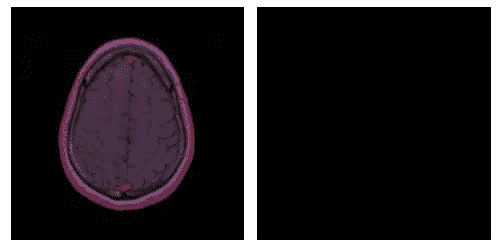

脑部 MRI 样本和带有肿瘤的分割掩模。

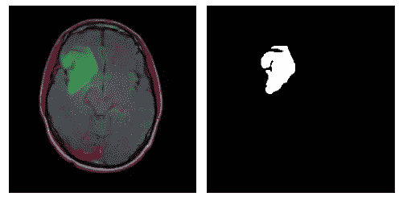

## 数据扩充前 MRI 扫描的分布

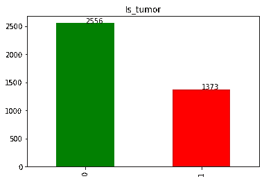

```
Percentage of patients with no tumor 65.05472130313056
Percentage of patients with  tumor 34.94527869686943
```

65%的核磁共振扫描不含肿瘤。

## 应用数据扩充

应用了三种类型的图像增强。

1.  翻转
2.  旋转任意角度
3.  模糊操作。

我们将包括更多来自少数民族(肿瘤类)的增强图像

数据扩充后的分布:

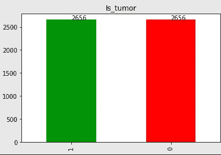

```
Percentage of patients with no tumor 50.0 
Percentage of patients with tumor 50.0
```

我在这里通过增加更多增强后的肿瘤类图像来平衡数据。

在数据扩充后，我们有 5312 个 MRI 扫描作为数据点。

# 建模

## a)独立型号

最初，我尝试为分类和分段任务创建不同的模型。

使用 ImageDataGenerator 类的 flow_from_dataframe 创建了一个训练、测试和验证数据生成器。

**A.1)简单分类器:**

用于两个卷积层，其次是一个平坦层，最后是一个密集层与乙状结肠作为激活。

随着训练和验证准确性之间的差距增大，模型开始过度拟合。

```
accuracy: 0.9604
val_accuracy: 0.8540
```

**A.2 使用异常模型分类**

由于例外模型有更多的可训练参数，它比简单分类器表现得更好，但此处模型也过拟合。

```
accuracy: 0.9875 
val_accuracy: 0.8728
```

**答:3)分段:**

我创建了一个定制的数据生成器来批量加载图像。

建立了以焦特沃斯基为损失函数的 Unet 模型。将(256，256，3)个图像传递给模型，这产生了(256，256，1)个分段掩码。

注意:该模型仅建立在包含肿瘤的 MRI 上。

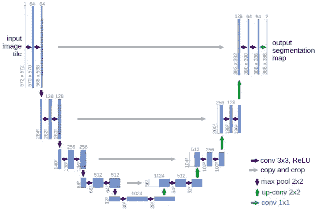

Unet 模型

```
loss: 0.2907  - val_loss: 0.2974
tversky: 0.8060 — val_tversky: 0.7994
```

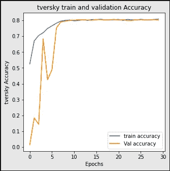

Unet 模型没有过度拟合，并且在 10 个时期后稳定。

下面是样本原始分段及其各自的预测掩码。

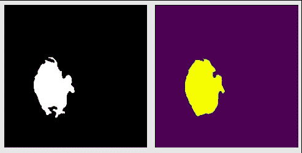

最终的面具做得很好，它错过了捕捉锐利的边缘。

## b)两类数据的分段模型

模型的输入和输出的维数都是(256，256，3)。

***注:*** 训练缓慢，如果学习率很高，最初会过拟合训练数据。

***提示:*** 保持较低的学习率，以便更好的训练。

**B.1)带有 Resblocks 的 Unet 模型:**

使用四级编码器-解码器 Unet 模型。

对于这项任务，这是最简单的 Unet 模型。

```
loss: 0.1888 - tversky: 0.8880 
val_loss: 0.1840 - val_tversky: 0.8925
```

## B.2)以 EfficientNet 为骨干的 Unet

不使用 Resnet 作为主干，而是使用在 Image net 数据集上训练的 EfficientNet。

```
loss: 0.1480 - tversky: 0.9206
val_loss: 0.1513 - val_tversky: 0.9183
```

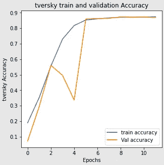

样本结果:

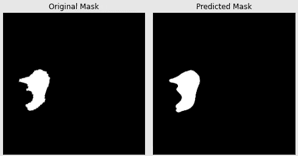

失败的示例:

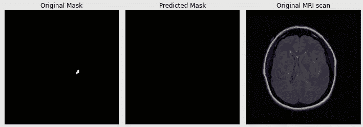

当肿瘤尺寸很小时，该模型未能发现肿瘤。

**B.3)双网**

是发表在 [2020](https://arxiv.org/pdf/2006.04868.pdf) 的作品。它的目的是创建一个模型，概括各种细分数据集。

这里预测了两个掩码，而不是单个掩码。

```
loss: 0.1539 — tversky: 0.9168
val_loss: 0.1551 — val_tversky: 0.9158
```

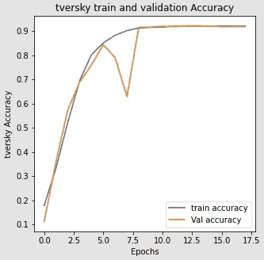

# 比较不同型号的性能:

高效 Unet 的可训练参数比 Unet 多 10 倍。Double Unet 的可训练参数几乎增加了 3 倍。

事实证明，高效的 Unet 表现最佳。

# 部署:

保存最佳模型并将其用于部署。

该模型由一个使用 streamlit 的 web 应用程序部署。

# **未来工作:**

1.  可以探索不同于学术研究的深度学习架构。
2.  利用 MRI 的 3d 空间特性的网络，如 3D 提拉米苏网、Deep Medic。
3.  可以组合不同 MRI 扫描的集合。
4.  在医学图像上使用通用分割模型，如 SegNet。

# 代码库和部署。

**Github 仓库:**包含这个项目的全部代码。[ [Github 回购](https://github.com/tushifire/Brain-MRI-segmentation)

下面是演示模型部署的视频。

# 参考资料:

1.  [https://www . Applied ai course . com/course/11/Applied-Machine-learning-course](https://www.appliedaicourse.com/course/11/Applied-Machine-learning-course)
2.  [DoubleU-Net:用于医学图像分割的深度卷积神经网络](https://arxiv.org/pdf/2006.04868.pdf)
3.  [Kaggle 数据集:脑部 MRI 分割](https://www.kaggle.com/mateuszbuda/lgg-mri-segmentation)

**联系人:**[**Linkedin**](https://www.linkedin.com/in/mr-tushar-tiwari/)| |[|**邮箱**](mailto:tushi.fire@gmail.com)