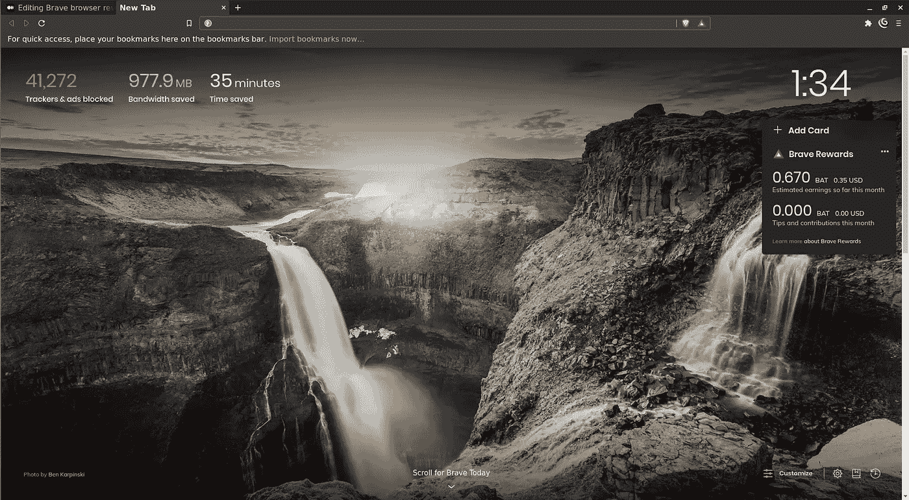
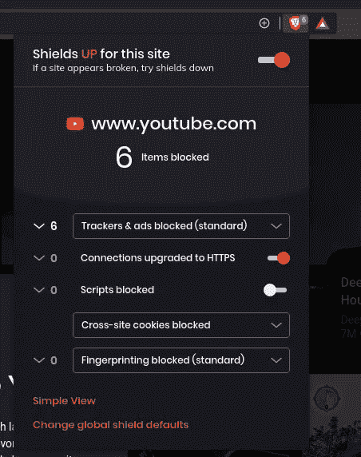
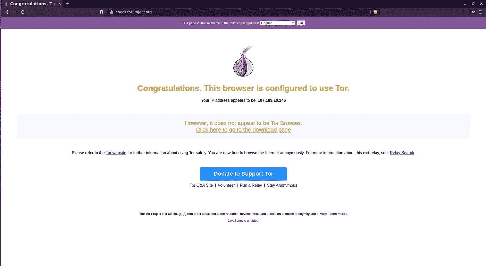
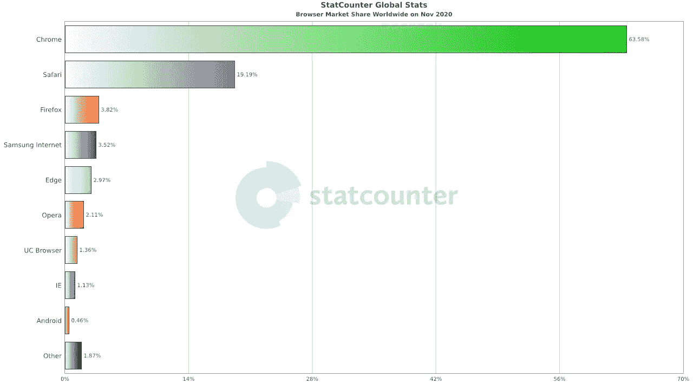
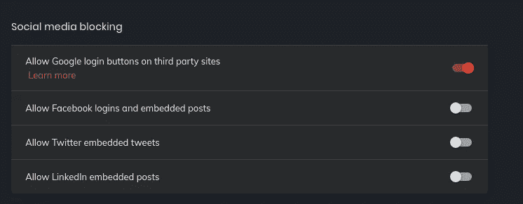

# 勇敢的浏览器评论

> 原文：<https://medium.com/nerd-for-tech/brave-browser-review-e2ad87da5ef9?source=collection_archive---------0----------------------->

丹·尼尔森在 [Unsplash](https://unsplash.com?utm_source=medium&utm_medium=referral) 上拍摄的照片

## 软件工程师在细节上不偏不倚。

我们都知道大型科技公司如何收集尽可能多的关于我们的数据，以及逃脱他们的监视有多难。这个浏览器是一个开箱即用的私人浏览器。这对于不喜欢配置很多设置，但仍然希望保持私密的人来说非常理想。

## 勇敢浏览器的出现

(f . 1)brave 浏览器的新标签页

首先，新的选项卡页面让您可以快速了解节省的数据量和时间。在右边，它还可以显示你持有的加密货币的数量，这也是一个很好的功能。在我看来，这个页面比 Chrome & Firefox 更好看。

## 内置广告拦截器

(F.2)内置广告拦截器

Brave 是一款开箱即用的隐私浏览器，内置广告拦截器。在右上角，有一个勇敢的小图标。这只小狮子是内置追踪器- &广告拦截器。除了内置的广告拦截器，还有一个第三方的 cookie 拦截器。

通常情况下，你必须自己下载这个。有很多低质量/糟糕的广告拦截器。这解决了知道你得到了正确的广告拦截器的问题。

## 反浏览器指纹识别

这款浏览器的独特之处还在于它内置了反浏览器指纹拦截器。这将使我更难发现我是否在不同的账户/会话上使用同一个系统。这是通过随机化关于浏览器的信息来实现的。

浏览器指纹识别是检测您的浏览器的所有独特功能，并根据这些独特功能识别您的身份。它就像一个真正的生物指纹，但对浏览器来说。

我试着在以下网站上进行测试

*   【https://coveryourtracks.eff.org/ 
*   [https://amiunique.org/fp](https://amiunique.org/fp)
*   [https://www.whatismybrowser.com/](https://www.whatismybrowser.com/)

**掩盖痕迹** 告诉我我的指纹是随机的。这是一个好迹象，但我们还不知道我们有多独特。我们越不独特，就越难追踪到我们。

我是独一无二的吗？这就是我要找的网站。有很多信息是可见的，我可以利用这些信息来了解指纹阻止是如何工作的。在另一个匿名窗口打开同一个网站会显示不同的结果。这很好，因为这意味着勇敢是积极随机化的指纹！

**我的浏览器是什么** 我认为这款浏览器的问题是，你可以看到 brave browser 试图谎报它是哪种浏览器，但不知何故，网站检测到我正在使用 brave browser。

## 超高速的

勇敢浏览器是我用过的最快的浏览器之一。当我点击勇敢的浏览器图标时，它出现在我的屏幕上。甚至比谷歌 Chrome 还要即时。
在 brave 上浏览互联网也更快，因为它阻止了不必要的广告，这将加快您的浏览体验。

## 内置新闻提要。

Brave news feed 是一个内置功能，可以让你在新的标签屏幕上看到最新的新闻文章。

**没有个性化。勇敢的新闻订阅并不是建立在你的兴趣之上，这很好，因为你也会看到你不感兴趣或不喜欢的新闻。现在，机器学习算法决定了你会看到什么样的新闻。这很糟糕，因为你只会看到你想看/感兴趣的新闻类型。**

关于这一点的另一个不好的地方是，勇敢决定了你会看到什么样的新闻文章，不会看到什么样的新闻文章。它将责任从机器学习算法转移到了公司的隐私建设上。

## 内置 tor 代理

(F.3)内置 tor 选项卡

对于那些真正关心他们的隐私，甚至不想泄露他们的元数据的人来说，还有一个内置的 tor 代理。通过 tor 访问互联网是一些人访问他们需要的网站的唯一方式。例如，在一些国家，政府阻止举报者或记者发送他们的信息。这是躲避政府或互联网服务提供商的理想方式。
当然，使用 Brave 浏览器访问网站的安全性与通过 tor 浏览器访问网页的安全性不同。

使用 tor 的内置功能访问网站是“普通”人在生活中使用更多隐私的一种简单方式。

(F.4) Tor 选项卡

**在 tor 中打开**
有些网站有一个按钮“在 Tor 中打开”。这将把您重定向到网站的 tor 版本。这是一个惊人的特性，因为洋葱网站比普通网站更安全。

**在黑暗中发光** 为了提高 brave 浏览器上的隐私性，brave 把 tor 窗口的默认搜索引擎改成了 DuckDuckGo，这很棒。因为 DuckDuckGo 以注重隐私著称。我宁愿看到 brave 把 DuckDuckGo 域名改成他们的洋葱域名，因为这样可以更好地保护用户的隐私。

当你比较 tor 浏览器和 Brave 浏览器时，tor 浏览器绝对胜出。尤其是在洋葱路由的流量上。可以看到某人的流量是否通过 tor 路由。通常，所有洋葱路由的流量都来自 tor 浏览器。但当你访问 Brave 网站时，指纹识别要容易得多，因为它们的用户代理和浏览器的行为方式暴露了这一点。

## 星际文件系统或 IPFS

这是迄今为止我所知道的最酷的通话项目。IPFS 是一个类似 torrent 协议的分散式文件共享平台。除此之外，也有可能在这里建立一个不变的网站。这在平台瘫痪、政府关闭网站或大型 DDoS 攻击关闭网站时非常有用。

我希望看到一个“在 IPFS 开放”的按钮，就像图 4 中的“在 Tor 开放”按钮一样

## 内置以太坊钱包

当你是一个加密货币交易者，并且你想要访问 Dapps(分散应用)时，这可能是很好的。我觉得大部分人都不会用。所以对我来说，这并没有增加多少勇敢的经历。以太坊钱包不是默认安装的，因此这个功能不会让我太困扰

## 内置种子下载器

这是另一个我很少使用的特性。但我可以看到这种积极的用例，因为大多数 torrenting 客户端显示了大量侵入性广告。能够下载您的 Linux ISO 而不查看侵扰性的广告或者跟踪广告是很好的。

## 在铬的基础上构建

资料来源:StatCounter

这是好事，也是坏事。好消息是几乎所有的网站都可以在勇敢浏览器上运行。坏消息是，如果 Chromium 存在漏洞，那么 60%的浏览器都会被利用。chromium 的另一个好处是大多数浏览器扩展也可以在 brave 浏览器上运行。

在我看来，另一件“不好”的事情是基于 chromium 浏览器的开发工具。火狐上的开发者工具更容易使用，而且火狐开发者工具有更多的特性。

我不喜欢 brave 浏览器的最后一点是标签的外观。作为一名软件开发人员，打开 30 多个标签页是很常见的。当我打开许多标签页时，标签页变得越来越小。这是令人沮丧的，因为你不能阅读标签中的文本。如果你知道可以改变这种情况的加载项，请留下评论！

## 你自己需要考虑的事情

默认情况下，谷歌是默认的搜索引擎。众所周知，谷歌是一台追踪机器。所以我会建议你从谷歌转到一个更尊重隐私的搜索引擎。比如 duckduckgo.com 或者 Qwant。

(F.6)

Brave 的一个奇怪之处在于，他们没有默认禁用最大的追踪器。比如社交媒体追踪器。当你使用谷歌登录某些网站时，我建议禁用除谷歌外的所有社交媒体追踪器。

**将信任从谷歌转移到 Brave** 许多通常直接流向谷歌的流量通过 Brave 进行代理。如果你信任 brave 但不信任 google，这可能是一个不错的功能。再说一次，这取决于你最信任谁。

**臃肿的** 默认情况下，勇敢的浏览器有很多你可能不需要的功能。例如 torrent 客户端或加密钱包。如果硬盘空间是一个问题，你需要记住，下载这些功能是可选的。

## 奖励系统(基本注意力标志)

这是迄今为止我在这款浏览器中见过的独一无二的功能。由于浏览器阻止广告，内容创作者不会为他们的工作挣钱。基本注意力令牌试图解决这个问题(以及其他一些问题)。

基本注意力令牌(BAT)是一种加密货币，用于吸引你的注意力。当这个功能启用时，你可以付费观看隐私友好的&不打扰的广告。你得到的球棒可以用来捐赠给你最喜欢的内容创建者，如维基百科或可汗学院。

(F.7)蝙蝠奖励弹出窗口

也有可能把你看广告得到的 BAT 提取到你的银行账户里。不要指望从看广告中赚很多钱。

**撤回 bat 时的隐私问题** 要撤回 BAT，您必须与第三方公司进行 KYC。这意味着您必须共享可识别信息才能提取您的在线私人货币。这违背了勇敢浏览器背后的整个理念。如果你认为这是一个问题，我建议把你赚到的球棒捐给创作者或你喜欢的其他网络人物。

# 结论

Brave 是目前最具创新性的浏览器。对于非技术人员来说，使用 BAT 开始使用 crypto 是很好的，可以更好地保护他们的在线隐私，而不会有太多设置广告拦截器/反指纹工具的麻烦。我使用勇敢浏览器作为我的日常驱动程序已经有一年了。