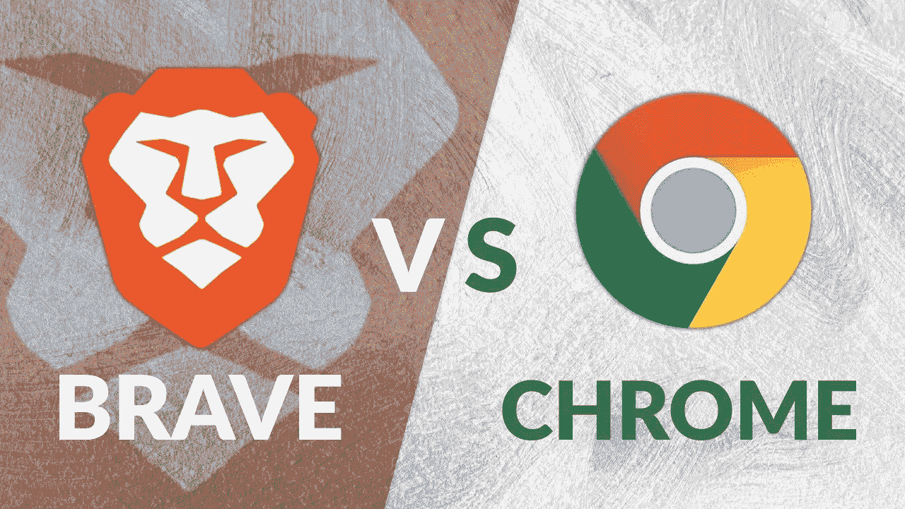
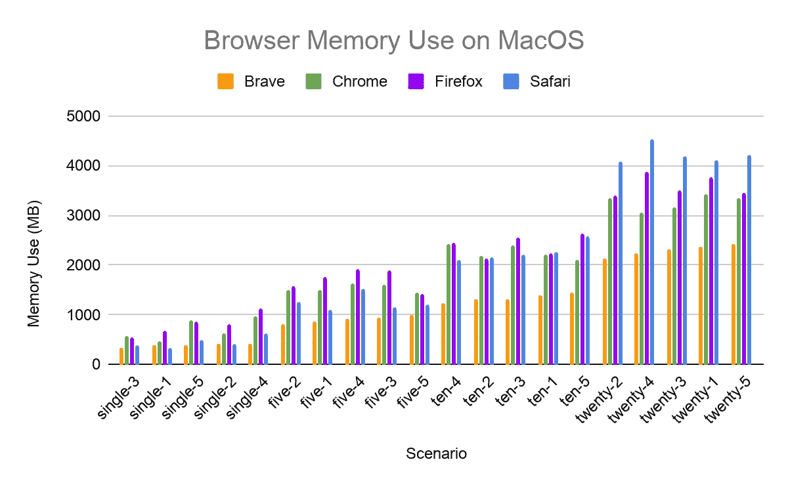
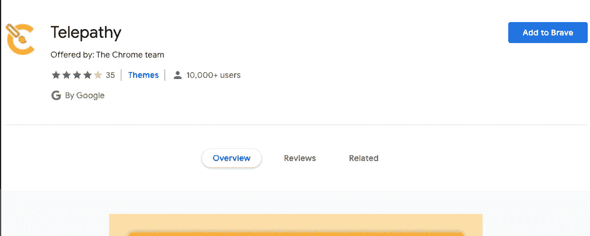
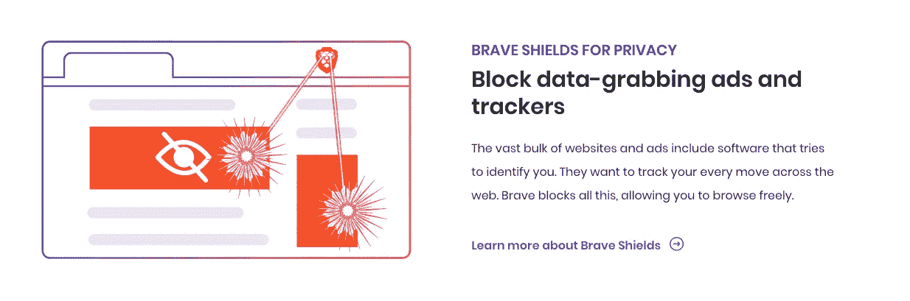

# 勇敢 VS Chrome

> 原文：<https://medium.com/nerd-for-tech/brave-vs-chrome-306e1451a401?source=collection_archive---------0----------------------->

让我们结束这两种浏览器之间的争论

图片来自[https://morioh.com/](https://morioh.com/)

挑战者:

## 勇敢的

Brave 是由 Brave Software，Inc .基于 Chromium web 浏览器开发的免费开源 web 浏览器。它阻止广告和网站追踪器，并为用户提供一种以基本注意力令牌的形式向网站和内容创作者发送加密货币贡献的方式。

## 铬

谷歌 Chrome 是谷歌开发的跨平台网络浏览器。这是迄今为止世界上最流行的浏览器。地球上的每个人都知道这件事。

将有一些标准，如速度，隐私，扩展支持等。所以让我们开始吧。

# 速度

在桌面上，Brave 加载页面的速度是 Chrome 和 Firefox 的两倍，Chrome 和 Firefox 是世界上排名第一和第三的浏览器，根据分析供应商 Net Applications 的排名[。在智能手机上，Brave 加载页面的速度比 Chrome (Android)或 Safari (iOS)快八倍。](https://www.computerworld.com/article/3199425/web-browsers/top-web-browsers-2018-firefox-sits-on-slippery-slope-chrome-grows-even-bigger.html)

Brave browser 在移动端加载网站的速度是 chrome 的 8 倍。

图片来自 brave.com

# 隐私

Brave 在很多方面比 Chrome 更私密。Brave 经常在他们的官方[网站](http://brave.com)向我们展示这一点。拥有一个 tor 的私人窗口可以对你的 ISP 或雇主隐藏你的 IP 地址，而 chrome 的隐名模式没有这个功能。

图片来自 brave.com

# 扩展支持度

勇敢在这个领域也没有任何限制。因为它是建立在 chrome 之上的，所以它也可以与 chrome 网络商店中的所有扩展一起工作。

《心灵感应扩展》作者截图

所以在 chrome 和 brave 中，这是一个平局。

# 广告拦截

brave 加载页面更快的几个原因之一是它有自己的广告拦截器。它消除了网站中的任何广告，使加载时间更快。

图片来自 brave.com

# 决定？

这取决于你。Brave 和 Chrome 非常相似，但 Brave 在隐私和速度方面稍好一些。

如果还有任何问题，你可以回复这个博客。

# 愿原力与你同在。