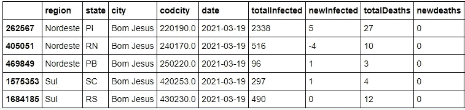
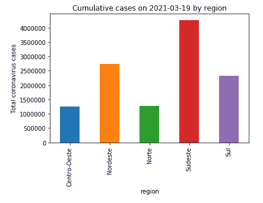
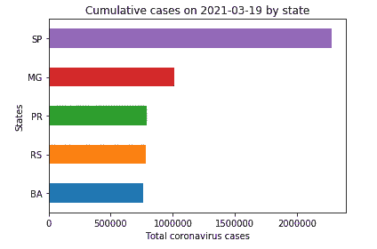
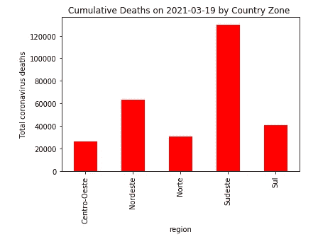
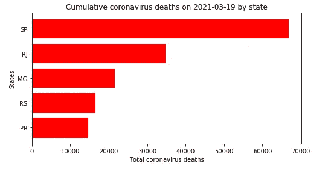
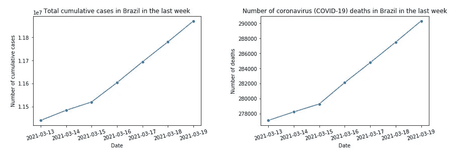

# 巴西新冠肺炎数据分析

> 原文：<https://medium.com/nerd-for-tech/brazil-covid-19-data-analysis-646c78d22d61?source=collection_archive---------18----------------------->

# 看看巴西新冠肺炎的现状

新冠肺炎是一种由冠状病毒引起的传染病，称为新型冠状病毒，因新冠肺炎而得病的人可能会有轻微至中度的症状，但它可以进展为更严重的病情，甚至导致死亡。

来自[皮克斯拜](https://pixabay.com/it/?utm_source=link-attribution&utm_medium=referral&utm_campaign=image&utm_content=4957154)的[格尔德·奥特曼](https://pixabay.com/it/users/geralt-9301/?utm_source=link-attribution&utm_medium=referral&utm_campaign=image&utm_content=4957154)的照片

在本帖中，我们将利用州卫生部门的数据调查巴西疫情冠状病毒的情况。由于数据每天仍在增长，请记住，这项研究考虑的是 2021 年 3 月 19 日的数字。

我们将使用 2，012，472 行 17 列的数据框。每行代表巴西的一个地点和日期，各列代表累积病例、新病例、累积死亡、新死亡、恢复病例，这些都在巴西政府网站上公布。

分析数据后，我决定研究案件的形式、速度和地点。具体来说，我研究了以下问题:

> 案件总数是多少？新病例总数是多少(过去 24 小时)？新冠肺炎累计死亡人数是多少？(过去 24 小时内)新增死亡总数是多少？
> 
> 哪个地区(地带)的新冠肺炎累积病例最多？哪个州累积的新冠肺炎病例最多？
> 
> 哪个地区(地带)的新冠肺炎累积死亡人数最高？哪个州的新冠肺炎累积死亡率最高？

**第一部分:病例总数是多少？新病例总数是多少(过去 24 小时)？新冠肺炎累计死亡人数是多少？(过去 24 小时内)新增死亡总数是多少？**

在这种情况下，很难准确跟踪关于这种新疾病的信息。因此，许多条目都丢失了。有必要清理数据，有些城市缺少值，输入我们没有任何信息(如名称或城市代码(代码城市))的城市计数并不有趣。

另一个重要的信息是，在巴西，我们有一些同名的城市，但是在不同的州。那么，这个数据真的是重复数据吗？例如，下面您可以看到城市 **Bom Jesus** 在数据集中出现了 5 次，但是这些城市在不同的州。然而，它们是该国非常不同的城市。

也是因为这个原因，我们在分析中没有按照“城市”(城市的名称)这一列进行过滤。我选择“编码城市”是为了让我们的分析尽可能准确，编码城市是每个城市的唯一代码，作为一个 id。也是因为这个原因，我们不会删除城市列中的重复数据。

回到我们的问题，截止*2021–03–19*巴西感染冠状病毒的**总病例数**为 **11.871.390** 。巴西的病例总数将近 1200 万。以及 **90.570** **过去 24 小时内新增病例**。有了这些数字，巴西在病例数量上已经位居第二，仅次于美国。

另一个重要的问题，关于新冠肺炎造成的死亡人数我们得到了以下结果。截至 2021 年 3 月 19 日的*巴西累计冠状病毒死亡总数为 **290.314** 。过去 24 小时内新增死亡人数 **2.815 人**。*

正如我们所看到的，巴西的病例和死亡人数在全世界排名第二，而且这个数字还在增加。

**第二部分:哪个地区(带)的新冠肺炎累积病例最多？哪个州累积的新冠肺炎病例最多？**

根据巴西地理统计局的数据，巴西 T21 的国土面积约为 8510345.538 平方公里，根据 DataSUS 的数据，巴西人口约为 210147125 人。

巴西分为五个地区(北部、东北部、中西部、东南部和南部)，26 个州和一个联邦区(首都是巴西利亚)以及大约 5，570 个城市。

下面你可以看到冠状病毒病例是如何按地区分布的。

**东南部**地区累计**4267653**例，占巴西新冠肺炎病例总数的 35.94%。二是**东北**地区，累计病例**2741080 例**，占全国新冠肺炎总数的 23.08%。**南部**地区**2326878，**北部**1277936**，中西部**1257843**。

下面你可以看到各州冠状病毒病例的分布情况。

圣保罗州共 **2.280.033** **累计病例**，占东南部新冠肺炎病例总数的 53.42%，占巴西新冠肺炎病例总数的 19.20%。第二，**米纳斯吉拉斯**州 **1.014.079** 累计病例，几乎是圣保罗州病例数的一半。

**第三部分:哪个区域(地带)的新冠肺炎累积死亡人数最高？哪个州的新冠肺炎累积死亡率最高？**

正如我们在上面看到的，随着病例数量的增加和疾病的演变，不幸的是，我们也注意到冠状病毒导致的大量死亡。

下面你可以看到冠状病毒死亡是如何按地区分布的。

**东南部**地区共有**130050**例冠状病毒死亡病例，占巴西新冠肺炎死亡总数的 44.79%。第二，**东北**地区**累计冠状病毒死亡 63408 例**，占全国新冠肺炎死亡总数的 21.84%。**南部**地区有**40546、**北部有**30447、****中西部有**25863**。**

**下面你可以看到冠状病毒死亡是如何按州分布的。**

****

****圣保罗州**共**66798****冠状病毒死亡**，占东南部地区新冠肺炎死亡总人数的 51.36%，占巴西新冠肺炎死亡总人数的 23.00%。第二，里约热内卢州累计死亡人数为 34830 人，几乎是圣保罗州的一半。**

## ****结论****

**在本文中，我们研究了巴西新冠肺炎的数据，并试图了解该国截至 2021 年 3 月 19 日的情况。这项研究集中在巴西，但对全世界来说是一个警告，我们需要意识到这一点。正如我们所见，目前巴西是世界上病例和死亡人数第二多的国家。新冠肺炎病例和死亡人数仍在增加。**

****

**2 月 26 日，南美洲首次报告了冠状病毒，当时巴西在圣保罗确认了一例病例。圣保罗的第一例由新冠肺炎病毒引起的死亡病例是一名患有糖尿病和高血压的 62 岁男子。正如我们所看到的，圣保罗州在病例数和死亡人数方面仍居首位。可能是因为圣保罗的人口集中和流通量最大。**

**为减少病毒传播和死亡人数而采取的措施之一是社会距离。但我相信还有其他解决问题的办法，比如加快疫苗的发放，集中在浓度最高的州。指导口罩的使用，鼓励远程工作和远程上课也是很好的预防措施。**

**所以我想这只是回避了一个问题——你也认为认真对待科学和数据也有助于改变这种情况吗？**

> **PS。:您可以在我的 [Github](https://github.com/romulloferreira/BrazilCovid19_DataAnalysis) 中找到本次研究使用的笔记本，以及 2021–03–19 拍摄的数据的 CSV 文件，您可以通过我的 [Linkedin](https://www.linkedin.com/in/romulloferreira/) 联系我。**