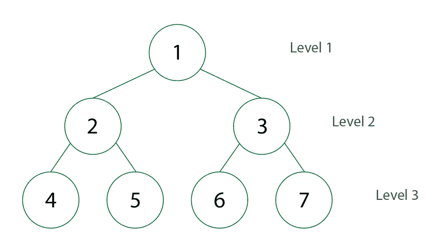

# 广度优先搜索和深度优先搜索

> 原文：<https://medium.com/nerd-for-tech/breadth-first-search-depth-first-search-dcd18fb18e0c?source=collection_archive---------3----------------------->


图表—维基百科

继续我最近的学习树和图数据结构的博客，我还想写两种使用**广度优先搜索** & **深度优先搜索遍历这些数据结构的方法！**

# **什么是深度优先搜索算法？**

深度优先搜索是一种算法，它搜索或遍历图形或树形数据结构。从选定的根节点开始(这可以是为图形数据结构选择的任何节点)，该算法沿着它能找到的每个可能的分支探索，直到它必须从探索的节点向下回溯到未访问的节点。


深度优先搜索树数据结构的动画—维基百科

# **深度优先搜索的伪代码**

**递归代码:**

```
**procedure** DFS(*G*, *v*) **is**
    label *v* as discovered
    **for all** directed edges from *v* to *w that are* **in** *G*.adjacentEdges(*v*) **do**
        **if** vertex *w* is not labeled as discovered **then**
            recursively call DFS(*G*, *w*)--Wikipedia
```

**迭代代码:**

```
**const** DFS = (node) *=>*{create and empty stackpush node into stackwhile (stack is not empty){reassign the node to the popped off element in the stackif(node has not been visited){mark the node as now visited
}**for each** (edge to vertices in the graph){push that vertex into the stack
}
}
}
```

深度优先搜索访问每个顶点一次，检查图中的每个边一次。因此，DFS 复杂度为*O*(*V*+*E*)。

# 什么是广度优先搜索算法？

广度优先搜索是一种算法，它搜索或遍历图形或树形数据结构。从树根节点开始，该算法在移动到下一深度级别的节点之前，探索当前深度的所有相邻节点。



广度优先搜索开发社区的 Gif

# 广度优先搜索的伪代码

**迭代代码:**

```
**Input**: A graph *G* and a *starting vertex* *root* of *G***Output**: Goal state. The *parent* links trace the shortest path back to *root*[[7]](https://en.wikipedia.org/wiki/Breadth-first_search#cite_note-7)**function** BFS(G,root){
create and empty queue array
label the root as visited in an array
assign the root to the queue**while**(queue is not empty){
assign a visited variable to the popped off element in the queue**for (all neighbors** w of v in G){
**if**(w is not visited){
push w into back of queue to visit its neighbors (if has any)
mark w as visited (true)
}
}
}
return visited
}
```

# 资源:

> 一个非常有用的媒体博客，由[感谢上帝 Ukachukwu](https://codeburst.io/implementing-dfs-and-bfs-using-javascript-5034f3cee9a1)

[](https://en.wikipedia.org/wiki/Breadth-first_search#Pseudocode) [## 广度优先搜索

### 广度优先搜索(BFS)是一种遍历或搜索树或图数据结构的算法。它始于…

en.wikipedia.org](https://en.wikipedia.org/wiki/Breadth-first_search#Pseudocode) [](https://en.wikipedia.org/wiki/Depth-first_search) [## 深度优先搜索

### 深度优先搜索(DFS)是一种遍历或搜索树或图数据结构的算法。算法…

en.wikipedia.org](https://en.wikipedia.org/wiki/Depth-first_search) 

> 我发现 youtube 上的两个视频非常有助于了解[呼吸优先搜索](https://youtu.be/aWEKe7lQxNw) & [深度优先搜索](https://youtu.be/pDxbtrVDwSU)由[逻辑优先](https://www.youtube.com/channel/UCFhHB5_2UkzB4V5iL1oaI-Q)