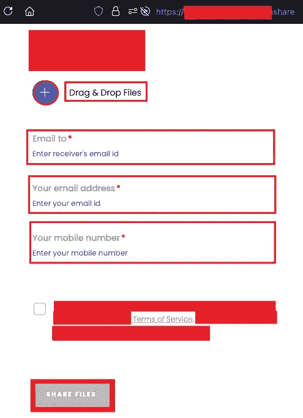
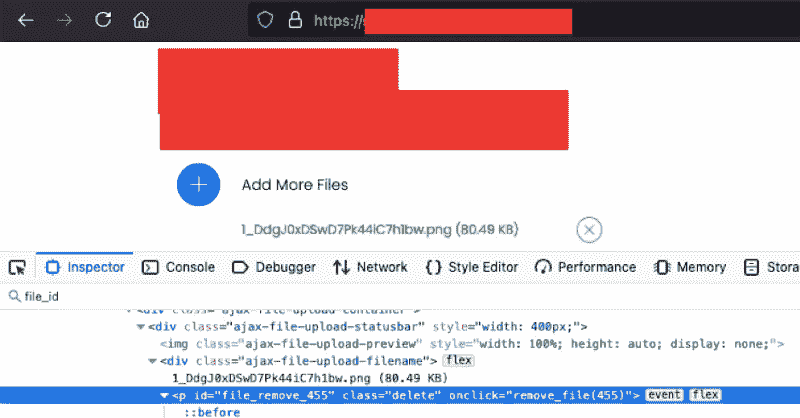
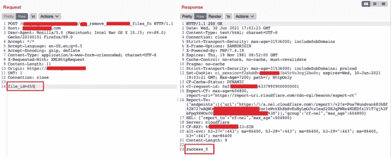
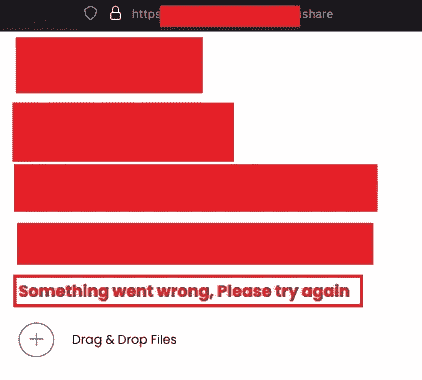

# 破解应用程序逻辑应对 DOS 攻击

> 原文：<https://medium.com/nerd-for-tech/breaking-applications-logic-to-dos-attack-88326cd0dd82?source=collection_archive---------2----------------------->

嘿伙计们，
最近我发现了一个足以配得上这篇文章的 bug。所以，我想把它写在这里。因为保密协议，我不能透露公司的名字(NDA)。所以我将使用 redacted.com 的*作为进一步的参考。*

# *TL；速度三角形定位法(dead reckoning)*

*我在 POST 请求中发现一个参数，容易受到 ***IDOR*** 的攻击。这个参数实际上是 ***序列*** ，这给了我在应用程序中使用我为该特定应用程序编写的 python 脚本创建 ***拒绝服务*** 攻击的优势。没有 WAF (Web 应用程序防火墙)能够检测到这种攻击，因为这完全是应用程序的逻辑行为(您将在后面看到)。*

## *先决条件*

***DOS 攻击你懂什么？** *在计算领域，拒绝服务攻击是一种网络攻击，攻击者试图通过暂时或无限期中断连接到互联网的主机的服务，使其目标用户无法使用机器或网络资源。【来自:* [*维基*](https://en.wikipedia.org/wiki/Denial-of-service_attack) *】。*
好的，除此之外，这是 [**US-CERT**](https://us-cert.cisa.gov/ncas/tips/ST04-015) 所说的:
*拒绝服务条件是通过用流量* ***淹没目标主机或网络，直到目标无法响应或干脆崩溃*** *，阻止合法用户的访问来实现的。**

*这是我所理解的，“*如果攻击者能够在攻击之后(或期间)阻止用户使用应用程序内部的任何功能或特性”应该被视为拒绝服务攻击*。*

## *让我们从初始 bug(IDOR)开始，*

*这个应用程序类似于 [Wetransfer](https://wetransfer.com) ，用户可以通过提供一些细节，如接收者的电子邮件、发送者的电子邮件、手机号码(应该验证)和文件(当然)，将文件发送给另一个用户。*

**

*看起来怎么样*

*当你上传一个文件，作为回应，我们得到一个文件 id 的上传文件。你也可以从 ***检查器*** 中看到 ***file_id*** 也可以。*

**

*上传文件>获取文件标识。*

*如果你上传了一个错误的文件，还可以选择从服务器上删除这个文件。现在这里有一个问题， ***file_id*** 本质上是连续的，当我们尝试删除文件时， ***POST*** 请求是用请求体中的 ***file_id*** 参数生成的。下面是删除文件的请求:*

**

*如果文件存在，则显示**成功**，否则**失败**。*

*现在你们中的许多人已经意识到可能存在 IDOR(不安全的直接对象引用)。所以，是的，你可以删除文件，因为没有访问控制删除文件。
好的，所以任何人只要知道你的 ***file_id*** 就可以删除你的文件。尽管 ***file_id*** 是连续的，所以你可以简单地用 ***蛮力*** 一下。当 file_id 被删除时，用户简单地得到一个错误消息，说 ***“出错了，请再试一次”。****

**

*出错信息*

*那么接下来可以做什么来增加这个 bug 的严重性呢？思考一分钟，然后继续往下读。*

# ***IDOR - > DOS***

*到目前为止，我们得到了一个 IDOR(严重性:高)，现在我将向您展示，我如何通过编写一个简单的 python 脚本将它提高到临界(DOS 攻击)。*

*我写了一个脚本，其中定义了一个 ***范围*** ，它发送 POST 请求来删除该范围内的特定 file_id。并且一旦脚本发现任何 ***file_id*** 被成功移除，则范围自动调整自身(即增加它的范围)。先看剧本:*

*python3 dos_poc.py*

## ***这个脚本有什么作用？***

*首先，你必须在网站上上传一个文件，并获得当前的文件标识(由检查员)。
**1。**现在通过将 file_id 值作为参数传递来运行脚本。例如:
(python3 dos_poc.py 310)。
**2。该脚本将创建一个从 310 到 330 的范围。
**3。它将发送一个 Post 请求来删除范围在 310 到 330 之间的文件标识。
**4。如果脚本找到了响应任何请求的成功消息，那么它将自动增加它的范围。例:如果发现 310 成功(响应)，那么新范围将是 311 到 331。攻击仍在继续..*******

**

# ***影响***

*因此，当我运行我的脚本时，任何试图通过该网站共享文件的人都会受到影响，他们的文件会被自动从服务器上删除，并显示一条错误消息 ***“出错，请稍后再试。”。****

*因此，我用 IDOR 漏洞链接，使该网站容易受到拒绝服务攻击。这种 DOS 攻击是完全合乎逻辑，因为它的行为没有恶意，所以没有 WAF 能够检测到这种攻击。*

# *外卖:*

*>我们应该始终考虑将漏洞链接起来以增加严重性(寻找最高的)。
>如果把访问控制的 bug 和其他一些 bug 链接起来，就变得更有意思了。想想吧。
>在 Twitter 上关注我了解更多信息。😉*

*对于任何查询，DMs 都是开放的:*

*推特:[https://twitter.com/abhiunix](https://twitter.com/abhiunix)
领英:[https://linkedin.com/in/abhiunix](https://linkedin.com/in/abhiunix)
谢谢！！*