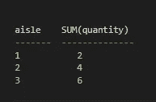

# 分解它— SQL 语法

> 原文：<https://medium.com/nerd-for-tech/breaking-it-down-sql-syntax-f3cd547c5826?source=collection_archive---------31----------------------->

在人类语言和计算机语言的交汇处。

啊 SQL…是念" *ess-cue-ell"* 还是" *see-qual"* ？抛开令人困惑和有争议的发音不谈，这种编程语言非常棒，因为它允许我们从看不见的数据库中请求一些数据，并接收回让人想起 excel 文件的信息。也就是说，以人类可读的格式组织。在我看来，在外观和用词上最接近英语的编程语言，可能看起来很难写。

对我来说，编写 SQL 查询最困难的部分是记住我可以访问的不同命令以及它们应该被编写的顺序。它有助于有一个公式，一个语法和句法可循。这篇文章最初是我的个人笔记，用来帮助记忆，我希望它们也能帮助你！

# 一个例子

给定以下语句:

英语还是 SQL？

看起来有些简单，不是吗？它用英语翻译为“从表*杂货中选择列*过道*的数据并合计*数量*。*返回的结果应该按照*通道*分组，然后按照合计*数量*排序。

查询结果

我们来分解一下。

# 公式

我们可以做`CREATE TABLE`、`ALTER TABLE`和`DROP TABLE`，它们听起来都很像。我们还可以使用 SQL 在表格中输入`INSERT INTO`、`UPDATE`和`DELETE`数据。不过明星选手，而且最有可能晋级的是`SELECT`。对于`SELECT`,我们可以使用下面的公式:

**动作→动作修改器→位置→过滤→排序**

## 作用指令

就像英语中的动词一样，这些语句告诉**需要做什么。**

`SELECT`从数据库中提取数据。我们可以指定要返回的列，或者使用 splat 运算符(*)来表示我们需要所有的列。
通过在`SELECT`后直接加上`DISTINCT`，我们只能得到唯一的值。

## 动作修饰符

在`SELECT`部分使用的这些命令表明，我们希望在看到数据和执行其他操作之前对数据进行一些操作。我们可以使用`MIN`和`MAX`来获得单个值，或者使用`COUNT`、`AVG`或`SUM`来聚合值。

## 位置命令

最标准最直接的部分。我们需要指定哪个数据库表包含我们想要返回的列。动作后面跟有`FROM`和要执行命令的表名。

## 过滤命令

我们现在进入可选领域。从这里开始，所有的命令都表示结果的进一步组织，并且有很多选项。语句顺序中的下一个是过滤命令。显示应用于过滤结果的标准。

这里的主体是`WHERE`，后面是列名和比较运算符，如:`=`、`>`、`<`，或者介词，如:`BETWEEN`、`IN`和`LIKE`。可与`WHERE`结合使用以增加特异性的附加可选过滤器:
`AND` / `OR` —返回可能满足多个条件的记录
`NOT`—返回条件不为真的所有记录
`Null` / `NOT NULL` —空白或非空白字段

## 排序命令

一旦我们有了应该返回的字段，我们就可以指定它们应该出现的顺序。

`GROUP BY`将具有相同值的行分组为汇总行。在这里，我们还可以添加聚合函数，如`COUNT`、`AVG`或`SUM`来表示分组方式。

然后…

`ORDER BY`列名。如果指示了多列，结果将首先按排序，如果有两列相同，则按下一列排序。

最后…

`ASC`(升序)或`DESC`(降序)选项允许按照您喜欢的方向对值进行排序。

# 连接

更复杂的是，可以一次查询多个表，并确定这两个表之间是否有共享值。下面列出了几种方法，具体取决于表之间的关系。

`INNER JOIN`

返回在两个表中都有匹配值的记录

`LEFT JOIN`

返回左表中的所有记录，以及右表中的匹配记录

`RIGHT JOIN`

返回右表中的所有记录，以及左表中的匹配记录

`FULL JOIN`

当左表或右表中有匹配项时，返回所有记录

希望 SQL 现在不那么神秘了，您可以自信地向数据库请求它的内容了！

我将在这里留下的最后一个趣闻是

 [## SQL GROUP BY 语句

### GROUP BY 语句将具有相同值的行分组到汇总行中，如“查找…中的客户数量”

www.w3schools.com](https://www.w3schools.com/sql/sql_groupby.asp)  [## 基本 SQL 命令——您应该知道的数据库查询和语句列表

### SQL 代表结构化查询语言。SQL 命令是用于与数据库通信的指令，以便…

www.freecodecamp.org](https://www.freecodecamp.org/news/basic-sql-commands/)