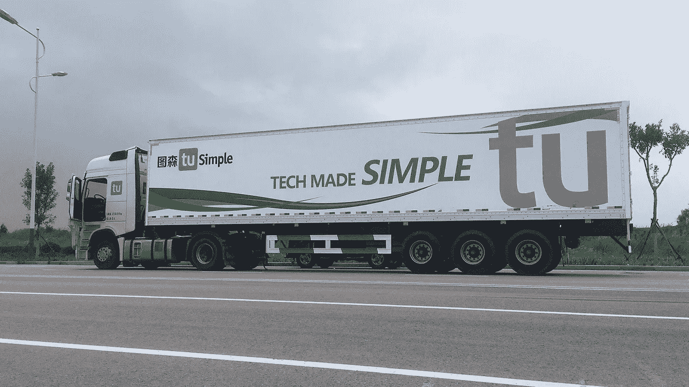

# 数据标签服务如何赋能包裹递送行业？

> 原文：<https://medium.com/nerd-for-tech/breaking-the-game-self-building-an-autonomous-car-part2-31b96601dbf0?source=collection_archive---------9----------------------->

图森普勒

# 无人配送

除了 Robotaxi，无人配送是商业化的另一个热门方向。

在这个领域，业内著名的公司有美团、Neolix、京东物流等。随着无人配送成本的降低，技术的更新进步和量产，更重要的是劳动力的短缺，对无人车的需求变得越来越迫切。Neolix 创始人余恩源此前提到，三年内将有超过 10000 辆无人配送车投入实践。

据麦肯锡预测，**未来十年 80%的包裹递送将采用自动配送**。“预计到 2025 年，中国低速自动驾驶汽车年销量将达到 19 万辆，其中 8 万辆在物流配送领域。而且无人配送的落地场景更广，包括快递、外卖配送、移动售货车等。这也是为什么越来越多的公司专注于无人配送。在这种场景下，自动驾驶可能会尽快落地并盈利。

# 融资和上市趋势

作为当今最“烧钱”的行业之一，2021 年自动驾驶的融资潮依然迅猛。仅今年上半年，自动驾驶领域就发生了 69 起投融资事件，披露的投融资总额超过 102 亿美元。

与此同时，自动驾驶公司并不满足于融资，更多的公司一直在达成上市的目标。Waymo、Aurora、Pony.ai 都已经开始了上市准备的进程。图森未来已于 4 月在美国上市，成为自动驾驶领域的“全球第一股”。

在这种背景下，没有人敢在这波上市中有所突破。一方面，上市可以快速收获资金，为后续的融资渠道铺平道路；另一方面，有利于推动商业化进程。总之，融资资金越多，公司越受市场青睐。

## 更合理的投资

随着时间的推移，2021 年自动驾驶融资市场确实会越来越火爆。不过，与前两年盲目投资不同的是，虽然投资金额依然巨大，但投资者明显越来越理性。他们关注的是商业模式(是否有整车厂做后盾)，以及商业落地中的速度和量产能力。

而且作为“领头羊”，Waymo 对外部投资者开放了融资模式，加剧了其他自动驾驶公司的融资困难。预计这种“头部效应”会越来越明显———**投资者显然更愿意投资利润预期更好的“龙头”。**在这种情况下，只有技术实力过硬的企业才能获得青睐。

# 安全条例已逐步完善

对于自动驾驶来说，最重要的是安全。现在自动驾驶不能被大众广泛接受的主要原因是不能保证绝对安全。

自动驾驶事故的频发也加深了人们对这项技术的怀疑。在自动驾驶法律法规方面，今年上半年，全球各地的法律法规都有了新的进展。

**阅读更多:** [**全球首个无人驾驶法律允许 L4 级自动驾驶在德国道路上行驶**](https://tinyurl.com/s6yva66e)

3 月，中国公安部发布了《道路交通安全法(修订草案)》。在自动驾驶方面，此次修订明确了道路测试和车辆通行的相关要求，以及违法行为和事故责任原则的规定。根据解读，**如果修改后的提案被采纳，将是自动驾驶首次写入中国国内法**。

最近，美国国家公路交通安全管理局(NHTSA)发布了一项总法令，要求 L2-L5 级自动驾驶系统的制造商和运营商在 24 小时内报告涉及伤害和死亡的事件。这些法律法规的逐步完善，也会让自动驾驶越来越被认可。

# 高质量的数据是行业的关键

标注数据的质量直接影响 AI 最终模型。可扩展的、高质量的和精炼的数据可以极大地提高安全性和实用性，并且肯定有助于着陆过程。

去年，在 2019 年 CVPR 上，特斯拉人工智能高级总监 Andrej Karpathy 回答了下面的问题:

**如何估计为特定场景训练和验证自动驾驶汽车所需的标记数据量？**

**答案是 378 小时的数据。**

标注越准确，算法性能越好。

驾驶过程中任何微小的错误都可能导致可怕的后果。如今，随着几起自动驾驶汽车事故的发生，人们越来越关注驾驶安全问题。

因此，为不同场景和不同需求提供高质量 AI 数据的措施逐渐成为自动驾驶人工智能解决方案的共识。

# 结束

将你的数据标注任务外包给 [ByteBridge](https://tinyurl.com/4upptnbv) ，你可以更便宜更快的获得高质量的 ML 训练数据集！

*   无需信用卡的免费试用:您可以快速获得样品结果，检查输出，并直接向我们的项目经理反馈。
*   100%人工验证
*   透明标准定价:[有明确的定价](https://www.bytebridge.io/#/?module=price)(含人工成本)

**为什么不试一试？**

来源:智能汽车技术