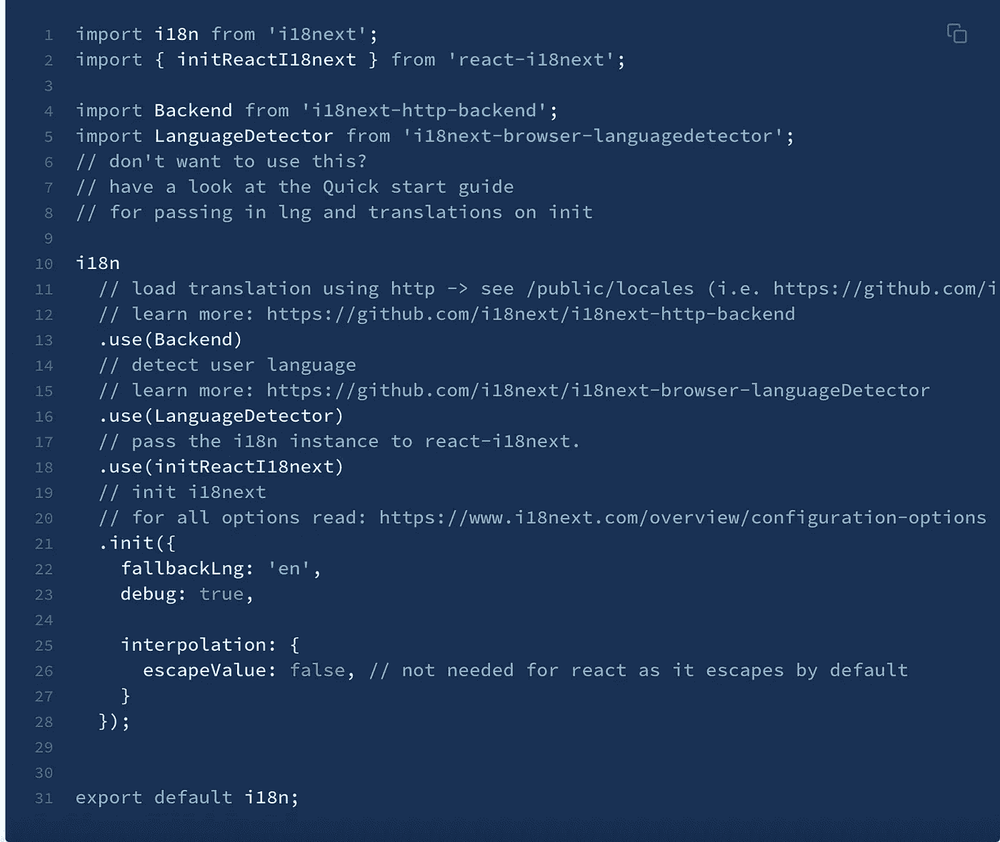
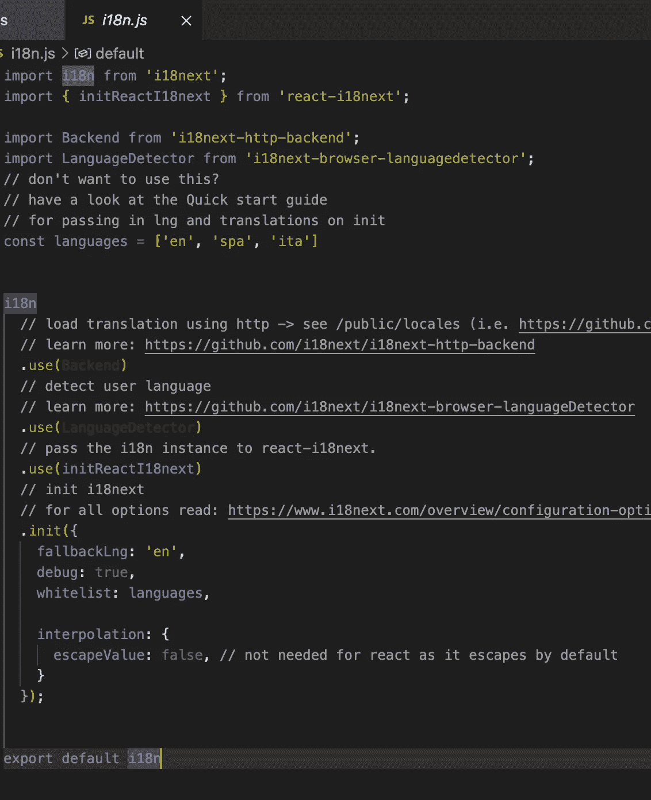
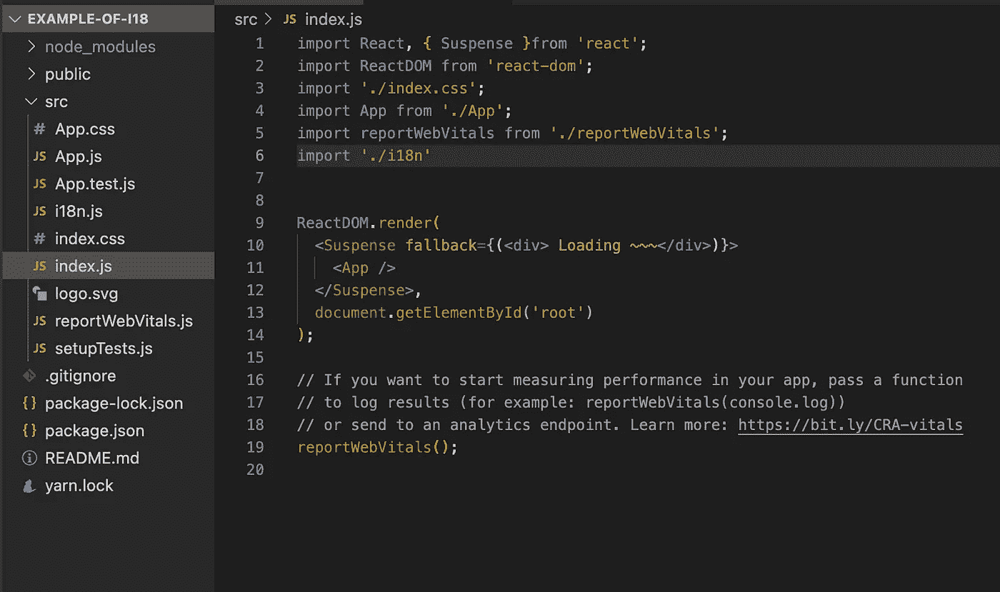
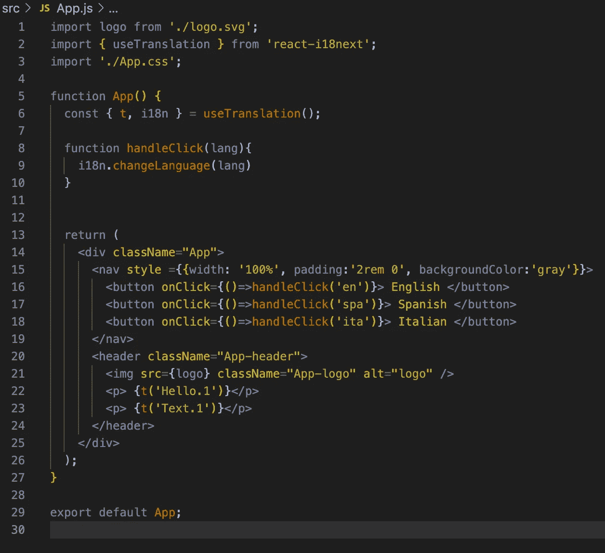
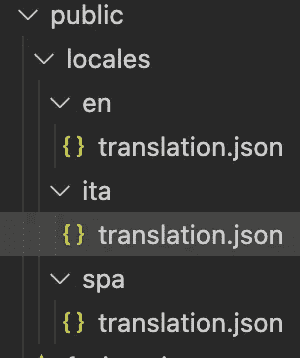
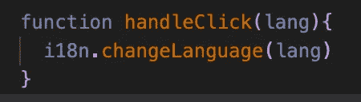
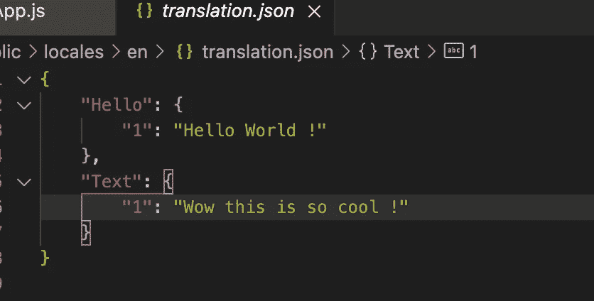
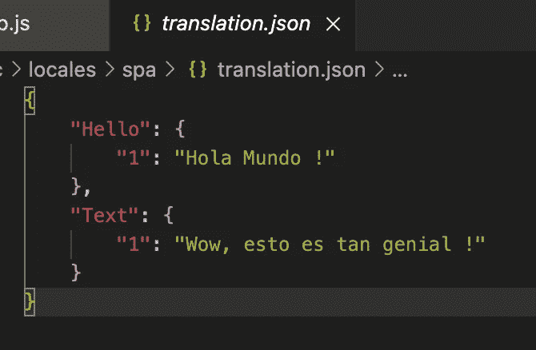
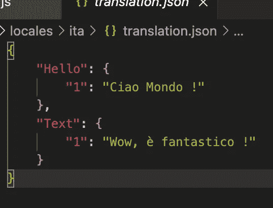
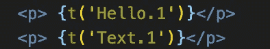

# 在 react 中使用 i18next 打破语言障碍！

> 原文：<https://medium.com/nerd-for-tech/breaking-the-language-barrier-using-i18next-in-react-56e0c2951e23?source=collection_archive---------16----------------------->

照片由[艾蒂安·吉拉代](https://unsplash.com/@etiennegirardet?utm_source=medium&utm_medium=referral)在 [Unsplash](https://unsplash.com?utm_source=medium&utm_medium=referral) 上拍摄

生活在世界上最大的熔炉里，我习惯了每天听到和看到世界上的语言。虽然在纽约市大多数人说英语，但它并不是每个人的主要语言，而且很多人更喜欢他们的母语。作为开发者，我们倾向于忘记不是每个人都能说和读英语，那么我们该如何解决这个问题呢？，这是 i18next 的亮点，它让任何使用 react 框架的开发人员都很容易。

# 设置

如果你是使用 react 的新手，不要担心，这个快速指南将确保解释你需要知道的一切！对于初学者，我们需要创建我们的应用程序，我们可以通过进入我们的终端并键入`npx create-react-app my-app-name`来做到这一点。一旦完成创建，我们希望`cd my-app-name`并最终用我们的代码编辑器打开它，在我的情况下，我使用 VsCode，所以我会输入`code . my-app-name.`。

现在我们在代码编辑器中，我们需要再次进入终端，粘贴每个代码。

> (先安装)npm 安装 react-i18 下一个 i18 下一个—保存
> 
> (安装第二个)npm 安装 i18 next-http-后端 i18 next-browser-language detector-保存

# i18n 文件

这应该安装了 i18next 在 react 应用程序中工作所需的所有必要文件。您还可以使用 i18next 的[文档](https://react.i18next.com/)来解决可能出现的任何问题！现在，我们需要在`src folder`下创建一个新文件，我们将把它命名为`i18n.js`，在这个文件中，我们将粘贴以下代码:

这可以在逐步指南下的 i18 下一个[文档](https://react.i18next.com/latest/using-with-hooks)中找到

现在我们已经在`i18n.js`文件中有了这段代码，我们需要添加一些代码，让我们更容易处理。在第 9 行，我们创建了一个保存到变量中的数组:`const languages = ['en', 'spa' , 'ita']`这些是我们将要使用的语言的简单缩写(在我们的例子中，我们使用英语、西班牙语和意大利语)。现在，在第 24 行，我们简单地放入`whitelist: languages,`,这将确保只有我们变量中的语言会被加载，这就是这个文件，除非你想添加更多的语言，你应该设置好继续下一步。

完成的 i18n 文件

# 索引. js

我们现在需要进入我们的`index.js`文件，对 i18next 进行一些修改，以便在我们的应用程序中工作。首先，我们需要在第 6 行导入新创建的 i18n 文件。我们还修改了第 1 行和第 9-12 行，这是了解 React 悬念的一个很好的资源，可以在这里找到。

更多关于 React 悬念的信息可以在[这里](https://reactjs.org/docs/concurrent-mode-suspense.html)找到。

# App.js

我们已经解决了烦人的部分，所以现在我们可以进入最后一步了。我们需要首先进入我们的`app.js`文件，从 i18next [文档](https://react.i18next.com/latest/usetranslation-hook)中复制几个项目。我们需要做的第一件事是从 i18next 导入我们的翻译钩子，所以继续复制下面的文本到你的导入中。

> 从“react-i18next”导入{ use translation }；

App.js 文件

正如你所看到的，在 work 旁边有几行我为 i18 添加的代码，但是不要担心，我们会仔细检查每一行。现在，我们需要做的就是确保在进入下一步之前正确导入第 2 行。下一步，我们需要进入代码编辑器中的`public`文件夹，并在其中创建一个名为`locales`的新文件夹。这就是命名的重要性，因为正如你所记得的，在我们的小教程开始时，我们缩写了我们的每一种语言，现在我们需要确保我们保持相同的缩写，否则 react 将会混淆，什么也翻译不出来。在每个新文件夹中，我们都要创建一个名为`translation.json`的新文件，这是我们放入译文的地方，也是 18next 的威力充分发挥的地方！

文件夹和文件

谈到翻译的功能，有多种途径可供选择。对于这个具体的例子，我创建了按钮，并赋予每个按钮在点击后改变语言的功能，为此我将参考之前的`app.js file`照片。看看它，除了两个非常重要的细节之外，我们没有太多需要做的事情，在第 2 行我们可以看到:

> const { t，i18n } = use translation()；

有了这个，我们现在使用 i18next 提供给我们的 useTranslation 钩子。这将允许我们在我们的`translation.json`文件中调用我们的翻译，记住在这个例子中我创建了一个简单的`handleClick`函数。这就是 i18next 的威力所在，通常我们需要为我们的翻译创建一个小的三元组，但是因为我们使用 i18next，它通过简单地在我们的函数中添加`changeLanguage`为我们做了所有复杂的工作。

i18 的威力下一步

# 翻译

我们的每个`translation.json`文件看起来都一样，唯一的关键区别是你选择的语言。保持每个文件的结构相同，因为这在我们进行最后一步时很重要，也可能是整个教程中最简单的部分。

英语(默认)

西班牙语

意大利的

# 结局

所有这一切的最后一步很简单，我们需要使用 *t，*和 i18next 的强大功能以及命名约定。这最后一步非常简单。

上面的 App.js 文件可查看大图

在我们的翻译文件中，我们创建了一个保存在每个文件中的公共变量，在本例中,“Hello.1”指的是保存为“Hello World！”的默认文本而“Text.1”指的是“哇这太酷了！”。本质上，这就是我们如何翻译页面上的文本，并且现在能够看到所有的文本汇集在一起！

把所有的放在一起

如果你还没有因为现在知道如何使用 18next 而给自己一个鼓励，并且可以开始在你的应用程序中实现它。我会留下一个到我的 GitHub repo 的链接，你可以在那里修改它，直到下一次，快乐编码！

约书亚·雷德科普在 [Unsplash](https://unsplash.com?utm_source=medium&utm_medium=referral) 上拍摄的照片