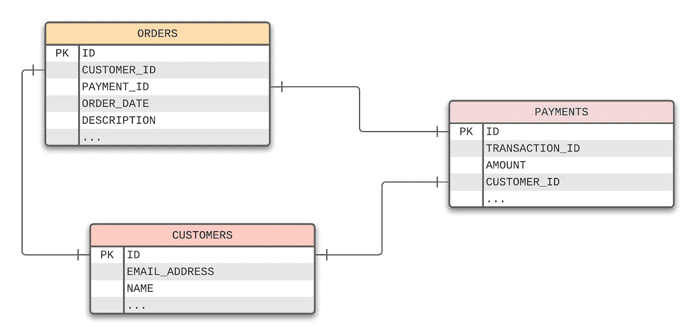
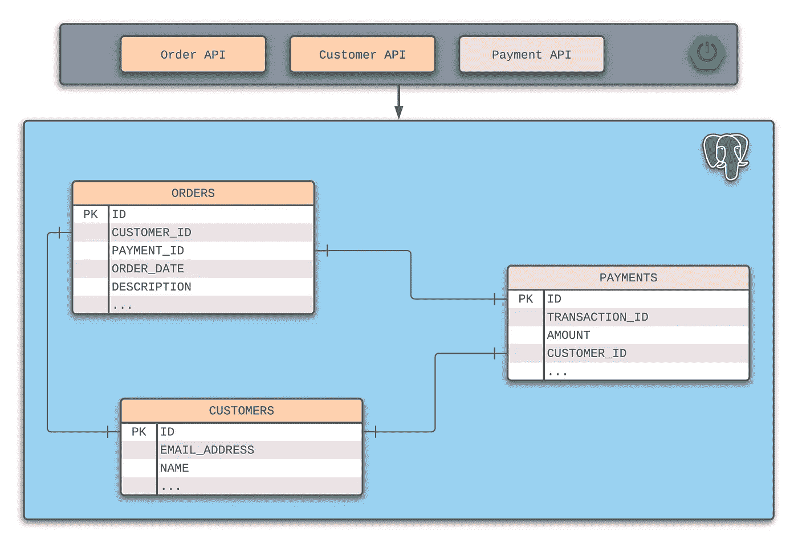
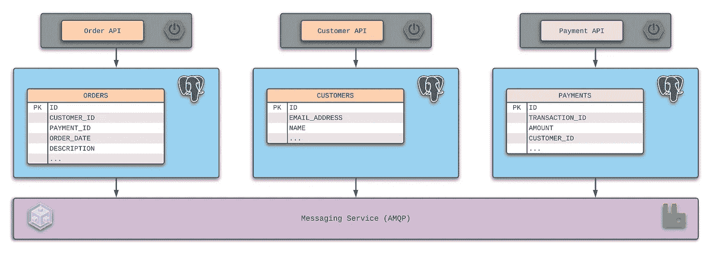
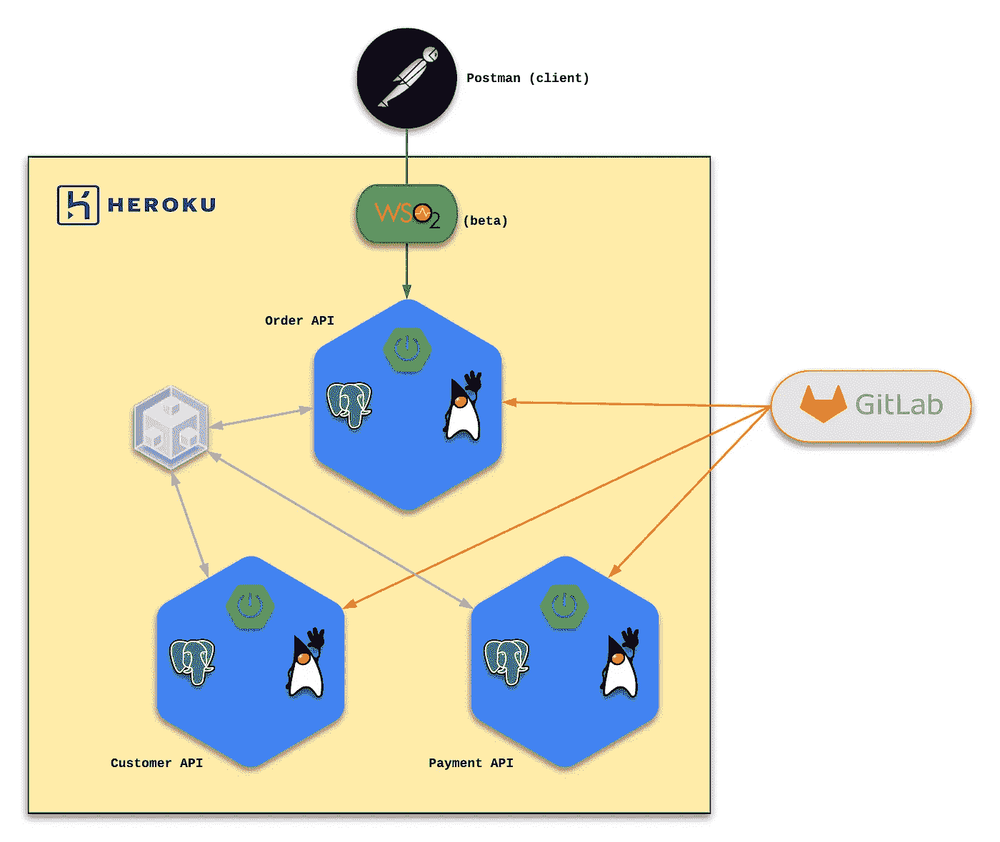
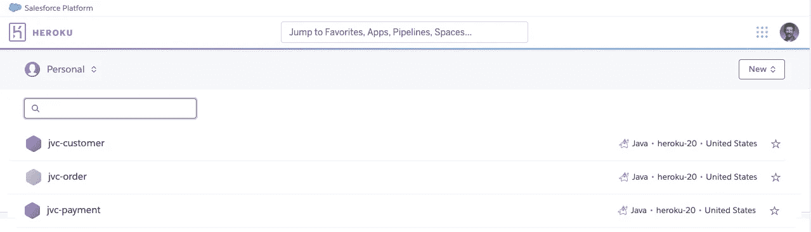

# 使用 Heroku 打破神的服务

> 原文：<https://medium.com/nerd-for-tech/breaking-up-the-god-service-using-heroku-61e27613538a?source=collection_archive---------11----------------------->


在过去的十年中，我参与了被我归类为“应用程序现代化计划”的项目这种努力的目标是使用更新的(通常更受支持的)框架、设计模式和语言来替换遗留的应用程序或服务。

在每一种情况下，以下三个教训中至少有两个被证明是正确的:

1.  不要用另一个伪装成现代化服务的整体来代替一个整体。
2.  避免接受包含在现代化系统中的不良数据模型。
3.  永远不要假设现有的程序逻辑是 100%正确的。

这让我想起了我购买一辆几年前的皮卡的时候。我为我的购买感到自豪，这辆卡车开起来很有趣。事实上，我和我父亲谈过想对卡车做些改进。你知道，改变会使它看起来真的很好…甚至增加一个改进的音响系统。

父亲饶有兴趣地听我讲述宏伟的计划。当我完成时，他确认我可以做所有这些事情。然而，最后他说我将“仍然有一辆旧卡车。”

他的观点很明确。我可以花很多钱让卡车看起来更好——但是如果我不更换下面的部件，我仍然会有同样的卡车。这意味着我可能会面临车主和他们的旧车经常遇到的挑战。

我觉得很多“应用程序现代化”项目很快就做出了保守的决定，最终导致这些“新”解决方案不那么新颖和改进。与我的“旧卡车”示例一样，这些遗留设计决策开始给新应用程序带来挑战只是时间问题。

这三个经验教训中的每一个都可以成为单独出版物的主题。在这篇文章中，我将集中讨论如何避免用另一个伪装成现代化应用程序的 monolith 替换一个遗留的 monolith 应用程序。

# 事情偏离轨道的地方

考虑一个非常简单的商业解决方案，它允许客户提交订单。原始应用程序包含一个带有三个表的数据库:



CUSTOMERS 表维护客户信息。表中的 ID 列链接到 ORDERS 表，将订单与客户相匹配。客户的 ID 列也链接到付款表。

通常，决定将所有内容保存在一个数据库中。这导致创建了一个新的服务，它包括在这些完全相同的表之间交互的组件和服务。

下图旨在展示一个设计，它仅仅是用 RESTful API 替换了单一的应用程序。这项工作的结果是数据库保持不变。



虽然这个想法在理论上听起来不错，但这通常会导致一个新的服务，它与原始系统一样复杂…如果不是更复杂的话。这就是通常所说的上帝服务。

使问题更加复杂的是，为了满足客户需求而进行的扩展需要所有的 API(如上所述)一致地进行扩展。根据底层设计，扩展选项甚至可能仅限于垂直扩展，这将调用“解决问题的硬件”解决方案。

这就是“*不要用伪装成现代化服务的另一个整体来取代另一个整体”的教训得到验证的地方。*

# 做得更好

使用同一个例子，考虑一下:如果下面的设计用于应用程序现代化计划会怎么样？



在这种设计中，引入了三种新的微服务来容纳应用程序的域所有权。最重要的是，每个微服务及其专用对象都有自己的数据库。

这些服务之间的连接将利用消息服务，通常采用[请求-响应](https://en.wikipedia.org/wiki/Request%E2%80%93response)模式。

作为一个例子，考虑下订单的用例。订单使用消息向客户 API 提供已知的客户数据。客户 API 将处理请求，或者返回一个现有的 `CustomerDto` (DTO 是一个[数据传输对象](https://en.wikipedia.org/wiki/Data_transfer_object))或者通过对原始请求的响应创建一个新的 `CustomerDto`。

然后，客户的标识符可以与订单和使用支付 API 进行支付的请求相关联。这里，遵循相同的模式，但是将利用从客户 API 请求中获得的信息。

当支付 API 做出响应时，新订单可以保存到相应的数据库中，并由发出请求的客户进行确认。

由于每个微服务都是独立的，因此满足客户需求的扩展和缩减仅限于当前识别较高(或较低)请求级别的服务。

# 利用 Heroku 来逃避上帝的服务

我想看看在 Heroku 中创建想要的图案有多容易。几分钟之内，我就能够在 Heroku 中建立三个应用程序来模拟以下设计:



这三个服务都包含他们自己的 [Heroku Postgres](https://www.heroku.com/postgres) 数据库和一个 [Spring Boot](https://spring.io/projects/spring-boot) 服务。为了使这个例子尽可能简单，将 [CloudAMQP](https://elements.heroku.com/addons/cloudamqp) (RabbitMQ)服务添加到 jvc-order 应用程序中。 [WSO2 API Cloud](https://elements.heroku.com/addons/wso2apicloud) 是设计的一部分，但不会在本文中记录。

在 Heroku 仪表板上，三个应用程序如下所示:



## 创建示例表

下面的 SQL 被用来创建基本表。这些可用于验证这些服务的功能:

```
CREATE TABLE orders (
 id INT PRIMARY KEY NOT NULL,
 customer_id INT NOT NULL,
 payment_id INT NOT NULL,
 order_date timestamp NOT NULL,
 description VARCHAR(255) 
);
​
CREATE TABLE customers (
 id INT PRIMARY KEY NOT NULL,
 email_address VARCHAR(255) NOT NULL,
 name VARCHAR(255),
 UNIQUE (email_address)
);
​
CREATE TABLE payments (
 id INT PRIMARY KEY NOT NULL,
 transaction_id VARCHAR(36) NOT NULL,
 amount DECIMAL(12,2),
 customer_id INT NOT NULL
);
```

请记住，每个 CREATE TABLE 命令都是针对与相应微服务相关联的 PostgreSQL 数据库执行的。

## 处理订单请求

考虑以下 OrderRequest 负载:

```
{
 “description” : “Sample Order #4”,
 “emailAddress” : “[bjohnson@example.com](mailto:bjohnson@example.com)”,
 “name” : “Brian Johnson”,
 “amount” : 19.99
}
```

正常情况下，一个真正的订单将包含其他几个属性，但是目标是遵循“保持简单”的方法，而是关注设计原则。

作为订单的一部分，系统需要知道下订单的客户的标识符和请求的交易。

## 请求客户

为了请求客户信息，可以将以下`CustomerDto`有效负载放在请求队列中:

```
{
 “emailAddress” : “[bjohnson@example.com](mailto:bjohnson@example.com)”,
 “name” : “Brian Johnson”
}
```

在 Order API 中，以下方法利用了 Heroku 的云 AMQP、直接交换的概念和 Spring Boot 的 spring-boot-starter-amqp:

```
public CustomerDto getCustomer(String emailAddress, String name) {
 CustomerDto customerDto = new CustomerDto();
 customerDto.setEmailAddress(emailAddress);
 customerDto.setName(name);
​
 return rabbitTemplate.convertSendAndReceiveAsType(customerDirectExchange.getName(),
 messagingConfigurationProperties.getCustomerRoutingKey(),
 customerDto,
 new ParameterizedTypeReference<>() {});
}
```

在本例中，这个请求是一个阻塞请求——这意味着订单 API 的处理会一直等到客户 API 提供响应。

在客户 API 中，有一个侦听器正在等待 customerDirectExchange 上的请求:

```
[@RabbitListener](http://twitter.com/RabbitListener)(queues = “#{messagingConfigurationProperties.customerRequestQueue}”)
[@Transactional](http://twitter.com/Transactional)(propagation = Propagation.REQUIRES_NEW)
public CustomerDto receive(CustomerDto customerDto) {
 log.debug(“CustomerProcessor: receive(customerDto={})”, customerDto);
​
 Customer customer = customerRepository.findByEmailAddressEquals(customerDto.getEmailAddress());
​
 if (customer != null) {
   log.debug(“Found existing customer={}”, customer);
   // return customer as a CustomerDto
 } else {
   log.info(“Creating new customer={}”, customerDto);
   // return new customer as a CustomerDto
 }
​
 log.debug(“customerDto={}”, customerDto);
 return customerDto;
} 
```

在此示例中，customerDto 对象包含以下信息:

```
[@AllArgsConstructor](http://twitter.com/AllArgsConstructor)
[@NoArgsConstructor](http://twitter.com/NoArgsConstructor)
[@Data](http://twitter.com/Data)
public class CustomerDto {
 private int id;
 private String emailAddress;
 private String Name;
}
```

## 请求付款

通过利用`PaymentDto`，可以使用相同的模式来请求付款:

```
[@AllArgsConstructor](http://twitter.com/AllArgsConstructor)
[@NoArgsConstructor](http://twitter.com/NoArgsConstructor)
[@Data](http://twitter.com/Data)
public class PaymentDto {
 private int id;
 private String transactionId;
 private BigDecimal amount;
 private int customerId;
}
```

customerId 属性是请求/响应模式的结果。当然，在付款 API 完成处理之前，不会设置 id 属性，付款 API 使用另一个非常简单的付款示例:

```
[@RabbitListener](http://twitter.com/RabbitListener)(queues = “#{messagingConfigurationProperties.paymentRequestQueue}”)
[@Transactional](http://twitter.com/Transactional)(propagation = Propagation.REQUIRES_NEW)
public PaymentDto receive(PaymentDto paymentDto) {
 log.debug(“PaymentProcessor: receive(paymentDto={})”, paymentDto);
​
 Payment payment = new Payment();
 payment.setAmount(paymentDto.getAmount());
 payment.setCustomerId(paymentDto.getCustomerId());
 payment.setTransactionId(UUID.randomUUID().toString());
 paymentRepository.save(payment);
 paymentDto.setId(payment.getId());
 paymentDto.setTransactionId(payment.getTransactionId());
 return paymentDto;
}
```

## 提交订单并完成交易

完成交易后，可以使用 Postman 客户端甚至一个简单的 cURL 命令来完成下订单的过程:

```
curl — location — request POST ‘[https://jvc-order.herokuapp.com/orders'](https://jvc-order.herokuapp.com/orders') \
 — header ‘Content-Type: application/json’ \
 — data-raw ‘{
 “description” : “Sample Order #4”,
 “emailAddress” : “[bjohnson@example.com](mailto:bjohnson@example.com)”,
 “name” : “Brian Johnson”,
 “amount” : 19.99
}’
```

订单 API 将接受 POST 请求，并返回 HTTP 201(已创建)状态以及以下有效负载:

```
{
 “id”: 4,
 “customerId”: 4,
 “paymentId”: 4,
 “orderDate”: “2021–06–07T04:31:52.497082”,
 “description”: “Sample Order #4”
}
```

三个微服务中的每一个都有标准的 RESTful APIs，允许检索完整的有效负载数据结果。

下面是调用客户 API 的示例:

```
GET [https://jvc-customer.herokuapp.com/customers/4](https://jvc-customer.herokuapp.com/customers/4`)
```

这将返回以下有效负载和 HTTP 200 (OK)状态:

```
{
 “id”: 4,
 “emailAddress”: “[bjohnson@example.com](mailto:bjohnson@example.com)”,
 “name”: “Brian Johnson”
}
```

以下是调用付款 API 的示例:

```
GET [https://jvc-payment.herokuapp.com/payments/4](https://jvc-payment.herokuapp.com/payments/4`)
```

这还会返回 HTTP 200 (OK)状态和以下有效负载:

```
{
 “id”: 4,
 “transactionId”: “3fcb379e-cb89–4013-a141-c6fad4b55f6b”,
 “amount”: 19.99,
 “customerId”: 4
}
```

最后，调用订单 API 的示例如下所示:

```
GET [https://jvc-order.herokuapp.com/orders/4](https://jvc-order.herokuapp.com/orders/4`)
```

这里返回一个 HTTP 200 (OK)状态，并带有以下有效负载:

```
{
 “id”: 4,
 “customerId”: 4,
 “paymentId”: 4,
 “orderDate”: “2021–06–07T04:31:52.497082”,
 “description”: “Sample Order #4”
}
```

# 结论

从 2021 年开始，我开始关注以下我认为适用于任何 IT 专业人士的使命宣言:

> “将您的时间集中在提供扩展您知识产权价值的特性/功能上。将框架、产品和服务用于其他一切。”
> —j·维斯特

Heroku 生态系统使得坚持使命宣言变得非常容易。在几个小时的时间里，我完全构建出了三个包含 Spring Boot RESTful API 和 Heroku Postgres 数据库的微服务原型。在同样长的时间内，云 AMQP 被添加、集成到解决方案中并得到验证。

如果我使用标准的云服务提供商，我无法想象这需要多长时间。附加 PostgreSQL 数据库和基于云的 AMQP 实例的能力，加上处理权限，将会消耗掉我所有的可用时间——让我没有时间来证明这个功能。

如果您有兴趣查看该项目的实际源代码，请查看 GitLab 上的以下资源库:

[JVC-客户](https://gitlab.com/johnjvester/jvc-customer)

[jvc 订单](https://gitlab.com/johnjvester/jvc-order)

[JVC-支付](https://gitlab.com/johnjvester/jvc-payment)

祝你今天过得愉快！