# 使用机器学习技术的乳腺癌分类器。

> 原文：<https://medium.com/nerd-for-tech/breast-cancer-classifier-by-using-machine-learning-techniques-d17bcb034892?source=collection_archive---------4----------------------->

## ['数据集和代码可在我的 [GitHub](https://github.com/Poulami0702/Breast-Cancer-Classification.git) 个人资料中找到']

Github 链接:***https://github . com/poulami 0702/Breast-Cancer-class ification . git***

**简介:**乳腺癌是全球女性最常见的癌症。它占所有癌症病例的 25%，2015 年影响了超过 210 万人。当乳房中的细胞开始不受控制地生长时，它就开始了。这些细胞通常会形成一个肿瘤，在 x 光片上可以看到或摸到一个肿块。早期诊断大大增加了幸存者的机会。对其检测的关键挑战是如何将肿瘤分类为恶性(癌症)或良性(非癌症)。如果肿瘤细胞可以生长到周围组织或扩散到身体的远处，则肿瘤被认为是恶性的(癌症)。良性肿瘤不会像癌症那样侵入附近的组织或扩散到身体的其他部位。但是，如果良性肿瘤压迫血管或神经等重要结构，就会很严重。机器学习技术可以大幅提高乳腺癌的诊断水平。研究表明，经验丰富的医生可以以 79%的准确率检测癌症，而使用机器学习技术可以达到 91%(高达 97%)的准确率。

**目的:**在这篇短文中，我将解释几种使用从不同文章中收集的数据来检测他/她是否患有乳腺癌的方法。但是相同的技术可以应用于不同的场景。在本文中，我将解释加载、清理和分析数据的 Python 代码。然后我们会做一些机器学习模型来执行一个分类任务(是或否)。

**使用的工具/技能:**

1.Python 编程

2.Jupyter 笔记本

3.熊猫

4.Numpy

5.Matplotlib

6.海生的

7.探索性数据分析

8.特征工程

9.数据可视化

10.Sciklearn

11.机器学习算法

**使用 Python 解决问题:**

**数据读取:**

我们使用 Pandas 库在 Jupyter 笔记本中加载 CSV 文件。Pandas 是机器学习中用于数据清理和分析的工具之一。它具有用于探索、清理、转换和可视化数据的功能。

head():-返回数据帧的前 5 行。要覆盖默认值，可以在括号之间插入一个值来更改返回的行数。例子:df。head(10)将返回 10 行。

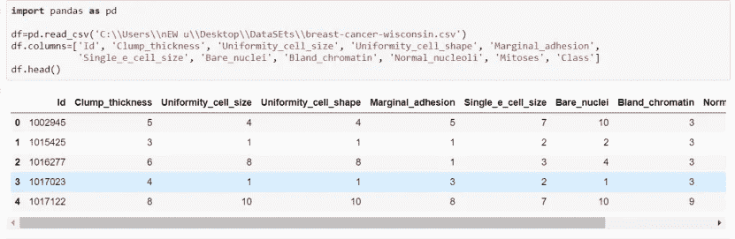

df.columns:-它可以被认为是一个类似于 dict 的 Series 对象容器。这是熊猫的主要数据结构。熊猫数据框。属性返回给定数据帧的列标签。

**数据清理:**

清理数据非常重要，因为它包含许多不需要的列、不需要的数据、离群值、空值、列等等。数据清理是指识别和纠正数据集中可能对预测模型产生负面影响的错误。数据清理是指检测和修复数据中错误的各种任务和活动。

因此，使用一些基础知识，如:

df.columns，df.isnull()。sum()，df.drop()。

让我们检查是否有空值:

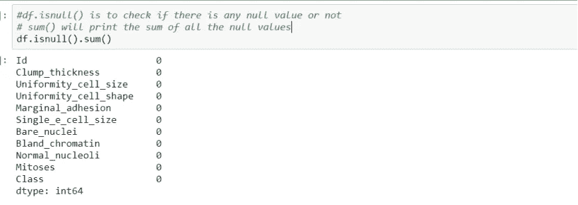

isnull()。sum()。sum()返回数据集中缺失值的数量。处理包含缺失值的数据的一个简单方法是跳过数据集中缺失值的行。

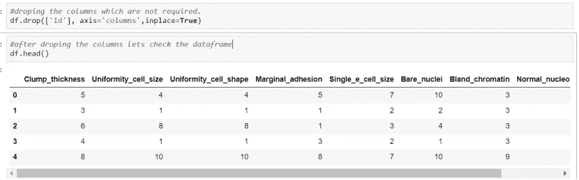

drop()函数用于从行或列中删除指定的标签。通过指定标签名和相应的轴，或者通过直接指定索引名或列名来删除行或列。使用多索引时，可以通过指定级别来删除不同级别上的标签。

让我们看看目标功能:

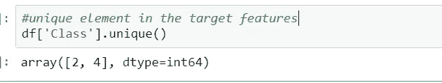

df . unique():unique()函数用于查找数组的唯一元素。返回数组中排序后的唯一元素。重建输入数组的唯一数组的索引。每个唯一值在输入数组中出现的次数。

**数据可视化:**

Matplotlib 和 Seaborn 是这个模型中使用的两个库。Matplotlib 主要用于基本绘图。使用 Matplotlib 的可视化通常由条形图、饼图、折线图、散点图等组成。另一方面，Seaborn 提供了多种可视化模式。它使用更少的语法，并且有很容易引起兴趣的默认主题。

该模型应用 seaborn 的 countplot()来显示目标特征的可视化计数。

countplot():使用条形显示每个分类容器中的观察计数。计数图可被视为分类变量而非定量变量的直方图。基本的 API 和选项与 barplot()的相同，因此您可以跨嵌套变量比较计数。

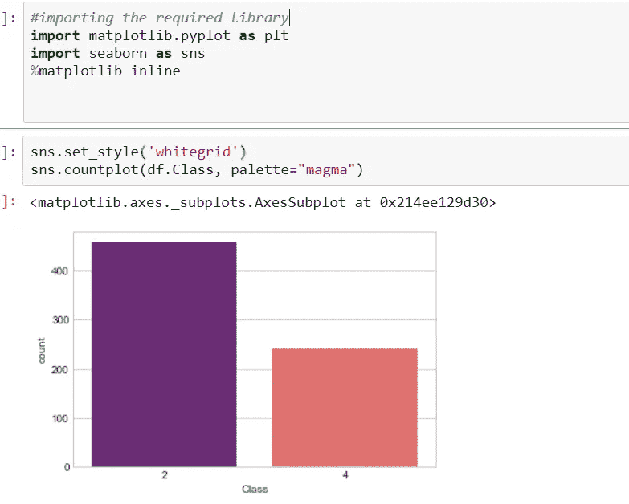

让我们画出所有特征相对于目标特征的计数图。

1.  具有特征名称有丝分裂

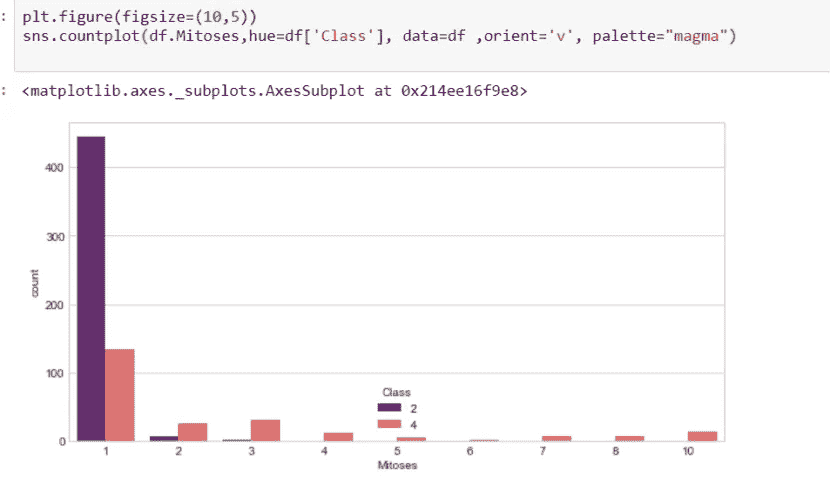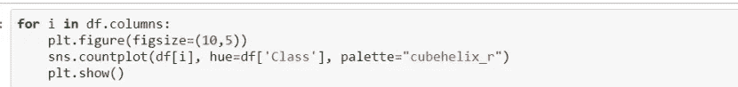

2.特征名为“块 _ 厚度”

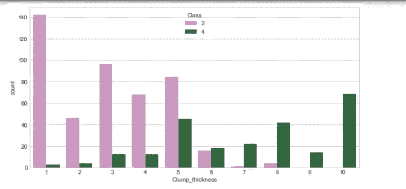

3.具有特征名称 Uniformity_cell_size

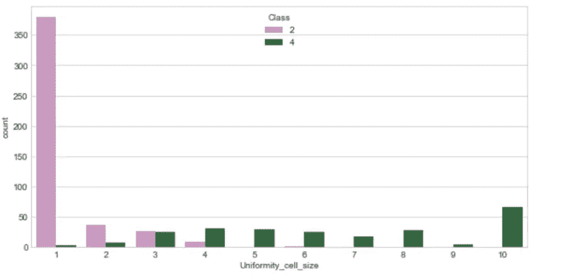

4.特征名为 Uniformity_cell_shape

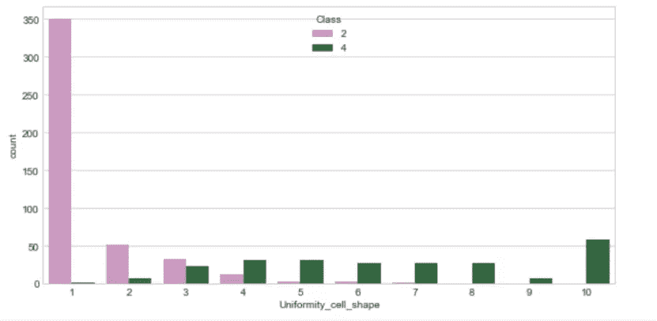

5.特征名为 Marginal_adhesion

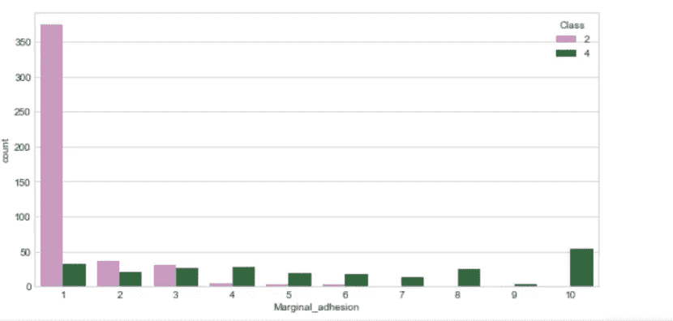

6.特征名称为单个单元大小

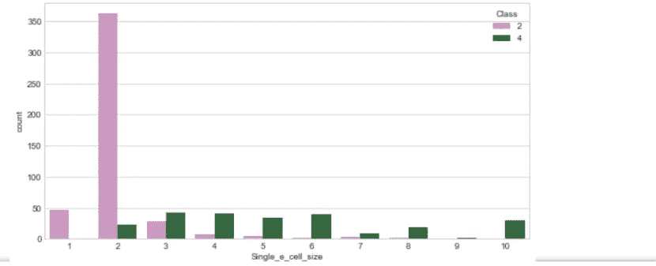

7.具有名为 Bare _ nuclei 功能

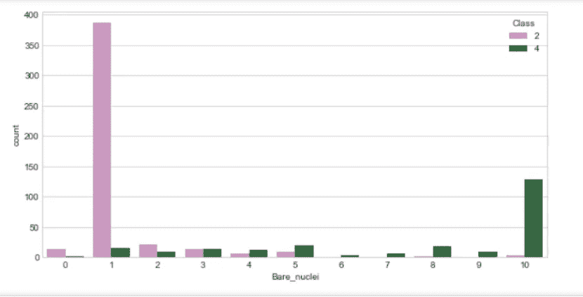

8.特征名为 Bland _ 染色质

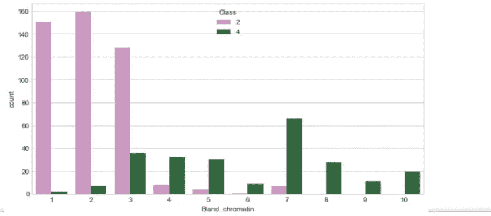

9.具有名为 Normal_nucleoli 特征

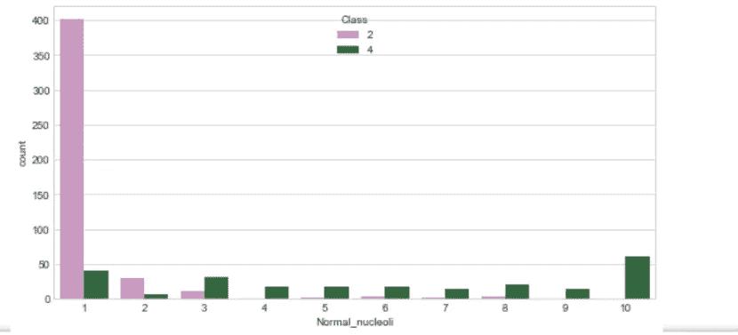

pair plot():pair plot 绘制数据集中的成对关系。pairplot 函数创建一个轴网格，这样数据中的每个变量将在 y 轴的一行中共享，在 x 轴的一列中共享。

要在数据集中绘制多个成对二元分布，可以使用 pairplot()函数。这将数据帧中变量(n，2)组合的关系显示为图的矩阵，对角线图是单变量图。

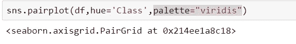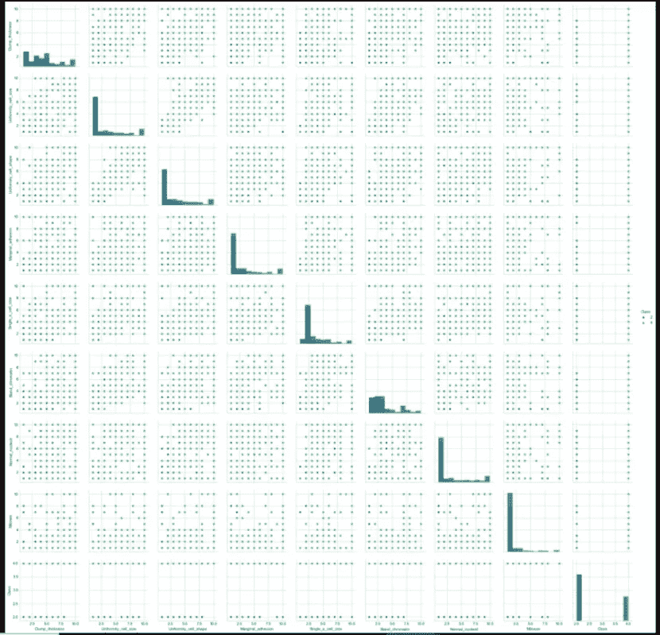

**现在，让我们检查一些关于数据集的统计信息:**

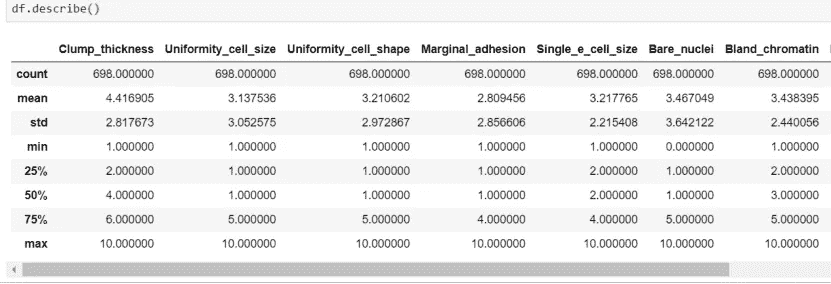

describe()describe()方法用于计算一些统计数据，如系列或数据帧的数值的百分位数、平均值和标准差。它分析数字和对象序列，以及混合数据类型的 DataFrame 列集。

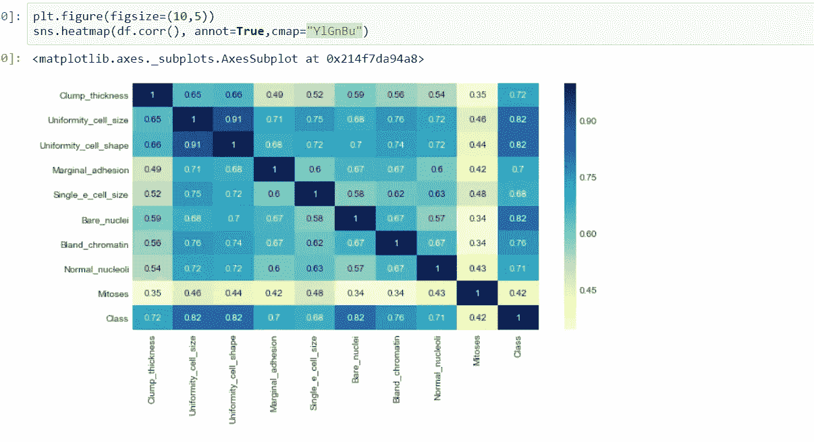

astype()方法用于将 pandas 对象转换为指定的 dtype。astype()函数还提供了将任何合适的现有列转换为分类类型的能力。

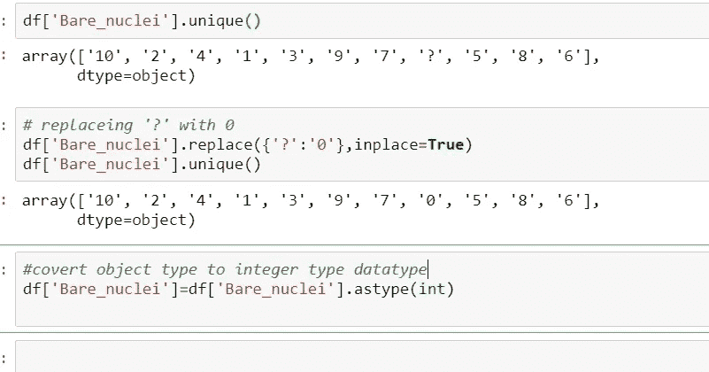

现在我们来区分因变量和自变量。

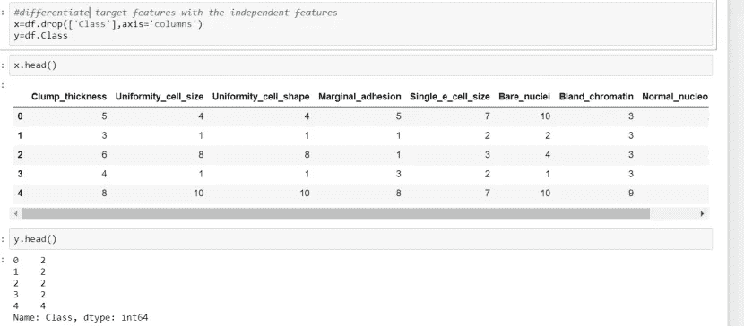

**缩放数据:**

通过计算训练集中样本的相关统计数据，对每个特征独立进行居中和缩放。然后，使用[变换](#sklearn.preprocessing.StandardScaler.transform)存储平均值和标准偏差，用于以后的数据。

数据集的标准化是许多机器学习估计器的常见要求:如果单个特征或多或少看起来不像标准的正态分布数据(例如，均值和单位方差为 0 的高斯数据)，它们可能表现不佳。

例如，学习算法的目标函数中使用的许多元素(如支持向量机的 RBF 核或线性模型的 L1 和 L2 正则化子)假设所有特征都以 0 为中心，并且具有相同顺序的方差。如果某个特征的方差比其他特征的方差大几个数量级，那么它可能会主导目标函数，使估计器无法像预期的那样正确地从其他特征中学习。

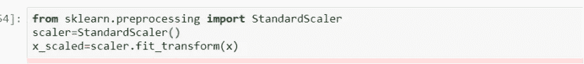

警察。DataFrame 是带有潜在不同类型的列的二维标记数据结构。你可以把它想象成一个电子表格或 SQL 表，或者一系列对象的字典。它通常是熊猫最常用的对象。

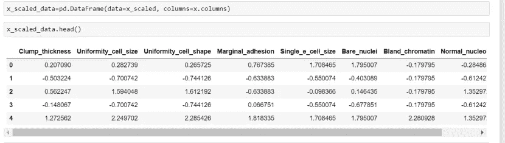

函数的作用是:打印一个数据帧的摘要。该方法打印关于数据帧的信息，包括索引数据类型和列数据类型、非空值以及内存使用情况。是否打印完整摘要。默认情况下，熊猫中的设置。

**造型:**

**train_test_split()** 是 Sklearn 模型选择中的一个函数，用于将数据阵列分成两个子集**:训练数据和测试数据。有了这个函数，就不需要手动划分数据集了。**

默认情况下，Sklearn train_test_split 会对这两个子集进行随机分区。但是，您也可以为操作指定随机状态。

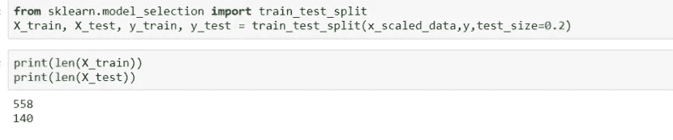

**决策树:**是一种受监督的机器学习(即你解释训练数据中的输入是什么，对应的输出是什么)，其中数据根据某个参数被连续分割。该树可以用两个实体来解释，即决策节点和树叶。树叶是决定或最终结果。决策节点是数据被拆分的地方。

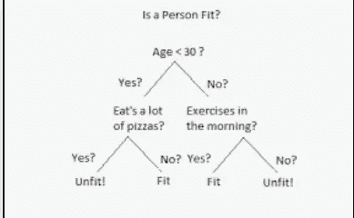

决策树的一个例子可以用上面的二叉树来解释。假设你想预测一个人是否适合给定他们的信息，如年龄，饮食习惯，体育活动等。这里的决策节点是像“年龄是多少？”这样的问题，‘他锻炼吗？’，'他吃很多披萨吗'？树叶是“健康”或“不健康”的结果。在这种情况下，这是一个二元分类问题(是非类型问题)。决策树主要有两种类型:

分类树(是/否类型)。

我们上面看到的是一个分类树的例子，其中的结果是一个变量，如“适合”或“不适合”。这里的决策变量是绝对的。

回归树(连续数据类型)

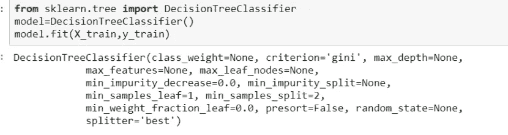

**混淆矩阵**是一个表格，通常用于描述一个分类模型(或“分类器”)对一组真实值已知的测试数据的性能。混淆矩阵本身相对容易理解，但相关术语可能会令人混淆。混淆矩阵是一种有用的机器学习方法，允许您测量召回率、精确度、准确度和 AUC-ROC 曲线。下面给出了一个例子，以了解术语真阳性，真阴性，假阴性和真阴性。真阳性:你投射了阳性，结果是真的。

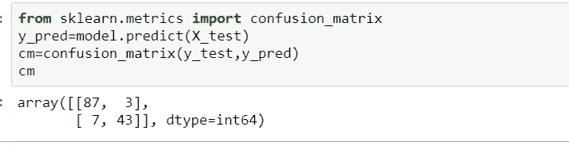

**分类报告**是关于分类问题中的关键指标。您将获得精确度、召回率、f1 分数以及对您尝试查找的每个类的支持。回忆的意思是“你在这个类的所有元素中找到多少个”。

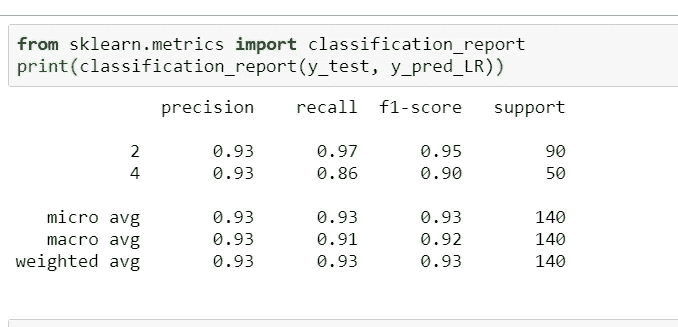

现在，让我们绘制混淆矩阵的热图()来可视化混淆矩阵。

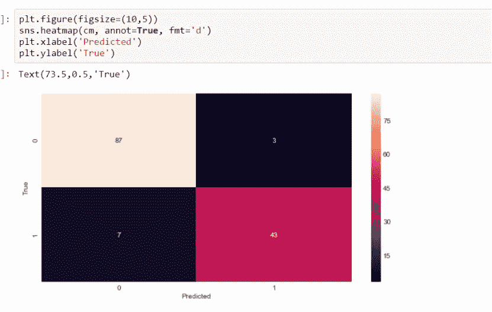

**模型的精度:**

**模型准确度**定义为模型正确预测的分类数除以预测总数。这是评估模型性能的一种方式，但肯定不是唯一的方式。

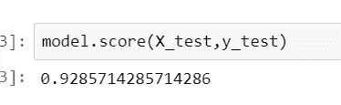

因此，我们可以得出结论，使用决策树是 0.928

**让我们用不同的算法检查随机森林分类器:**

**随机森林**是一种监督学习算法。它构建的“森林”是决策树的集合，通常用“打包”方法训练。bagging 方法的一般思想是学习模型的组合增加了整体结果。

随机森林是一种[监督学习算法](https://builtin.com/data-science/supervised-learning-python)。它构建的“森林”是决策树的集合，通常用“打包”方法训练。bagging 方法的一般思想是学习模型的组合增加了整体结果。

简单来说:随机森林建立多个决策树，并将它们合并在一起，以获得更准确和稳定的预测。

随机森林的一个大优势是它可以用于分类和回归问题，这形成了当前机器学习系统的大多数。让我们看看分类中的随机森林，因为分类有时被认为是机器学习的构建块。下面你可以看到有两棵树的随机森林的样子:

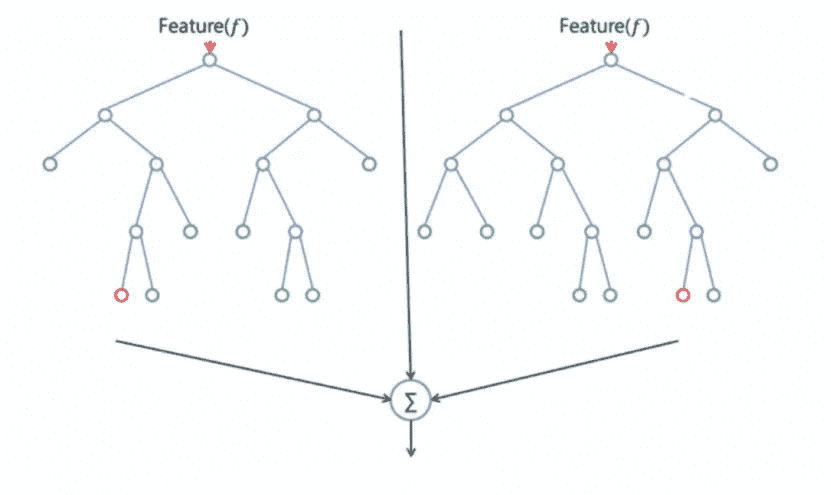

随机森林与决策树或 bagging 分类器具有几乎相同的超参数。幸运的是，没有必要将决策树与 bagging 分类器结合起来，因为您可以很容易地使用 random forest 的分类器类。使用随机森林，您还可以通过使用算法的回归器来处理回归任务。

随机森林增加了模型的随机性。它不是在分割节点时搜索最重要的特征，而是在随机的特征子集中搜索最佳特征。这导致了广泛的多样性，通常会产生更好的模型。

因此，在随机森林中，分裂节点的算法只考虑特征的随机子集。您甚至可以通过为每个特征额外使用随机阈值而不是搜索最佳阈值(像普通决策树一样)来使树更加随机。

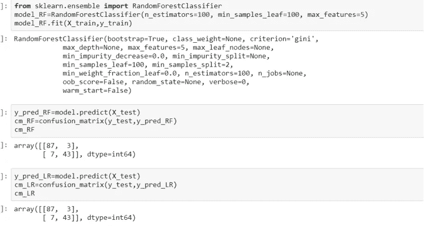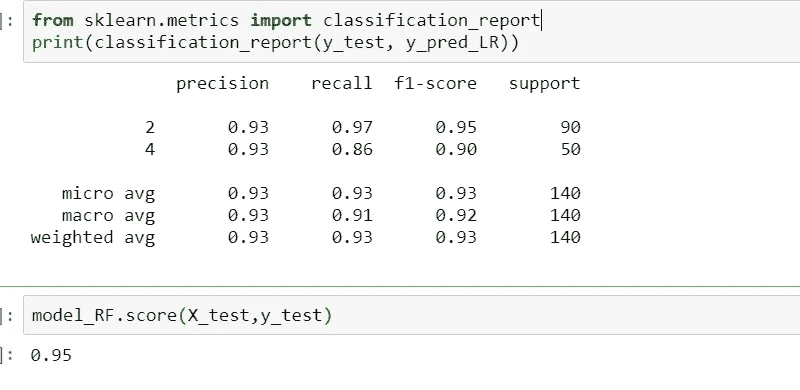

因此，通过使用 RandomForest 分类器，我们可以得出该模型的精度为 0.95。

现在，让我们绘制混淆矩阵的热图()来可视化混淆矩阵。

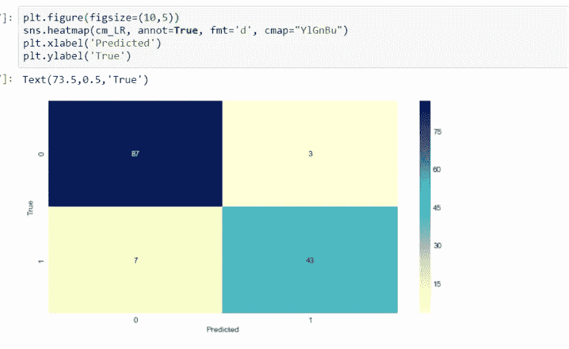

因此，我们可以得出结论，通过使用随机森林分类器，我们可以获得最大的准确性。

谢谢大家！！！一定要跟着喜欢！！