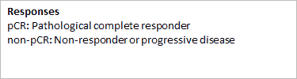
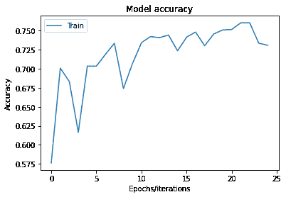
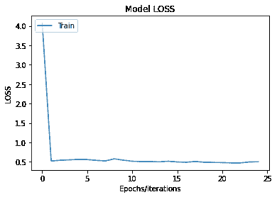

# 乳腺癌治疗反应分类

> 原文：<https://medium.com/nerd-for-tech/breast-cancer-treatment-response-classification-5e994b75fe4e?source=collection_archive---------22----------------------->

摘要

乳腺癌是一种在乳房组织中形成恶性(癌症)细胞的疾病。这可能发生在两性身上(男性和女性)。根据[世界卫生组织](http://www.who.int/en/)(世卫组织)的数据，乳腺癌是全球女性中最常见的癌症，每年夺去数十万女性的生命，并影响着处于各种现代化水平的国家。乳腺癌可以通过多种测试进行诊断，包括乳房 x 光片(X 射线)、超声波、核磁共振成像和活检。本文使用各种机器学习算法，如神经网络、主成分分析(PCA)、聚类等，将患者分类为新辅助化疗的 PCR 或非 PCR 应答者。&比较那些算法的准确性。

# 介绍

在美国，平均每两分钟就有一名女性被诊断出患有乳腺癌。在印度，每年检测出超过 100 万例乳腺癌。治疗乳腺癌有许多方法，包括:

*   **手术**:医生切除癌组织的手术。
*   **化疗:**使用特殊药物缩小或杀死癌细胞。这些药物可以是你服用的药片或静脉注射的药物，有时两者都有。
*   **激素疗法:**阻止癌细胞获得它们生长所需的激素。
*   **生物疗法**:与你身体的免疫系统一起工作，帮助它对抗癌细胞或控制其他癌症治疗的副作用。
*   **放射疗法**:利用高能射线(类似 X 射线)杀死癌细胞。

目前使用的新型化疗是新辅助化疗。它被设计成在手术切除肿瘤之前使用，并受到了极大的关注。目前，新辅助化疗被提供给患有局部晚期乳腺癌的患者，以及那些在保守治疗前可能受益于体积缩小的乳腺癌患者。

新辅助化疗可能能够缩小一个较大的肿瘤，因此乳房肿瘤切除术加放射治疗成为一种选择，而不是乳房切除术。新辅助化疗也可用于腋下淋巴结肿大的女性，因为乳腺癌已扩散至这些淋巴结。

病理完全缓解(pCR)被定义为新辅助化疗完成后乳腺中所有浸润性癌的消失，尽管一些作者也要求清除腋窝淋巴结中的残留疾病(von Minckwitz 等人，2012)。已证实 pCR 的实现增加了总生存率和无病生存率，在三阴性和 ER-/HER2+患者中获益最大。

无应答或进行性疾病(非 PCR)发生在三阴性乳腺癌新辅助化疗后未达到病理完全应答的高危患者中。现在有足够的证据表明，如果新辅助化疗导致完全的病理反应，患者将享有更好的结果。因此，评估对新辅助化疗的反应程度对患者的选择和每个患者的随访管理具有重要影响，并决定了患者的预后。

本研究的目的是使用图像识别算法和其他机器学习算法来识别和预测 pCR 或非 pCR 反应。

# 资料组

从 [*癌症影像存档(TCIA)公共访问*](https://wiki.cancerimagingarchive.net/) 获得的数据集信息总结在下表中:

应答者计数非 PCR/有癌 39 PCR/无癌 20 总样本 59

这里的计数代表文件夹的数量，因此非 PCR 有 39 个文件夹，代表 39 个不同的患者&它有许多子文件夹，其名称为我们提供了 CT 扫描的日期和时间，每个子文件夹有 83 个不同角度的乳腺癌图像。

该集合包含纵向 PET/CT 和定量 MR 图像，用于研究乳腺癌新辅助治疗中的治疗评估。PET/CT 图像是使用内部内置的支持设备采集的，以允许患者处于俯卧位，从而便于与 MRI 数据进行配准。

# 数据集的详细描述

**收集统计描述**研究数量 214 系列数量 530 参与人数 68 图像数量 10835 模式 MR、PET、CT 图像大小(GB)11.286

我们随机选择数据集，总共获得 4149 张图像，并在将它们运行到机器学习模型之前，将它们分成以下几组

**数据分割图像计数占总数据的百分比**训练总计 149482%测试总计 3328%总计 1826100%

在(训练/测试)中拍摄的总图像及其子文件夹数量如下所示:

1.  列车图像

**患者 IDResponseStatusNo。文件夹编号 N * 83**QIN-BREAST-01–0001 non-pcrtrain 3249 QIN-BREAST-01–0005 non-pcrtrain 3249 QIN-BREAST-01–0011 non-pcrtrain 3249 QIN-BREAST-01–0010 PCR train 3249 QIN-BREAST-01–0013 PCR train 3249 QIN-BREAST-01–017 pcrtrain 3249

1.  测试图像

**患者 IDResponseStatusNo。文件夹编号 N * 83**QIN-BREAST-01–0016 non-PCR tes 183 QIN-BREAST-01–0035 non-PCR tes 183 QIN-BREAST-01–0006 PCR tes 183 QIN-BREAST-01–0024 PCR test 183

我们的图像的形状是 512 X 512。

# 方法:

使用各种机器学习算法来完成两个响应者之间的分类，例如:

1.  **主成分分析(PCA) :** 实 p 空间中的点的集合的主成分是方向向量的序列，其中向量是最适合数据的线的方向，同时与第一向量正交
2.  **Logistics regression (LR) :** 这是一种统计模型，其基本形式使用逻辑函数来模拟二元因变量，尽管存在许多更复杂的扩展。在回归分析中，逻辑回归(或 logit 回归)是估计逻辑模型的参数(二元回归的一种形式)。在统计学中，逻辑模型用于模拟某一类别或事件存在的概率，如通过/失败、赢/输、活着/死了或健康/生病。
3.  **神经网络(NN) :** 神经网络是一系列算法，通过模拟人脑运作方式的过程，努力识别一组数据中的潜在关系。
4.  **KNN :** K 最近邻是一种简单的算法，它存储所有可用的案例，并基于相似性度量(例如，距离函数)对新案例进行分类。
5.  **支持向量机(SVMs) :** 这是一种强大而灵活的监督机器学习算法，可用于分类和回归。但一般都是用在分类问题上。
6.  **聚类技术:**
7.  **层次聚类**:层次聚类，也称为层次聚类分析，是一种将相似的对象分组为称为聚类的组的算法。端点是一组群集，其中每个群集都不同于其他群集，并且每个群集内的对象大体上彼此相似。

# 结果

在我们透露结果之前，重要的是要注意我们为什么认为准确性正在到来的几个原因如下。本项目中使用的图像是 dicom 图像，在 python 中使用时，dicom 图像的准确度和精度会降低。尤其是对于像新辅助化疗的 PCR 或非 PCR 应答者之间的差异这样精确的事情。此外，Google Colab 只提供了 12.72 GB 的空闲内存，因此，尽管我们有一个非常丰富和广泛的数据库，但我们只能使用其中的一部分，这导致了数据图像的变形。我们相信，通过更好的 RAM 可访问性和更精确地读取 python 中的 dicom 图像，这些模型可以提供更好的结果。

我们在各个算法中的精度如下:

1.  **主成分分析(PCA) :** 我们把特征的数量从 262144( 512*512)减少到了 100。即使有 100 个特征，我们得到的累积解释比率(方差)为【0.9014066901109175。
2.  **逻辑回归(LR) :** 我们在逻辑回归模型上训练我们的数据集，发现准确率为 0.5542168674698795 (55.4%)。这个模型耗时 130.24 秒。
3.  **神经网络(NN) :** 我们的神经网络有两层。第一层具有激活函数“relu ”,第二层具有激活函数 sigmoid。通过多次试验和错误，我们发现，随着层数的增加，我们的精度下降，因此我们只坚持这两层。在对我们的神经网络进行 20 个时期的训练之后，我们得到了 0.8078 (80%)的训练精度和 0.6416 (64%)的测试精度。这花了 313.6 秒。

1.  **KNN :** 使用 KNN 我们得到的准确率为 0.40963855421686746 (41%)，耗时为 55.5496000000008(56 秒)。
2.  **支持向量机(SVMs) :** SVM 的准确率为 0.5602409638554217 (56%)，耗时 564.104367 秒(9 分钟)。
3.  **聚类技术:**
4.  **层次聚类**:在执行 n_clusters 等于 2 的层次聚类之后，我们在训练数据集上获得了 0.6191432396251674 (62%)的准确度，在测试数据集上获得了 0.25 (25%)的准确度。

# 结论和未来范围

最后，在这个项目中，我们将多种机器学习技术应用于乳腺癌的 dicom 图像数据集。具体地将患者分类为新辅助化疗的 PCR 或非 PCR 反应者。我们发现，结果的准确性不是很高，但鉴于 RAM 的限制和如此详细的图像的低精度，分析必然会有重大损失。

这项研究的未来范围首先是获得足够的 RAM 来处理如此大量和丰富的数据。第二种方法是使这个图像更具体地反映变化的区域，以帮助进行更精确的分析。我们将进一步考虑乳腺癌的不同参数，并将它们纳入我们的分析中。与此同时，我们还想探索医学图像分析的其他缺点。