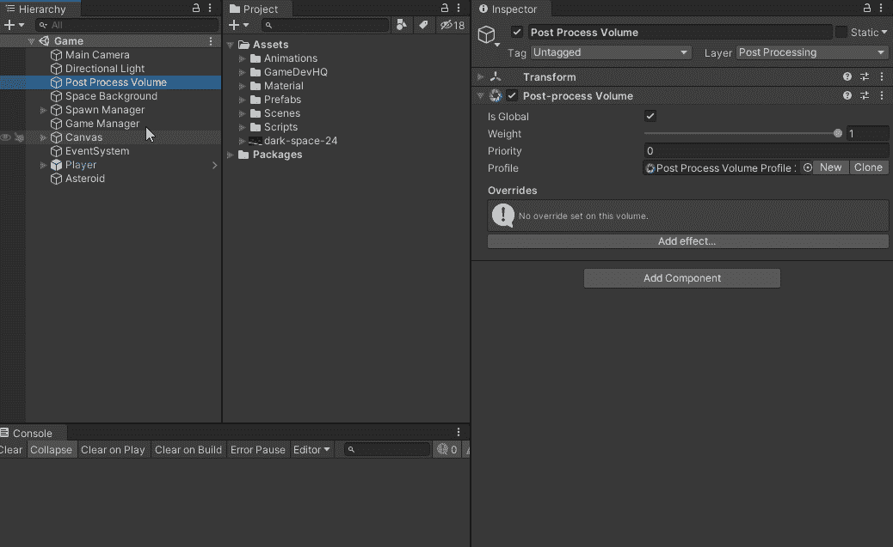
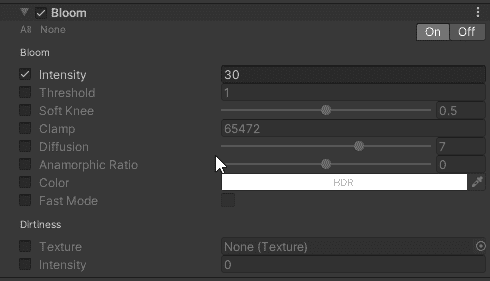
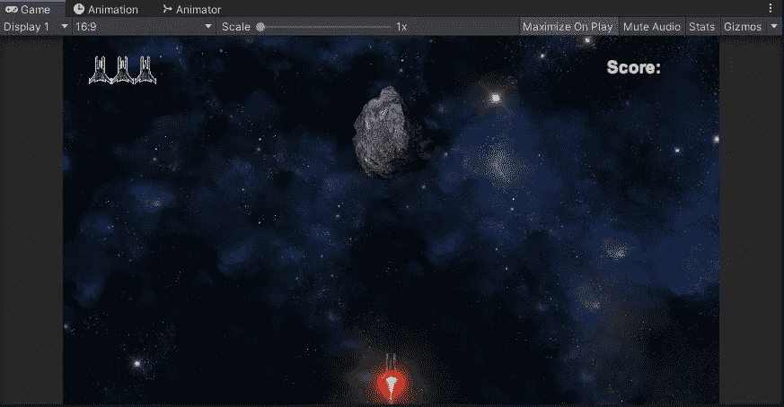
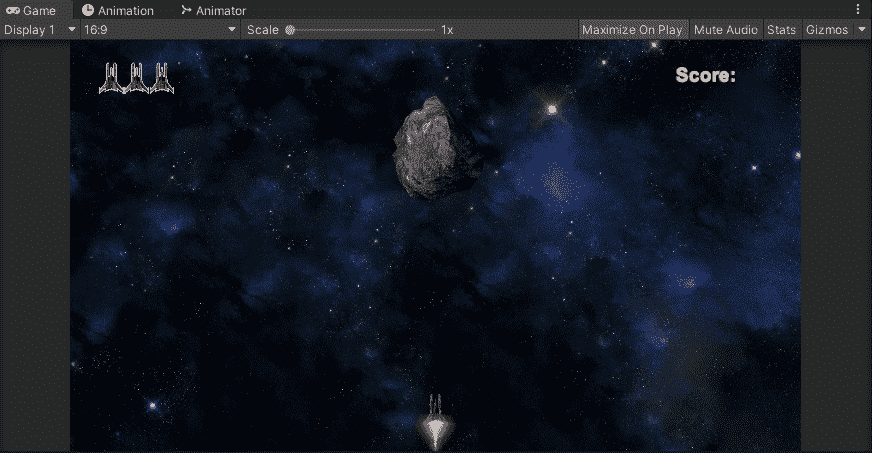
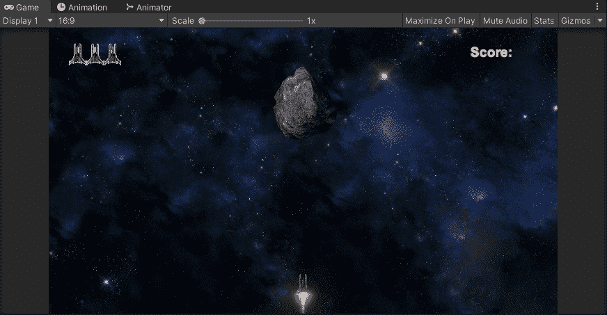

# 通过 Unity 的后期处理将你的游戏提升到 AAA 级

> 原文：<https://medium.com/nerd-for-tech/bring-your-game-to-aaa-status-through-post-processing-in-unity-ca2df8d2ef87?source=collection_archive---------20----------------------->

**目标**:以我们简单的 **2D 银河射手**在 **Unity** 中，并为其添加了**后期处理**效果，使其更上一层楼。

现在我们已经为我们的游戏设置了**后期处理**，是时候运行我们可用的效果之一来将我们美丽的场景带到下一个级别。让我们从如何给你的**后处理体积**游戏对象添加效果开始。确保在**层级**中选中，然后在**检查器**中点击**后处理体积**组件下的**添加效果**。让我们先来看看**绽放**！

## 花

布鲁姆给人一种极其明亮的光的错觉。这是一种增强场景视觉氛围的奇妙方式，在我的游戏中，我将使用 **Bloom** 来调整云层中的光线强度，并使用玩家的引擎推进器来产生更亮的光线，给我们一些相对于黑暗场景的对比。

首先，确保您已经在**层级**中选择了**后处理量**游戏对象，我们将在这个**后处理量**组件中添加一个效果:

要在**场景**中调整**强度**，请确保勾选该框，您可以硬编码一个您想要的 ***数字，例如*** *5、10、15、20 等*，并注意到**游戏**场景的变化，或者更好的是，您可以使用位于**强度**文字和数字框之间的拖动功能，如下所示

现在让我们来看看**强度为 0**和**强度为 50** **强度为**的场景之间的区别。请注意更亮的星星和玩家推进器，因为它们倾向于粉红色/红色色调:

0 强度

显示亮度渐变的更好方法是通过拖动功能:

这在**小行星**和**敌人爆炸**中也很明显，因为火焰变成了更加强烈的红色:

