# 通过 Unity 的后期处理让你的游戏达到 AAA 级

> 原文：<https://medium.com/nerd-for-tech/bringing-your-game-to-a-aaa-status-through-post-processing-in-unity-276073f5827d?source=collection_archive---------11----------------------->

## 统一指南

## 一个关于 Unity 中后期处理效果的指南，让你的游戏达到 AAA 级

**目的**:使用 Unity 中的后期处理特效，升级一款 Unity 中太空射击游戏的外观。

在我的上一篇文章中，我介绍了[如何在 Unity](/nerd-for-tech/start-using-post-processing-in-unity-9b081da8f6a7) 中开始使用后期处理。现在是时候使用一些后期处理效果让我的太空射击游戏看起来更好了。

# 后处理效果

## 环境遮挡

环境遮挡提供了一种在游戏中用相应的灯光设置真实阴影的方法。这种效果是为了在 3D 环境中使用，所以我不会在我的太空射击游戏中使用它。以下是可以在组件中启用的属性:

将环境光遮挡效果添加到后处理体积组件中。

如果你想知道更多关于后处理效果的信息，你可以访问 Unity 文档:

 [## 环境遮挡

### 环境遮挡效果计算场景中暴露于环境照明的点。然后它变暗了…

docs.unity3d.com](https://docs.unity3d.com/Packages/com.unity.postprocessing@3.1/manual/Ambient-Occlusion.html) 

## 抗锯齿

抗锯齿提供了一种方法来柔化场景的边缘，使它们看起来更平滑。Unity 中有 3 种抗锯齿模式:

*   快速近似反走样(FXAA)

它通常用于手机和主机游戏。

*   亚像素形态抗锯齿(SMAA)

它通常用于主机游戏。

*   时间抗锯齿(TAA)

它通常用于桌面和主机游戏。

我可能会使用 FXAA，因为我将推出一个移动平台的游戏。

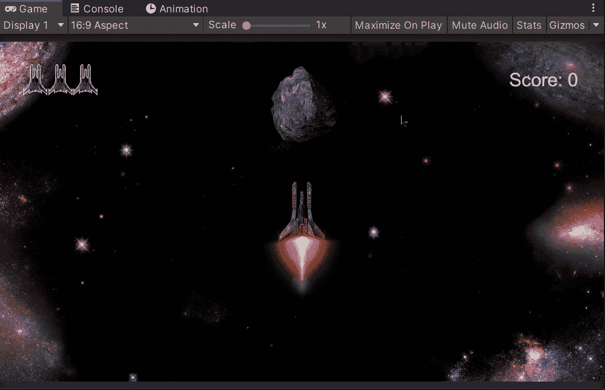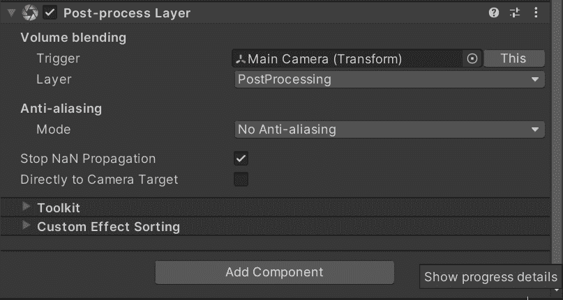

如果你想知道更多关于后处理效果的信息，你可以访问 Unity 文档:

 [## 抗锯齿

### 抗锯齿效果会柔化场景中边缘的外观。为了做到这一点，它用类似的…

docs.unity3d.com](https://docs.unity3d.com/Packages/com.unity.postprocessing@3.1/manual/Anti-aliasing.html) 

## 自动曝光

自动曝光提供了一种实时调整游戏不同亮度配置的方法。这类似于眼睛或数码相机在光线变化时产生的效果。

这种效果通常用于相机移动时光线变化的游戏，但在我的太空射击游戏中相机是静态的(目前)，所以我现在不会使用它。

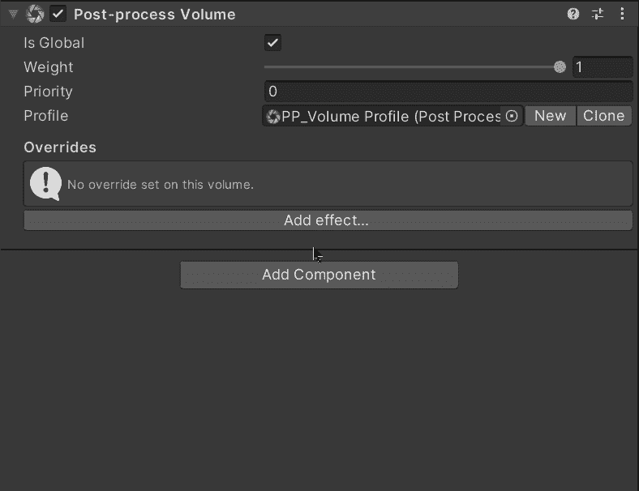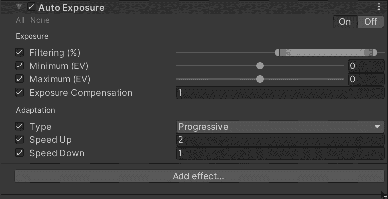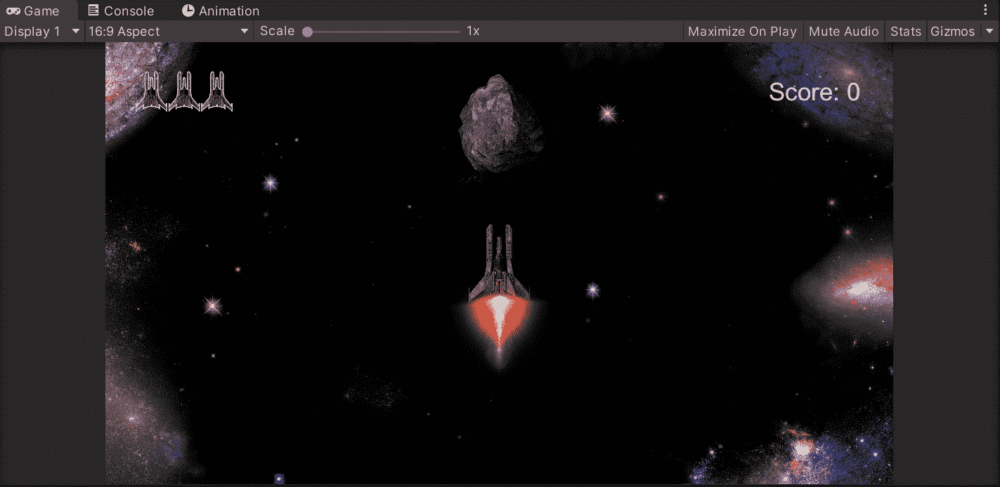

当修改自动曝光属性时，我们可以看到它是如何影响灯光效果的。

如果你想知道更多关于后处理效果的信息，你可以访问 Unity 文档:

 [## 自动曝光

### 自动曝光效果模拟人眼如何实时调整亮度变化。为此，它…

docs.unity3d.com](https://docs.unity3d.com/Packages/com.unity.postprocessing@3.1/manual/Auto-Exposure.html) 

## 花

Bloom 提供了一种在游戏的明亮区域显示某种辉光的方法。这类似于数码相机对着强光拍摄时的效果。

Bloom 也可以提供 dirty 特征，它使用纹理来衍射 Bloom 效果。肮脏的一个例子可能是在雨中用数码相机拍摄的光线，这样镜头会显示水的折射效果。

我可能会在我的太空射击游戏中使用布鲁姆效果，用另一种强度更大的 HDR 颜色让它看起来更亮。

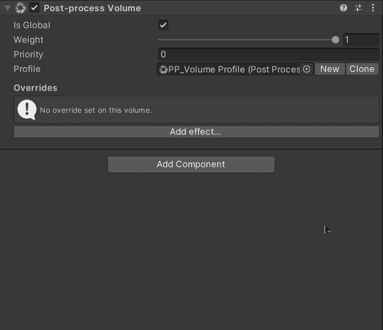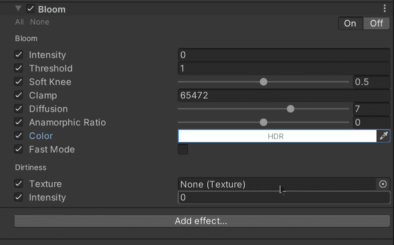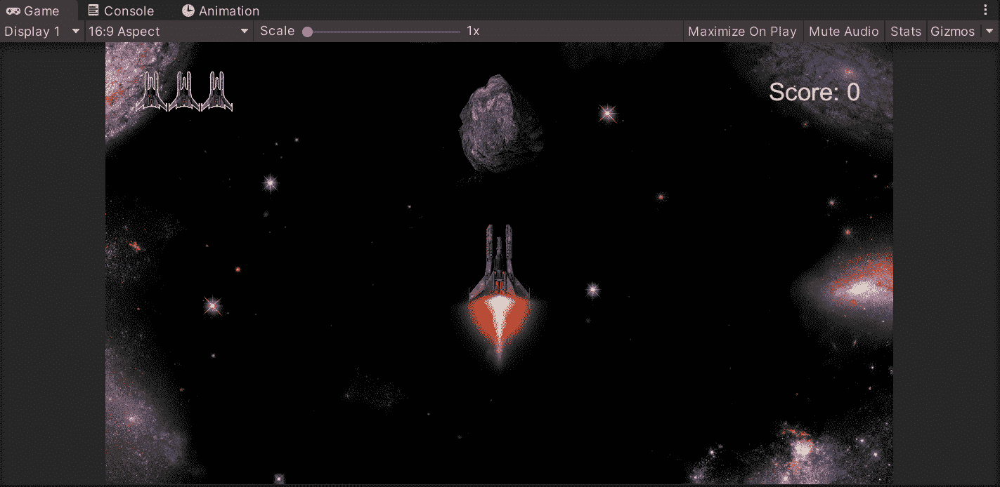

使用不同颜色的高光效果，比如绿色，让游戏看起来更有未来感。

如果你想知道更多关于后处理效果的信息，你可以访问 Unity 文档:

 [## 花

### 光晕效果使图像中的明亮区域发光。为了做到这一点，它创造了光的条纹，从明亮的…

docs.unity3d.com](https://docs.unity3d.com/Packages/com.unity.postprocessing@3.1/manual/Bloom.html) 

## 色差

色差提供了一种沿图像边界分割 RGB 通道中颜色的方法。这类似于当光线在镜头中折射和分散波长时相机产生的效果。

您也可以选择使用不同的纹理来定义用于分割图像范围内的颜色的颜色。

我可能会在我的太空射击游戏中使用色差效果来制作玩家在太空中的初始或最终过渡。

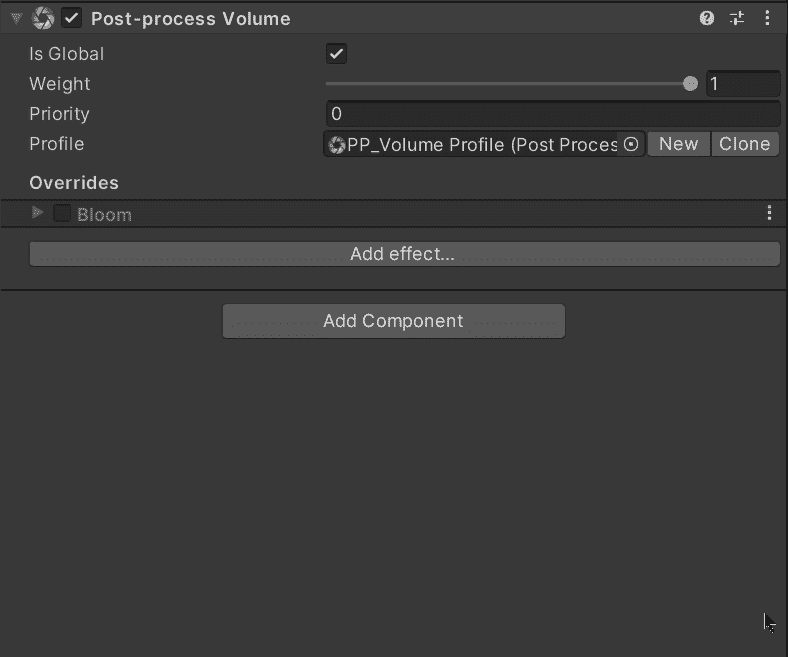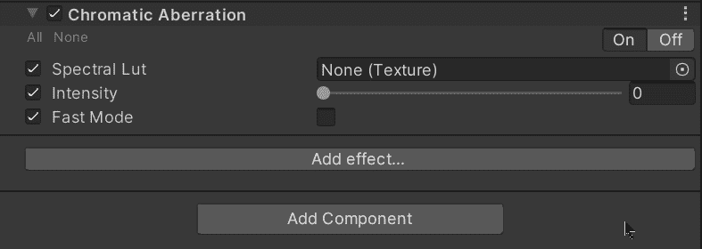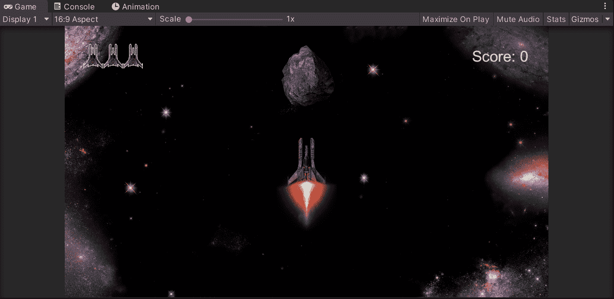

色差效应让我的飞船看起来更快。

如果你想知道更多关于后处理效果的信息，你可以访问 Unity 文档:

 [## 色差

### 色差效果将图像中的颜色沿边界分成红色、绿色和蓝色通道…

docs.unity3d.com](https://docs.unity3d.com/Packages/com.unity.postprocessing@3.1/manual/Chromatic-Aberration.html) 

## 颜色分级

颜色分级提供了一种方法来修改游戏中图像的颜色和亮度。你可以用它来修改你的游戏，就像在 Photoshop 或者其他版本的软件中一样。

颜色分级有 3 种模式:

*   低清晰度范围(LDR):

它通常用于低端平台，如手机或游戏机。

*   高清晰度范围(HDR):

它通常用于支持 HDR 渲染的平台。

*   外部:

它与来自外部软件的自定义 3D 查找表(lut)一起使用。

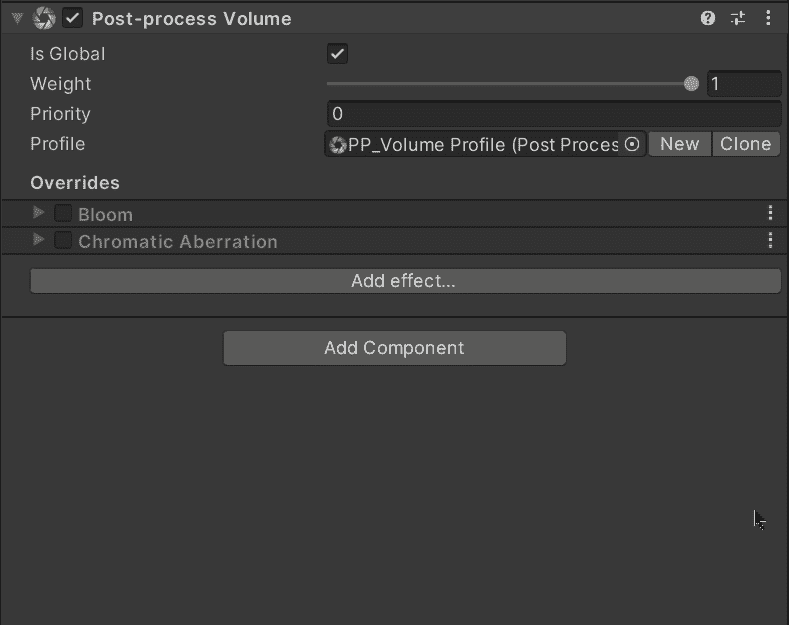

添加颜色分级效果。

在这种情况下，我将选择使用 HDR 使游戏看起来更好，但正如你所看到的，这个消息出现:

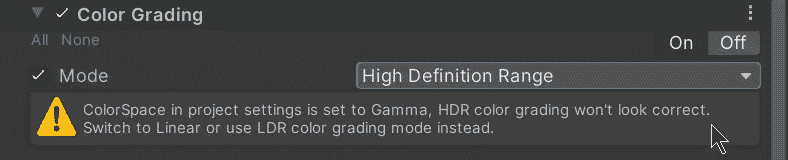

因此，为了将我的色彩空间变为线性，我需要:

*   打开构建设置
*   打开播放器设置
*   在其他设置中选择不同的色彩空间

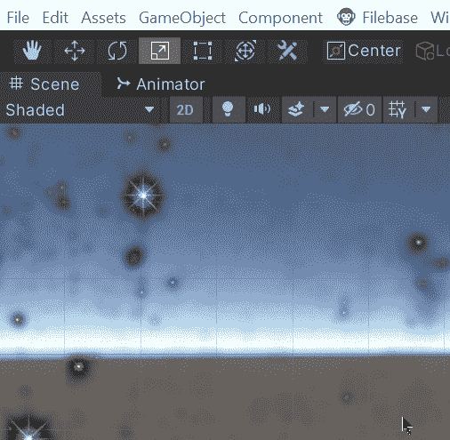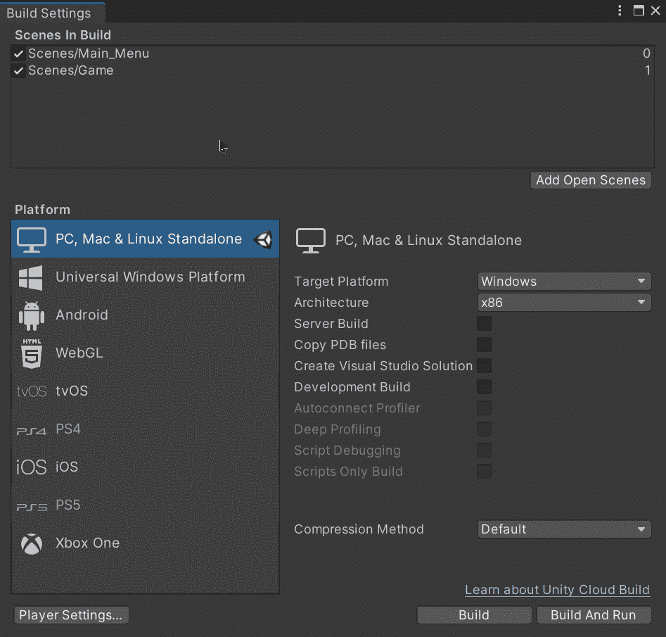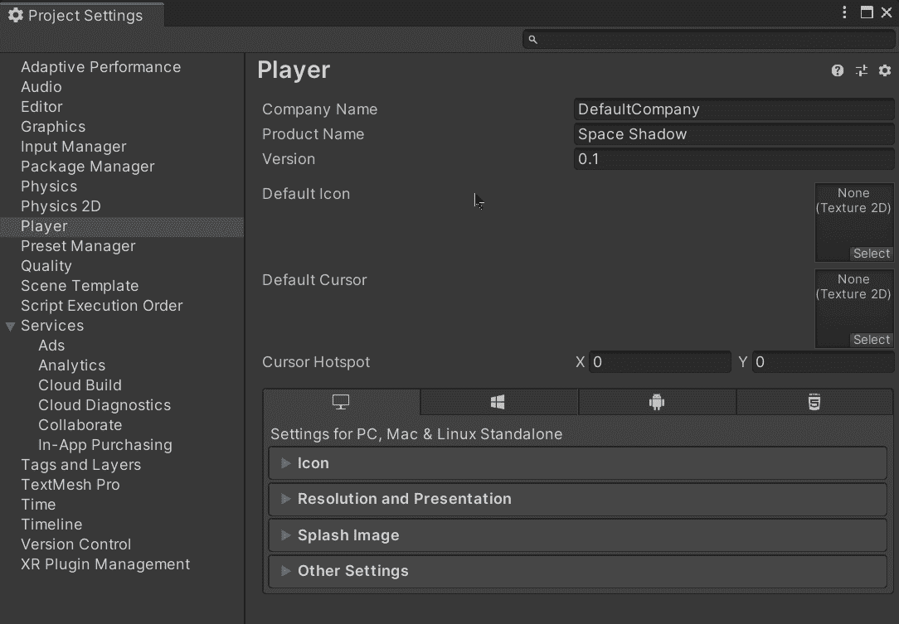

现在，我可以开始修改颜色分级效果的属性，以改变我的太空射击游戏的外观和感觉:

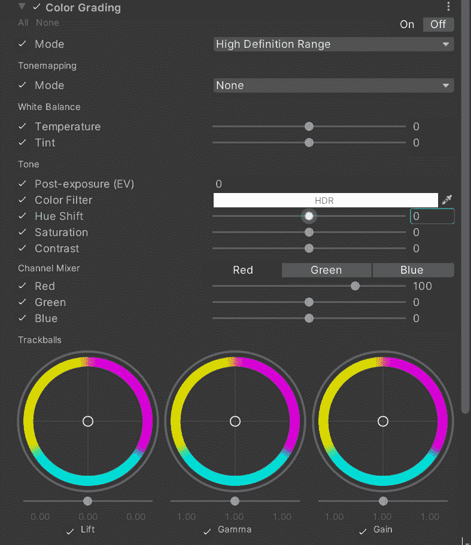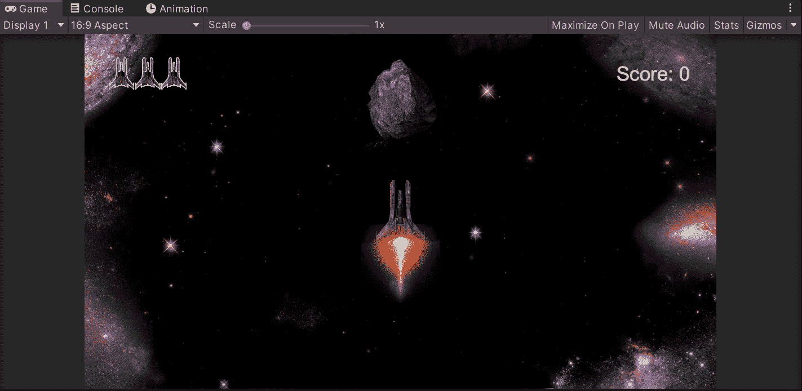

如果你想知道更多关于后处理效果的信息，你可以访问 Unity 文档:

 [## 颜色分级

### 颜色分级效果会改变或校正 Unity 生成的最终图像的颜色和亮度。你可以用…

docs.unity3d.com](https://docs.unity3d.com/Packages/com.unity.postprocessing@3.1/manual/Color-Grading.html) 

## 景深

景深提供了一种模糊游戏背景的方法，同时前景中的对象保持聚焦。这类似于相机镜头的聚焦特性。

由于我的 2D 太空射击游戏使用精灵，景深效果将适用于所有的精灵，它不会实现预期的效果。这应该使用着色器来实现，而不是使用这个效果，因此我不会使用它。

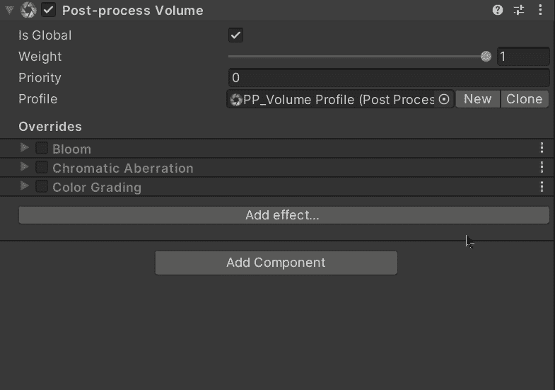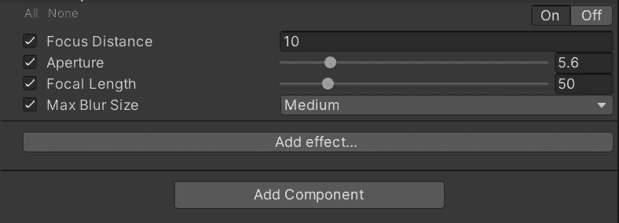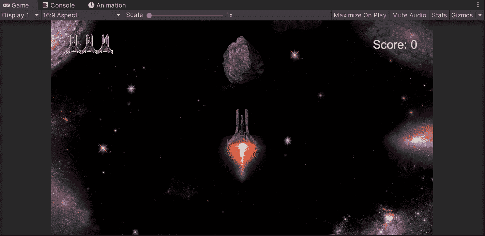

景深效果适用于我的场景中几乎所有的精灵(ui 是例外)。

如果你想知道更多关于后处理效果的信息，你可以访问 Unity 文档:

 [## 景深

### 景深效果模糊了图像的背景，而前景中的对象保持在焦点上。这个…

docs.unity3d.com](https://docs.unity3d.com/Packages/com.unity.postprocessing@3.1/manual/Depth-of-Field.html) 

## 小麦

“颗粒”提供了一种将胶片噪点应用到图像中的方法。这类似于相机产生的效果，当胶片中的小颗粒使图像看起来未经处理。

由于颗粒效果使游戏看起来有点老，我决定不在我的太空射击游戏中使用它。

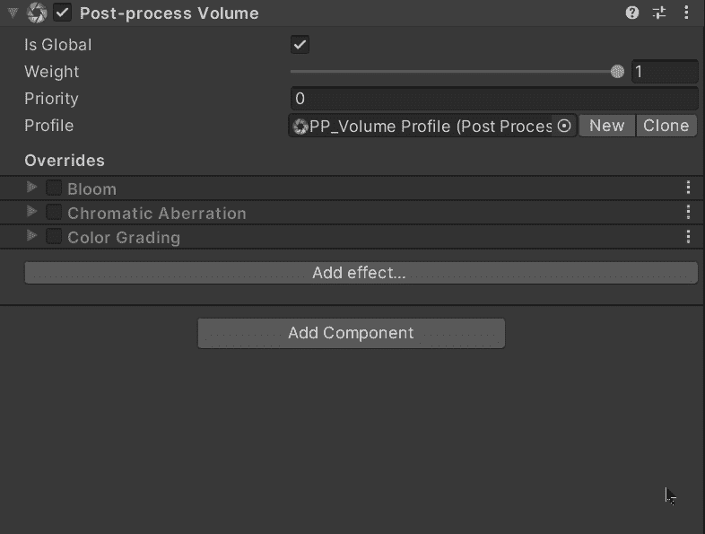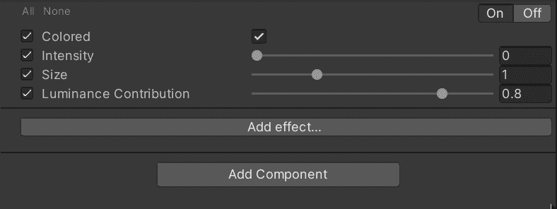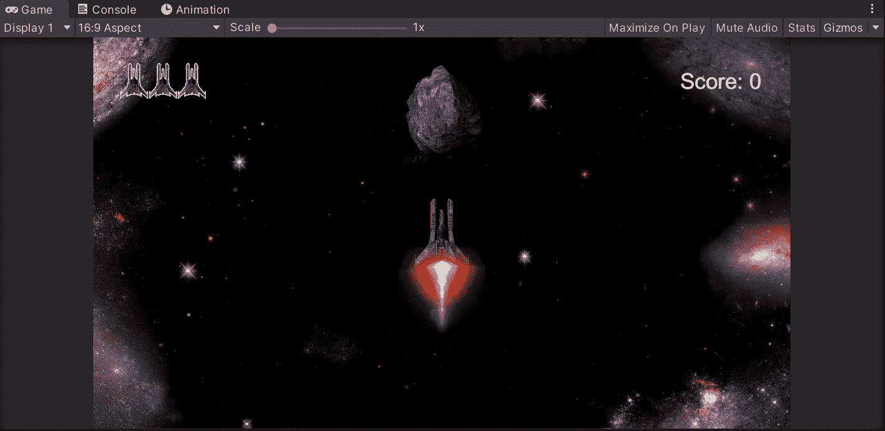

如果你想知道更多关于后处理效果的信息，你可以访问 Unity 文档:

 [## 小麦

### 该效果会将胶片噪点叠加到您的图像上。胶片噪音是现实世界中的相机在小…

docs.unity3d.com](https://docs.unity3d.com/Packages/com.unity.postprocessing@3.1/manual/Grain.html) 

## 透镜畸变

镜头变形提供了一种在游戏中模拟变形的方法。这类似于相机镜头的形状所产生的效果。

我可以用这个效果让我的飞船进入场景内部或外部，就像光速跳跃或类似的动作。

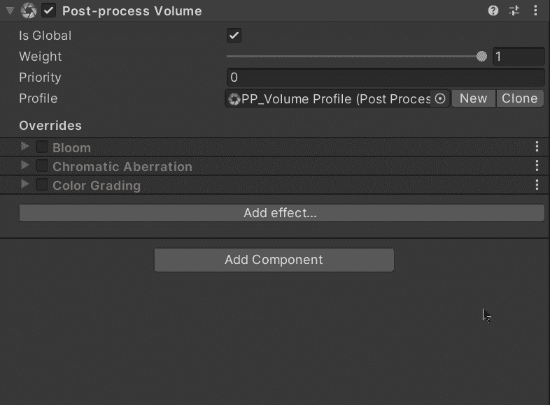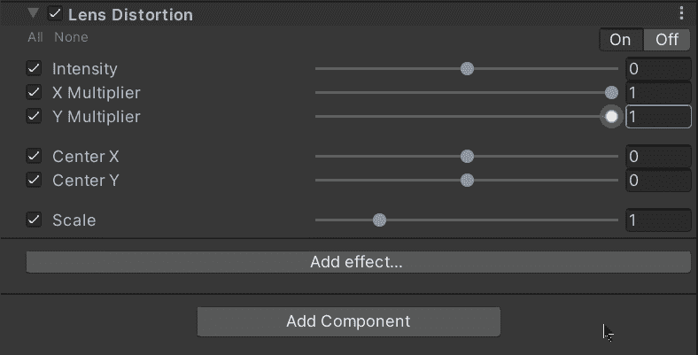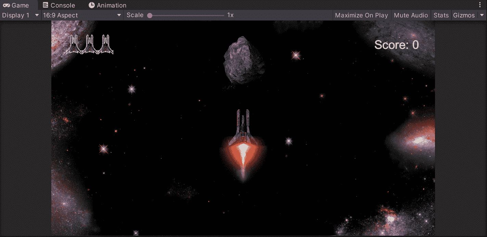

如果你想知道更多关于后处理效果的信息，你可以访问 Unity 文档:

 [## 透镜畸变

### 镜头扭曲效果模拟由真实世界相机镜头的形状引起的扭曲。你可以调整…

docs.unity3d.com](https://docs.unity3d.com/Packages/com.unity.postprocessing@3.1/manual/Lens-Distortion.html) 

## 运动模糊

运动模糊提供了一种根据摄像机的方向实时模糊游戏的方法。这类似于当相机比另一个被记录的对象移动得更快时相机产生的模糊效果，反之亦然。

由于我的太空射击游戏使用静态相机，我决定不使用这种效果。

如果你想知道更多关于后处理效果的信息，你可以访问 Unity 文档:

 [## 运动模糊

### 运动模糊效果在相机移动的方向上模糊图像。这模拟了模糊效果…

docs.unity3d.com](https://docs.unity3d.com/Packages/com.unity.postprocessing@3.1/manual/Motion-Blur.html) 

## 屏幕空间反射

屏幕空间反射提供了一种创建类似于潮湿地板表面或水坑的真实反射的方法。

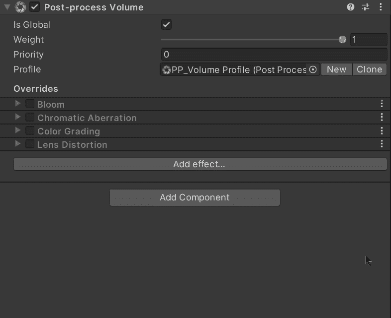

因为它打算在有湿地板或水坑的 3D 游戏中使用，所以我不会在我的太空射击游戏中使用它。

如果你想知道更多关于后处理效果的信息，你可以访问 Unity 文档:

 [## 屏幕空间反射

### 屏幕空间反射效果创建模拟潮湿地板表面或水坑的细微反射。它反映了…

docs.unity3d.com](https://docs.unity3d.com/Packages/com.unity.postprocessing@3.1/manual/Screen-Space-Reflections.html) 

## 小插图

晕影提供了一种使游戏边缘变暗的方法。这类似于相机镜头使用堆叠滤镜时产生的效果。集中游戏的注意力是有效的。

使用这种效果的一个很好的例子是当玩家进入一个洞穴或一个封闭的空间，而这个空间在游戏中不会提供太多的光线。我可能不会在我的太空射击游戏中使用这种效果，除非我需要将注意力转移到图像中心的玩家。

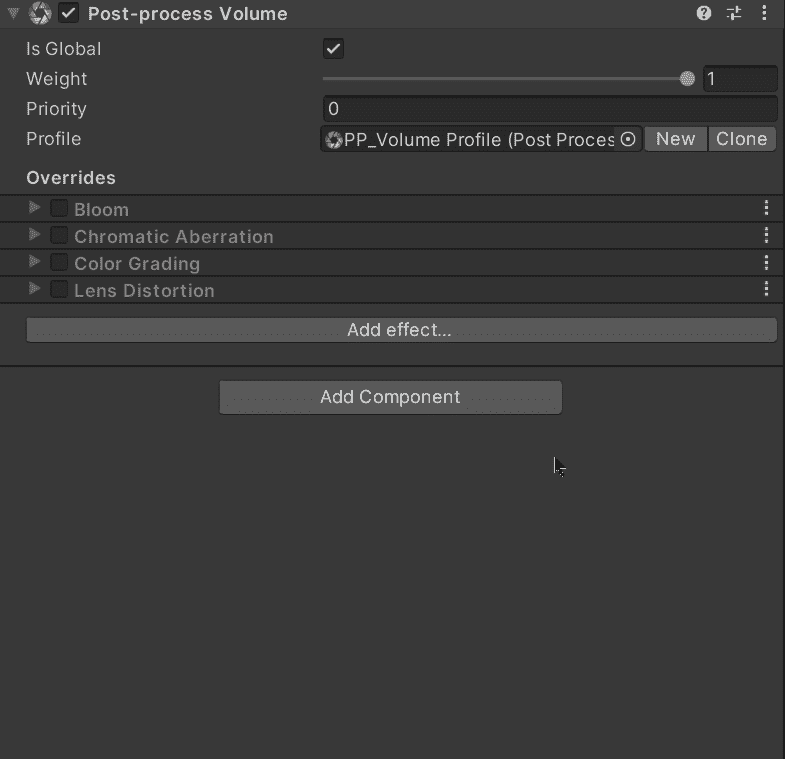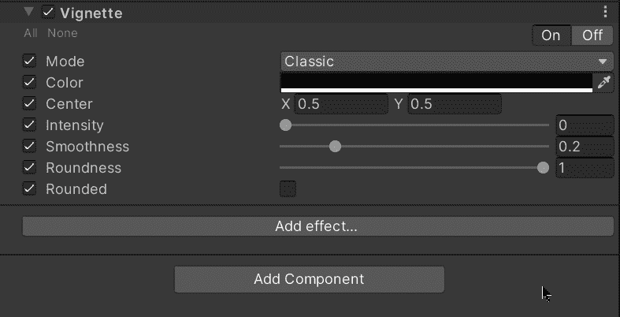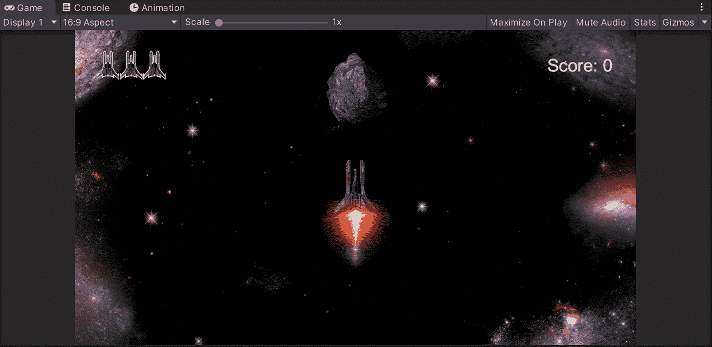

如果你想知道更多关于后处理效果的信息，你可以访问 Unity 文档:

 [## 小插图

### 这种效果会使图像的边缘变暗。这模拟了在真实世界的相机镜头中由厚或…

docs.unity3d.com](https://docs.unity3d.com/Packages/com.unity.postprocessing@3.1/manual/Vignette.html) 

# 新气象

我可以使用上面的一些效果来制作我的游戏:

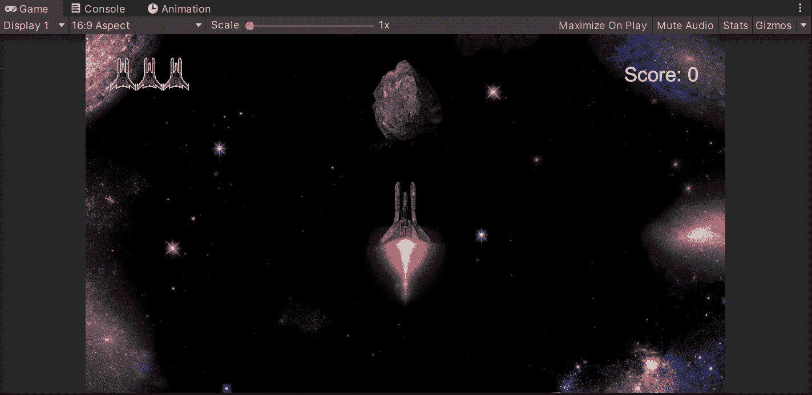

对此:

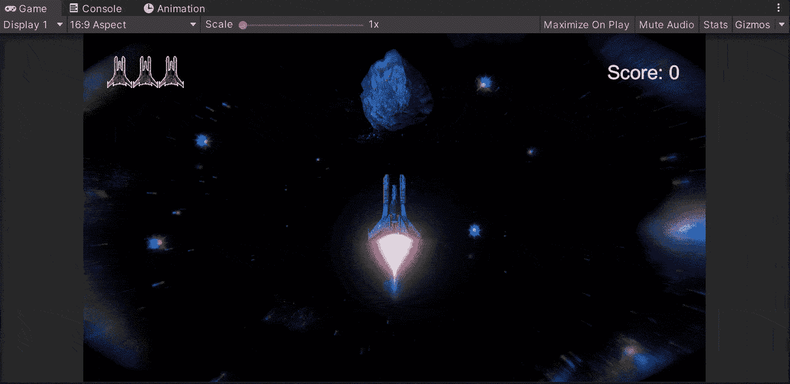

而就是这样，你可以在 Unity 中使用一些后期处理效果让你的游戏更上一层楼！:d .我会在下一篇文章中看到你，在那里我将展示如何开始在 Unity 中使用声音。

> *如果你想更多地了解我，欢迎登陆*[***LinkedIn***](https://www.linkedin.com/in/fas444/)**或访问我的* [***网站***](http://fernandoalcasan.com/) *:D**