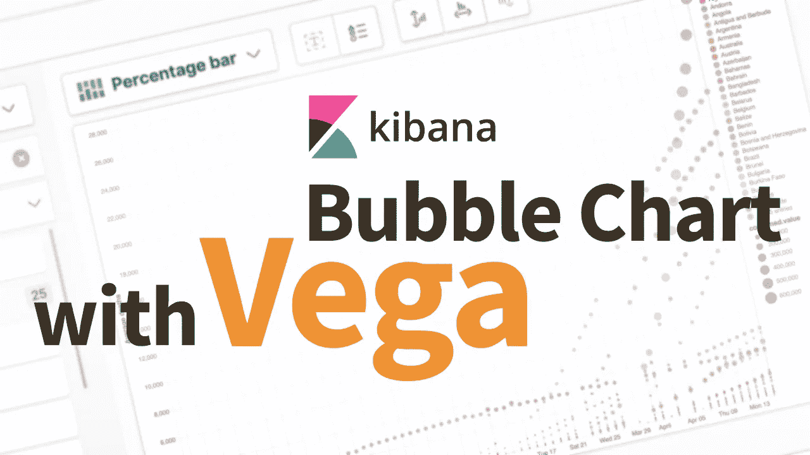
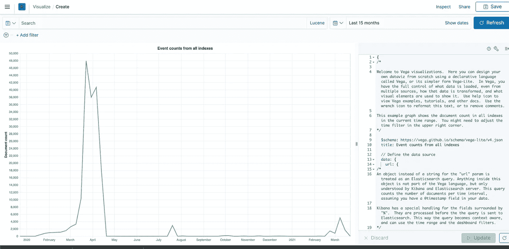
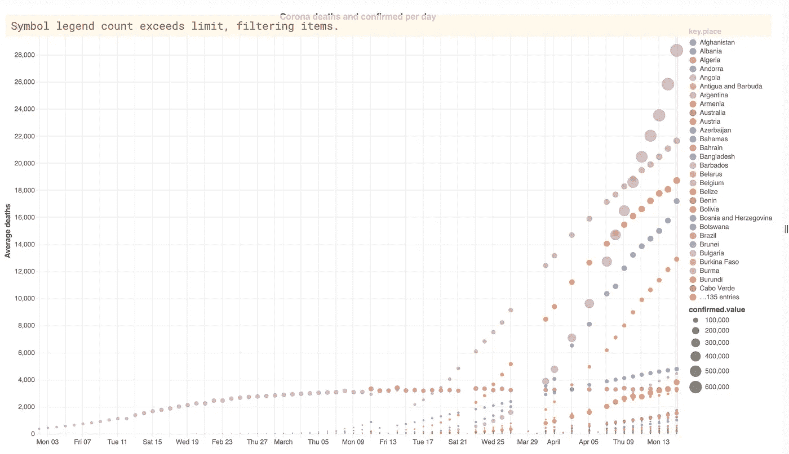
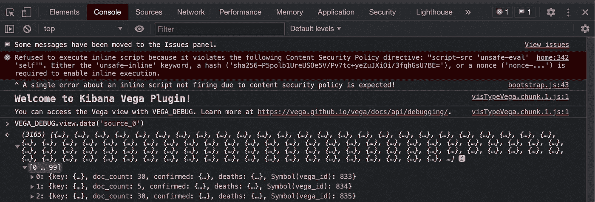

# 织女星在基巴纳的泡泡图

> 原文：<https://medium.com/nerd-for-tech/bubble-chart-in-kibana-with-vega-c137d170577d?source=collection_archive---------10----------------------->

## 在本帖中，我们将介绍使用 Vega 的基础知识，并展示它如何帮助拓展 Kibana 的潜能。具体来说，我们将使用 Vega 创建一个可在 Kibana 仪表板中使用的气泡图。



我们的顾客喜欢 Kibana。毫无疑问，这是一个优秀的数据可视化工具，是任何 Elasticsearch 用户的必备工具。但是，如果您是高级 BI 和仪表板用户，这也会非常有限。经常有客户来找我们，他们希望拓展 Kibana 的边界，并得到一些不平凡的可视化和仪表板。一个流行的要求是创建可视化，目前不存在作为 Kibana 仪表板应用程序的一部分。

尽管大多数可视化需求很简单，可以通过 Kibana 中可用的标准可视化来满足，但也有一些不是这样。这方面的一个很好的例子是标准可视化无法支持嵌套聚合。另一个例子是缺少气泡图，这是 BI 世界中非常常见的可视化。(Canvas——另一个 Kibana 应用程序——实际上提供了一个气泡图，但有其他限制，我们将在未来的帖子中讨论。)

## —内容

*   **基巴纳的织女星**
*   **了解内置织女星的例子** 1。织女星屏幕。
    2。弹性搜索查询。
    3。输出中的路径。
    4。可视化细节。
*   **创建气泡图** 1。修改 Elasticsearch 查询。
    2。定义输出中的路径。
    3。定义气泡图的可视化详细信息。
    4。测试和整合图表。

# 基巴纳的维加

幸运的是，Kibana 内置了对 Vega 的一流支持——一种用于创建、保存和共享可视化设计的声明式格式。在 Vega 中，可视化用 JSON 描述，并使用 HTML5 Canvas 或 SVG 生成交互式视图。

Vega(或者更确切地说是它在 Kibana 中的变体，Vega-Lite)是一种用于创建可视化的语言，它可以作为一种可视化类型在 Kibana 中使用，并且可以集成到 Kibana 仪表板中。因为在使用 Vega 时，您有机会自己指定 Elasticsearch 查询，这通过允许用户定义数据的基本聚合解决了嵌套聚合问题。Vega 丰富的语法允许创建多种类型的图表，包括气泡图，当然还有几乎所有其他的东西。

由于 Vega 可视化并不总是易于理解和定义，我们将在构建 Vega 可视化的过程中为您提供指导，首先查看 Kibana 中内置的 Vega 示例，并对其进行修改以创建气泡图。我们不会使用嵌套聚合，但是我们也将简要讨论针对该需求的解决方案。为了继续阅读，你需要对 Elasticsearch 和 Kibana 有一些基本的了解。

# 理解内置的 Vega 示例

我们将从简要概述内置示例的工作方式开始，并在下一节中对其进行修改。



**织女星屏幕**

## **1。织女星屏幕。**

在屏幕的左侧，我们可以看到可视化，而右侧显示了创建它的 Vega 语法。在上图中，我们可以看到时间过滤器和搜索栏，无论我们是直接查看可视化效果还是将其作为控制面板的一部分，这两者都可以用来过滤可视化效果。我们可以在 Vega 语法的第一部分看到这是如何实现的:

```
// Apply dashboard context filters when set
%context%: true
// Filter the time picker (upper right corner) with this field
%timefield%: @timestamp
```

## **2。弹性搜索查询。**

在 Vega 语法的第二部分，我们可以看到用于获取数据的查询。这是一个简单的 Elasticsearch 语法，您应该已经熟悉了，当然 Vega 使用的占位符除外。这是一个[日期直方图](https://www.elastic.co/guide/en/elasticsearch/reference/current/search-aggregations-bucket-datehistogram-aggregation.html)，它使用了我们的时间过滤器。因为没有提到指标，所以使用默认的文档数指标。

```
// Which index to search
index: _all
// Aggregate data by the time field into time buckets, counting the number of documents in each bucket.
body: {
  aggs: {
    time_buckets: {
      date_histogram: {
        // Use date histogram aggregation on @timestamp field
        field: @timestamp
        // The interval value will depend on the daterange picker (true), or use an integer to set an approximate bucket count
        interval: {%autointerval%: true}
        // Make sure we get an entire range, even if it has no data
        extended_bounds: {
          // Use the current time range's start and end
          min: {%timefilter%: "min"}
          max: {%timefilter%: "max"}
        }
        // Use this for linear (e.g. line, area) graphs.  Without it, empty buckets will not show up
        min_doc_count: 0
      }
    }
  }
  // Speed up the response by only including aggregation results
  size: 0
}
```

## **3。输出中的路径。**

注意“format”属性，这是 Vega 过滤结果中的路径并将输出的特定部分输入可视化逻辑的方式。示例的这一部分告诉 Vega 将其数据从聚合输出的“aggregations . time _ buckets . buckets”部分中取出。

```
format: {property: "aggregations.time_buckets.buckets"}
```

## **4。可视化细节。**

最后，我们来看数据的可视化表示的语法，它告诉 Kibana 将数据绘制成一段时间内计数的折线图。虽然不难理解，但预计必须仔细阅读文档，再加上一些尝试和错误，才能使其符合您的需求。

```
encoding: {
   x: {
     // The "key" value is the timestamp in milliseconds.  Use it for X axis.
     field: key
     type: temporal
     axis: {title: false} // Customize X axis format
   }
   y: {
     // The "doc_count" is the count per bucket.  Use it for Y axis.
     field: doc_count
     type: quantitative
     axis: {title: "Document count"}
   }
 }
```

# 创建气泡图

现在，我们将用创建气泡图所需的语法来一部分一部分地替换这个语法。我们将使用在之前的博客系列中创建的冠状病毒数据集[，但是该示例应该足够清楚，以便您可以根据您的使用情况对其进行修改。](https://blog.bigdataboutique.com/2020/05/using-ingest-processors-to-load-data-into-elasticsearch-analyzing-covid-19-spread-part-4-e0k551)

## **1。修改 Elasticsearch 查询。**

我们所拥有的是一个基于时间的索引，进一步按照关键字值(在本例中是“国家/地区”的值)划分为文档。对于每个时间段——比如说，一天——我们希望为每个关键字值绘制一个气泡。x 轴将代表时间段，而 y 轴将代表度量(“死亡”)。这意味着气泡将被放置在关键字值的特定时间段的指标值所代表的点上。气泡将根据另一个指标(“已确认”)来调整大小，并根据关键字值来着色。

由于 Vega 需要将结果展平而不是嵌套，我们将使用一个[复合聚合](https://www.elastic.co/guide/en/elasticsearch/reference/current/search-aggregations-bucket-composite-aggregation.html)来实现桶，它是日期直方图聚合和关键字术语聚合的变体。

我们还将告诉 Elasticsearch 忽略某个指标中值为零的存储桶——为此我们将使用一个[存储桶选择器聚合](https://www.elastic.co/guide/en/elasticsearch/reference/current/search-aggregations-pipeline-bucket-selector-aggregation.html)。

```
index: corona-v2-fb
      body: {
         "aggs": {
    "my_buckets": {
      "composite": {
        "size": 65535,
        "sources": [
          {
            "time_buckets": {
              "date_histogram": {
                "field": "Last_update",
                "interval": "day"
              }
            }
          },
          {
            "place": {
              "terms": {
                "field": "Country/Region"
              }
            }
          }
        ]
      },
      "aggs": {
        "deaths": {
          "sum": {
            "field": "Deaths"
          }
        },
        "confirmed": {
          "sum": {
            "field": "Confirmed"
          }
        },
        "filter": {
          "bucket_selector": {
            "buckets_path": {
              "deaths": "deaths.value"
            },
            "script": "params.deaths > 0"
          }
        }
      }
    }
  }
        size: 0
      }
    }
/*
```

如果我们的源数据是嵌套数据——例如，如果每个国家/地区的数据都嵌套在一个包含某个日期的所有地区的文档中，那么我们就需要将聚合包装在一个[嵌套聚合](https://www.elastic.co/guide/en/elasticsearch/reference/current/search-aggregations-bucket-nested-aggregation.html)中，但是原理是相同的。

## **2。定义输出中的路径。**

对于格式，我们根据聚合中使用的名称来使用路径(对于嵌套的情况，需要对额外的嵌套进行调整)。

通过直接对 Elasticsearch 运行聚合并查看输出，我们可以很容易地确定正确的值:

```
{
    "took": 95,
    "timed_out": false,
    "_shards": {
        "total": 1,
        "successful": 1,
        "skipped": 0,
        "failed": 0
    },
    "hits": {
        "total": {
            "value": 10000,
            "relation": "gte"
        },
        "max_score": null,
        "hits": []
    },
    "aggregations": {
        "my_buckets": {
            "after_key": {
                "time_buckets": 1586908800000,
                "place": "Zimbabwe"
            },
            "buckets": [
                {
                    "key": {
                        "time_buckets": 1585699200000,
                        "place": "Afghanistan"
                    },
                    "doc_count": 1,
                    "confirmed": {
                        "value": 237
                    },
                    "deaths": {
                        "value": 4
                    }
                }
            ]
        }
    }
}
```

因此，我们可以看到包含我们需要的关键字“位置”、时间值和指标值的路径位于“aggregation.my_buckets.buckets”，因此:

```
format: {property: "aggregations.my_buckets.buckets"}
}
```

## **3。定义气泡图的可视化详细信息。**

我们将标记类型改为“圆形”以允许气泡，并添加一个[工具提示](https://vega.github.io/vega-lite/docs/tooltip.html)以提高清晰度。我们将使用聚合中的一个指标“死亡数”作为 y 轴指标。对于尺寸，我们将使用另一个指标——“已确认”。最后，我们将告诉 Vega 根据关键字选择一种颜色。请注意，配色方案是根据字段类型决定的，如[Vega-Lite 参考](https://vega.github.io/vega-lite/docs/scale.html#scheme)中所述。

```
mark: {"type": "circle", "tooltip": true}
encoding: {
x: {
  field: key.time_buckets
  type: temporal
  axis: {title: false} 
}
y: {
  field: deaths.value
  type: quantitative
  axis: {title: "Deaths per day"}
}
"size": {"field": "confirmed.value", "type": "quantitative"},
color: {
      "field": "key.place",
      "type": "nominal"
      }
}
}
```

## **4。测试和整合图表。**

应用更改后，您应该能够在图表中看到绘制的结果。如果没有，请确保您选择了具有相关数据的期间。



如果可视化中的某些东西让您觉得不可思议，您可以通过转到浏览器开发控制台，并在控制台中键入 VEGA_DEBUG.view.data('source_0 ')来查看可视化所使用的数据。



我们现在可以保存可视化并将其合并到任何 Kibana 仪表板中。

在本文中，我们介绍了使用 Vega 的基础知识，并展示了它如何帮助拓展 Kibana 的潜能。请在此关注更多关于该主题的帖子，特别是，我们将很快讨论在选择如何可视化 Elasticsearch 数据时的其他选项，以及何时选择哪个选项。

如果您希望与我们讨论任何基于 Elasticsearch 数据的可视化需求，请随时[联系我们](https://bigdataboutique.com/contact)。