# 冒泡排序

> 原文：<https://medium.com/nerd-for-tech/bubble-sort-73bacb74f215?source=collection_archive---------1----------------------->

冒泡排序是一种排序算法，它重复遍历一个数组，如果相邻元素不按顺序排列，就交换相邻元素。重复该算法，直到列表被排序。

**例子**

对给定数组{3，2，5，1，4}进行排序。

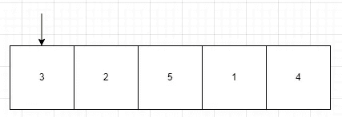

首先，我们比较 3 和 2。

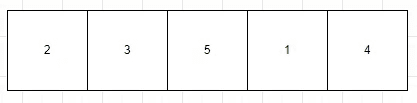

3 小于 2，所以它们被交换了。

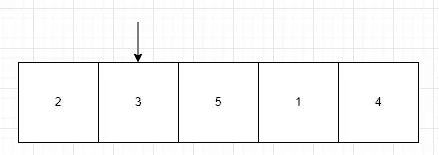

现在比较 3 和 5。

3 小于 5，因此它们不会被交换。

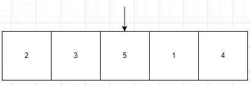

接下来比较 5 比 1。

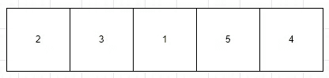

5 大于 1，因此它们被交换。

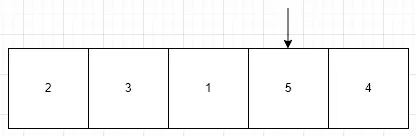

现在比较 5 和 4。

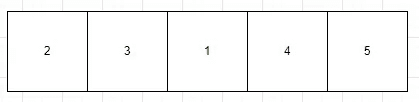

5 大于 4，因此它们被交换。

现在我们在数组的末尾，我们将再次遍历数组并完成相同的过程。这一次我们不需要检查数组的最后一个元素，因为它将是最大的数字。

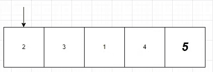

比较 2 和 3。

2 小于 3，因此它们不会被交换。

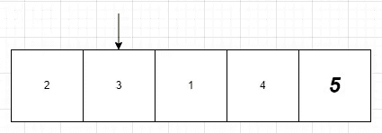

比较三比一。

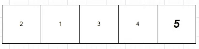

3 大于 1，因此它们被交换。

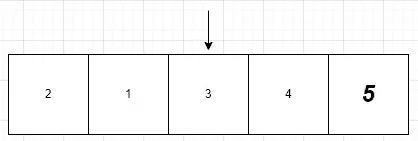

比较 3 比 4。

3 小于 4，因此它们不会被交换。

这次大约 4 被认为是数组的最后一个元素，所以这个循环结束了。

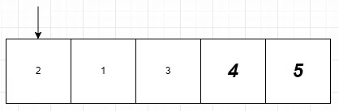

回顾一下，我们将 2 比 1 进行比较。

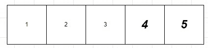

2 大于 1，因此它们被交换。

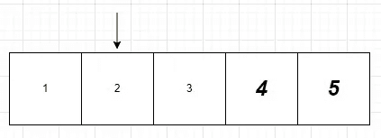

比较 2 和 3。

2 小于 3，因此它们不会被交换。

3 是数组中新的最后一个元素，所以这个循环结束了。因为在这个循环中有一个交换，所以我们必须再次遍历这个循环。

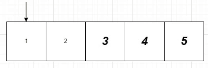

比较 1 和 2。

1 小于 2，因此它们不会被交换。

2 是新的最后一个元素，因此循环结束。因为没有交换，所以循环不需要再次运行。

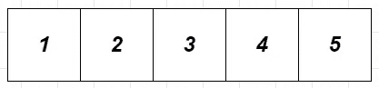

当数组已经排序时，该算法的最佳情况场景的时间复杂度为 O( *n* )。当数组被反向排序时，该算法的最坏情况的时间复杂度为 O( *n* )。

**代码实现**

要实现冒泡排序，您将创建一个函数来对数组进行排序。它需要两个参数。一个是数组，第二个是数组的大小。

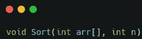

在这个函数中，您将创建一个 bool 变量来确定是否发生了交换。

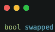

创建一个 for 循环来通过数组。在每一轮开始时，您将把交换变量设置为 false。

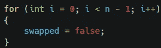

现在，您将创建一个嵌套的 for 循环，该循环将通过数组。这个 for 循环将比较数组中的每个元素，如果它们的顺序不正确，就交换它们。如果交换发生，你将设置交换变量为真。

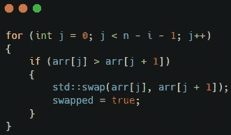

嵌套的 for 循环完成后，您将检查交换的变量是否为 false。如果为 false，您将退出 for 循环。如果是真的，你将再次运行循环。

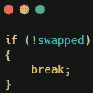

对于这个例子，我已经创建了一个打印数组的函数。

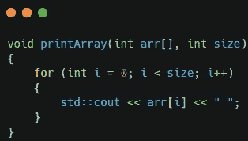

在 main 函数中，我创建了一个数组和一个变量来保存数组的大小。然后我运行了打印数组函数和排序函数。

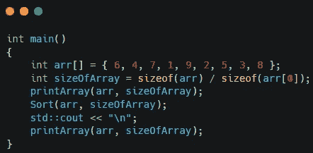

运行时，它将打印原始数组和排序后的数组。

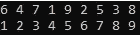

这是完整的剧本。

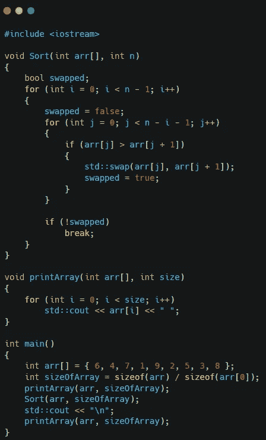