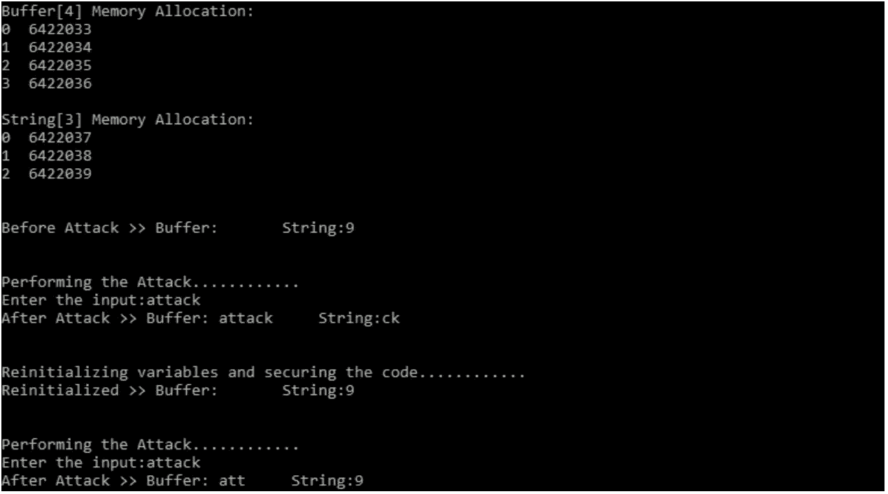
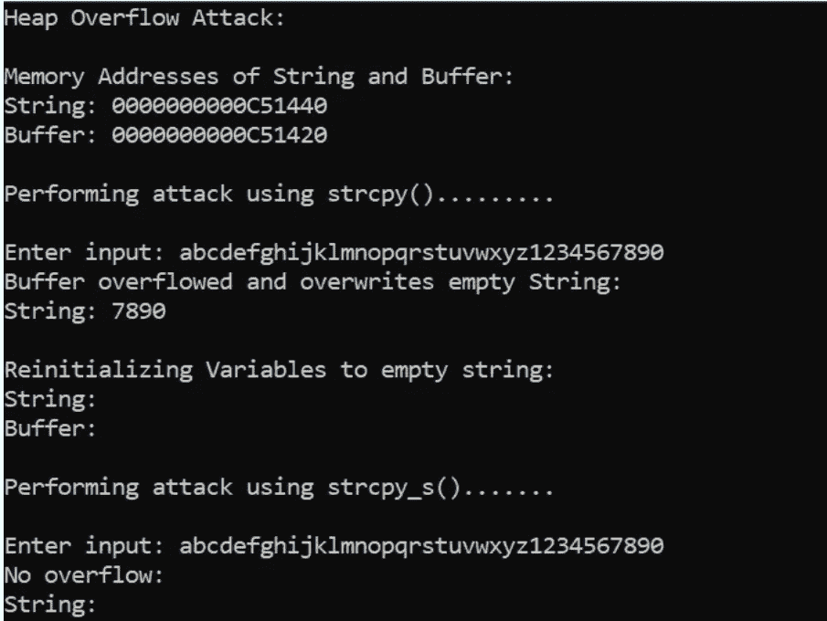
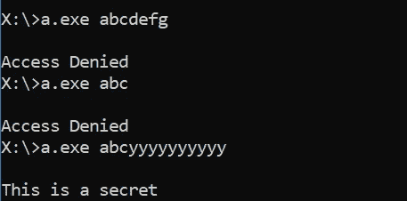

# 缓冲区溢出攻击

> 原文：<https://medium.com/nerd-for-tech/buffer-overflow-attacks-b5e62a522e6e?source=collection_archive---------10----------------------->

用简单的例子理解缓冲区溢出攻击

**什么是缓冲？**

在计算机内存中，缓冲区是一个固定大小的临时存储区域。它可以用于在上下文切换时存储数据，或者临时存储用户输入，直到它被传输到专用的存储区域。

**什么是缓冲区溢出？**

当程序试图向缓冲区写入超过缓冲区大小的数据量时，这是一种不寻常的行为。因此，缓冲区的相邻存储位置被覆盖。这种异常称为缓冲区溢出。

**缓冲区溢出的类型**

通常会发生三种类型的缓冲区溢出。它们如下所示:

1 基于堆栈的缓冲区溢出

2 基于堆的缓冲区溢出

3 全局缓冲区溢出

> 注意:在这里，我们将考虑非常简单的程序来理解 3 种类型的缓冲区溢出攻击，实际上攻击可能会有所不同。要理解实际的缓冲区溢出，需要了解寄存器及其操作方式。

**基于堆栈的缓冲区溢出**

我们将考虑用 C 语言来演示这种攻击。C 中有几个易受缓冲区溢出攻击的内置函数，如 gets()、strcpy()。gets()用于获取用户输入，strcpy()用于将一个字符串复制到另一个字符串。gets()函数在接受用户输入时不检查数组边界，而只是接受用户输入的所有输入字符，与 strcpy()函数检查数组边界并只是将一个字符串复制到另一个字符串的方式相同。这可能导致缓冲区溢出。下面的 C 程序演示了同样的情况。在下面给出的 C 代码中，一个大小为 3 的变量字符串被声明并初始化为 9，另一个大小为 4 的变量缓冲区被声明并初始化为空字符串。在输出中可以观察到，string 和 buffer 具有相邻的内存区域，这使得它容易受到缓冲区溢出攻击。获取(缓冲区)；用于接收用户的输入。恶意攻击者为了利用此漏洞，会输入超过缓冲区所能容纳的大小的输入，如输入大小为 6 (>4)的输出所示，这会导致缓冲区溢出和字符串中的数据被覆盖。可以观察到，字符串中的数据已被更改为 ck。这是因为输入“attack”的大小是 6，缓冲区的大小是 4，所以输入“attack”的最后 2 个字符会溢出并被复制到 string。

```
include<stdio.h>
#include<string.h>
**int** main()
{
 **char** string[3] = "9";
 **char** buffer[4] = " ";
 printf("Buffer[4] Memory Allocation: \n");
 **for**(**int** i=0;i<4;i++)
 {
 printf("%d %u\n",i,&buffer[i]);
 }
 printf("\nString[3] Memory Allocation: \n");
 **for**(**int** i=0;i<3;i++)
 {
 printf("%d %u\n",i,&string[i]);
 }
 printf("\n\nBefore Attack >> Buffer: %s String:%s\n",buffer,string);
 printf("\n\nPerforming the Attack....\n");
 *//strcpy(buffer,"Attack");*
 printf("Enter the input:");
 gets(buffer);
 printf("After Attack >> Buffer: %s String:%s\n",buffer,string);
 printf("\n\nReinitializing variables and securing the code....\n");
 strcpy(string,"9");
 strcpy(buffer," ");
 printf("Reinitialized >> Buffer: %s String:%s\n",buffer,string);
 printf("\n\nPerforming the Attack....\n");
 *//strcpy_s(buffer,4,"Attack");*
 printf("Enter the input:");
 fgets(buffer,4,stdin);
 printf("After Attack >> Buffer: %s String:%s\n",buffer,string);
 **return** 0;
}
```



基于堆栈的缓冲区溢出

> 注意:您可以删除程序中的注释，看看 strcpy()函数如何容易受到缓冲区溢出的攻击。

从输出中可以看出，当使用 fgets()函数执行攻击时，由于没有缓冲区溢出，所以攻击没有成功。这是因为 fgets()函数与 gets()函数不同，它只接受小于或等于存储输入的变量大小的输入字符。fgets()在其参数中取变量的最大值。因此，从输出中可以看出，它只将“att”作为输入，并拒绝来自输入的“ack”。由于存储的最后一个字符是“\0”，因此只接受三个字符“att”。同样，strcpy()不检查数组边界，直接将一个字符串复制到另一个字符串，如果源字符串比目标字符串大，就会导致缓冲区溢出。为了防止这种情况发生，应该使用 strcpy_s()。strcpy_s()将目标字符串的最大大小作为参数，如果它发现源字符串的大小大于目标字符串的大小，它不会将一个字符复制到目标字符串，从而防止缓冲区溢出

**基于堆的缓冲区溢出**

基于堆的缓冲区溢出以相同的方式发生，不同之处在于这里以动态方式为缓冲区分配内存。所以我们来看一个简单的 C 程序。

```
#include<stdio.h>
#include<stdlib.h>
#include<string.h>
**int** main()
{
 **char** *buffer;
 buffer = (**char***)malloc(5***sizeof**(**char**));
 **char** *string;
 string = (**char***)malloc(5***sizeof**(**char**));
 printf("Heap Overflow Attack: \n\n");
 printf("Memory Addresses of String and Buffer: \n");
 printf("String: %p \n", string);
 printf("Buffer: %p \n\n", buffer);
 printf("Performing attack using strcpy().........\n\n");
 *//strcpy(buffer,"abcdefghijklmnopqrstuvwxyz1234567890");*
 gets(buffer);
 printf("Buffer overflowed and overwrites empty String:\n");
 printf("String: %s \n\n", string);
 printf("Reinitializing Variables to empty string:\n");
 strcpy(string, " ");
 strcpy(buffer, " ");
 printf("String: %s \n", string);
 printf("Buffer: %s \n\n", buffer);
 printf("Performing attack using strcpy_s().......\n\n");
 *//strcpy_s(buffer, 5, "abcdefghijklmnopqrstuvwxyz1234567890");*
 fgets(buffer,5,stdin);
 printf("No overflow:\n");
 printf("String: %s", string);
 **return** 0;
}
```



基于堆的缓冲区溢出

可见 gets()和 strcpy()函数有多不安全。

**全局缓冲区溢出**

这里，缓冲区具有全局范围。

```
#include<stdlib.h>
#include<stdio.h>
#include<string.h>
**char** access;
**char** buffer[4]; *//global buffer*
**int** main(**int** argc, **char** **argv)
{
 **char** *A = argv[1];
 **char** *B = "pass";
 access = 'n';
 strcpy(buffer,A);
 *//strcpy_s(buffer,4,A);*
 **if** (strcmp(buffer,B)==0)
 {
 access = 'y';
 }
 **if**(access == 'y')
 {
 printf("\nThis is a secret");
 }
 **else**
 {
 printf("\nAccess Denied");
 }
**return** 0;
}
```



全局缓冲区溢出

从上面的程序中可以看出，我们试图溢出全局声明的缓冲区。首先，我们声明了一个全局变量“access ”,它将用于执行访问控制。还有，还有一个全局缓冲区“buffer”。当使用 strcpy()将命令行参数复制到“buffer”时，缓冲区可能会溢出。因此，正如在输出中看到的，当我们给定输入为“abcyyyyyyyyyy”时，它将溢出，并且“y”将在“access”变量中被覆盖，这将非法访问代码的密码保护部分。

**结论**

可以得出这样的结论:如果使用不净化用户输入的易受攻击的函数，缓冲区溢出攻击很容易被利用，并可能导致灾难性的破坏。因此，为了防止这些攻击的发生，最好使用 fgets()和 strcpy_s()之类的函数来净化用户输入。应该使用 strcpy()或 strcpy()来防止缓冲区溢出攻击，而不是使用 strcpy()。另外，应该使用 strcmp()来代替 strcmp()。

对于任何技术或其他错误，随时与我联系，以便进一步的读者受益。

感谢您的阅读。知识就是力量，所以不断获取！😈

在 [GitHub](https://github.com/gandhidevansh) 上关注我吧！