# 错误修正和增加敌人火力

> 原文：<https://medium.com/nerd-for-tech/bug-fixing-and-adding-enemy-fire-295aa0e9d808?source=collection_archive---------22----------------------->

所以，现在我们有了一个更具可玩性的游戏版本，我们可以考虑添加一些额外的功能来创造更多的挑战。不过，先来看一个我们玩的时候弹出来的 bug。如果我们向敌人的爆炸射击，我们可以继续获得积分:

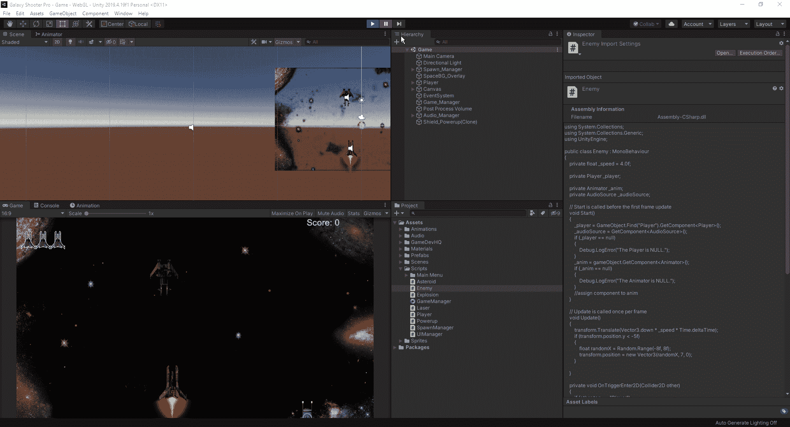

至于这是为什么，我们得看看剧本:

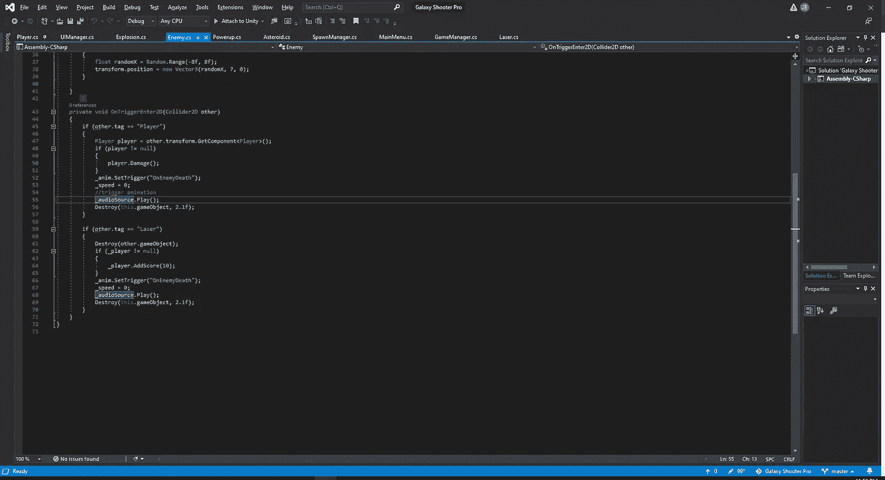

从脚本中，我们可以看到，在摧毁我们的对象之前，我们有一个延迟，所以发生的事情是，我们仍然让我们的激光与我们的对象碰撞 2.1 秒后，我们击中了它。为了解决这个问题，我们可以在我们的对撞机被激光击中后将其摧毁，我们将不再因为击中死亡的敌人而获得积分:

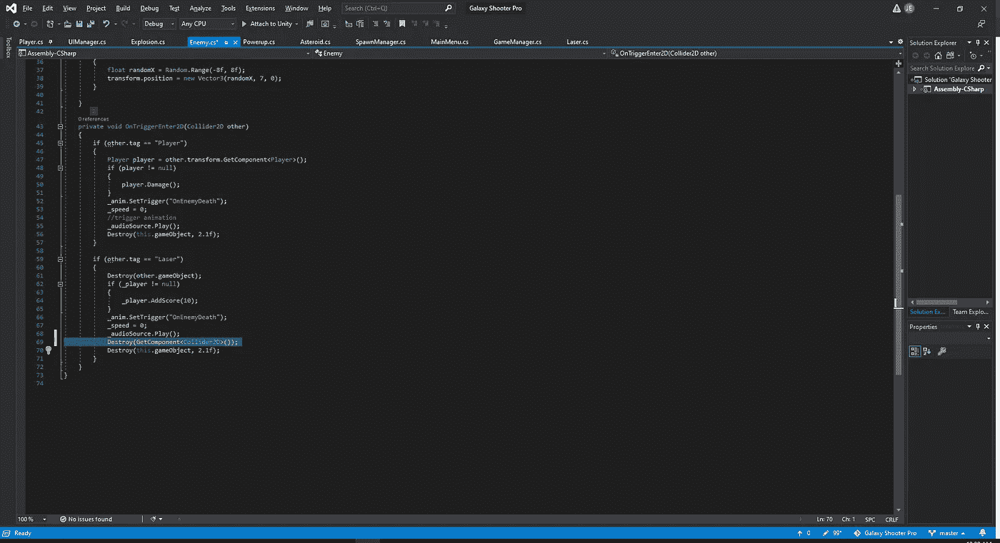

现在我们已经摧毁了对撞机，我们可以在我们的编辑器中检查它，看看它是如何进行的:

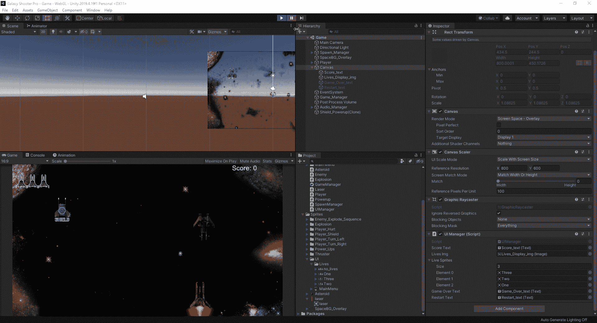

现在我们已经修复了这个错误，让我们从敌人那里得到一些还击。首先，我们需要为我们的敌人制造一个激光预制体:

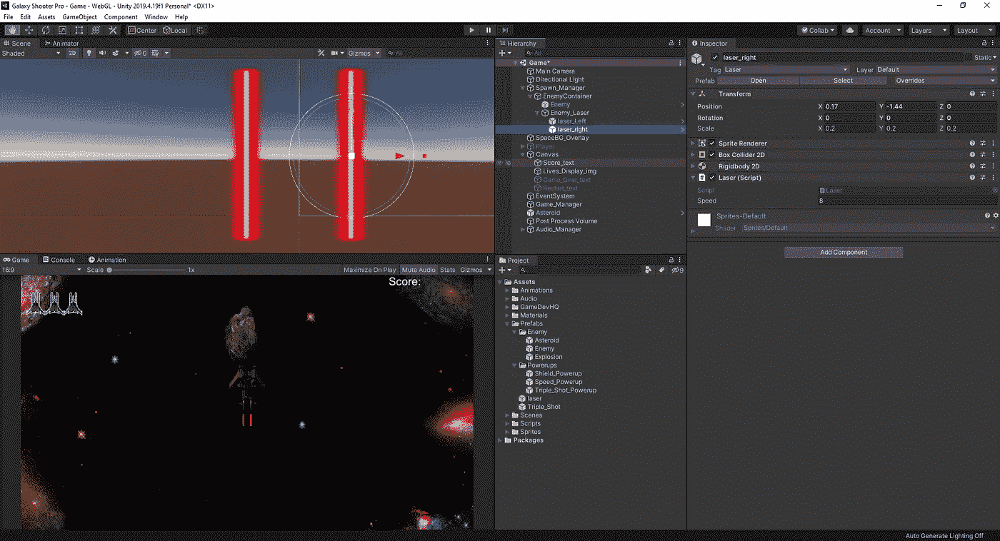

我们所要做的就是把一个敌人的预制体和两个激光预制体拖进敌人的容器里。从那里，我们将移动我们的 2 个激光器到一个我们喜欢的位置，并通过使用一个我们称之为敌人激光的父对象将它们连接在一起。现在我们已经造好了激光预制体，让我们进入敌人的脚本，开始编写让敌人向我们开火所需的代码。首先，我们将简单地为敌人的移动创建一个新的空白，这样如果出现错误，我们就可以更容易地找到问题的位置:

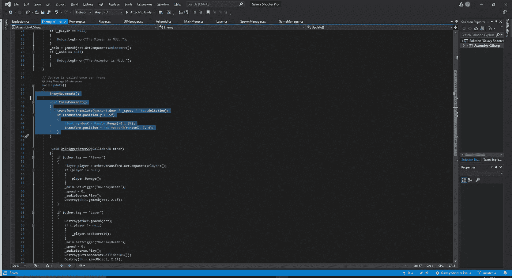

接下来，我们要做的是为射击速度和我们是否能够射击创建一对浮动。从那里，我们可以在我们的 void 更新中编写我们的激光发射代码:

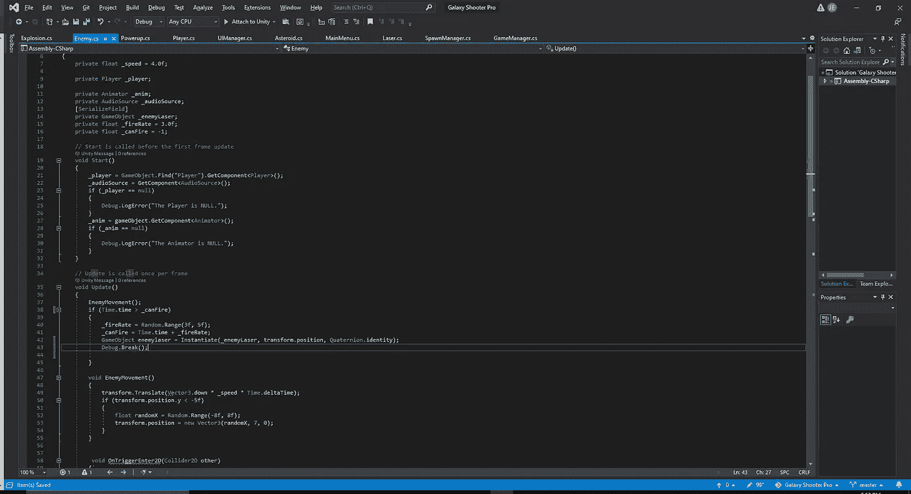

为了测试我们的敌人是否开火，我们添加了 Debug 行。break()；因此，一旦游戏中出现动作，它会暂停游戏，这样我们就可以看到它在敌人开火时的样子:

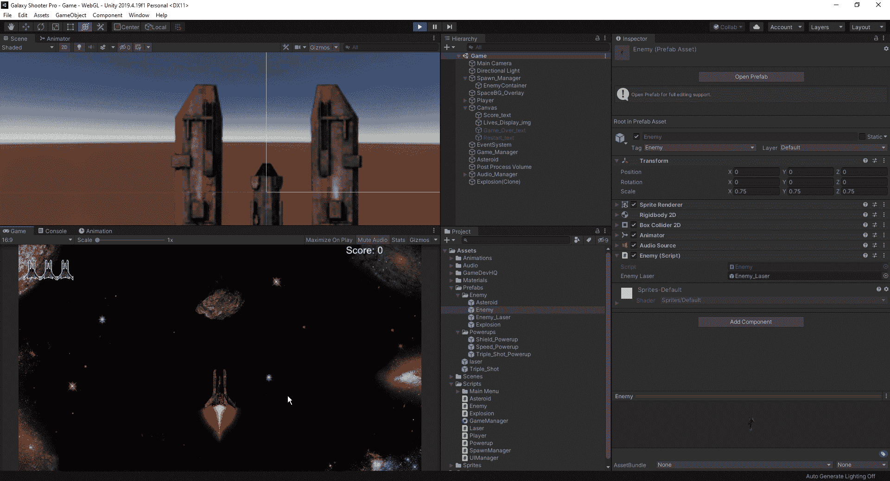

现在我们看到了它的样子，让我们继续游戏，看看最终会发生什么:

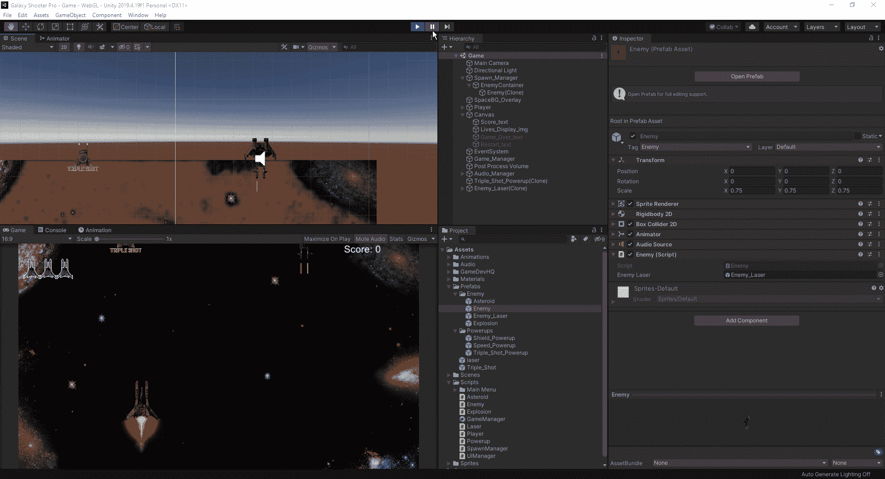

我们的敌人正在用激光自杀。原因是因为我们的激光脚本设置为让激光向上移动，所以我们必须进入我们的激光脚本，并创建一个方法，使其在满足特定条件时向下移动。为此，我们将创建一个 bool 语句，使我们的激光向下移动，除非它是由敌方单位发射的:

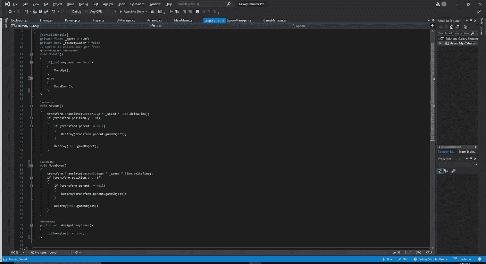

至于我们如何让方法成为现实，我们必须使用脚本与我们的敌人沟通。首先，我们必须创建一个 gameobject enemyLaser，这样我们就可以更容易地调用 instantiate 方法。从那里，我们可以创建一个数组:

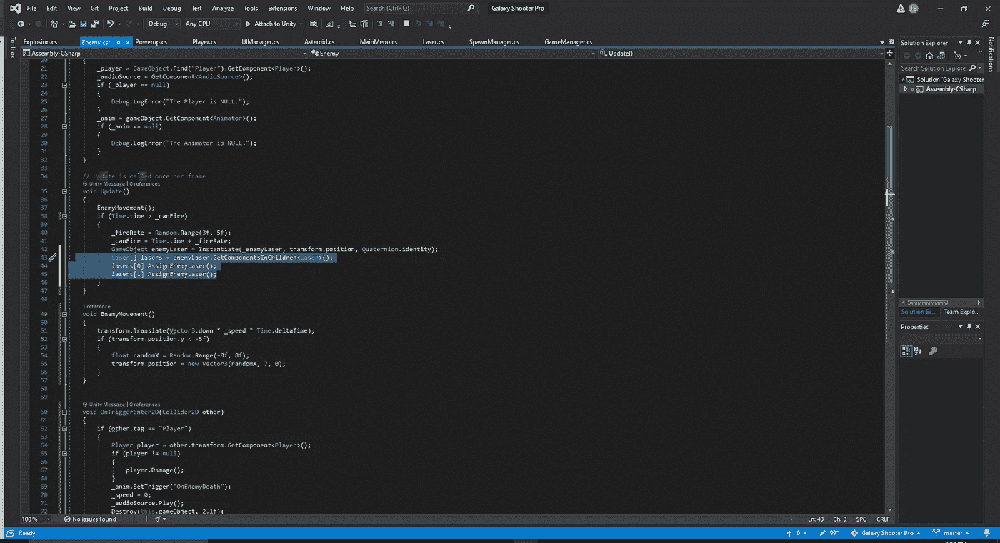

由于我们调用了两个独立的激光器，我们需要确保我们在儿童中使用的是 GetComponent ***s*** 。从这里，我们可以为每个激光器键入一行代码，或者使用我们所学的 for 循环方法。for 循环是一种更安全的使用方法，就好像我们碰巧拥有它，所以敌人发射了 40 种不同的激光，我们不需要为这个动作创建 40 行不同的代码:

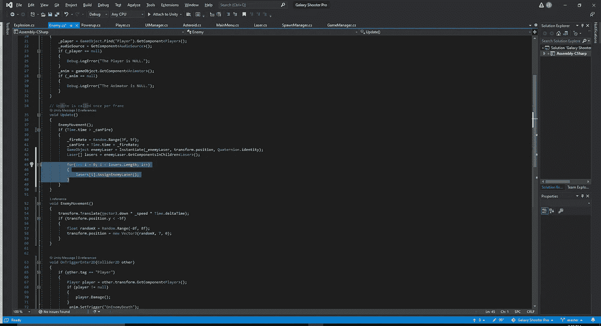

现在我们已经把敌人的脚本设置成向下发射激光，让我们在游戏中测试一下:

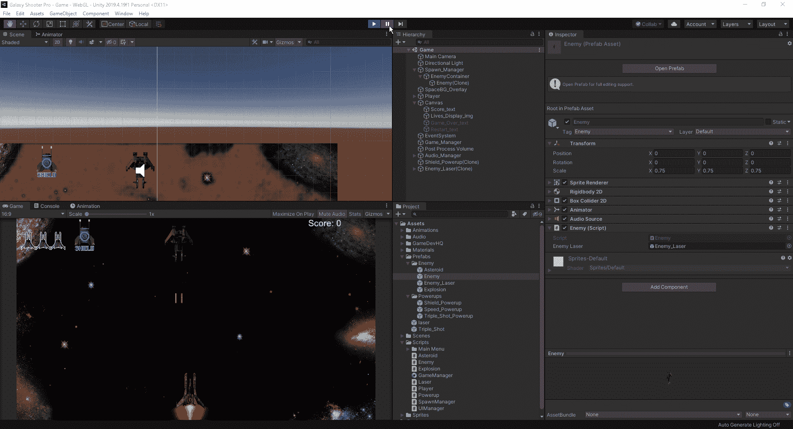

我们需要采取的最后一步是允许激光破坏播放器。要做到这一点，我们必须回到我们的激光脚本，并为我们的激光添加一个触发事件，以便当它击中我们的玩家时，我们知道我们希望玩家受到伤害:

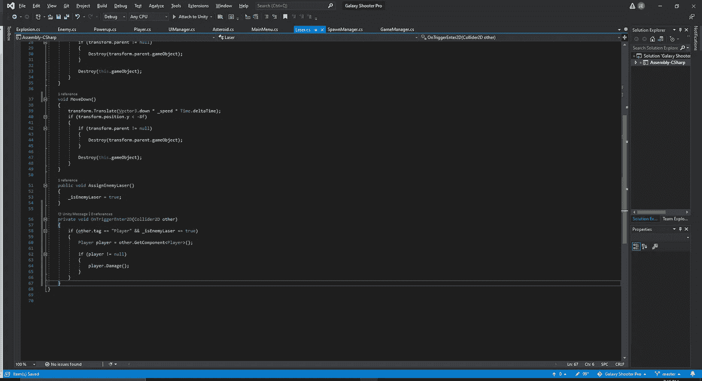

现在我们已经连接了伤害脚本，让我们在游戏中测试一下:

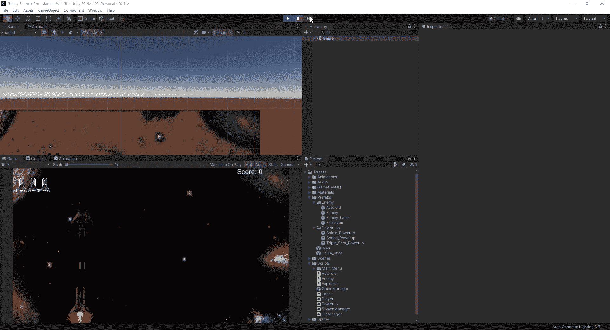

我们走吧。我们的玩家受到了激光的伤害，在这种情况下，由于我们的设置，他受到了 2 点的伤害。因为我们被两个独立的激光击中，所以我们受到 2 点伤害是有道理的。我们可以把它改为 1，但是由于这给游戏增加了难度，我们将保留它。