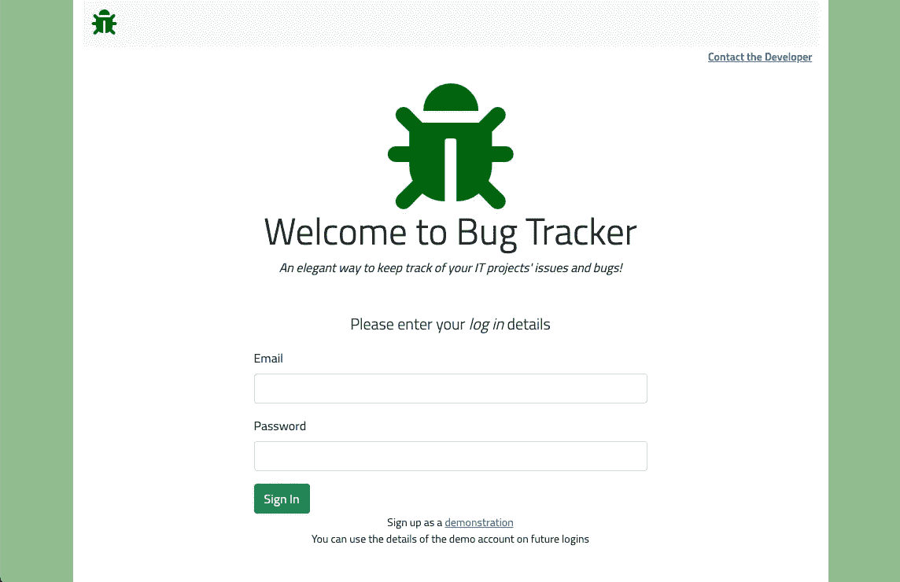
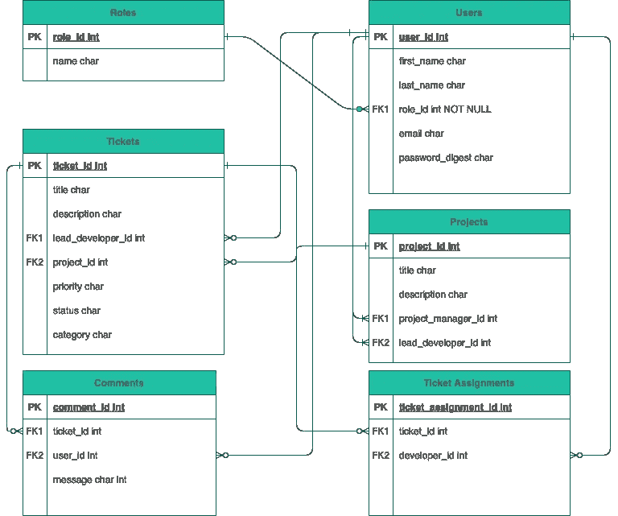
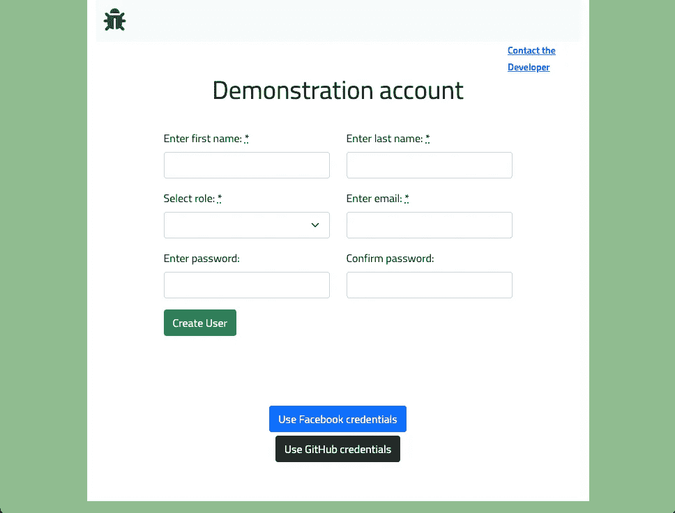
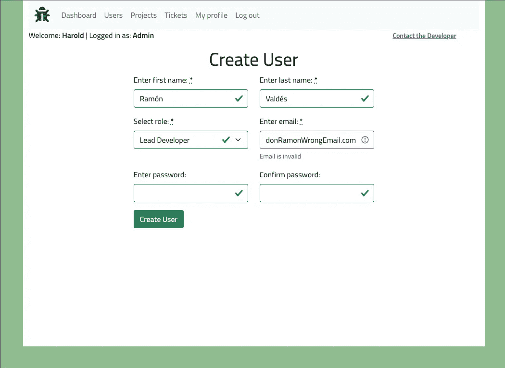
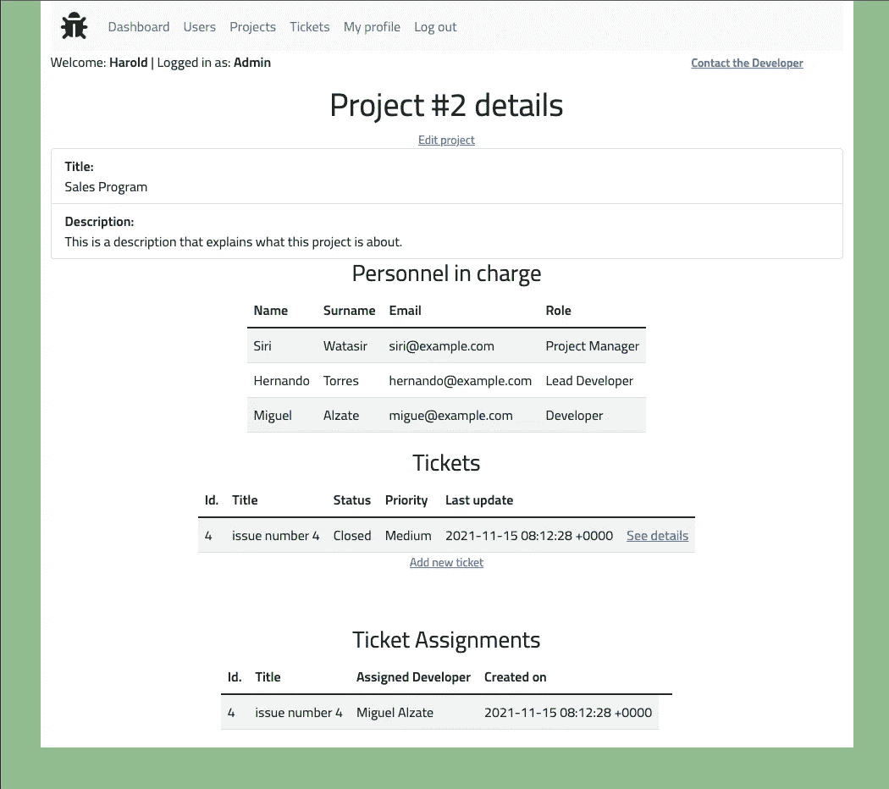
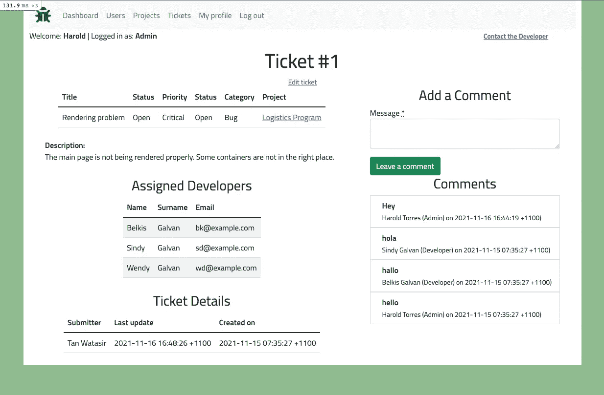
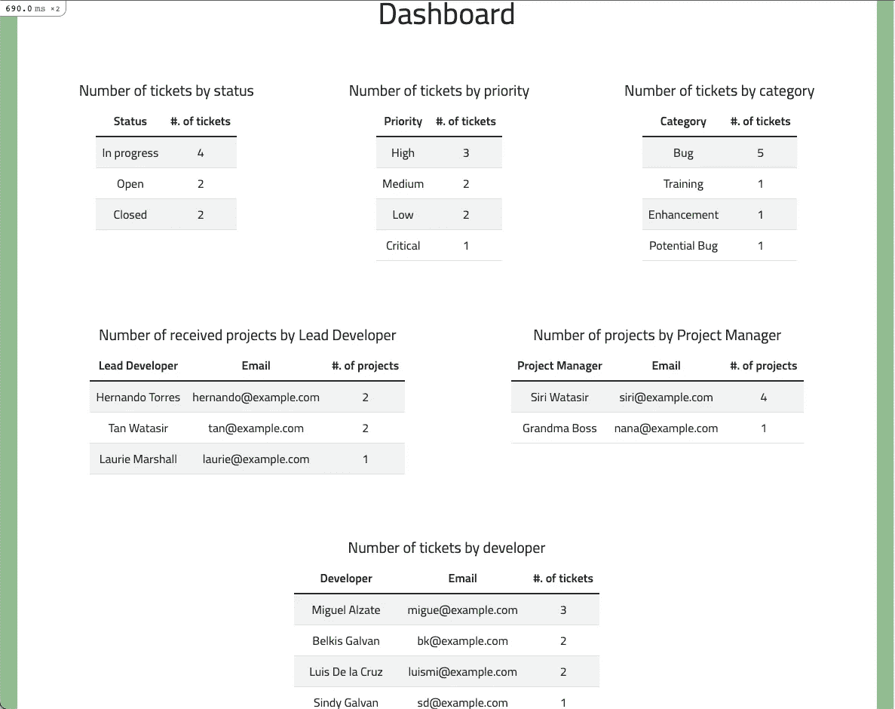

# Bug Tracker:我的 Ruby on Rails 应用程序项目

> 原文：<https://medium.com/nerd-for-tech/bug-tracker-my-ruby-on-rails-application-project-501318983d37?source=collection_archive---------2----------------------->

我将分享我在软件开发研究中对 Ruby on Rails 学习过程的思考，包括我的最终项目 Bug Tracker。

***App:***[*https://bug-tracker-project-phase-4.herokuapp.com/*](https://bug-tracker-project-phase-4.herokuapp.com/)

***源代码:****[*https://github.com/CodeHunt101/bug-tracker-project-phase-4*](https://github.com/CodeHunt101/bug-tracker-project-phase-4)*

**

*主页/登录页面*

# *这期间我学到了什么？*

*在对 Ruby 有了相当的了解并完成了一个 CLI 应用程序项目之后，下一个目标是进入 ***Ruby on Rails*** 的世界，这是一个遵循模型-视图-控制器(MVC)设计模式的服务器端 web 应用程序 Ruby 框架。首先介绍了 Rails 应用程序的一般结构，比如文件结构、MVC 和表述性状态转移(REST)。后来，它开始深入研究这个结构的细节。我学习了 *ActionView、CRUD 操作、验证和表单、关联、布局和部分、重构助手*和*模型方法、路由*和*资源、认证、Rails 作为 API* 和*授权*。*

*我必须说，我发现这个阶段是最具挑战性的，包括项目需求。尽管事实上 Ruby on Rails 是一个快速构建网站的好工具，但是在编码时你必须记住大量的概念，至少从主观上来说，由于 Ruby on Rails 遵循的约定优于配置的思想，你需要花一些时间来掌握它们。然而，好消息是，在某个时候，一切都变得简单明了。*

# *我的项目:一个 Bug 跟踪器 Ruby on Rails 应用程序*

*我所做项目的要求如下:*

*   *包括至少一个`has_many`、至少一个`belongs_to`和至少两个`has_many :through`关系。连接表必须包含一个用户可提交的属性，也就是说，除了外键之外，应用程序用户可以提交的一些属性。*
*   *包括简单属性的合理验证。*
*   *包括至少一个类级别的活动记录范围方法，比如`.where`和`.order`，而不是像`#find_all`或`#sort.`这样的原生 ruby 方法*
*   *提供标准的用户验证，包括注册、登录、注销和密码。*
*   *身份验证系统还必须允许从第三方服务登录。*
*   *包含并利用具有适当 RESTful URLs 的嵌套资源。*
*   *表单应该正确显示验证错误。*
*   *在合理的范围内，必须是一个*干* *(不要重复自己)*的 Rails 应用。*

# *这个项目是关于什么的？*

*到目前为止，我之前的项目都集中在兴趣爱好上。我在 *Vanilla JavaScript* 中构建了一个 S *occer 联赛应用*，在 *ReactJS* 中构建了一个*口袋妖怪记忆游戏*，在 *Ruby* 中构建了一个*电影*Web 报废 CLI 应用。这一次，我想要一个更侧重于企业世界的项目。*

*我的项目是一个 *Bug 和问题跟踪工具*，它帮助软件团队记录和跟踪与 IT 项目相关的 Bug 和问题。它由具有票据的项目组成，这些票据具有一组定义其类别、优先级和状态的属性。根据用户的角色，有一组权限。例如，项目经理可以创建项目并将其分配给首席开发人员，首席开发人员可以向开发人员提交票证。但是，开发人员和首席开发人员不能创建或编辑项目。*

# *型号和功能*

*因为这是一个 Rails 应用程序，所以它遵循了 *MVC* 模式。我想按照这种模式来解释我的项目，但是将视图和控制器浓缩在一起作为*特性*。*

# *模型*

*该应用程序的模型有:*

*   ***角色**:存储*角色名称。**
*   ***用户**:存储*用户的信息*和与之相关联的 *role_id* 。*
*   ***项目**:存储用户 *(project_manager_id)* 发送的、另一用户 *(lead_developer_id)接收的*项目信息*。**
*   ***票证**:存储用户*(lead _ developer _ id)**发送的*票证信息*及其所属的 *project_id* 。**
*   ****票证分配**:将票证 id 与收到它的用户相关联*(开发者 id)***
*   ****注释**:存储来自一个*用户 id、*的*消息，并链接到一个*票证 id。****

*值得一提的是，用户可以是项目经理、首席开发人员、开发人员或管理员。上面说了，项目经理可以送项目给领开发者，领开发者可以送门票给开发者。从这些关联中，我们可以假设用户之间存在`has_many :through`关联。*

***实体关系(模式)***

**

*实体关系*

*一旦完成，我想用 *Heroku* 部署我的应用程序，所以我决定从 *SQLite3* 切换到 *PostgreSQL* 作为数据的数据库系统，因为它不支持 *SQLite3* 。这是一个与更强大、声誉更好的数据库系统合作的绝佳机会。*

# *特征*

*该应用程序有以下主要视图:*

*   *布局*
*   *欢迎*
*   *用户*
*   *项目*
*   *票*
*   *仪表盘*

## *布局*

*这是创建 Rails 应用程序时出现的内置视图。它包含 *HTML 嵌入的 ruby* 数据，这些数据在应用程序的所有视图中共享。我在`<head>`标签上设置了导航栏、引导脚本和配置。导航栏根据用户类型显示不同的部分。例如，管理员用户可以访问用户和仪表板，而开发人员则不能。*

## ***欢迎光临***

**欢迎控制器视图*包含主页，如果用户尚未登录，可以使用他们的凭证登录。当用户登录时，*会话控制器*创建一个*会话散列*，前提是用户被正确认证。此外，用户可以完全自己创建新帐户，或者从第三方来源(如脸书或 GitHub)请求认证。然而，这只是一个用于演示目的的特性。在现实世界中，由于这是一个为企业设计的应用程序，我只会让一个*管理员*创建新账户。*

**

*创建模拟帐户页面*

## ***用户***

**用户控制器* *视图*允许任何用户查看他们的个人资料信息。但是，管理员用户可以享受它的所有操作。管理员用户不仅可以看到他们的信息，还可以看到所有其他用户的信息。此外，在通过适当的验证后，他们可以创建新用户或编辑现有用户。*

**

*管理用户试图在未通过所有验证的情况下创建新用户*

## ***项目***

*在*项目控制器视图*中，用户可以看到他们所负责的项目及其详细信息，例如与项目相关的用户、票证以及负责这些票证的开发人员。项目经理可以创建和编辑他们负责的项目，而管理员，除了刚才提到的一切，还可以看到每个项目。*

**

*项目显示视图*

## *票*

*与项目一样，在 *tickets controller 视图*中，用户可以看到他们相关或负责的票证，并可以看到有关它们的详细信息，例如分配的开发人员和票证详细信息。此外，*评论控制器*在门票视图中播放。由于评论属于票证，因此将它们包含在票证显示视图中是有意义的。首席开发人员可以创建和编辑他们负责的票证，管理员也可以查看每个票证以及刚才提到的所有内容。*

**

*门票展示视图*

## *仪表盘*

*如前所述，*仪表板控制器* *视图*只适用于管理员用户(或者至少适用于这个项目的当前版本)。该视图呈现了来自票证和用户模型的一些 SQL 查询逻辑，展示了一些重要的见解。*

**

# *式样*

*在造型方面，我使用了 *Bootstrap* 和 *CSS* 的组合。导航栏和表格样式依赖于*引导*，而布局和容器大小基于 *CSS Flexbox 布局*和其他属性。目前，该应用程序从 768 像素的宽度完全响应。我将在以后的版本中改进小设备的视图。*

# *宝石*

*除了 Ruby on Rails 需要正确工作的强制 gems 之外，我还安装了一些 gems 来改进开发过程。我使用了*更好的错误，*，其中用一个更好更有用的错误页面替换了标准的 Rails 错误页面。另外，我想测试我的代码，所以我对 Rails 使用了 *Rspec。*我用*撬*bye bug，其中*一个* dds 分步调试和堆栈导航功能来*撬*调试*。我使用的另一个很棒的宝石是*简单表单，*节省了大量构建表单的时间。最后但同样重要的是，我使用了 *BCrypt* ，它为安全处理密码提供了一个简单的包装器。**

# ***挑战***

*在我看来，我的 *Rails* 之旅充满了挑战，这个项目也没有摆脱它:*

1.  ***定义模型及其关联:**判断我的提交日志，我花了相当多的时间来决定我将使用的模型。我知道模型是 MVC 设计模式的关键部分，因为它们直接管理应用程序的数据、逻辑和规则。我努力通过使用 Rails 约定来创建关联，但同时，它帮助我了解了很多这方面的知识。*
2.  ***避免好奇的用户在 inspect 工具中操作 DOM:**由于我处理隐藏字段，我必须确保应用程序准备好处理用户在发送 POST、PUT 或 PATCH 请求时修改隐藏字段值的情况。*
3.  ***与 has_many 关联的验证:**由于某种原因，我在将开发者分配到新票证时遇到了问题。似乎如果你声明了`has_many`，那么 Rails 会自动验证关联，也就是开发者(用户)。因为他们有密码验证，所以我不得不在分配开发者时通过在票证模型中声明`has_many :developers, through: :ticket_assignments, validate: false`来禁用该关联的验证。*

# ***结论***

*总的来说，我很喜欢我的 Ruby 后端之旅，以及现在它的超级明星框架 *Ruby on Rails。我发现 Rails 是一个很好的快速构建应用程序的工具，虽然有时候我觉得它太神奇了，但是一旦你开始掌握它，它会优化你的编码。构建这个项目对我理解 Rails 帮助很大。**

*如果你想看看我的项目，我很乐意分享 GitHub 库和部署版本:*

***资源库:**https://github.com/CodeHunt101/bug-tracker-project-phase-4*

***部署版本:**[https://bug-tracker-project-phase-4.herokuapp.com/](https://bug-tracker-project-phase-4.herokuapp.com/)*

*我学习之旅的下一章是通过将 *Redux* 整合到 React 应用程序中来强化我的 *ReactJS* 知识，并通过应用我迄今为止所学的一切来构建一个全栈应用程序。这意味着使用 *ReactJS* 作为前端，使用 *Rails* 作为 API 作为后端，同时利用 *Redux* 进行状态管理。*