# 在 AWS 上构建 CI/CD 管道

> 原文：<https://medium.com/nerd-for-tech/build-a-ci-cd-pipeline-on-aws-f806e427db22?source=collection_archive---------1----------------------->

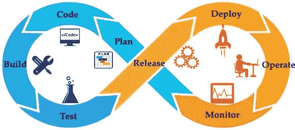

# 什么是 CI/CD 管道？

CI 和 CD 代表持续集成和持续交付/持续部署。CI/CD 管道**自动化了软件交付过程**。它构建代码，运行测试，并帮助您安全地部署软件的新版本。通过自动化过程，目标是最小化人为错误，并保持软件发布过程的一致性。

本文的目标是通过一个实际的例子来指导您使用 AWS CodePipeline 构建、测试和部署应用程序。

# **目标**

您的团队要求您为开发人员创建一种自动化应用部署的方式。目前，您的开发人员必须手动通过构建过程来测试他们代码的每个新更新。您需要向开发人员提供静态站点 URL，并修改 GitHub repo 中的代码，以验证管道是否正常工作。

# 我们开始吧！

## 步骤 1:创建 S3 时段

使用您的凭证登录到 [AWS 管理控制台](https://aws.amazon.com/)，并从搜索栏导航到 S3。

要创建 S3 存储桶，点击“*创建存储桶*，如下所示:

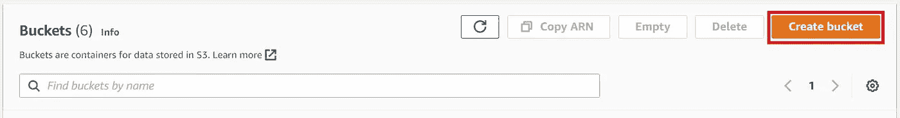

输入一个“*桶名*，选择要创建桶的“*区域*”。在*阻止该桶段*的公共访问设置中，**取消选中**阻止所有公共访问**的复选框。**将其他设置保留为，点击*“创建桶”创建桶。*

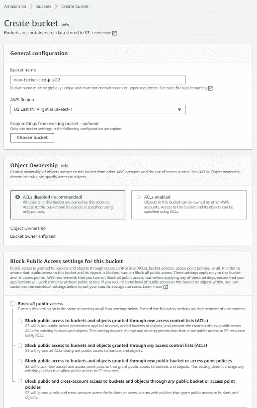

## 步骤 2:为 S3 桶配置静态**网站托管**

导航到新创建的存储桶，然后单击*“属性”*选项卡。

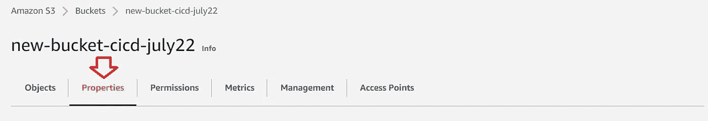

滚动到底部，在*“静态网站托管”*部分选择编辑

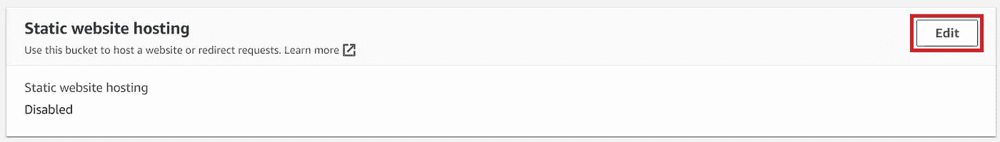

选择“*启用*，填写“*index . html”*和“*error.html*”字段，点击*“保存更改”*，如下图所示:


## 步骤 3:授予权限

导航到 S3 存储桶的“权限”选项卡。

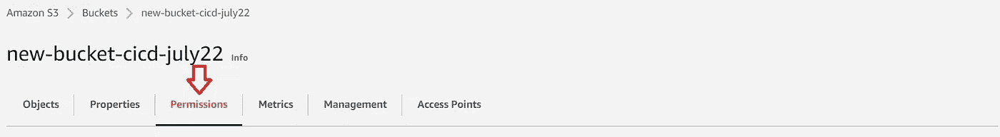

在 Bucket Policy 下，点击“ *Edit* ，然后点击“*Policy Generator”*，找到“*GetObject”*的动作，点击“*Generate Policy”*，将会生成以下代码:

```
{
  "Id": "Policy1659540315262",
  "Version": "2012-10-17",
  "Statement": [
    {
      "Sid": "Stmt1659540307023",
      "Action": [
        "s3:GetObject"
      ],
      "Effect": "Allow",
      "Resource": "arn:aws:s3:::new-bucket-cicd-july22/*",
      "Principal": "*"
    }
  ]
}
```

再次单击*“Permissions”***选项卡，删除当前策略并用上面的代码替换它。*注意:如果您正在跟进这个项目，请将 ARN 替换为您的铲斗的名称*。不要忘记在您的存储桶名称后添加/*！点击*“保存更改”****

**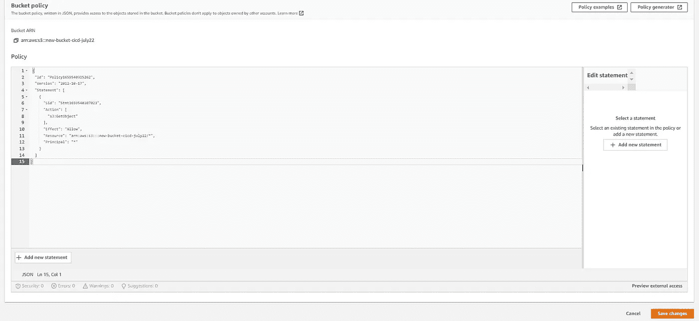**

**您将看到该存储桶现在可以公开访问。我们可以继续建立我们的管道！**

**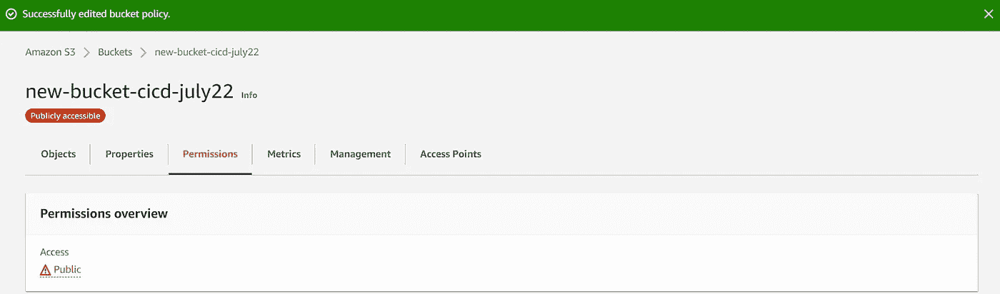**

## **第四步:将**连接到 GitHub:****

**登录 AWS 管理控制台，打开[https://Console . AWS . Amazon . com/code suite/settings/connections](https://console.aws.amazon.com/codesuite/settings/connections)的开发者工具控制台。**

**要创建到 GitHub 的连接，请在选择提供商下，选择“*GitHub”***

**在 GitHub 连接设置下，您的连接名称会出现在连接名称中。选择“连接到 GitHub”。“访问请求”页面如下所示:**

**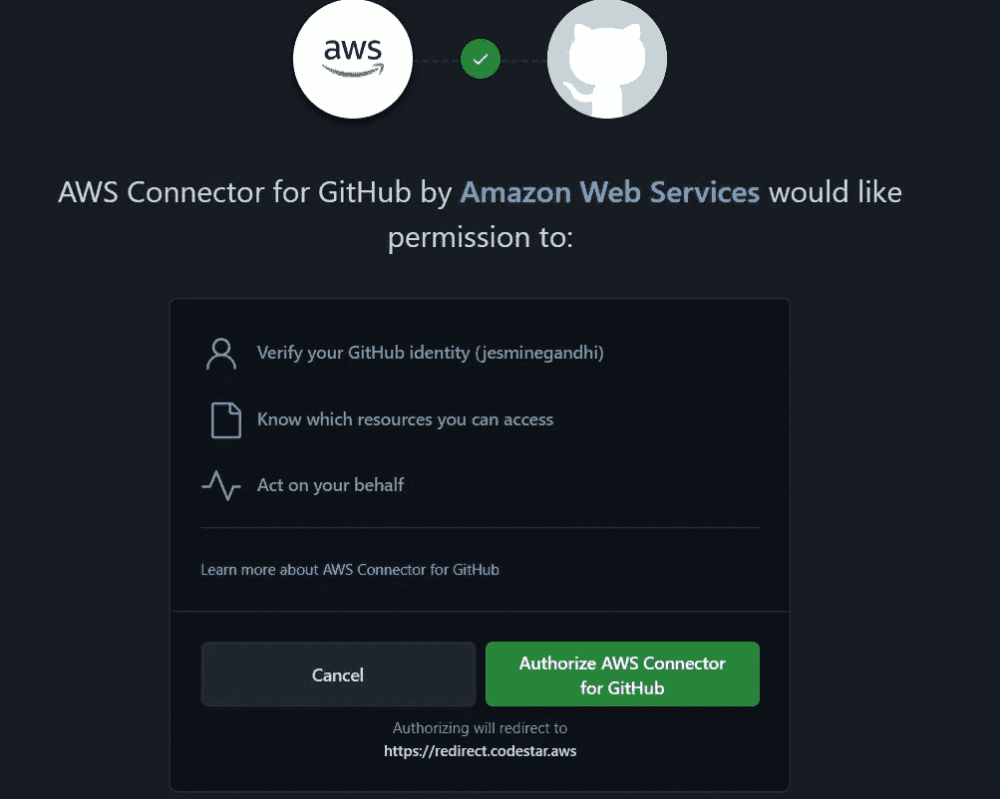**

## **步骤 5:创建 CI/CD 管道**

**导航到 AWS 管理控制台中的*“代码管道”* 。点击*【创建管道】* ***，*** 输入新管道的名称，点击【下一步】，如下图所示:**

**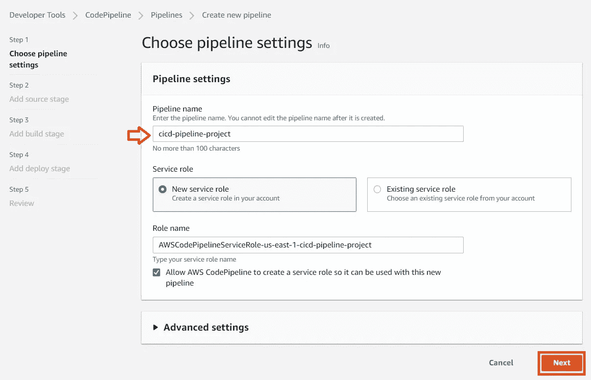**

**在源代码提供者下，选择*“GitHub(版本 2)”***。**在下拉菜单中选择您现有的 GitHub 连接。在你的 GitHub 账号中选择“*库名***”**。选择*“分行名称”*，点击*下一步*，如下图所示。**

**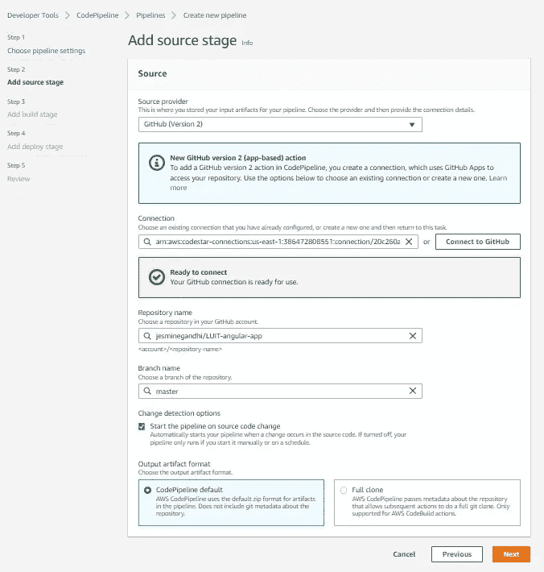**

**选择*“AWS code build”*作为构建提供者，并点击*创建项目*。**

**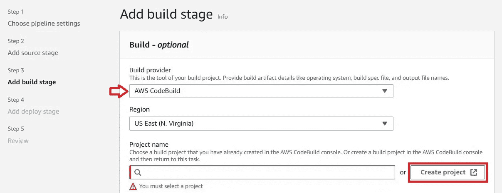**

**在项目创建下，命名您的项目，在环境下选择*“托管镜像”*，选择运行时为“*标准”*，选择镜像的最新版本，选择一个“*新服务角色*”。在“ *BuildSpec* ”下选择默认设置，然后继续流水线。**

**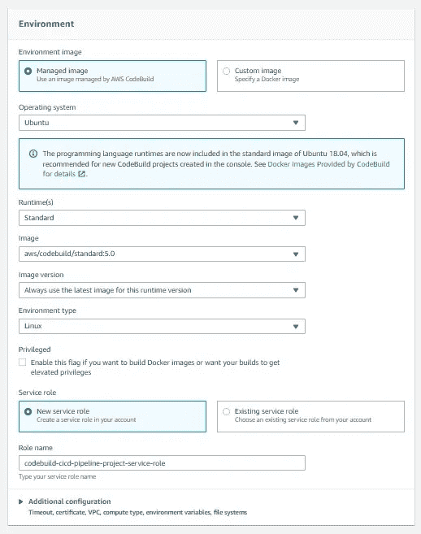**

**点击*“下一步”*继续，如下图所示:**

**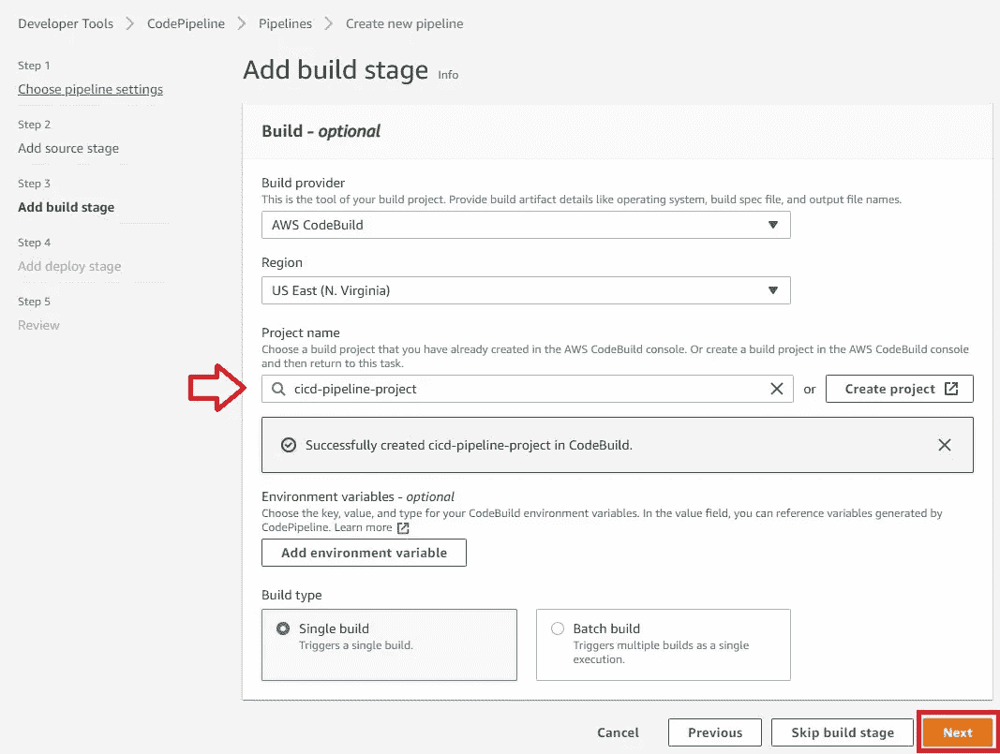**

**对于部署阶段，选择您的 S3 存储桶，如下图所示:**

**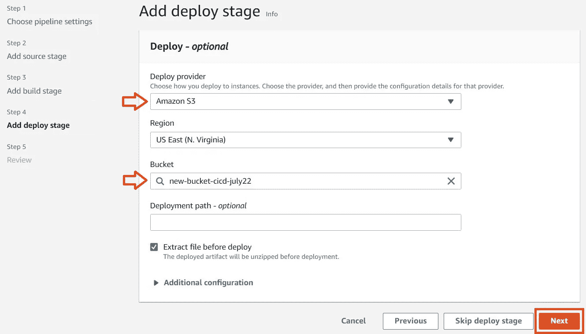**

**点击*下一步**查看你的管道，最后点击*创建管道* ***。******

***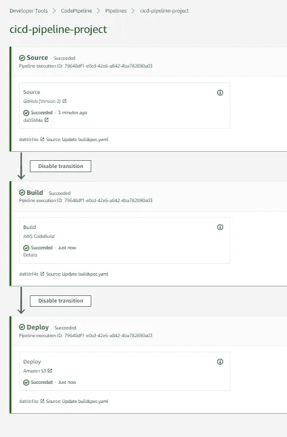***

## ***步骤 6:验证静态网站是否可访问***

***在新的浏览器标签中导航至 S3。点击 S3 木桶名称，“ *new-bucket-cicd-july22* ”。点击*属性*。滚动到页面底部，在“*静态网站托管***”**下，点击斗网站端点 URL。***

***当您单击 URL 时，应该会看到以下屏幕:***

***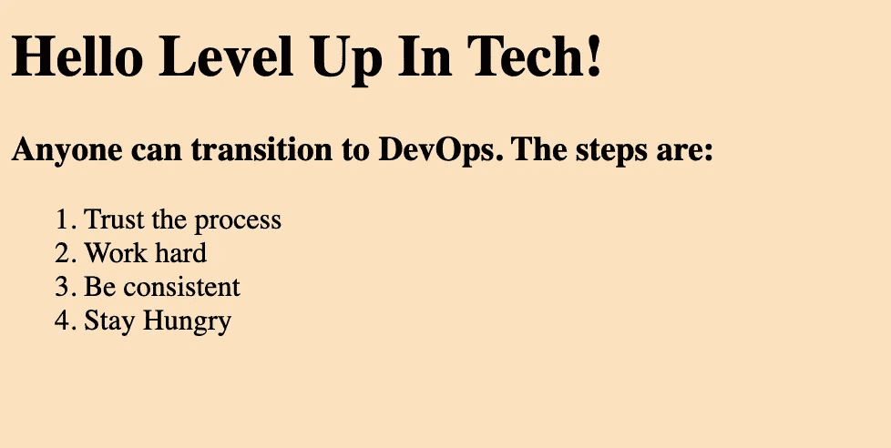***

## ***步骤 7:当您对源代码进行更改时，验证代码管道是否被触发***

***现在是时候测试我们的 CI/CD 渠道了。应该通过对任何文件进行更改来自动部署更改。为此，导航到您的 GitHub 并编辑 index.html。***

***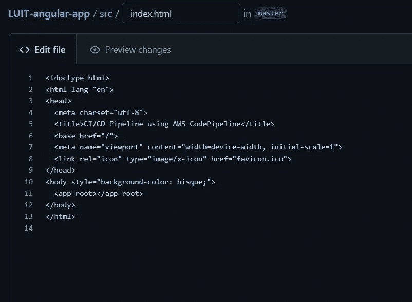***

***将代码提交并推回您的 GitHub 库***

***验证代码管道被触发并更新您的静态网站！***

******恭喜恭喜！您刚刚使用 GitHub 和 CodePipeline 构建了第一个 CI/CD 管道。******