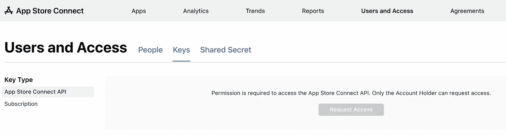
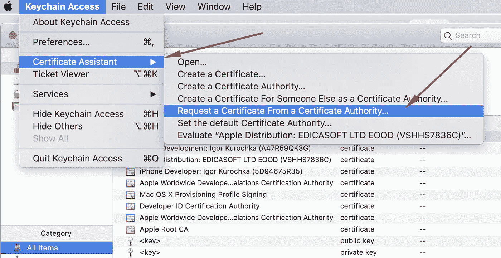
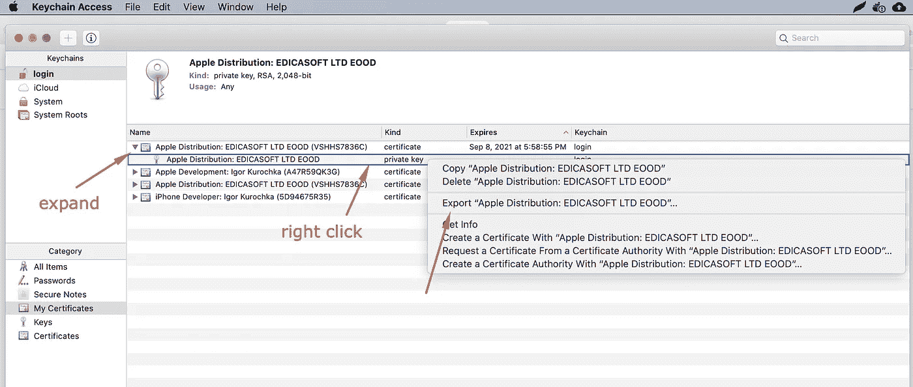
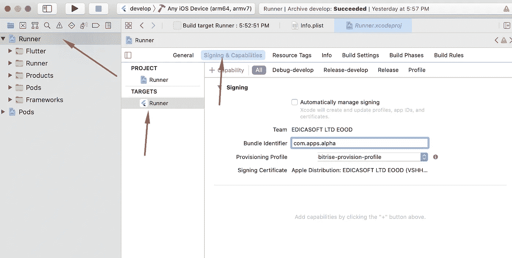
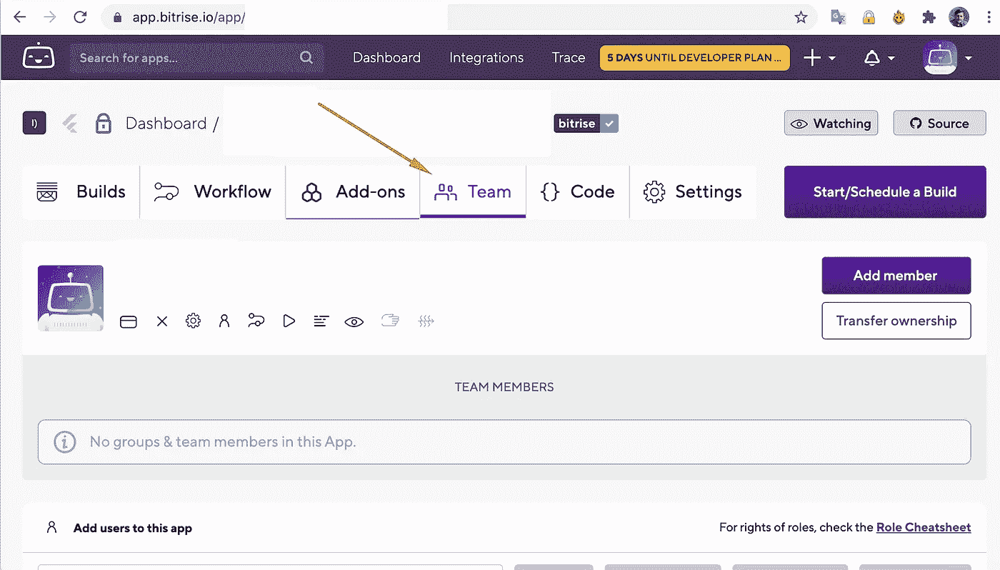
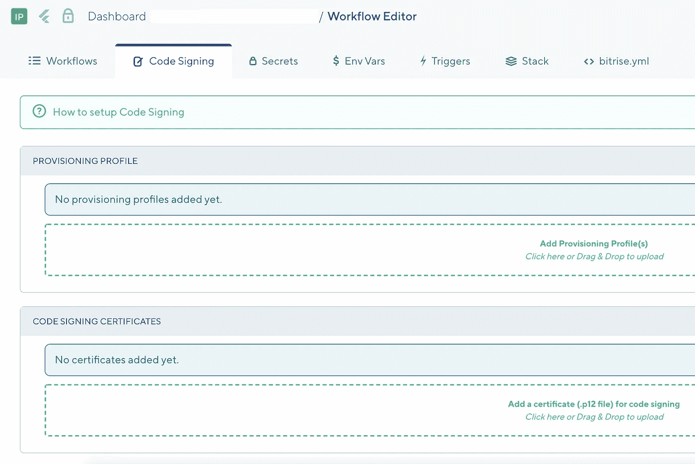

# 构建一个 Flutter iOS 应用程序，并使用 Bitrise CI/CD 平台将其部署到 Testflight

> 原文：<https://medium.com/nerd-for-tech/build-a-flutter-ios-app-and-deploy-it-to-testflight-using-bitrise-ci-cd-platform-dc1eef5f253a?source=collection_archive---------5----------------------->

Bitrise 是一个持续集成和交付(CI/CD)平台即服务(PaaS ),主要关注移动应用程序，它支持开箱即用。

他们的[文档](https://devcenter.bitrise.io/getting-started/index/)很棒，但是有些东西可能会过时，因为他们似乎经常提供新功能和更新。我在配置工作流时有些纠结，所以我决定在这篇文章中写下解决方案。

# 创建 Bitrise 应用程序

使用预定义的基本工作流创建和设置基于 flutter 的应用程序的过程非常简单直观，只需登录 Dashboard，单击“在 Web UI 上添加新应用程序”,然后按照向导步骤进行操作。在您连接 git 存储库之后，它将检测 Flutter 项目，并使用测试和构建 Flutter 应用程序的步骤预先填充工作流。

几个音符:

*   “方案名称”——您希望用于分发的“口味”的名称，例如“产品”、“发布”等
*   “选择 ipa 导出方法”——选择“应用商店”
*   “Webhook 设置”——允许 Bitrise 通过点击“为我注册一个 Webhook！”

# 更新工作流程步骤

默认情况下，向导会创建两个工作流:

*   Primary 仅运行颤振分析和颤振测试命令，该流程被配置为每当向任何分支推送时触发
*   部署—除了分析和测试之外，还通过平台的 Bitrise Apps&Artifacts 部分创建构建并发布构建。此流未配置为自动触发。

首先，我们需要解决默认配置中的一些问题:

*   “Git 克隆”步骤的插件版本已经过时。要解决这个问题，点击步骤，在“版本”部分选择“5.x.x ”,使插件保持最新发布的版本
*   “Flutter install”默认不会将 flutter sdk 更新到最新，我们需要改变这一点。单击该步骤，并将参数“更新到最新版本”更改为“真”
*   切换到“部署”工作流，并对其重复这些步骤。
*   “颤振测试”步骤可通过一些附加参数进行调整，例如`--no-sound-null-safety`。选择步骤并将参数粘贴到“附加参数”字段中
*   “颤振建设”步骤也可以用类似的方式调整。检查“iOS 平台配置”和“Android 平台配置”部分。
    增加额外的参数`--build-number $BITRISE_BUILD_NUMBER`对于在上传到 AppstoreConnect(以前的 itunesconnect)之前自动增加构建版本可能非常有用

# 设置 iOS Appstore 部署

要签署 iOS 版本并将其上传到 [AppstoreConnect](https://appstoreconnect.apple.com/) (又名 Testflight)，您需要:

*   可访问苹果开发者计划的苹果账户
*   AppstoreConnect API 密钥
*   iOS 应用程序标识符，也称为 BundleID
*   iOS 分发证书
*   App Store 分发的预置描述文件，包括这些 AppID 和分发证书

在本文中，我不会介绍加入苹果开发者计划，并假设你已经有一个苹果帐户包含在开发者帐户中。

我们需要从这个帐户创建一个应用程序特定的密码，能够使用帐户而不暴露我们的主要密码，并避免双因素认证机制。

## 创建 AppstoreConnect API 密钥

要创建 API 密钥，请转到 [AppstoreConnect](https://appstoreconnect.apple.com/) ，用户和访问，点击“密钥”选项卡

要启用使用 Connect API 的能力，您可能需要请求开发人员帐户的所有者启用该权限。

启用后，您将能够生成密钥。生成之后，下载. p8 私钥。

## 在 Bitrise 中配置 Apple 服务连接

进入 Bitrise Dashboard 并导航至[账户设置](https://app.bitrise.io/me/profile#/overview)

在左侧边栏找到“已连接的帐户”部分，然后点按“Apple 服务连接”

单击“添加连接”并上传创建的 Api 密钥，复制并粘贴发布者和密钥 id，命名连接。

## 创建应用程序 ID

要创建捆绑 ID(或应用 ID)，您需要登录到[苹果开发者账户](https://developer.apple.com/)，导航到证书、ID&配置文件→标识符部分，然后点击“+”按钮创建记录。

选择应用程序 Id，在下一步选择“应用程序”作为类型，然后在表单中填写“描述”和“捆绑包 ID”，保留“功能”的默认值，您可以稍后编辑它们。

## 创建分发证书

相同的部分，切换到子部分证书并单击“+”按钮。

选择“苹果分销”

下一步，您需要上传证书签名请求(CSR)文件。要生成它，您需要在 mac 上打开一个名为“钥匙串访问”的应用程序。使用主菜单选择证书助手→向证书颁发机构申请证书”

在打开的表单中填写您的电子邮件和姓名，选择“请求保存到磁盘”，然后将文件保存到您选择的文件夹中。

返回浏览器，将此文件上传到您停止的步骤，然后单击“继续”。

这将创建证书文件(即 distribution.cer)，下载它并通过 mac 上的“钥匙串访问”打开(只需双击它)。在“我的证书”下找到证书，并导出私钥(. p12)

保存私钥，我们以后会用到它。

## 为 App Store 分发创建预置描述文件

相同部分，切换到子部分配置文件并单击“+”按钮。

选择“分发”→“应用商店”,然后选择您刚刚创建的应用 ID 和证书，用一些能说明其用途的名称来命名配置文件(例如 myapp-bit rise-Distribution-Profile)

下载该文件并将其放在其他文件附近的某个地方，您稍后将需要该文件。

## 配置 Xcode 项目

启动 Xcode，点击“打开项目或文件”，打开 xcworkspace 文件:/path/to/flutter-project/IOs/runner . xc workspace

打开跑步者目标的“签名和能力”

确保关闭“自动管理签名”

将您的应用 ID 粘贴到捆绑包标识符中

导入您的预配配置文件

保存项目，此时 Xcode 可以关闭了

# 在 Bitrise 中配置应用程序以签名并部署到 Appstore

导航到 [Bitrise Dashboard](https://app.bitrise.io/dashboard) 并打开您之前创建的应用程序。

## 为应用程序设置 Apple 服务连接

首先，让我们选择应用程序将用来与 AppstoreConnect 对话的 Apple 服务连接。为此，请转到“团队”选项卡，向下滚动到“Apple 服务连接”部分，并选择您几分钟前添加的 API 密钥认证。

# 将预配配置文件和分发证书上传到代码签名

切换到代码签名选项卡，上传您在前面步骤中保存的文件:***。将 mobileprovision 和***.p12 移动到相应的区域。

# 配置部署工作流中的步骤

最后，导航到工作流并切换到部署工作流。

确保您有步骤证书和概要文件安装程序，不需要更改任何东西，只需要在 Flutter 构建步骤之前。

在 XCode Archive & Export 后添加新步骤，单击该步骤后的“+”，在右侧出现的搜索栏中，键入并找到部署到 iTunes Connect 插件，单击它。

在 params 中，我们唯一需要更改的是填充“App Bundle ID”的值，将我们几个步骤前创建的 App 标识符粘贴到那里。

应该就是这样了！尝试使用“部署”工作流进行构建，在所有步骤通过后，一个新的构建应该会出现在 AppstoreConnect 帐户的 Testflight 部分。

# 陷阱

在这一节中，我将列出我在设置工作流程时遇到的错误和问题，以及必须解决的方法。只是为了帮助将来可能会寻找解决方案的人。

**flutter“分析”失败**
因为“app”要求 SDK 版本> =2.12.0 < 3.0.0，版本解析失败。通过将“安装颤振”步骤的“更新到最新版本”更改为“真”来解决

**错误:无法使用健全的空安全**运行，因为以下依赖项不支持空安全:包:通过添加`--no-sound-null-safety`参数解决了 validation_extensions

**错误:{module}不支持预置描述文件** 已通过将正确的预置描述文件导入 xcproject 和 Bitrise 解决

**错误:预置描述文件“xxx-provision-profile”不包括签名证书“iPhone 开发者:Igor Kurochka (5D94675R35)”。
此外，bitrise 错误:未找到签名证书“iOS Development ”:未找到“iOS Development”
此外，未找到“name”的配置文件**
通过上传正确的配置文件配置文件以及分发证书(非开发人员证书)并将正确的证书包含在配置文件中，解决了该错误

**错误 ITMS-90189:“冗余二进制上传。**您已经上传了版本号为“1 . 0 . 0”
的内部版本号为“1”的内部版本，通过从$BITRISE_BUILD_NUMBER env 变量设置递增的版本号来解决

我希望这个教程能节省一些时间和理智。