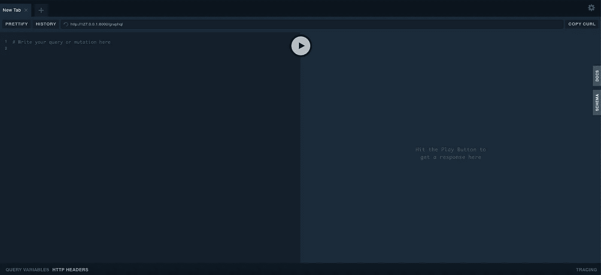
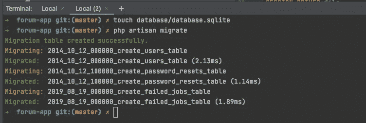
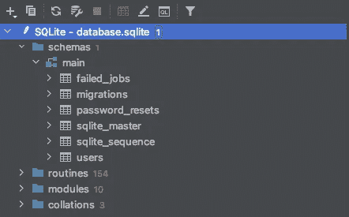
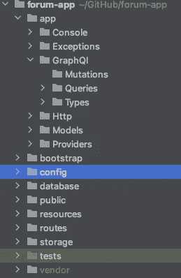
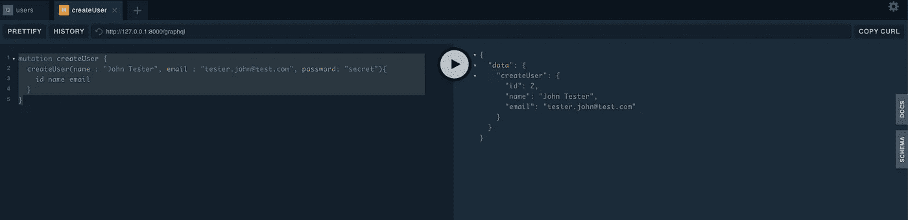
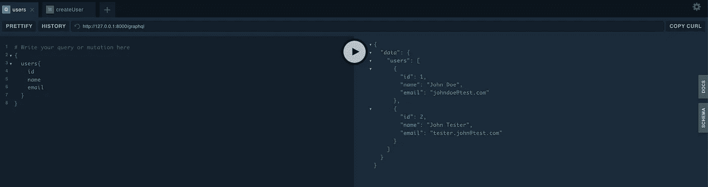

# 在 Laravel 中用 GraphQL Powered API 构建一个论坛—[第 1 部分]

> 原文：<https://medium.com/nerd-for-tech/build-a-forum-with-graphql-powered-api-in-laravel-part-1-de032d13d628?source=collection_archive---------5----------------------->

首先让我们把这个拿出来。GraphQl 是什么？三言两语大概是这样的:

GraphQL 是一种构建和访问 API 的方法，与传统的 REST API 端点相比，它具有更高的灵活性和效率。REST API 范式提供了许多端点，但这些端点中没有定制，这可能导致数据溢出/溢出。GraphQL 只提供一个端点，但是允许完全定制接收什么数据。GraphQL 完全满足了您的要求，并且以一种直观而高效的方式来实现。

更多关于 GraphQl 的信息你可以在这里找到[https://graphql.org/](https://graphql.org/)

在第一部分中，我们将介绍项目的基本设置，安装使用 GraphQl 的依赖项，并创建我们的第一个用户。

# 先决条件

1/本教程假设如下:

*   GraphQL 的基础知识
*   Laravel 的基础知识

2/此外，确保您安装了以下设备:

*   服务器端编程语言（Professional Hypertext Preprocessor 的缩写）
*   设计者
*   SQLite

# 创建新的 Laravel 项目

```
$ composer create-project --prefer-dist laravel/laravel forum-app
```

# 安装 GraphQL Laravel 库

```
composer require "rebing/graphql-laravel"
```

安装完成后，使用以下命令从`vendor`文件夹发布配置文件的副本:

```
$ php artisan vendor:publish --provider="Rebing\GraphQL\GraphQLServiceProvider"
```

一旦我们完成了依赖项的安装，我们将为 GraphQl 安装操场。这是一个帮助你测试实现的工具。

为此，我使用了这个回购[https://github.com/mll-lab/laravel-graphql-playground](https://github.com/mll-lab/laravel-graphql-playground)。您可以使用以下命令安装它。

```
composer require mll-lab/laravel-graphql-playground
```

安装完成后，我们需要发布如下配置:

```
php artisan vendor:publish --tag=graphql-playground-config
```

默认情况下，可以在[http://127 . 0 . 0 . 1:8000/graph QL-playground](http://127.0.0.1:8000/graphql-playground)中访问该链接



对于下一部分，我们将创建一个数据库，我用的是 Sqlite 数据库，这很容易，你不需要安装任何东西。要使用 sqlite，我们需要创建数据库文件，然后我们可以运行应用程序迁移。



# 定义 GraphQL 模式

一般来说，模式描述了数据的结构以及服务器上的哪些数据可以被检索。模式存在于查询和变异中。GraphQL 查询和变异之间的区别在于，查询用于获取数据，而变异用于插入/更新/删除操作。

从查询或变异返回的数据是基于为返回的对象定义的类型来构造的。

在 GraphQL 模式语言中，我们可以这样表示用户类型:

```
type User {
  id: Int!  //non-null Integer
  name: String! //non-null String
  email: String! //non-null String
}
```

GraphQL 自带了一组默认的标量类型:

*   Int:一个有符号的 32 位整数。
*   Float:有符号的双精度浮点值。
*   字符串:UTF 8 字符序列。
*   布尔值:真或假。
*   ID:ID 标量类型表示一个惟一的标识符，通常用于重新提取一个对象或作为缓存的键。ID 类型以与字符串相同的方式序列化；但是，将其定义为 ID 意味着它不适合人类阅读。

模式在 config/graphql.php 文件中定义，以描述数据是如何形成的(通过 graphql 类型)以及服务器上的哪些数据可以被查询或变异。

为了有一个逻辑，我们项目的文件夹结构应该是这样的:



让我们用相应的 PHP 格式来表示这个 GraphQL 类型。下面是代码片段:

```
use App\Models\User;
use Rebing\GraphQL\Support\Type as GraphQLType;
use GraphQL\Type\Definition\Type;

class UserType extends *GraphQLType* {

    protected $attributes = [
        'name'          => 'User',
        'description'   => 'A User',
        'model'         => User::class,
    ];

    public function fields(): array
    {
        return [
            'id' => [
                'type'          => Type::*nonNull*(Type::*int*()),
                'description'   => 'ID of the user',
            ],
            'name' => [
                'type'          => Type::*nonNull*(Type::*string*()),
                'description'   => 'Name of the user',
            ],
            'email' => [
                'type'          => Type::*nonNull*(Type::*string*()),
                'description'   => 'Email of the user',
            ],
        ];
    }
}
```

# 创建 GraphQL 查询和变异

让我们按如下方式更新 config/graphql.php 文件，以定义两个查询“user”和“users ”,并指定之前创建的 graphql 类型“User”。

```
'schemas' => [
    'default' => [
        'query' => [
            'user' => App\GraphQL\Queries\UserQuery::class,
            'users' => App\GraphQL\Queries\UsersQuery::class,
        ],
        'mutation' => [
            // ExampleMutation::class,
        ],
        'types' => [
            'User' => App\GraphQL\Types\UserType::class,
        ],
        'middleware' => [],
        'method' => ['get', 'post'],
    ],
],
```

一个基本的用户查询如下所示:

```
use App\Models\User;
use GraphQL;
use GraphQL\Type\Definition\Type;
use Rebing\GraphQL\Support\Query;
use Rebing\GraphQL\Support\SelectFields;

class UserQuery extends Query
{

    protected $attributes = [
        'name'  => 'user',
    ];

    public function type(): Type
    {
        return Type::*nonNull*(GraphQL::*type*('User'));
    }

    public function rules(array $args = []): array
    {
        return [
            'id' => [
                'required',
                'numeric',
                'min:1',
                'exists:users,id'
            ],
        ];
    }

    public function args(): array
    {
        return [
            'id'    => [
                'name' => 'id',
                'type' => Type::*int*(),
            ],
        ];
    }

    public function resolve($root, $args, SelectFields $fields)
    {
        return User::*findOrFail*($args['id']);
    }
}
```

对于像这样的用户:

```
class UsersQuery extends Query
{
    protected $attributes = [
        'name' => 'users',
    ];

    public function type(): Type
    {
        return Type::*nonNull*(Type::*listOf*(Type::*nonNull*(GraphQL::*type*('User'))));
    }

    public function args(): array
    {
        return [
            'id' => [
                'name' => 'id',
                'type' => Type::*string*(),
            ],
            'email' => [
                'name' => 'email',
                'type' => Type::*string*(),
            ]
        ];
    }

    public function resolve($root, $args, $context, ResolveInfo $resolveInfo, Closure $getSelectFields)
    {
        if (isset($args['id'])) {
            return User::*where*('id' , $args['id'])->get();
        }

        if (isset($args['email'])) {
            return User::*where*('email', $args['email'])->get();
        }

        return User::*all*();
    }
}
```

突变与查询非常相似。唯一的区别是，变异的解析函数包含修改目标对象的逻辑。

```
'schemas' => [
    'default' => [
        'query' => [
            'user' => App\GraphQL\Queries\UserQuery::class,
            'users' => App\GraphQL\Queries\UsersQuery::class,
        ],
        'mutation' => [
            'createUser' => App\GraphQL\Mutations\CreateUserMutation::class,
        ],
        'types' => [
            'User' => App\GraphQL\Types\UserType::class,
        ],
        'middleware' => [],
        'method' => ['get', 'post'],
    ],
],
```

用户的一个突变看起来像这样

```
use App\Models\User;
use GraphQL;
use GraphQL\Type\Definition\Type;
use Closure;
use GraphQL\Type\Definition\ResolveInfo;
use Rebing\GraphQL\Support\Mutation;

class CreateUserMutation extends Mutation
{
    public function args(): array
    {
        return [
            'name' => [
                'name' => 'name',
                'type' =>  Type::*nonNull*(Type::*string*()),
            ],
            'email' => [
                'name' => 'email',
                'type' =>  Type::*nonNull*(Type::*string*()),
            ],
            'password' => [
                'name' => 'password',
                'type' =>  Type::*nonNull*(Type::*string*()),
            ],
        ];
    }

    public function resolve($root, $args, $context, ResolveInfo $resolveInfo, Closure $getSelectFields)
    {
        $user = new User();

        $user->fill($args);
        $user->save();

        return $user;
    }

    public function rules(array $args = []): array
    {
        return [
            'name' => [
                'required', 'max:50'
            ],
            'email' => [
                'required', 'email', 'unique:users,email',
            ],
            'password' => [
                'required', 'string', 'min:5'
            ],
        ];
    }

    public function type(): Type
    {
        return GraphQL::*type*('User');
    }
}
```

现在，让我们执行一些查询，以确保我们的第一份实现草案能够正常工作。让我们运行一个变异来创建一个用户:

```
mutation createUser {
  createUser(name : "John Tester", email : "[tester.john@test.com](mailto:tester.john@test.com)", password: "secret"){
    id name email
  }
}
```

结果应该是这样的:



现在让我们运行并查看用户列表:



在下一部分，我们将进行身份验证，并可能创建我们的第一个线程。

回购环节:[https://github.com/mihaisolomon/forum-app](https://github.com/mihaisolomon/forum-app)

第 1 部分:[用 GraphQL 驱动的 API 构建一个论坛——构建我们的第一个查询和变异。](https://solomons.work/build-a-forum-with-graphql-powered-api-in-laravel-part-1-de032d13d628)

第 2 部分:[用 GraphQL 驱动的 API 构建一个论坛——用 passport 进行用户认证](/nerd-for-tech/build-a-forum-with-graphql-powered-api-in-laravel-part-2-auth-ede9b57a3cf0)

第 3 部分:[在 Laravel 中用 GraphQL Powered API 构建一个论坛—【第 3 部分】通道、线程和回复](/nerd-for-tech/build-a-forum-with-graphql-powered-api-in-laravel-part-3-channels-threads-and-replies-bd7423ee1c98)

第 4 部分:[线程中的搜索 Laravel 中的论坛 GraphQL Powered API【第 4 部分】](https://solomons.work/search-in-threads-forum-graphql-powered-api-in-laravel-part-4-ead4ed28b70f)