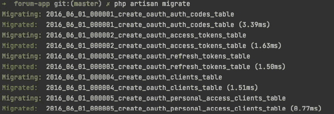
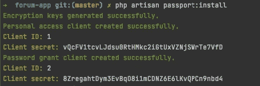
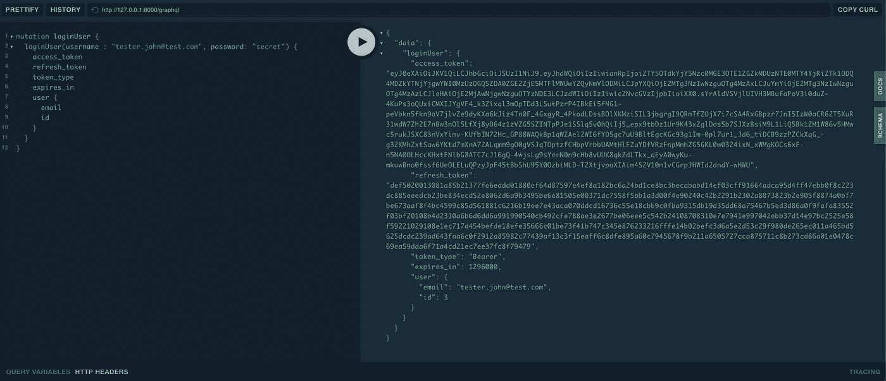
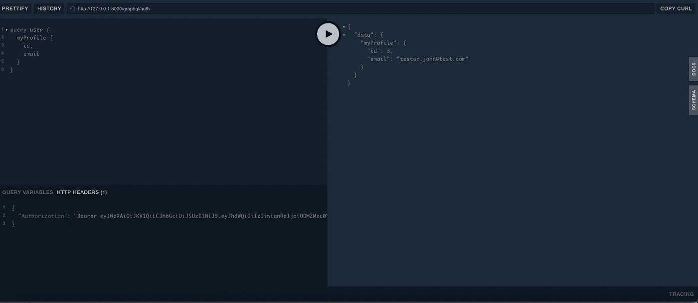

# 在 Laravel 中用 GraphQL 驱动的 API 构建一个论坛—[第 2 部分] Auth

> 原文：<https://medium.com/nerd-for-tech/build-a-forum-with-graphql-powered-api-in-laravel-part-2-auth-ede9b57a3cf0?source=collection_archive---------6----------------------->

在这一部分中，我们将讨论用户的认证。为此，我们将使用 Laravel 护照。运行以下命令来安装该软件包。

```
composer require laravel/passport
```

现在让我们从 Laravel Passport 开始配置每个包，因为我们将首先运行迁移。

```
php artisan migrate
```



运行迁移后，我们需要安装 laravel/passport，为此我们需要运行以下命令:

```
php artisan passport:install
```



然后将 HasApiTokens 特征添加到您的用户模型中

```
use Illuminate\Database\Eloquent\Factories\HasFactory;
use Illuminate\Foundation\Auth\User as Authenticatable;
use Illuminate\Notifications\Notifiable;
use Laravel\Passport\HasApiTokens;

class User extends *Authenticatable* {
    use HasApiTokens, HasFactory, Notifiable;
}
```

我们需要在 AuthServiceProvider 中添加以下引导方法:

```
public function boot()
{
    $this->registerPolicies();

    Passport::*routes*();

    Passport::*enableImplicitGrant*();

    Passport::*tokensExpireIn*(now()->addDays(15));

    Passport::*refreshTokensExpireIn*(now()->addDays(30));
}
```

让我们看看 GraphQl 模式应该是什么样子。我们已经在之前的文章中定义了用户类型。

```
type Mutation {
  loginUser(email: String!, password: String!): AuthPayload
}type AuthPayload {
  access_token: String!
  refresh_token: String!
  expires_in: Int!
  token_type: String!
  user: User!
}
```

现在让我们用 PHP 代码定义我们的 AuthPayloadType。它应该看起来像下面这样:

```
class AuthPayload extends *GraphQLType* {

    protected $attributes = [
        'name'          => 'AuthPayload',
        'description'   => 'AuthPayload response',
    ];

    public function fields(): array
    {
        return [
            'access_token' => [
                'type'          => Type::*nonNull*(Type::*string*()),
                'description'   => 'access token',
            ],
            'refresh_token' => [
                'type'          => Type::*nonNull*(Type::*string*()),
                'description'   => 'refresh token',
            ],
            'expires_in' => [
                'type'          => Type::*nonNull*(Type::*int*()),
                'description'   => 'expires in',
            ],
            'token_type' => [
                'type'          => Type::*nonNull*(Type::*string*()),
                'description'   => 'token type',
            ],
            'user' => [
                'type'          => Type::*nonNull*(GraphQL::*type*('User')),
                'description'   => 'User profile',
            ],
        ];
    }
}
```

Laravel passport 没有 GraphQl 的默认实现，为此我们需要做一些变通来获得 auth 令牌。为此，我查看了这个资源库[https://github . com/joselfonseca/light house-graph QL-passport-auth](https://github.com/joselfonseca/lighthouse-graphql-passport-auth)。为了获得访问令牌，他向 passport 端点发出请求。这些请求看起来像这样:

```
$credentials = [
'client_id' => 'test'
'scope' => '*'
'client_secret' => 'test'
'grant_type' => 'password'
'username' => 'test'
'password' => 'test'
];
$request = Request::*create*('oauth/token', 'POST', $credentials, [], [], [
    'HTTP_Accept' => 'application/json',
]);

$response = app()->handle($request);
```

在我们的例子中，我们将它包装在一个简单的服务中，该服务将会处理它，它看起来像这样:

```
class PassportService
{
    public function buildCredentials(array $args = [], $grantType = 'password'): array
    {
        $args = collect($args);
        $credentials = $args->except('directive')->toArray();
        $credentials['client_id'] = $args->get('client_id', env('PASSPORT_CLIENT_ID'));
        $credentials['client_secret'] = $args->get('client_secret', env('PASSPORT_CLIENT_SECRET'));
        $credentials['grant_type'] = $grantType;
        $credentials['scope'] = '*';

        return $credentials;
    }

    public function makeRequest(array $credentials)
    {
        $request = Request::*create*('oauth/token', 'POST', $credentials, [], [], [
            'HTTP_Accept' => 'application/json',
        ]);

        $response = app()->handle($request);

        $decodedResponse = json_decode($response->getContent(), true);

        if ($response->getStatusCode() != 200) {
            if ($decodedResponse['message'] === 'The provided authorization grant (e.g., authorization code, resource owner credentials) or refresh token is invalid, expired, revoked, does not match the redirection URI used in the authorization request, or was issued to another client.') {
                throw new AuthenticationException(__('Authentication exception'), __('Incorrect username or password'));
            }

            throw new AuthenticationException(__($decodedResponse['error']), __($decodedResponse['message']));
        }

        return $decodedResponse;
    }

}
```

到目前为止，我们创建了我们的 AuthPayload，我们制作了 passport 令牌的包装器，接下来我们需要为登录创建突变。它是这样显示的:

```
class Login extends Mutation
{
    protected PassportService $passportService;

    public function __construct(PassportService $passportService)
    {
        $this->passportService = $passportService;
    }

    public function args(): array
    {
        return [
            'username' => [
                'name' => 'username',
                'type' =>  Type::*nonNull*(Type::*string*()),
            ],
            'password' => [
                'name' => 'password',
                'type' =>  Type::*nonNull*(Type::*string*()),
            ],
        ];
    }

    public function resolve($root, $args, $context, ResolveInfo $resolveInfo, Closure $getSelectFields)
    {
        $credentials = $this->passportService->buildCredentials($args);

        $response = $this->passportService->makeRequest($credentials);

        $user = User::*where*('email', $args['username'])->first();

        return array_merge(
            $response,
            [
                'user' => $user,
            ]
        );
    }

    public function rules(array $args = []): array
    {
        return [
            'username' => [
                'required', 'email',
            ],
            'password' => [
                'required', 'string', 'min:5'
            ],
        ];
    }

    public function type(): Type
    {
        return GraphQL::*type*('AuthPayload');
    }
}
```

这样一来，让我们测试一下，看看结果。响应中应该有 access_token、refresh_token 和用户详细信息。



为了使`config/graphql.php`更具可读性，我为我们的模式创建了一些类。默认方案是这样的:

```
use Rebing\GraphQL\Support\Contracts\ConfigConvertible;

class DefaultSchema implements ConfigConvertible
{
    public function toConfig(): array
    {
        return [
            'query' => [
                'user' => UserQuery::class,
                'users' => UsersQuery::class,
            ],
            'mutation' => [
                'createUser' => CreateUserMutation::class,
                'loginUser' => Login::class,
            ],
            'types' => [
                'User' => UserType::class,
                'AuthPayload' => AuthPayload::class,
            ],
            'middleware' => [],
            'method' => ['get', 'post'],
        ];
    }
}
```

我们需要在`config/graphql.php` 模式中为登录用户定义一个受保护的区域。定义 GraphQL 端点需要模式。除了全局中间件之外，您还可以定义多个模式，并为它们分配不同的 HTTP 中间件。例如:

```
'schema' => 'default',

'schemas' => [
    'default' => [
        'query' => [
            'someQuery' => AnotherExampleQuery::class,
        ],
        'mutation' => [
            ExampleMutation::class,
        ],
        'types' => [
        ],
    ],
    'user' => [
        'query' => [
            App\GraphQL\Queries\ProfileQuery::class
        ],
        'middleware' => ['auth'],
    ],
],
```

在我们的例子中，这看起来有点不同，因为我们在类中分离了模式，它看起来像这样:

```
'schemas' => [
    'default' => \App\GraphQL\Schemas\DefaultSchema::class,
    'auth' => \App\GraphQL\Schemas\AuthSchema::class,
],
```

对于您将定义的每个模式，链接将看起来像这样[http://127 . 0 . 0 . 1:8000/graph QL/](http://127.0.0.1:8000/graphql/auth){ schema }在我们的例子中是[http://127 . 0 . 0 . 1:8000/graph QL/auth](http://127.0.0.1:8000/graphql/auth)

为了让用户登录，我们需要在请求中添加授权头，并放入获得的访问令牌。结果应该是如下所示:



回购环节:[https://github.com/mihaisolomon/forum-app](https://github.com/mihaisolomon/forum-app)

第 1 部分:[用 GraphQL 驱动的 API 构建一个论坛——构建我们的第一个查询和变异。](https://solomons.work/build-a-forum-with-graphql-powered-api-in-laravel-part-1-de032d13d628)

第 2 部分:[用 GraphQL 驱动的 API 构建一个论坛——用 passport 进行用户认证](/nerd-for-tech/build-a-forum-with-graphql-powered-api-in-laravel-part-2-auth-ede9b57a3cf0)

第 3 部分:[在 Laravel 中用 GraphQL Powered API 构建一个论坛—【第 3 部分】通道、线程和回复](/nerd-for-tech/build-a-forum-with-graphql-powered-api-in-laravel-part-3-channels-threads-and-replies-bd7423ee1c98)

第 4 部分:[线程中的搜索 Laravel 中的论坛 GraphQL Powered API【第 4 部分】](https://solomons.work/search-in-threads-forum-graphql-powered-api-in-laravel-part-4-ead4ed28b70f)