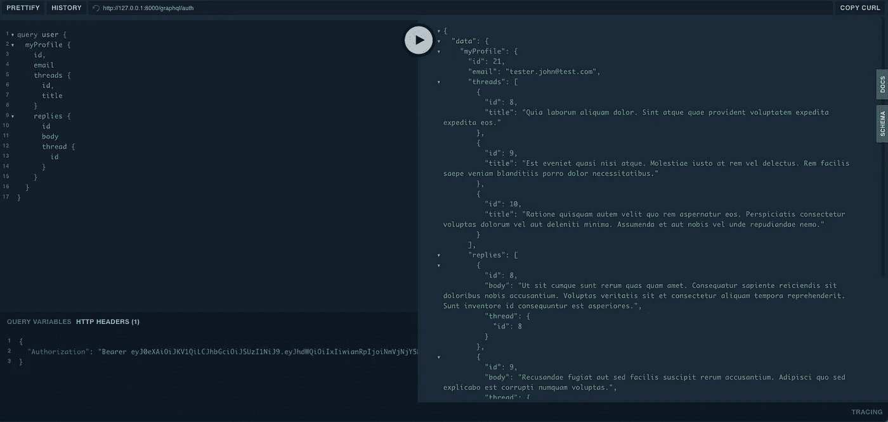
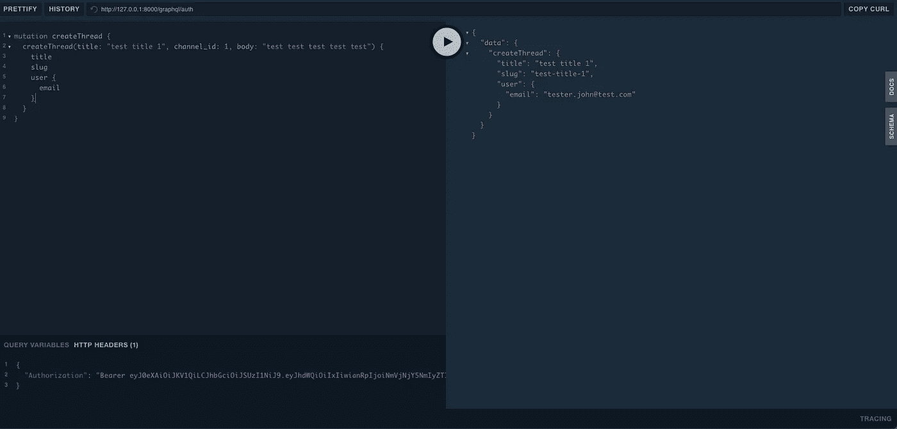

# 在 Laravel 中用 GraphQL Powered API 构建一个论坛—[第 3 部分]通道、线程和回复

> 原文：<https://medium.com/nerd-for-tech/build-a-forum-with-graphql-powered-api-in-laravel-part-3-channels-threads-and-replies-bd7423ee1c98?source=collection_archive---------11----------------------->

到目前为止，我们设法设置了我们的应用程序，创建了我们的第一个用户帐户，并构建了我们的登录。在这一部分，我们将着重于创建讨论的渠道和线索。

让我们首先回顾一下论坛的最低要求。为了构建它，我们需要用户、线程和回复。到目前为止，我们只有用户。让我们为线程、回复和通道构建模型和迁移。运行以下命令以创建模型和迁移，它将自动创建模型和迁移。

```
php artisan make:model Channel -m
php artisan make:model Thread -m
php artisan make:model Reply -m
```

迁移看起来会像这样。将使用完整的代码更新存储库。

```
Schema::create('channels', function (Blueprint $table) {
    $table->id();
    $table->string('name');
    $table->string('slug')->unique();
    $table->timestamps();
});Schema::create('threads', function (Blueprint $table) {
    $table->id();
    $table->string('slug')->unique()->nullable();
    $table->string('title');
    $table->text('body');
    $table->boolean('locked')->default(false);
    $table->timestamps();
});Schema::create('replies', function (Blueprint $table) {
    $table->id();
    $table->unsignedBigInteger('thread_id');
    $table->unsignedBigInteger('user_id');
    $table->text('body');

    $table->timestamps();
});
```

这样一来，我们需要构建我们的 GraphQl 模式。我们有这样的东西:

*   一个通道可以有多个线程
*   主题由用户创建，属于一个频道，具有多个回复
*   回复属于一个线程，也属于一个用户

渠道类型模式将类似于以下内容:

```
# A Channel
type Channel {
  # ID of the channel
  id: Int!# Name of the channel
  name: String!# Slug of the channel
  slug: String!# Channel threads
  threads: [Thread!]!
}
```

线程类型模式如下所示:

```
# A Thread
type Thread {
  # ID of the thread
  id: Int!# Slug for the thread
  slug: String!# Thread title
  title: String!# Thread content
  body: String!# Is locked
  locked: Boolean!# Creator of the thread
  user: User!# Thread replies
  replies: [Reply!]!
}
```

回复类型看起来会像下面这样:

```
# A Reply
type Reply {
  # ID of the thread
  id: Int!# Slug for the thread
  slug: String!# Thread title
  title: String!# Thread content
  body: String!# Is locked
  locked: Boolean!# Creator of the reply
  user: User!# Replied to the thread
  thread: Thread!
}
```

现在让我们为上面定义的模式类型构建我们的类型:

## 渠道类型

```
class Channel extends *GraphQLType* {
    protected $attributes = [
        'name'          => 'Channel',
        'description'   => 'A Channel',
        'model'         => *ChannelModel*::class,
    ];

    public function fields(): array
    {
        return [
            'id' => [
                'type'          => Type::*nonNull*(Type::*int*()),
                'description'   => 'ID of the channel',
            ],
            'name' => [
                'type'          => Type::*nonNull*(Type::*string*()),
                'description'   => 'Name of the channel',
            ],
            'slug' => [
                'type'          => Type::*nonNull*(Type::*string*()),
                'description'   => 'Slug of the channel',
            ],
            'threads' => [
                'type'          => Type::*nonNull*(Type::*listOf*(Type::*nonNull*(GraphQL::*type*('Thread')))),
                'description'   => 'Channel threads',
            ]
        ];
    }
}
```

## 螺纹类型

```
class Thread extends *GraphQLType* {
    protected $attributes = [
        'name'          => 'Thread',
        'description'   => 'A Thread',
        'model'         => *ThreadModel*::class,
    ];

    public function fields(): array
    {
        return [
            'id' => [
                'type'          => Type::*nonNull*(Type::*int*()),
                'description'   => 'ID of the thread',
            ],
            'slug' => [
                'type'          => Type::*nonNull*(Type::*string*()),
                'description'   => 'Slug for the thread',
            ],
            'title' => [
                'type'          => Type::*nonNull*(Type::*string*()),
                'description'   => 'Thread title',
            ],
            'body' => [
                'type'          => Type::*nonNull*(Type::*string*()),
                'description'   => 'Thread content',
            ],
            'locked' => [
                'type'          => Type::*nonNull*(Type::*boolean*()),
                'description'   => 'Is locked',
            ],
            'user' => [
                'type'          => Type::*nonNull*(GraphQL::*type*('User')),
                'description'   => 'Creator of the thread',
            ],
            'replies' => [
                'type'          => Type::*nonNull*(Type::*listOf*(Type::*nonNull*(GraphQL::*type*('Reply')))),
                'description'   => 'Thread replies',
            ]
        ];
    }
}
```

## 回复类型

```
class Reply extends *GraphQLType* {
    protected $attributes = [
        'name'          => 'Reply',
        'description'   => 'A Reply',
        'model'         => *ReplyModel*::class,
    ];

    public function fields(): array
    {
        return [
            'id' => [
                'type'          => Type::*nonNull*(Type::*int*()),
                'description'   => 'ID of the thread',
            ],
            'slug' => [
                'type'          => Type::*nonNull*(Type::*string*()),
                'description'   => 'Slug for the thread',
            ],
            'title' => [
                'type'          => Type::*nonNull*(Type::*string*()),
                'description'   => 'Thread title',
            ],
            'body' => [
                'type'          => Type::*nonNull*(Type::*string*()),
                'description'   => 'Thread content',
            ],
            'locked' => [
                'type'          => Type::*nonNull*(Type::*boolean*()),
                'description'   => 'Is locked',
            ],
            'user' => [
                'type'          => Type::*nonNull*(GraphQL::*type*('User')),
                'description'   => 'Creator of the reply',
            ],
            'thread' => [
                'type'          => Type::*nonNull*(GraphQL::*type*('Thread')),
                'description'   => 'Replied to the thread',
            ],
        ];
    }
}
```

为了在我们的表中有一些数据，我们需要创建一些虚拟内容。为此，我创建了一些工厂，它们将在您运行:`php artisan db:seed`时填充数据库。`Threads`的工厂看起来会像下面这样，其余的会在仓库里

```
class ThreadFactory extends Factory
{
    */**
     * The name of the factory's corresponding model.
     *
     ** ***@var*** *string
     */* protected $model = Thread::class;

    */**
     * Define the model's default state.
     *
     ** ***@return*** *array
     */* public function definition()
    {
        return [
            'user_id' => User::*factory*()->create()->id,
            'channel_id' => Channel::*factory*()->create()->id,
            'slug' => $this->faker->slug,
            'title' => $this->faker->text(200),
            'body' => $this->faker->paragraph,
        ];
    }
}
```

现在让我们定义我们在模型中的关系，首先是拥有线索和回复的用户:

## 用户

```
public function threads(): HasMany
{
    return $this->hasMany(Thread::class);
}

public function replies(): HasMany
{
    return $this->hasMany(Reply::class);
}
```

## 线

```
public function replies(): HasMany
{
    return $this->hasMany(Reply::class);
}public function channel(): BelongsTo
{
    return $this->belongsTo(Channel::class);
}
```

## 回答

```
public function thread(): BelongsTo
{
    return $this->belongsTo(Thread::class);
}

public function user(): BelongsTo
{
    return $this->belongsTo(User::class);
}
```

## 频道

```
public function threads(): HasMany
{
    return $this->hasMany(Thread::class);
}
```

这样一来，我们可以查询我们的个人资料，并获得我们的线程和回复，如下所示:

```
query user {
  myProfile {
    id,
    email
    threads {
     id,
      title
    }
    replies {
      id
      body
      thread {
        id
      }
    }
  }
}
```

响应将如下所示:



突变是相当直接的前言。因此，创建线程和回复的变化将如下所示。

```
type Mutation {
  createThread(title: String!, channel_id: Int!, body: String!): Thread
  createReply(thread_id: Int!, body: String!): Reply
}
```

有了这个定义，我们需要在我们的 php 代码中定义它:

```
class CreateThreadMutation extends Mutation
{
    public function args(): array
    {
        return [
            'title' => [
                'name' => 'title',
                'type' =>  Type::*nonNull*(Type::*string*()),
            ],
            'channel_id' => [
                'name' => 'channel_id',
                'type' =>  Type::*nonNull*(Type::*int*()),
            ],
            'body' => [
                'name' => 'body',
                'type' =>  Type::*nonNull*(Type::*string*()),
            ],
        ];
    }

    public function rules(array $args = []): array
    {
        return [
            'title' => [
                'required'
            ],
            'channel_id' => [
                'required',
            ],
            'body' => [
                'required', 'string', 'min:5'
            ],
        ];
    }

    public function resolve($root, $args, $context, ResolveInfo $resolveInfo, Closure $getSelectFields)
    {
        $thread = new Thread();

        $args['user_id'] = auth()->user()->id;
        $args['slug'] = Str::*slug*($args['title']);

        $thread->fill($args);

        $thread->save();

        return $thread;
    }

    public function type(): Type
    {
        return GraphQL::*type*('Thread');
    }
}
```

变异结果将类似于以下内容:



回复和通道的实现与此类似。回购将用其余部分进行更新。

在下一部分中，我们将使用 MySql 全文讨论线程中的搜索。

回购链接:【https://github.com/mihaisolomon/forum-app 

第 1 部分:[用 GraphQL 驱动的 API 构建一个论坛——构建我们的第一个查询和变异。](https://solomons.work/build-a-forum-with-graphql-powered-api-in-laravel-part-1-de032d13d628)

第 2 部分:[用 GraphQL 驱动的 API 构建一个论坛——用 passport 进行用户认证](/nerd-for-tech/build-a-forum-with-graphql-powered-api-in-laravel-part-2-auth-ede9b57a3cf0)

第 3 部分:[在 Laravel 中用 GraphQL Powered API 构建一个论坛—【第 3 部分】通道、线程和回复](/nerd-for-tech/build-a-forum-with-graphql-powered-api-in-laravel-part-3-channels-threads-and-replies-bd7423ee1c98)

第四部分:[线程中的搜索—论坛 GraphQL 提供的 Laravel 中的 API【第四部分】](https://solomons.work/search-in-threads-forum-graphql-powered-api-in-laravel-part-4-ead4ed28b70f)