# 用 PyCaret 建立机器学习模型，用 Gradio 建立相应的用户界面

> 原文：<https://medium.com/nerd-for-tech/build-a-machine-learning-model-with-pycaret-and-corresponding-user-interface-with-gradio-57ff09b7d262?source=collection_archive---------2----------------------->

# 问题陈述和目标

想象你在一家保险公司做数据科学家。您的经理要求您提出一个数据科学解决方案，以估算在机构中购买健康保险的个人的医疗成本。**建立机器学习模型，估算个人的医疗成本**。


# PyCaret

[PyCaret](https://pycaret.org/) 是一个开源、低代码的机器学习库和端到端的模型管理工具，内置于 Python 中，用于自动化机器学习工作流。它因其易用性、简单性以及快速有效地构建和部署端到端 ML 原型的能力而广受欢迎。

PyCaret 是一个替代的低代码库，可以用来用几行代码替换数百行代码。这使得实验周期成倍地快速和有效。

py caret**简单** **好用**。PyCaret 中执行的所有操作都顺序存储在一个**管道**中，该管道对于**部署是完全自动化的。**无论是输入缺失值、一键编码、转换分类数据、特征工程，甚至是超参数调整，PyCaret 都能实现自动化。

# 格拉迪欧

[Gradio](https://www.gradio.app/getting_started) 是一个开源的 Python 库，用于围绕你的机器学习模型创建可定制的 UI 组件。Gradio 可以让您轻松地在浏览器中“摆弄”您的模型，方法是拖放您自己的图像、粘贴您自己的文本、录制您自己的声音等。，并查看模型输出的内容。

Gradio 适用于:

*   围绕您训练有素的 ML 渠道创建快速演示
*   获得关于模型性能的实时反馈
*   在开发过程中交互式调试您的模型

## 正在安装 Pycaret

```
**%%capture #suppresses the displays
# install the full version
pip install pycaret[full]**
```

*通过安装 pycaret 的完整版，此处* *列出的所有可选依赖项* [*也被安装。*](https://github.com/pycaret/pycaret/blob/master/requirements-optional.txt)

## 安装 Gradio

```
**pip install gradio**
```

## 导入必要的包

```
**import pandas as pd
import numpy as np
import matplotlib.pyplot as plt
import seaborn as sns
# 
import pycaret
from pycaret.regression import ***
```

## 下载与问题陈述相关的数据

```
**train = pd.read_csv("train.csv")
test = pd.read_csv("test.csv")
sub = pd.read_csv("Sample_Submission.csv")
# display first 5 samples of the training data
train.head()**
```

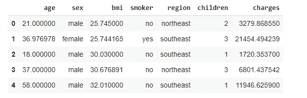

## 数据预处理

*   *将主要受益人的年龄四舍五入至最接近的整数*
*   *身体质量指数身体质量指数是体重与身高的比率。根据体重指数将人分为体重不足、正常、超重和肥胖。*

```
**** Underweight: [0–18.5)******* Normal : [18.5, 25)******* Overweight : [25, 30)******* Obese : [30+]***
```

*   *创建一个新的特征 age_category 来存储年龄*

```
**** Infant: [0–2)******* Toddler : [2, 5)******* Child : [5, 13)******* Teen : [13- 20)******* Adult : [20, 40)******* Middle Age : [40, 60)******* Senior : [60+]***
```

## 密码

```
**train[‘age’] = train[‘age’].round().astype(int)
test[‘age’] = test[‘age’].round().astype(int)
#
#Define Function to define body category
def group_bmi(x):
 if x >= 0 and x <= 18.5:
 return ‘underweight’
 elif x > 18.5 and x <= 25:
 return “normal”
 elif x > 25 and x <= 30:
 return “overweight”
 else:
 return “obese”
#
train[‘body_category’] = train[‘bmi’].apply(lambda x : group_bmi(x))
test[‘body_category’] = test[‘bmi’].apply(lambda x : group_bmi(x))
#
# Define function to define the age category
def age_bin(x):
  if x >= 0 and x < 2:
    return "infant"
  elif x >= 2 and x< 5:
    return "toddler"
  elif x >=5 and x < 13:
    return "child"
  elif x >= 13 and x < 20:
    return "teen"
  elif x >= 20 and x < 40 :
    return "adult"
  elif x >= 40 and x < 60:
    return "middle_aged"
  else:
    return "senior"****train['age_group']  = train['age'].apply(lambda x : age_bin(x) )
test['age_group'] = test['age'].apply(lambda x : age_bin(x) )**
```

## 从数据可视化中获得洞察力

```
**sns.set_style(‘darkgrid’)
plt.figure(figsize=(12,8))
sns.lineplot(x=’age’,y=’charges’,data=train)**
```

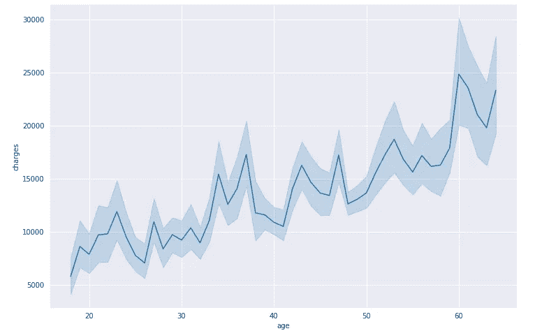

随着年龄的增长，医疗费用也在增加

```
sns.displot(train, x= “charges”, hue= “smoker”, kind=”kde”, fill=True)
```

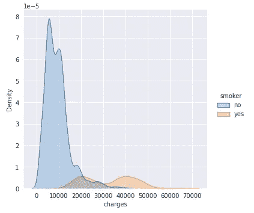

```
sns.set_style(‘darkgrid’)
plt.figure(figsize=(12,8))
sns.lineplot(x=’age’,y=’charges’,data=train,hue=’smoker’)
```

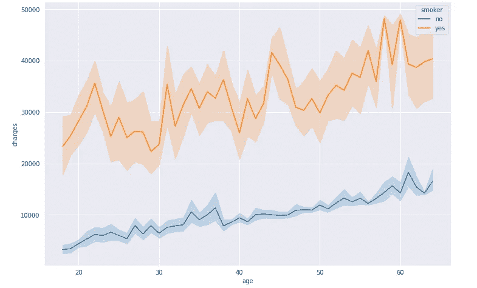

不吸烟者和吸烟者之间的医疗费用似乎有明显的界限

```
plt.figure(figsize=(12,8))
sns.countplot(x=’body_category’,data=train,hue=’sex’ )
```

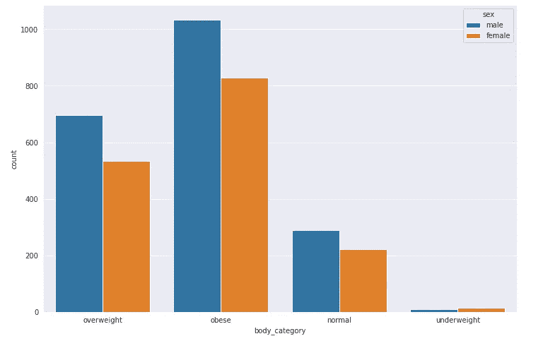

```
sns.set_style(‘darkgrid’)
plt.figure(figsize=(12,8))
sns.lineplot(x=’age’,y=’charges’,data=train,hue=’age_group’)
```

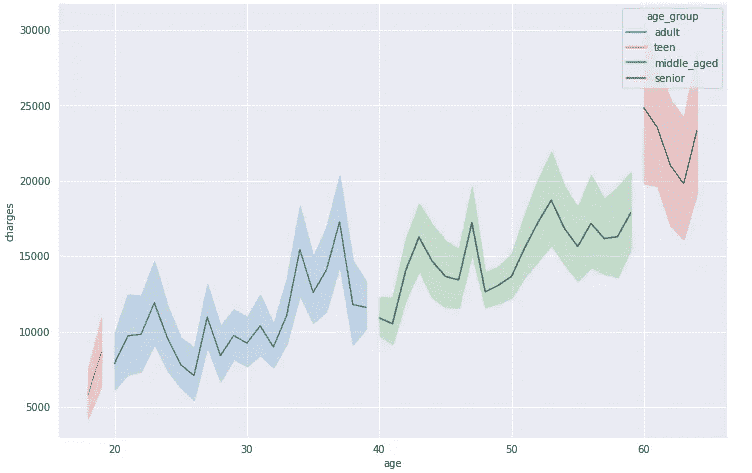

# pycaret 建模和推理入门

## 初始化设置

```
**reg = setup(data = train, 
            target = ‘charges’,
            use_gpu =True,
            preprocess=True,
            log_data=True,
            log_experiment=True,
            normalize=True)**
```

PyCaret 中的函数，对数据集进行剖析，并推断所有输入要素的数据类型。这是在 PyCaret 中开始任何机器学习实验的第一步，也是唯一的强制步骤。

## 比较模型

此函数使用默认超参数训练模型库中所有可用的模型，并使用交叉验证评估性能指标。可使用`fold`参数定义折叠次数(默认= 10 次折叠)。表格按照选择的度量标准进行排序(从最高到最低)，选择的度量标准可以使用`sort`参数来定义(在本例中，我们在 RMSE 上对其进行了排序)

`n_select`设置功能中的参数控制已训练模型的返回。在本例中，我将它设置为 15，这意味着以列表的形式返回前 15 个模型。第二行中的`pull`函数将`compare_models`的输出存储为`pd.DataFrame`。

```
best = compare_models(n_select = 15,sort=’RMSE’)
compare_model_results = pull()
```

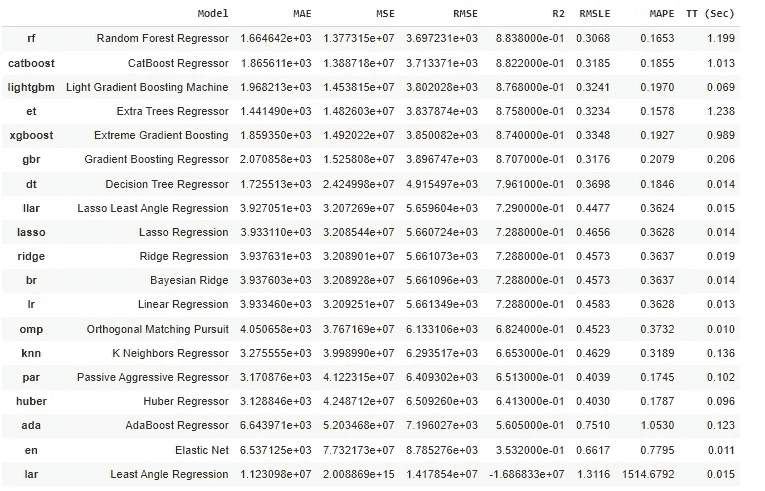

因为 RandomForestregressor 被评估为具有相对较好的 RMSE，所以让我们使用 RandomForestregressor 来构建模型

```
**rf = create_model(‘rf’)**
```

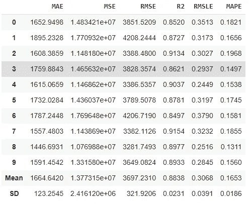

## 超参数调谐

```
**tuned_rf = tune_model(rf,optimize = ‘RMSE’,search_library = ‘optuna’)**
```

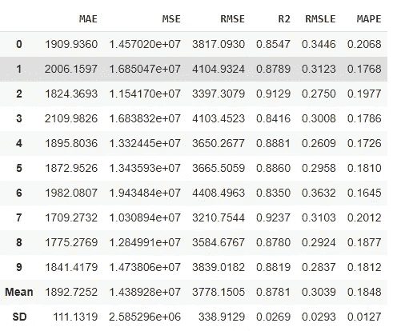

利用 Optuna 选择最佳超参数

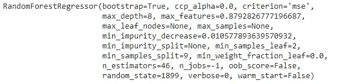

## 分析模型性能

```
plot_model(tuned_rf)
```

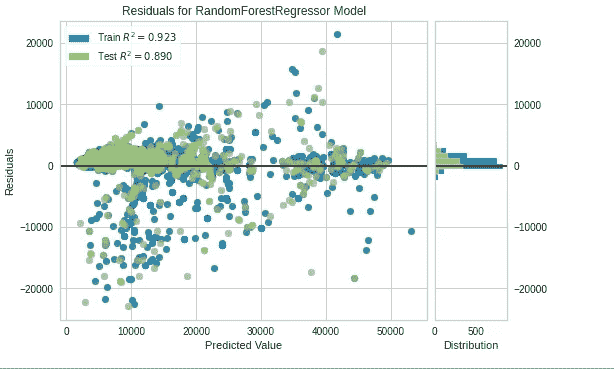

## 解释结果

在 PyCaret 中，我们只用一行代码就可以通过 SHAP 值和相关图来解释模型

```
interpret_model(tuned_rf)
```

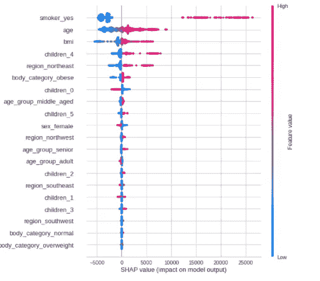

## 评估模型

如果我们不想单独绘制所有这些可视化效果，那么 PyCaret 库有另一个惊人的功能—***evaluate _ model***。在这个函数中，您只需要传递模型对象，PyCaret 将为您创建一个交互式窗口，以所有可能的方式查看和分析模型:

```
evaluate_model(tuned_rf)
```

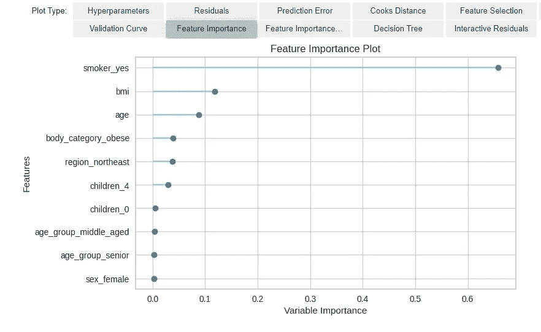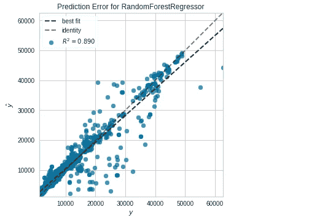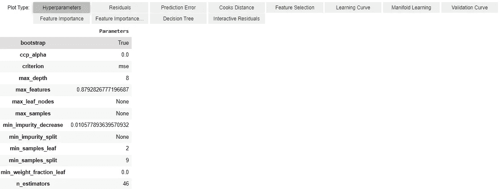

## 评估用于验证的维持集的模型

```
val_rf_pred = predict_model(tuned_rf)
```


所做的预测(标签)如下

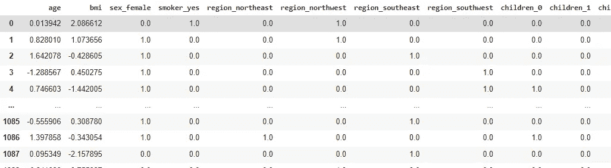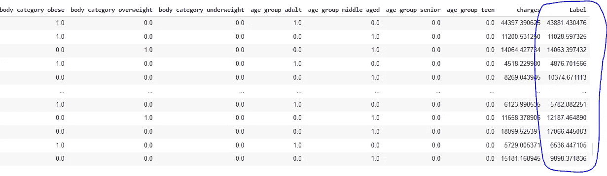

## 根据测试数据进行预测

```
# predictions on new dataset
pred_new_rf = predict_model(tuned_rf, data = test) #new_data is pd dataframe
pred_new_rf = pred_new_rf.rename(columns={‘Label’:’prediction’})
pred_new_rf
```

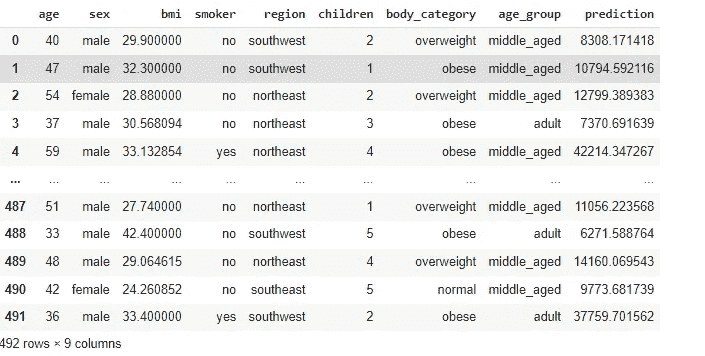

RandomForestRegressor 提交分数(RMSE):53660 . 68668686666

# 使用 PyCaret 构建集合模型

机器学习中的集成模型结合了来自多个模型的决策，以提高整体性能。在 PyCaret 中，我们只需要一行代码就可以创建打包、增强、混合和堆叠整体模型。在这里，我们将尝试混合。

混合模型是一种集成方法，它使用估计者之间的共识来生成最终预测。混合背后的想法是结合不同的机器学习算法，并在分类的情况下使用多数投票或平均预测概率来预测最终结果。

```
# train a voting regressor dynamically
blender_specific = blend_models(estimator_list = compare_models(n_select = 5))
```

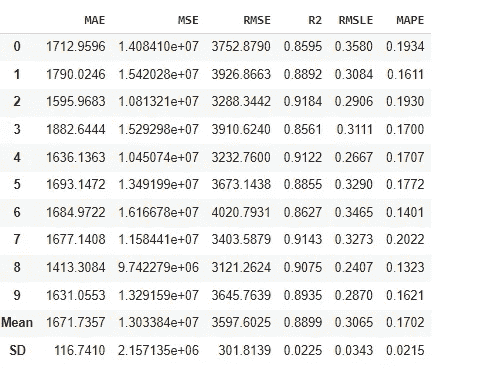

校准后的混合模型如下

```
blender_specific
```

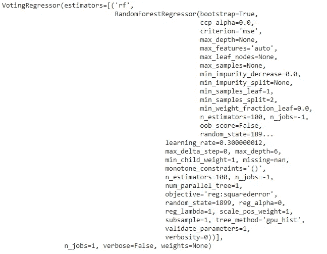

## 在 PyCaret 中分析模型性能

```
plot_model(blender_specific)
```

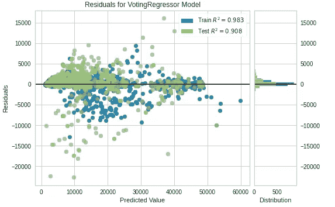

## 评估模型性能

```
evaluate_model(blender_specific)
```

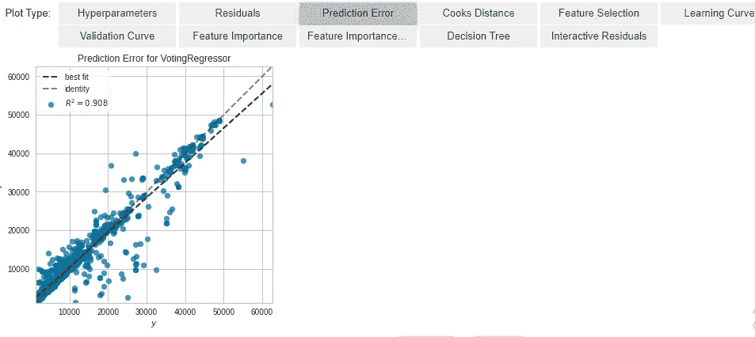

## 对验证集进行预测

```
val_pred = predict_model(blender_specific)
```

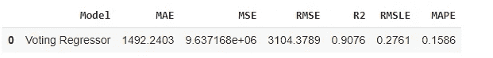

*   投票回归显示了改进的 R2 分数和 RMSE

## 根据看不见的数据做出预测

```
# predictions on new dataset
pred_new = predict_model(blender_specific, data = test) #new_data is pd dataframe
pred_new = pred_new.rename(columns={‘Label’:’prediction’})
pred_new
```

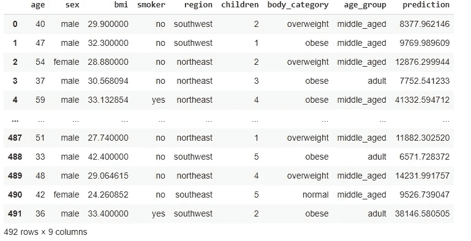

*   投票回归器提交分数为 4084.5919179367957。与其他模型相比，该分数更好。

## 保存并加载模型

```
save_model(blender_specific , ‘/content/drive/MyDrive/blender_specific_saved_06142021’)
# Loading the saved model
blend_saved = load_model(‘/content/drive/MyDrive/blender_specific_saved_06142021’)
pred = blend_saved.predict(test)
pred[:5]
```

## 使用 Gradio 为 ML 模型创建界面

现在我们已经完成了建模过程，我们现在使用 Gradio 创建一个简单的 UI 来与我们的模型进行交互。

```
import gradio as gr
```

## 创建预处理函数

该功能对数据进行预处理

```
def encode_attributes(df): # Binning ages 
 df[‘body_category’] = df[‘bmi’].apply(lambda x : group_bmi(x)) 
 df[‘age_group’] = df[‘age’].apply(lambda x : age_bin(x) )
 return df
```

## 创建预测函数

```
def predict_charges(age, bmi,sex,smoker,region,children):
 df = pd.DataFrame.from_dict({‘sex’: [sex], ‘age’: [age], ‘smoker’: [smoker],’bmi’:[bmi],’region’:[region],’children’:[children]})
 df = encode_attributes(df)
 pred = blend_saved.predict(df).tolist()[0]
 return ‘charges : ‘+str(pred)+” in rupees”
```

## 构建可共享的用户界面

Gradio 可以用一个易于使用的接口包装几乎任何 Python 函数。该函数可以是任何东西，从简单的税收计算器到预先训练的模型。

核心`Interface`类用三个参数初始化:

*   `fn`:换行功能
*   `inputs`:输入组件类型
*   `outputs`:输出组件类型

```
sex = gr.inputs.Radio([‘female’, ‘male’], label=”sex”)
smoker = gr.inputs.Radio([‘no’, ‘yes’], label=”smoker”)
children = gr.inputs.Radio([2, 3, 1, 4, 5, 0], label=”children”)
region = gr.inputs.Radio([‘northeast’, ‘southeast’, ‘northwest’, ‘southwest’], label=”region”)
age = gr.inputs.Slider(minimum=15, maximum=75, default=16, label=”age”)
bmi = gr.inputs.Slider(minimum=15, maximum=60, default=16, label=”bmi”)
```

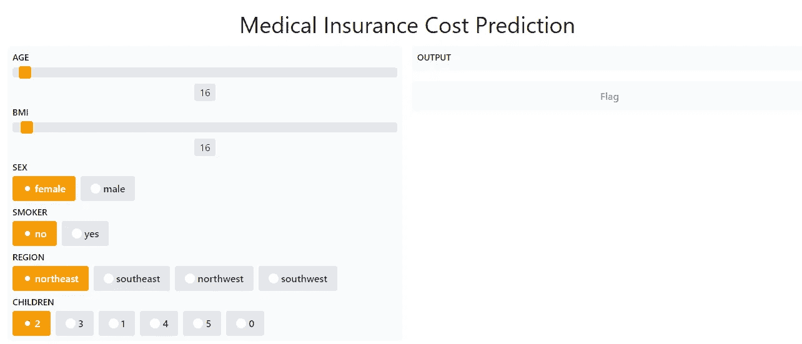

可定制的组件

```
gr.Interface(predict_charges, inputs=[age, bmi,sex,smoker,region,children], 
 outputs=”label”,
 title=”Medical Insurance Cost Prediction”,
 capture_session=True,
 live=True).launch();
```

上面的界面会自动出现在 Python 笔记本中，或者如果从脚本运行，会弹出一个带有 url 链接的浏览器。

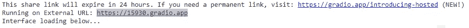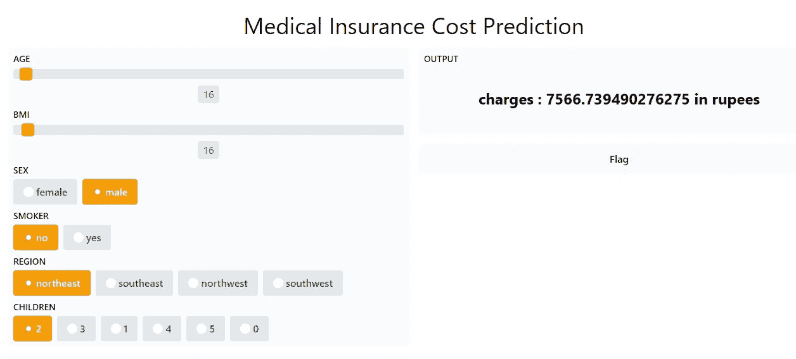

模型对用户界面中所选参数的预测

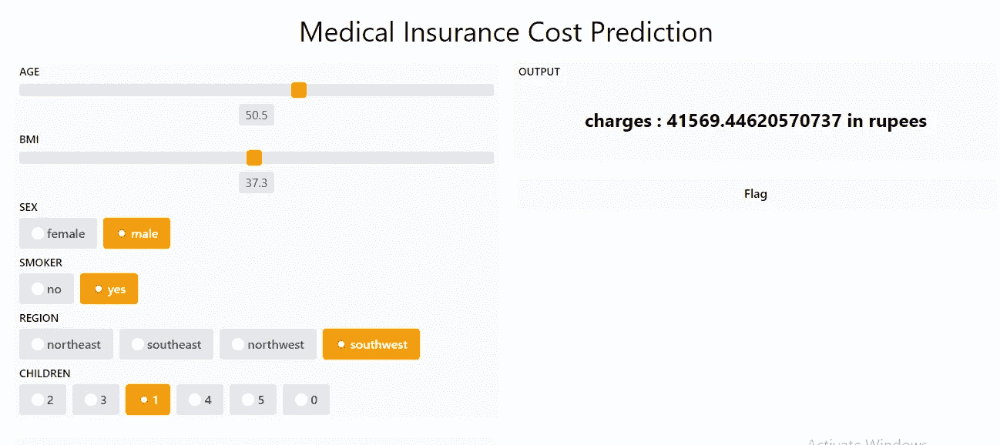

模型对用户界面中所选参数的预测

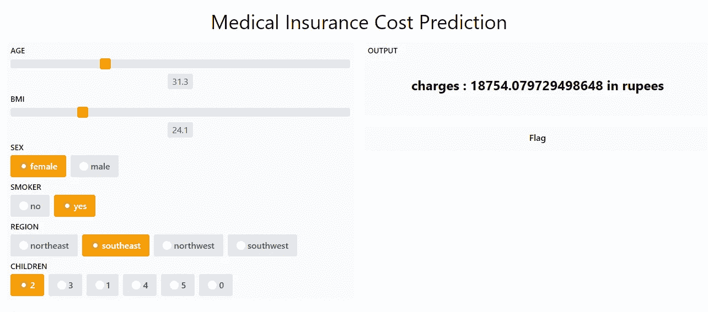

模型对用户界面中所选参数的预测

在这里，只需几行代码，我们就可以开发一个下降 UI，与开发的模型进行交互。又快又省事。

## 结束注释

它真的很容易使用。我个人发现 PyCaret 对于在黑客马拉松或项目中快速生成结果非常有用，在这些项目中，我们有一个紧凑的时间表，并且需要比较不同的模型方法。它还有助于用几行代码更快地选择超参数和特性。所以所有的初始步骤都由 Pycaret 负责。

## 参考

[](https://dphi.tech/challenges/data-sprint-37-medical-insurance-cost/127) [## 数据冲刺#37:医疗保险费用| DPhi

### 通过解决模拟现实世界问题的数据科学和人工智能挑战来竞争和展示您的技能。组织…

dphi.tech](https://dphi.tech/challenges/data-sprint-37-medical-insurance-cost/127) [](https://towardsdatascience.com/pycaret-2-2-is-here-whats-new-ad7612ca63b) [## PyCaret 2.2 已经发布了，有什么新消息吗？

### 我们很高兴宣布 py caret 2.2—2020 年 10 月的更新。

towardsdatascience.com](https://towardsdatascience.com/pycaret-2-2-is-here-whats-new-ad7612ca63b) [](https://www.gradio.app/) [## 格拉迪欧

### 亲爱的#机器学习 twitter，如果你还没有输入:$ 𝚙𝚒𝚙 𝚒𝚗𝚜𝚝𝚊𝚕𝚕 𝚐𝚛𝚊𝚍𝚒𝚘yet，现在将是一个该死的好…

www.gradio.app](https://www.gradio.app/) 

[*跟我联系*](https://www.linkedin.com/in/plaban-nayak-a9433a25/)