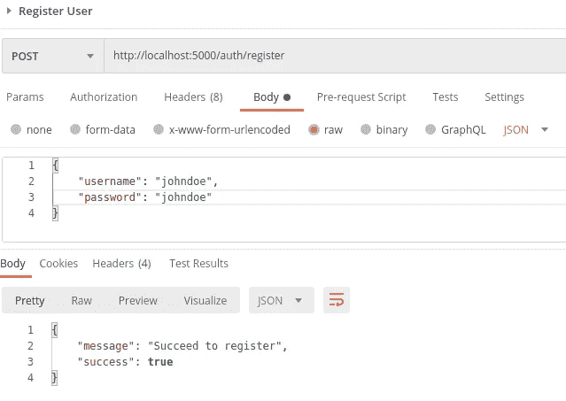
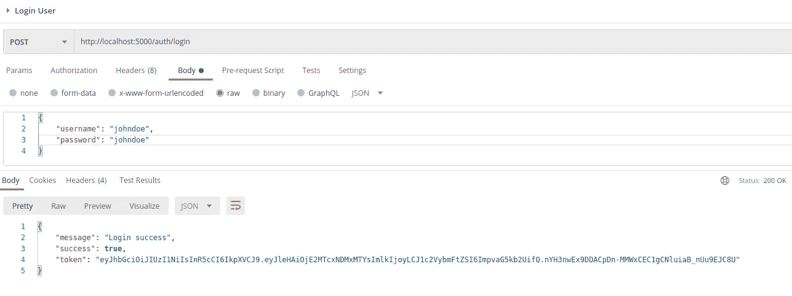

# 使用 gRPC、Python 和 Golang 构建微服务应用程序(第 2 部分)

> 原文：<https://medium.com/nerd-for-tech/build-a-microservice-app-using-grpc-python-and-golang-part-2-ac93541e4d0d?source=collection_archive---------4----------------------->


照片由 [OMID 视觉效果](https://unsplash.com/@omidvisuals?utm_source=medium&utm_medium=referral)在 [Unsplash](https://unsplash.com?utm_source=medium&utm_medium=referral) 上拍摄

欢迎回到本教程的第二部分。我们将继续使用 gRPC、Python 和 Golang 学习和构建应用程序的旅程。这一次，我们重点关注身份验证服务的实现细节。让我们开始…

# 认证服务器

首先，我们必须创建认证服务，我们使用的语言将是 Golang。然后，我们将这个服务连接到主服务。现在，确保您在根文件夹中。顺便说一下，如果您更喜欢将这个项目的服务分离到它自己的存储库中，那也没问题。在这种情况下，为了方便起见，我将它们放在一个存储库中。

让我们将这个服务命名为`auth`，初始化 golang 项目并安装所需的依赖项，或者您可以在这里查看如何设置项目[https://grpc.io/docs/languages/go/quickstart/](https://grpc.io/docs/languages/go/quickstart/)。

```
go mod init auth      # the name will be auth
go get google.golang.org/protobuf/cmd/protoc-gen-go **\
**         google.golang.org/grpc/cmd/protoc-gen-go-grpc
```

现在，创建 *main.go* 文件，然后编写某种占位符来确保我们已经正确初始化了应用程序。

这么原始的权利？:)

在我们开始在 proto 文件中编写一些代码并在 Golang 中生成相应的代码之前，我们必须设置一些配置和数据库。

现在，创建一个名为`grpc_auth`的数据库，我们将这个服务连接到`grpc_auth`数据库。然后，创建一个名为`users`的表。这是每次注册新用户时用户数据的存放位置。你可以使用这个查询来创建`users`表。

```
CREATE TABLE public.users (id serial NOT NULL,username varchar(128) NULL,"password" varchar(256) NULL,CONSTRAINT users_pkey PRIMARY KEY (id));
```

创建一个名为 config 的文件夹，并在其中创建一个名为`database.go`的文件。

函数`getDBConnection`负责建立数据库，函数`ConnectDB`将被导入到主文件中，并被调用来建立与数据库的连接。

接下来，创建一个名为 repository 的文件夹，并在其中创建一个名为`user.go`的文件。这样做的目的是作为我们用来对数据库进行一些改变或查询的接口。通过这样做，我想在我的代码中实现关注点分离的概念。

在这个文件中，我们创建了一个名为`userRepository`的结构和一个名为`UserRepository`的接口。然后我们定义了它下面的接口方法(`CreateUser`和`GetUserByUsername`)。请注意，我们在这些方法中不做任何事情，所以我们必须在稍后定义 proto 文件后回到这里。但是，在跳到下一部分之前，在第 31 行我们有`models.User`，但是这是什么东西呢？让我们创造这个“东西”。

创建一个名为 models 的文件夹，并在其中创建一个名为`user.go`的文件。

这么短的一段代码，对吧？这里，我们刚刚定义了表示用户的结构。

在那之后，另一段用于分离关注点的代码是`usecase`。创建一个名为`usecase`的文件夹，并在其中创建一个名为`user.go`的文件。和`repository`差不多，但是任务不同，你会看到的。

现在，我们让这个`usecase`文件保持原样，稍后我们将回到这里实现真正的东西。

现在，是时候定义 proto 文件并在 Golang 中生成相应的代码了。生成的代码将被用作 gRPC 的服务器部分，当我们从客户端(main-service)调用某个过程时，它会给出我们需要的响应。

在根文件夹中创建一个名为`auth.proto`的文件。

以上是`auth.proto`的内容。我们用的是 protobuf 语言版本 3，包的名字是`auth`。可能你不需要`option`，但是在这种情况下，我需要它，否则它会给我一个错误。

简单地说，我们必须定义一个过程看起来是什么样子，以及它需要的参数和返回值。我们将使用这个原型文件来生成服务的服务器和客户机。例如，在客户端，我们想调用`Register`(基本上是一个远程过程)，然后我们必须给它一个参数(`RegisterRequest`)，它将返回`RegisterResponse`。

要生成过程代码，我们必须运行以下命令。但是在此之前，创建一个名为`auth`的文件夹，它将是所生成代码的输出目标。

```
protoc --go_out=./auth --go_opt=paths=source_relative \--go-grpc_out=./auth --go-grpc_opt=paths=source_relative \./auth.proto
```

原型编译器将在当前目录中查找名为`auth.proto`的文件，并将输出返回到名为`auth`的文件夹中。

运行这个命令后，您将拥有两个名为`auth.pb.go`和`auth_grpc.pb.go`的文件。我们不会直接使用这段代码或者改变里面的任何东西，事实上，你会在文件顶部看到一个警告`DO NOT EDIT`。

接下来，在`auth`文件夹中创建一个名为`auth.go`的文件。在这里，我们将定义这些过程是如何工作的。

同样，因为我们一点一点地提供服务，所以我们必须回到这里定义真实的东西。在这个文件中，我们定义了三个与 proto 文件定义中相同的过程，因为基本上在这里我们将生成的代码实现成我们需要的样子。注意我放了`UnimplementedAuthServiceServer`，原因是为了向前兼容的实现。

现在，让我们改变一下`main.go`。

这里，我们连接到数据库，初始化`repository`、`usecase`和`server`，在第 25 行注册服务服务器，在第 27 行打开`tcp`连接，在第 33 行服务服务器。此时，希望您可以通过键入`go run main.go`命令来运行这个程序。

# 授权客户端

现在，我们转移到客户端(主服务)。首先，我们必须安装依赖项，稍后将使用它在 Python 中生成 gRPC 代码。

在我们的主服务根目录中(确保首先激活您的虚拟环境)，在您的终端上键入以下命令。

```
pip install grpcio
```

接下来，我们需要来自我们的`auth`服务的相同的原型文件。您可以将其复制到主服务根文件夹中。然后通过运行以下命令生成 gRPC 代码。

```
python -m grpc_tools.protoc -I. --python_out=./auth --grpc_python_out=./auth ./auth.proto
```

该命令编译主服务根目录(`auth.proto`)中的 proto 文件，输出放在`auth`文件夹中。

在我们运行这个命令之后，我们有两个新生成的文件，名为`auth_pb2.py`和`auth_pb2_grpc.py`。与之前的 Golang 服务类似，我们必须在另一个文件中定义真正的过程，我们称之为`client.py`并将其放在`auth`文件夹中。

这是主服务中的一部分，我们用它来调用认证服务中的一些过程。这是客户端部分，认证服务是服务器部分。请注意，我们还定义了与在 proto 文件中编写的相同的函数。

让我们在视图文件中使用`AuthClient`。在上一篇文章中，我们已经定义了 auth view 函数，它仍然是一种基本形式。现在，让我们改变它，使它实现其真正的工作。

为了方便起见，我们的应用程序将混合使用 gRPC 和 REST，但是在上一篇文章中，我们将把`templates`用于 Jinja2。gRPC 被用作连接服务之间的桥梁，REST 被用作连接应用程序和用户之间的桥梁。

# 授权服务(重新访问)

现在，让我们完成我们的认证服务。我们需要更改几个部分，分别是`repository`、`usecase`和`server`，然后创建一些新的实用程序文件。

首先更改存储库。

改变用例。

为了让上面的代码正常工作，我们必须创建用于散列密码、检查密码、生成令牌和解析令牌的实用函数。

让我们更新我们的依赖项，这样我们就可以生成一个散列密码和 JSON 令牌。

```
go get golang.org/x/crypto/bcryptgo get github.com/dgrijalva/jwt-go
```

创建一个名为`utils`的文件夹，并在其中创建一个名为`hash_password.go`的文件。

接下来，在`utils`文件夹中创建一个名为`token.go`的文件。

`GenerateToken`函数如其名，用于生成 JSON 令牌，而`ParseToken`用于验证令牌并返回登录的用户数据。

现在，在`auth`文件夹中修改服务器文件`auth.go`。

这里，我们使用已经更新的用例。

我们的认证服务即将完成。以确保一切正常运行。让我们运行这两个服务，并使用 Postman 测试它们。

```
python app.py        # for main service
go run main.go       # for auth service
```



太棒了，现在认证服务完成了。我们将在下一篇文章中继续讨论如何实现 todo 服务。您可以在这里找到本文的代码[https://github . com/agusrichard/python-golang-grpc/tree/part 2](https://github.com/agusrichard/python-golang-grpc/tree/part2)。

如果您有任何问题或反馈，请随时留下评论或通过电子邮件联系我，agus.richard21@gmail.com。另外，如果你认为这篇文章对你有帮助，请不要犹豫，给这篇文章鼓掌。

感谢您的阅读，下一篇文章再见。