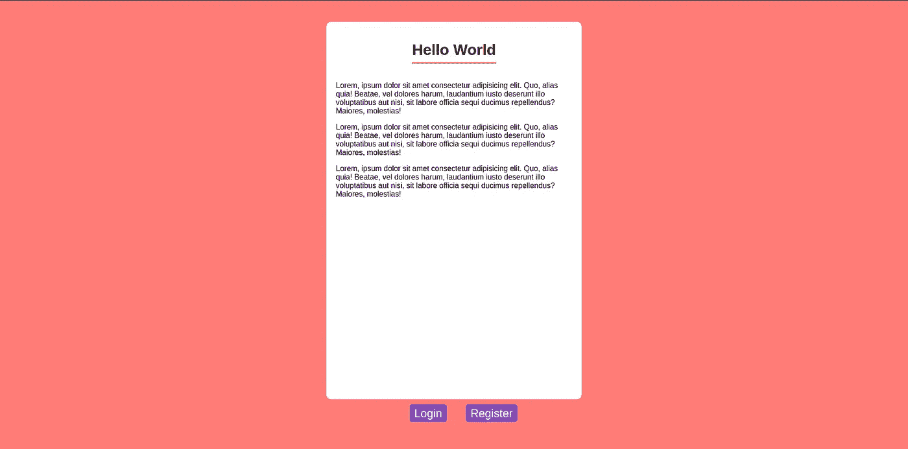
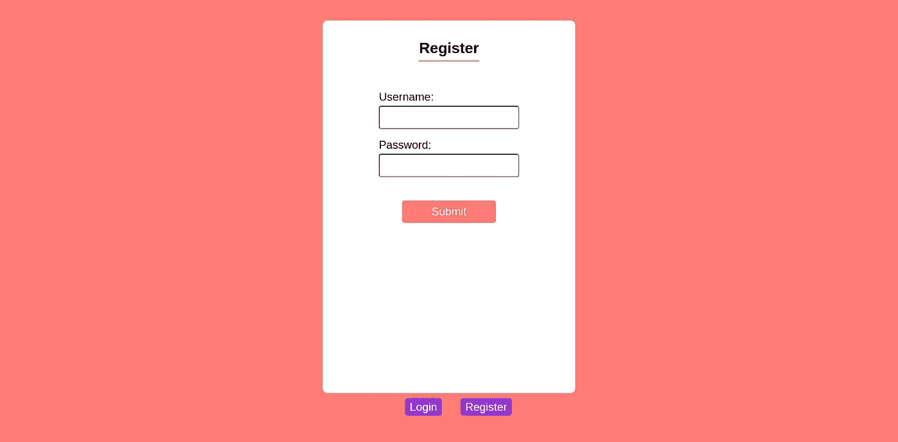
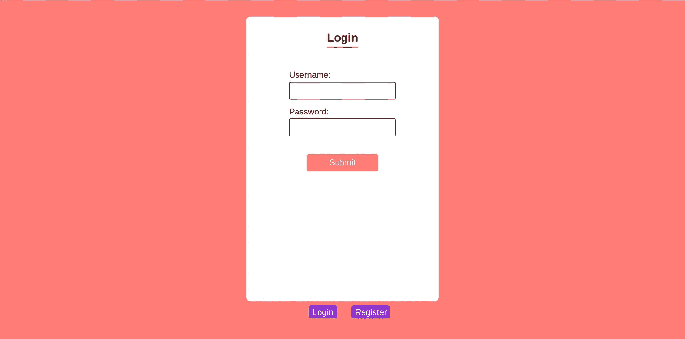
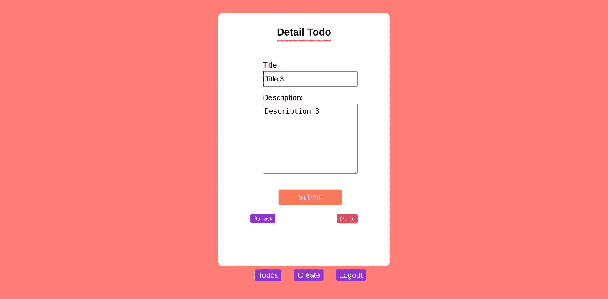

# 使用 gRPC、Python 和 Golang 构建微服务应用程序(第 4 部分)

> 原文：<https://medium.com/nerd-for-tech/build-a-microservice-app-using-grpc-python-and-golang-part-4-421bcdc3def0?source=collection_archive---------14----------------------->


照片由[亚当·博尔科夫斯基](https://unsplash.com/@borkography?utm_source=medium&utm_medium=referral)在 [Unsplash](https://unsplash.com?utm_source=medium&utm_medium=referral) 上拍摄

欢迎回到使用 gRPC、Python 和 Golang 构建微服务应用程序的系列。这是我们旅程的最后一部分。如果您从一开始就关注这个系列，您可能知道这个应用程序是 REST 和 gRPC 的某种混合体。所以这一次，我们可以通过使用 Jinja2 模板引擎创建前端来改变这一点。让我们开始…

# 创建布局模板并更改根视图

如果你知道 React 或 Vue，可能你已经熟悉了组件或窗口小部件的概念，但不仅仅是在 React 和 Vue 中，我们可以将 HTML 部分分离到它自己的文件中，我们也可以用 Jinja2 做到这一点，尽管实现非常不同。现在，我们需要创建一个将在每个页面上使用的布局模板。在此之前，在`main`服务的根目录下做一个文件夹，命名为`templates`，然后做一个文件，命名为`layout.html`。Flask 会在我们调用`render_template`函数的时候寻找这个文件夹，寻找匹配的 HTML 文件。

让我们仔细分析这段代码。在第 7 行，我们写了一个链接标签来连接 HTML 文件和 CSS 文件，注意我们使用了 Jinja2 提供的`url_for`函数。在第 8 行，我们写了一个块，这是我们在使用这个布局模板时必须实现的代码部分；第 13 行和第 14 行也是一样，但是第 14 行非常特殊，因为这是我们主要内容将要放置的块。

在第 18 到 25 行，我们为我们的应用程序写了一个简单的导航条。if 条件将确保只有登录的用户可以获得他们的 todo 并创建 todo，否则他们必须首先注册然后登录。

接下来，为我们的`root_router`视图功能创建一个主页。在`templates`文件夹中创建一个名为`home.html`的文件。

在上面的代码中，我们在`home.html`中使用了`layout`。在第 2 行，我们将主页的标题设置为`Welcome Folks`，将第 3 行的内容标题设置为`Hello World`。就像我之前提到的，内容块是我们放置主要内容的地方，在这里我们只放`lorem ipsum`。如果你知道在这里放什么，请随意。

将根路由器视图更改为如下所示。

记住你也必须从顶部的 flask 导入`render_template`函数。

这个页面的结果是这样的。



作者形象

不是很好的设计对吗？没关系，因为这个系列的主要目的不是关于设计或前端:)。你可以在这里得到 CSS 文件[。](https://github.com/agusrichard/python-golang-grpc/blob/part4/main-service/static/styles.css)

# 注册和登录页面

下一步是创建注册页面并更改其视图功能。

现在，在`templates`中创建一个文件夹并命名为`auth`，然后在其中创建一个文件并命名为`register.html`。

注意，我们需要一些东西来使它正常工作，那就是`macros`。你可以把它看作是 React 中的一个组件，或者是一个呈现 HTML 某个部分的函数。让我们在`templates`文件夹中创建两个名为`forms.html`和`macros.html`的文件。

上面还定义了其他几个`macros`，我们后面还需要这个`macros`。正如您可能想到的，在表单部分，用户必须填写他们的用户名和密码，然后该信息将由使用该模板的视图函数处理。

现在，我们必须改变注册页面的视图功能。

我们来剖析一下上面的代码。首先，这个函数决定使用哪种请求方法。如果它是 GET 方法，那么它将跳转到最后一行并返回注册页面的模板，而不将任何变量传递给模板。如果是 POST 方法，那么它将进入`try-except`块，如果在这个块中出现了一些错误，那么这个视图函数将返回一个注册页面的模板，并向该模板传递一个错误变量，因此用户可以看到错误消息。这里，我们还必须检查用户是否提供了用户名和密码，因为这两个字段是必需的。如果一切顺利，用户将被重定向到登录页面。

接下来，让我们创建登录页面并更改其视图功能。

用于登录的模板文件与注册页面非常相似，还有它的视图功能。不同的是，当登录过程顺利时，`auth_client.login`方法返回的令牌存储在`session`对象中。这很重要，因为我们需要被认证来创建 todo 和获取我们的 todo。

我们的注册和登录页面将如下所示。



作者形象



作者形象

在跳转到 todo 部分之前，需要创建一个注销视图函数。你可以看到 navbar 里面有一个注销按钮(在你登录之后)，所以当用户点击那个按钮的时候，就会触发这个查看功能，清除会话，把用户重定向到登录页面。

# 待办事项列表

用户登录后，他们将被重定向到待办事项列表页面。所以先把这一页做出来。创建一个名为`todo`的文件夹，并在其中创建一个名为`list.html`的文件。

我们还在这里扩展`layout.html`。在`div`标签内部，有一个 if 条件；如果有待办事项(列表不为空)，那么将呈现每个待办事项。但是如果列表是空的，它将呈现`p`标签(没有 todos)。现在，让我们看看`get_todos`的视图功能。

上面的代码将把检索到的登录用户的 todos 数据传递给模板，如果有错误，它将呈现带有错误消息的模板。请注意，我们从使用`g`(应用程序上下文)转移到了`session`。有一个很好的理由，你可以在这里找到它。基本上，最好使用`session`来存储请求之间的数据，而不是应用程序上下文`g`。所以我们必须改变中间件。

# 创建待办事项

在`templates/todo`目录下创建一个文件，命名为`create.html`。

从上面的代码中，我们看到在`div`标签中有一个表单部分，用户可以在其中填写他们的 todo 的标题和描述；如果有一些错误，它将被呈现在表单下面。接下来，更改创建 todo 的视图函数。

如果请求方法是 POST，todo 的标题和描述将从`request.form`字典中提取，如果一切顺利，它将把用户重定向到 todo 列表页面。

# 获取单个待办事项，更新并删除它

如果你注意到了，我们没有实现任何过程来获得一个单独的 todo，我们忘记这样做了。所以，让我们现在就开始吧！

有几件事我们需要改变，从`todo`服务和`main`服务中的`todo.proto`开始。

我们添加了`request`和`response`来获得单个 todo，以及它在`service`块中的过程。然后，运行此命令重新生成 gRPC 代码。

用于`todo`服务。

```
protoc --go_out=./todo --go_opt=paths=source_relative \--go-grpc_out=./todo --go-grpc_opt=paths=source_relative \./todo.proto
```

为`main`服务。

```
python -m grpc_tools.protoc -I. --python_out=./todo --grpc_python_out=./todo ./todo.proto
```

接下来，我们必须在`todo`服务中添加实现。

这个处理函数的功能是根据它的 ID 和用户 ID 获取一个 todo。

现在，让我们改变一下`main`服务。为`TodoClient`添加一个名为`get_todo`的新方法。

从上面的代码中，我们在`templates/todo`目录中使用了另一个名为`item.html`的模板文件。那么，让我们创建这个文件。

要访问此页面，用户必须单击待办事项列表页面上的待办事项之一。在这里，用户可以查看单个待办事项，更新和删除它，还可以返回到待办事项列表页面。

接下来，我们必须更改视图函数来更新和删除 todo。

这两个视图功能的应用流程是，在用户填写指定的字段(标题和描述)后，他们将停留在带有新的更新标题或描述的详细信息页面，如果出现任何错误，将在表单下方显示一条错误消息。对于删除功能，用户将被重定向到待办事项列表页面。

这是这个页面的样子。



作者形象

万岁，我们的申请完成了。对于一个非常简单的应用程序来说，有很多工作要做，对吗？通过阅读本系列文章，我希望您能够了解 gRPC 的概念、gRPC 如何被认为优于 REST、使用 gRPC 在 Python 和 Golang 中构建应用程序的体验以及更多内容。

你可以在这里找到这篇文章的代码[https://github.com/agusrichard/python-golang-grpc](https://github.com/agusrichard/python-golang-grpc)。

如果您有任何问题或反馈，请随时留下评论或通过电子邮件联系我，agus.richard21@gmail.com。另外，如果你认为这篇文章对你有帮助，请不要犹豫，给这篇文章鼓掌。

如果你想在你的某个项目上与我合作，或者要求加入你的网络，你可以通过[电子邮件](http://agus.richard21@gmail.com)或 [LinkedIn](https://www.linkedin.com/in/agus-richard/) 与我联系。

感谢您的阅读，祝您愉快。