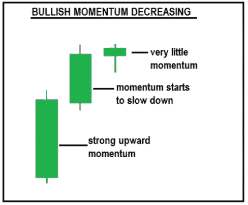
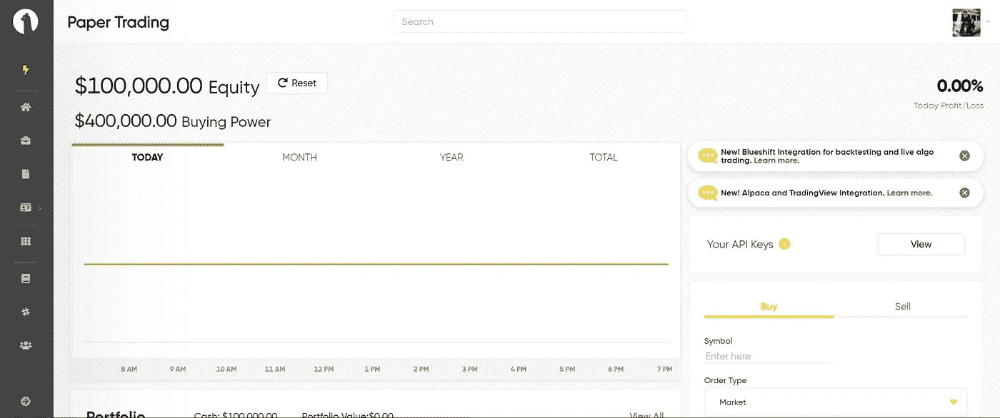
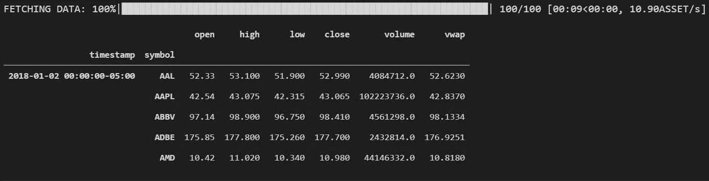
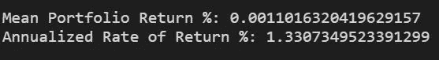
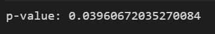

# 建立动量交易策略&测试阿尔法信号

> 原文：<https://medium.com/nerd-for-tech/build-a-momentum-trading-strategy-test-the-signal-for-alpha-b50731cadd89?source=collection_archive---------0----------------------->

**什么是动量交易？**

动量是量化交易中最流行的技术指标之一。动量就是一个特定时期内证券价格的变化率。动量投资者寻求利用短期头寸，在股票上涨时买入，在开始下跌时卖出。注意——这与著名的“低买高卖”投资策略形成了鲜明的对比。

烛台动量轮廓

SL =止损。TP =止盈。这是动量交易的一个例子。以下战略旨在利用这一双向运动。

**用 Python 实现**

1.  使用羊驼和多边形获取数据。羊驼是一个真正的算法交易精英平台，易于使用的 API 的。如果您不熟悉，这里有文档的链接。Polygon: [Polygon.io —股市数据 API](https://polygon.io/)，羊驼:[文档|羊驼](https://alpaca.markets/docs/)
2.  建立动量交易策略——识别表现良好的股票并模拟多头，识别表现不佳的股票并模拟空头。计算预期收益。
3.  分析信号。执行单侧统计 t 检验，以确定该信号中是否有任何α。无效假设是，这个信号中没有α。记住，我们拒绝小于显著性水平(0.05)的 p 值的零假设。

***第一步—取数据***

模块可以通过 conda / pip 安装。我推荐在康达建立一个虚拟环境。此处链接:

[高空滑索::蟒蛇云](https://anaconda.org/quantopian/zipline)

[管道-实时 PyPI](https://pypi.org/project/pipeline-live/)

[羊驼-贸易-api PyPI](https://pypi.org/project/alpaca-trade-api/)

> 在您成功导入上述模块后，我们就可以开始构建策略了！

这将返回一个空的数据框，其中包含我们希望用于我们的宇宙的证券作为索引。宇宙参数如下:前 100 名，**平均美元成交量**股票，在过去 120 天内。注意——这不要与每日交易量相混淆。 ***平均美元成交量是一个比率，计算方法是一只股票的股价乘以其日成交量。***

创建帐户后，您的 API 密钥可以在您的羊驼仪表板中找到。转到票据交易概述并选择“查看”。

既然宇宙已经设定好了，我们有了想要交易的证券，是时候获取数据了。我们使用上面管道输出的索引。这就是我们的战略领域。

注意—实例化 API REST 对象+在循环中使用函数

不幸的是，polygon api 不允许您一次获取多个证券的数据。我构建了上面的函数来获取每个资产的数据，一次一个，并将所有数据合并到一个整洁的数据框中。输出是包含所有证券的多指数。

***第二步——造势策略***

> **计算返回&重采样频率。**

**细分:**

1.  对数返回:当处理时间序列数据时，标准惯例是计算对数值，而不是算术值。因此有了上面的计算。这有很多原因，但归结起来就是:对于微积分/统计计算，对数值更容易处理。
2.  Returns:分解新计算的“Log_Returns”特征。这将创建一个新的数据框，以时间戳索引和符号作为列。
3.  重采样:在月末对指数频率进行重采样，频率为每月一次。这将是投资组合再平衡的时间表，也称为“交易时间表”。
4.  Shift 返回:创建两个新的数据帧；lookahead_returns 和 prev_returns，将收益向前移动一个月，向后移动一个月。这些将用于识别多头和空头头寸，并计算预期的投资组合回报。

> **识别表现最佳和表现最差的股票。**

**细分:**

1.  创建包含返回列(符号)和索引(日期)的空数据框
2.  用新的和空的数据框扫描以前的回报数据框，用 1 填充表现最好的 50 只股票，设置为“df_long”。对 50 个性能最差的重复此过程，设置为“df_short”

> **计算投资组合回报**

**细分:**

1.  计算长数据框和短数据框中的“模拟”/相等持仓。*(模拟，因为在生产中，您将在这里设计一个真正的优化)*
2.  将持有量和未来回报相乘，得到投资组合的预期回报。记住未来的收益，只是一个月前的收益。
3.  转置预期回报(翻转列和索引)，以获得每个日期的预期回报。获得平均投资组合回报。
4.  这是我们计算年化回报率的方法:

年化收益率=((1+*r*1)×(1+*r*2)×(1+*r*3 )×⋯×(1+*rn*)*n*11

(提示:这只是一个例子，说明为什么我们之前计算对数回报，而不是算术回报。上面的“n”变量对应于投资的持有时间，类似于回报的对数计算。)

在上面代码片段的第 14 行，您可以看到这个公式在 Python 中的实现。

***第三步——分析信号***

> **进行单边 t 检验来回答零假设:这个信号中没有 alpha。**

**细分:**

1.  “stats.ttest_1samp”函数进行双边 t 检验。我们需要单侧 t 检验的 p 值，所以我们将 p 除以 2。该函数的参数是预期的投资组合回报，以及我们的零假设或“参考值”。

*(提示:这样做的原因是因为我们不寻求发现一个平均值是否在两个值之间。我们想知道平均值是否在任一方向上不同于参考值，因此是零假设。因此我们做了单边 t 检验。)*

2.我们拒绝显著性水平小于 0.05 的 p 值的零假设，并推断该信号中存在α。直觉上，这是有道理的，因为年化回报率是正数。