# 10 分钟内建立一个自定义域名的 Next.js 网站

> 原文：<https://medium.com/nerd-for-tech/build-a-next-js-website-with-custom-domain-in-10-minutes-71fcb664a845?source=collection_archive---------0----------------------->


由 [Ferenc Almasi](https://unsplash.com/@flowforfrank?utm_source=unsplash&utm_medium=referral&utm_content=creditCopyText) 在 [Unsplash](https://unsplash.com/s/photos/react?utm_source=unsplash&utm_medium=referral&utm_content=creditCopyText) 上拍摄的照片

在本教程中，我们将使用`create-next-app`、Github、Netlify 和 namescheap 部署一个带有自定义域名的 Next.js 静态网站。

Next.js 是一个使用 React 的“生产就绪”库，具有额外的好处，如服务器端渲染和开箱即用。欲了解更多信息，请查看 nextjs.org 的[。](https://nextjs.org/)

当然，域名注册和网站托管还有其他选择，但 Namescheap 提供了我所发现的最便宜的域名，易于使用，还免费提供 whoIs 隐私保护(因此当你注册一个新域名时，你不会收到垃圾邮件和电话)。Vercel 是一个非常简单的托管平台。

注意:此方法仅适用于使用 Next.js 生成的静态站点。动态站点将需要 node.js 托管的后端。

# 第 1 步，共 5 步:创建您的应用程序

首先，使用`create-next-app:`创建一个名为‘my-awesome-app’的新 Next.js 应用程序(当然，您可以随意更改应用程序的名称)

在终端中，键入:

```
npx create-next-app my-awesome-app
cd my-awesome-app
```

重要提示:在`package.json`文件中，将`"build"`命令改为`"next build && next export"`

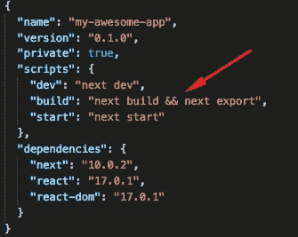

# 第 2 步，共 5 步:将你的应用程序推送到 GitHub

接下来，为项目创建一个新的 GitHub repo，然后将您的项目上传到其中。

在 GitHub 中，点击左上角的“新建”按钮:

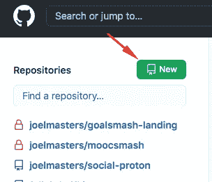

键入应用程序的名称，然后单击屏幕底部的“创建存储库”按钮:

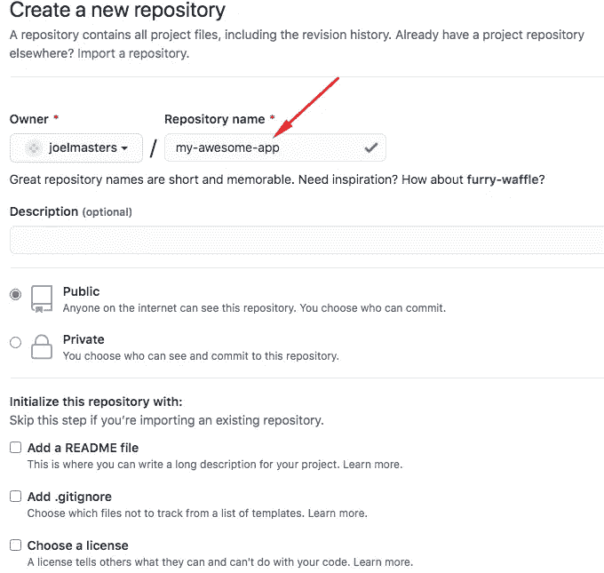

从命令行复制代码以推送您的现有存储库:

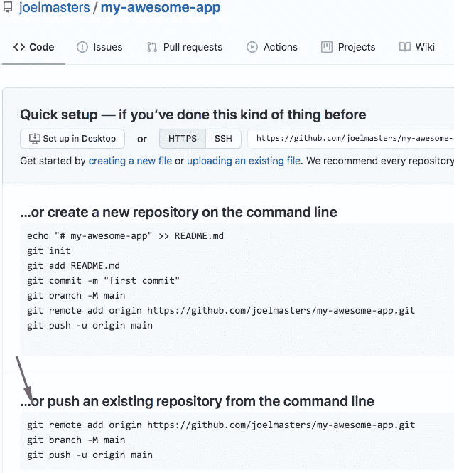

将代码粘贴到终端以上传您的代码。

# 第 3 步，共 5 步:为托管设置 Netlify

接下来，登录 [Netlify](https://www.netlify.com) (如果你还没有的话，创建一个账户)。

点击“来自 Git 的新网站”

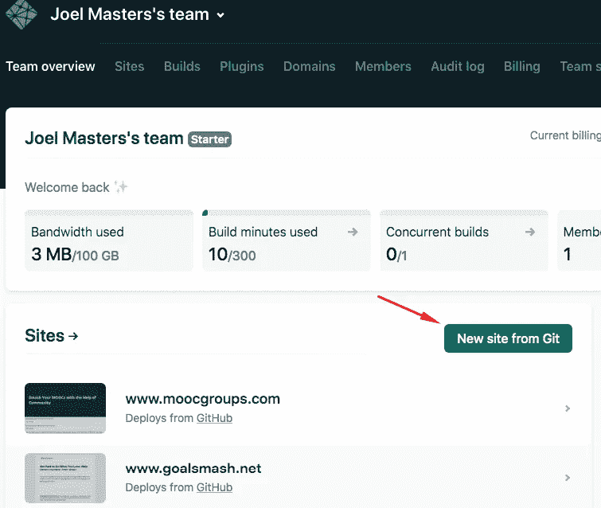

在下一个屏幕上，选择“GitHub”

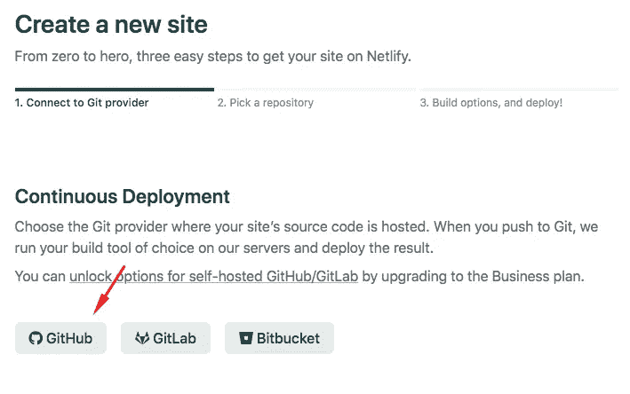

在下一个屏幕上，向下滚动找到您的 GitHub repo for the app:


然后，在下一个屏幕上单击“部署站点”

对于“构建命令”类型`yarn build`，对于“发布目录”类型`out/`

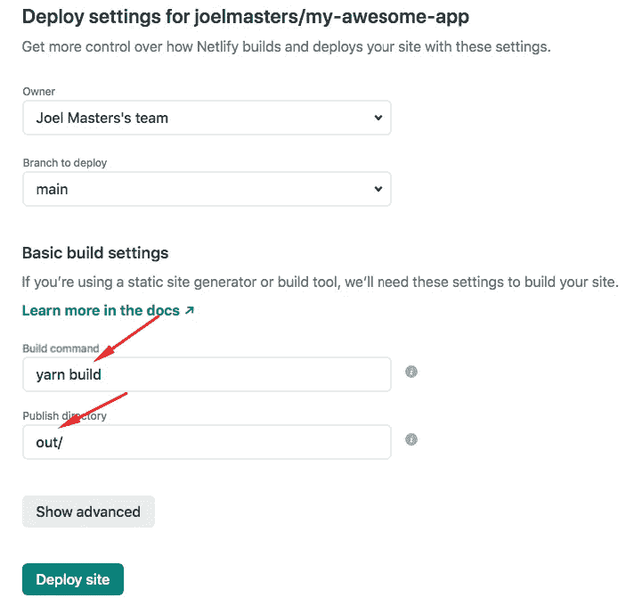

接下来，点击“域设置”

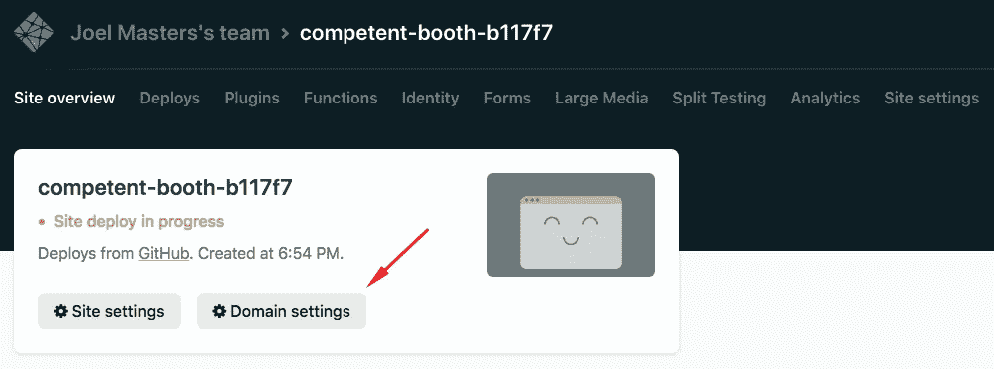

接下来，点击“添加自定义域”

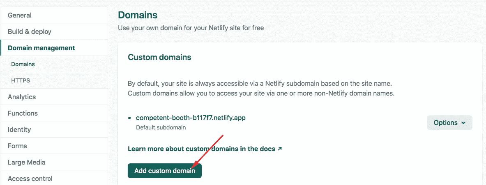

键入您的域，然后单击验证

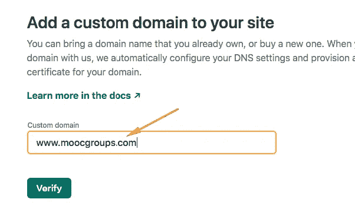

然后单击“是，添加域”

返回到域设置屏幕，复制。app 链接。您将在注册自定义域后使用它。

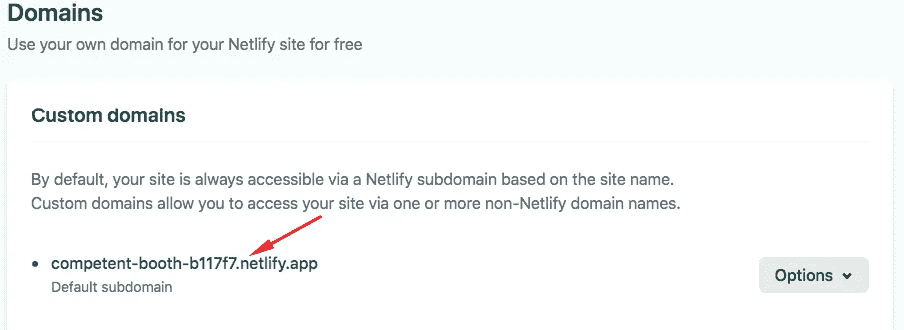

# 第 4 步，共 5 步:在 Namescheap 注册您的自定义域名

在[域名页面](https://namecheap.pxf.io/LzrdZ)上注册域名

购买完成后，进入您的仪表板，找到您想要转让的域名，然后单击“管理”按钮

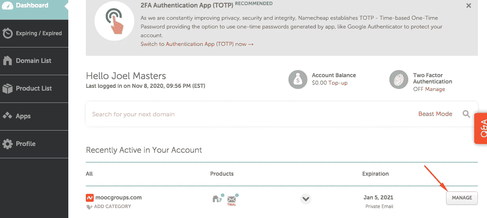

接下来，点击“高级 DNS”


点击“添加新记录”

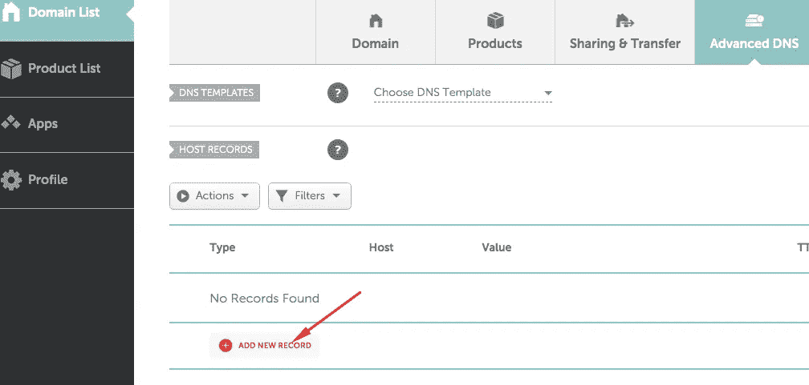

向下滚动到 CNAME，然后单击

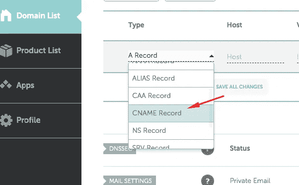

对于“主机”，键入“www ”,对于“值”,粘贴您的。来自 Netlify 的应用链接。点击绿色复选标记，您就可以开始了。

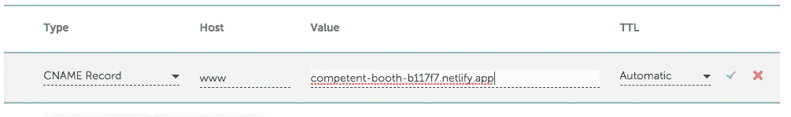

# 第 5 步，共 5 步:将您的域添加到 Netlify

您的自定义域名现在应该显示在 Netlify 上:

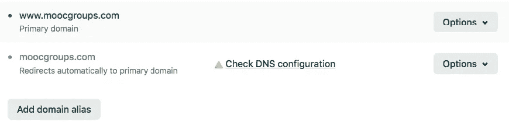

前往您的新网站，并开始定制:)。当你推你的 GitHub repo 你的网站会自动更新。

感谢阅读。

如果你用这种方法创建了一个 webapp，我很想知道！请在下面留下评论。

*注意:域名链接是一个附属链接。我在我所有的个人网站上都使用 namescheap，因为我发现它们有最好和最便宜的服务。你可以直接去他们的网站。*